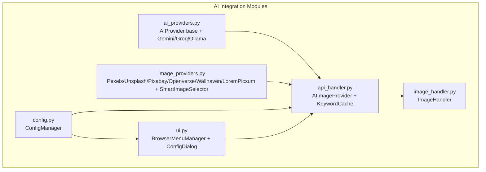
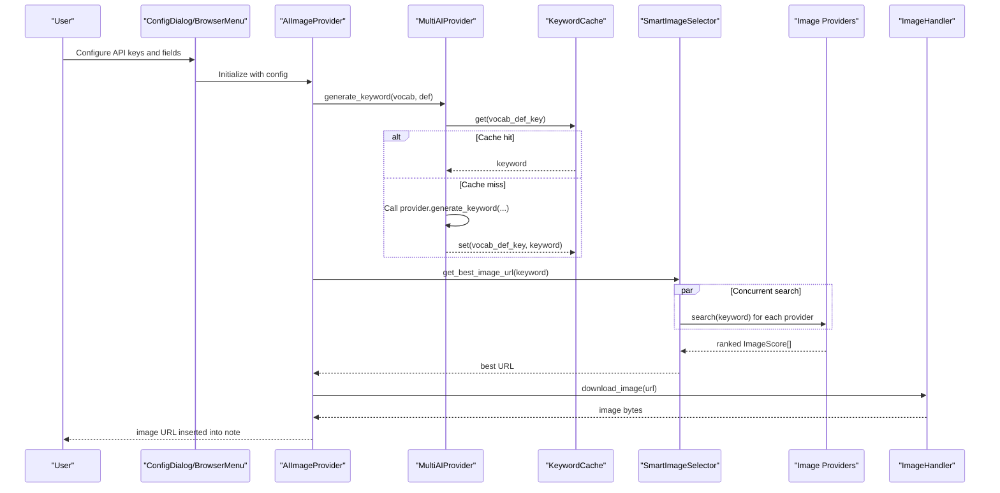
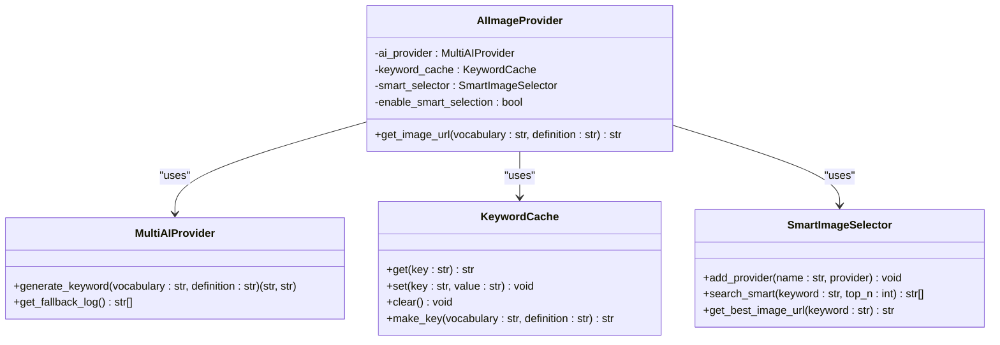
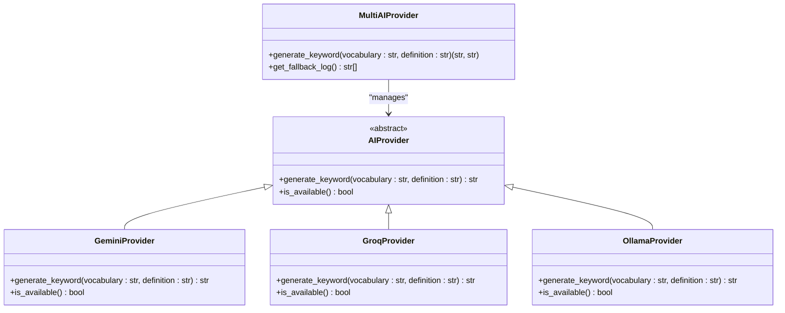
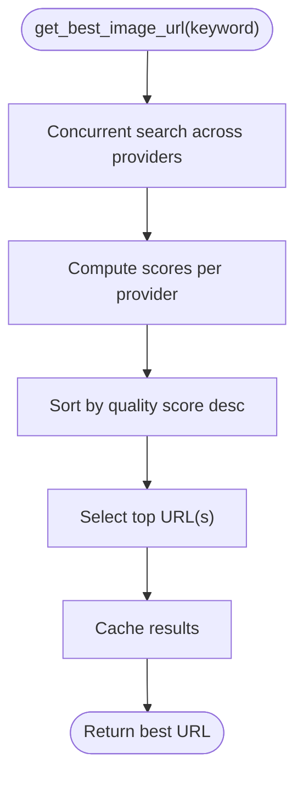
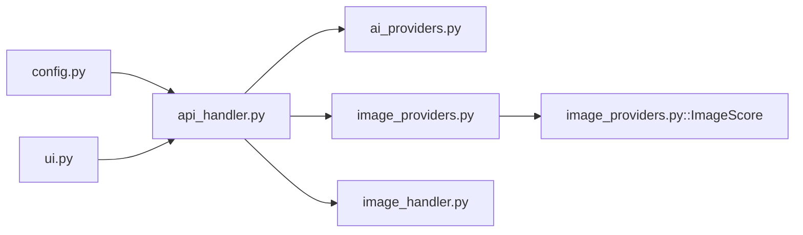

# AI Integration API

<cite>
**Referenced Files in This Document**
- [ai_providers.py](file://AnkiAI_ImageAddon/modules/ai_providers.py)
- [api_handler.py](file://AnkiAI_ImageAddon/modules/api_handler.py)
- [image_providers.py](file://AnkiAI_ImageAddon/modules/image_providers.py)
- [config.py](file://AnkiAI_ImageAddon/modules/config.py)
- [image_handler.py](file://AnkiAI_ImageAddon/modules/image_handler.py)
- [ui.py](file://AnkiAI_ImageAddon/modules/ui.py)
- [__init__.py](file://AnkiAI_ImageAddon/modules/__init__.py)
- [TEST_REPORT.md](file://TEST_REPORT.md)
</cite>

## Table of Contents
1. [Introduction](#introduction)
2. [Project Structure](#project-structure)
3. [Core Components](#core-components)
4. [Architecture Overview](#architecture-overview)
5. [Detailed Component Analysis](#detailed-component-analysis)
6. [Dependency Analysis](#dependency-analysis)
7. [Performance Considerations](#performance-considerations)
8. [Troubleshooting Guide](#troubleshooting-guide)
9. [Conclusion](#conclusion)

## Introduction
This document describes the AI integration API for generating and selecting illustrative images for Anki notes. It covers:
- Unified access via the AIImageProvider wrapper
- Multi-provider AI keyword generation with automatic fallback
- Smart image selection across multiple image providers
- Keyword caching and performance impact
- Error handling with structured exceptions
- Configuration and graceful degradation strategies

The system supports three AI providers (Gemini, Groq, Ollama) for keyword generation and six image providers (Pexels, Unsplash, Pixabay, Openverse, Wallhaven, Lorem Picsum) for image search. It also includes optimized image download and insertion into Anki notes.

## Project Structure
The AI integration is implemented across several modules:
- AI providers: keyword generation
- API handler: orchestration and caching
- Image providers: image search and ranking
- Config: persistent settings
- Image handler: download and insertion
- UI: configuration dialogs and browser integration
- Init exports: module exposure

**Diagram sources**
- [ai_providers.py:1-393](file://AnkiAI_ImageAddon/modules/ai_providers.py#L1-L393)
- [api_handler.py:1-229](file://AnkiAI_ImageAddon/modules/api_handler.py#L1-L229)
- [image_providers.py:1-463](file://AnkiAI_ImageAddon/modules/image_providers.py#L1-L463)
- [config.py:1-132](file://AnkiAI_ImageAddon/modules/config.py#L1-L132)
- [image_handler.py:1-364](file://AnkiAI_ImageAddon/modules/image_handler.py#L1-L364)
- [ui.py:1-444](file://AnkiAI_ImageAddon/modules/ui.py#L1-L444)

**Section sources**
- [__init__.py:1-12](file://AnkiAI_ImageAddon/modules/__init__.py#L1-L12)

## Core Components
- AIImageProvider: orchestrates AI keyword generation and smart image selection; exposes a single method to obtain the best image URL.
- MultiAIProvider: manages multiple AI providers with availability checks and automatic fallback.
- KeywordCache: caches generated keywords to reduce repeated AI calls.
- SmartImageSelector: concurrently queries multiple image providers, ranks results, and returns the best URL.
- Image providers: Pexels, Unsplash, Pixabay, Openverse, Wallhaven, Lorem Picsum.
- ConfigManager: manages persistent configuration for API keys, concurrency, and behavior toggles.
- ImageHandler: downloads, optimizes, saves, and inserts images into Anki notes.
- UI components: browser menu integration and configuration dialogs.

**Section sources**
- [api_handler.py:74-229](file://AnkiAI_ImageAddon/modules/api_handler.py#L74-L229)
- [ai_providers.py:297-393](file://AnkiAI_ImageAddon/modules/ai_providers.py#L297-L393)
- [image_providers.py:373-463](file://AnkiAI_ImageAddon/modules/image_providers.py#L373-L463)
- [config.py:18-132](file://AnkiAI_ImageAddon/modules/config.py#L18-L132)
- [image_handler.py:36-364](file://AnkiAI_ImageAddon/modules/image_handler.py#L36-L364)
- [ui.py:13-444](file://AnkiAI_ImageAddon/modules/ui.py#L13-L444)

## Architecture Overview
The system follows a layered design:
- Configuration layer: reads and validates settings
- AI layer: generates search keywords from vocabulary and definition
- Image layer: searches and ranks images from multiple providers
- Processing layer: downloads, optimizes, and inserts images into Anki

**Diagram sources**
- [api_handler.py:187-229](file://AnkiAI_ImageAddon/modules/api_handler.py#L187-L229)
- [ai_providers.py:358-393](file://AnkiAI_ImageAddon/modules/ai_providers.py#L358-L393)
- [image_providers.py:411-463](file://AnkiAI_ImageAddon/modules/image_providers.py#L411-L463)
- [image_handler.py:59-129](file://AnkiAI_ImageAddon/modules/image_handler.py#L59-L129)

## Detailed Component Analysis

### AIImageProvider
AIImageProvider is the central facade for AI-driven image selection. It:
- Initializes MultiAIProvider for keyword generation
- Manages a KeywordCache keyed by vocabulary and definition
- Optionally initializes SmartImageSelector with multiple image providers
- Provides get_image_url(vocabulary, definition) to return the best image URL

Method signature and behavior:
- get_image_url(vocabulary: str, definition: str) -> str
  - Generates or retrieves a cached keyword
  - Uses SmartImageSelector to find the best image URL
  - Raises APIError on failures

Initialization parameters:
- AI providers: gemini_key, groq_key, use_ollama, ollama_url
- Image providers: unsplash_key, pixabay_key, pexels_key, wallhaven_key
- Behavior: enable_smart_selection, max_concurrent_providers

**Diagram sources**
- [api_handler.py:74-229](file://AnkiAI_ImageAddon/modules/api_handler.py#L74-L229)
- [ai_providers.py:297-393](file://AnkiAI_ImageAddon/modules/ai_providers.py#L297-L393)
- [image_providers.py:373-463](file://AnkiAI_ImageAddon/modules/image_providers.py#L373-L463)

**Section sources**
- [api_handler.py:74-229](file://AnkiAI_ImageAddon/modules/api_handler.py#L74-L229)

### MultiAIProvider and AI Providers
MultiAIProvider manages multiple AI providers with priority and fallback:
- Priority order: Groq (fast), Gemini (quality), Ollama (local)
- Availability checks before adding providers
- generate_keyword(vocabulary, definition) returns (keyword, provider_name)
- Fallback logging captured for diagnostics

AI providers:
- GeminiProvider: Google Gemini API
- GroqProvider: Groq chat completions
- OllamaProvider: local LLM via Ollama

Validation and error handling:
- APIProviderError raised for invalid keys or provider failures
- Timeouts and connection errors mapped to specific exceptions

**Diagram sources**
- [ai_providers.py:24-127](file://AnkiAI_ImageAddon/modules/ai_providers.py#L24-L127)
- [ai_providers.py:129-217](file://AnkiAI_ImageAddon/modules/ai_providers.py#L129-L217)
- [ai_providers.py:219-295](file://AnkiAI_ImageAddon/modules/ai_providers.py#L219-L295)
- [ai_providers.py:297-393](file://AnkiAI_ImageAddon/modules/ai_providers.py#L297-L393)

**Section sources**
- [ai_providers.py:24-393](file://AnkiAI_ImageAddon/modules/ai_providers.py#L24-L393)

### KeywordCache
KeywordCache reduces redundant AI calls by caching keyword-generation results:
- Thread-safe dictionary with lock
- Automatic eviction when size limit reached
- Key composition from vocabulary and definition
- TTL-like behavior via manual clearing or size limits

Usage pattern:
- AIImageProvider constructs cache key from vocabulary and definition
- If cache miss, calls MultiAIProvider and stores result
- Subsequent calls return cached keyword immediately

**Section sources**
- [api_handler.py:42-72](file://AnkiAI_ImageAddon/modules/api_handler.py#L42-L72)
- [api_handler.py:187-215](file://AnkiAI_ImageAddon/modules/api_handler.py#L187-L215)

### SmartImageSelector and Image Providers
SmartImageSelector coordinates concurrent image searches across providers:
- Adds providers dynamically (Pexels, Unsplash, Pixabay, Openverse, Wallhaven, LoremPicsum)
- Concurrent search using ThreadPoolExecutor
- Scores images by provider reliability, URL quality, and title relevance
- Returns top-N URLs and caches results

Image providers:
- PexelsProvider: requires API key, high-quality photos
- UnsplashProvider: requires API key, landscape orientation
- PixabayProvider: requires API key, popular and safe search
- OpenverseProvider: free CC images
- WallhavenProvider: wallpapers and general images
- LoremPicsumProvider: instant fallback without API key

**Diagram sources**
- [image_providers.py:373-463](file://AnkiAI_ImageAddon/modules/image_providers.py#L373-L463)
- [image_providers.py:280-371](file://AnkiAI_ImageAddon/modules/image_providers.py#L280-L371)

**Section sources**
- [image_providers.py:29-463](file://AnkiAI_ImageAddon/modules/image_providers.py#L29-L463)

### ConfigManager
ConfigManager provides centralized configuration:
- Default settings for AI providers, image providers, smart selection, and image download
- Validation helpers for API key presence
- Persistence via Anki’s addon configuration

Key configuration keys:
- AI: gemini_api_key, groq_api_key, use_ollama, ollama_url
- Image: pexels_api_key, unsplash_api_key, pixabay_api_key, wallhaven_api_key
- Behavior: enable_smart_selection, max_concurrent_providers, smart_cache_ttl_minutes
- Downloads: image_download_timeout, image_download_retries, enable_image_optimization, image_max_width, image_quality
- Fields: vocabulary_field, definition_field, image_field, image_generation_mode
- Concurrency: max_concurrent_requests, enable_concurrent_downloads

**Section sources**
- [config.py:18-132](file://AnkiAI_ImageAddon/modules/config.py#L18-L132)

### ImageHandler
ImageHandler performs optimized image download and insertion:
- Download with reduced timeout and retries, streaming, and header optimization
- Optional PIL-based optimization (resize, convert to RGB, JPEG compression)
- Filename generation from vocabulary and detected format
- Safe insertion into Anki media folder and note field with responsive HTML

**Section sources**
- [image_handler.py:36-364](file://AnkiAI_ImageAddon/modules/image_handler.py#L36-L364)

### UI Integration
UI components support configuration and batch operations:
- BrowserMenuManager: adds context menu actions to Anki Browser
- ConfigDialog: collects API keys, validates minimum provider configuration, and tests connections
- FieldSelectionDialog: allows selecting vocabulary, definition, and image fields

**Section sources**
- [ui.py:13-444](file://AnkiAI_ImageAddon/modules/ui.py#L13-L444)

## Dependency Analysis
Module-level dependencies:
- api_handler.py depends on ai_providers.py, image_providers.py, and defines APIError
- image_providers.py defines ImageProviderError and ImageScore
- config.py integrates with Anki’s addon manager
- image_handler.py depends on requests and optional PIL
- ui.py depends on aqt and interacts with browser menus

**Diagram sources**
- [api_handler.py:24-34](file://AnkiAI_ImageAddon/modules/api_handler.py#L24-L34)
- [ai_providers.py:13-16](file://AnkiAI_ImageAddon/modules/ai_providers.py#L13-L16)
- [image_providers.py:16-21](file://AnkiAI_ImageAddon/modules/image_providers.py#L16-L21)
- [config.py:12-15](file://AnkiAI_ImageAddon/modules/config.py#L12-L15)
- [image_handler.py:15-28](file://AnkiAI_ImageAddon/modules/image_handler.py#L15-L28)

**Section sources**
- [api_handler.py:24-34](file://AnkiAI_ImageAddon/modules/api_handler.py#L24-L34)
- [image_providers.py:16-21](file://AnkiAI_ImageAddon/modules/image_providers.py#L16-L21)
- [config.py:12-15](file://AnkiAI_ImageAddon/modules/config.py#L12-L15)
- [image_handler.py:15-28](file://AnkiAI_ImageAddon/modules/image_handler.py#L15-L28)

## Performance Considerations
- Keyword caching: reduces repeated AI calls; improves latency and cost-efficiency
- Concurrent image search: ThreadPoolExecutor speeds up provider queries
- Smart scoring: prioritizes reliable providers and quality metrics
- Image optimization: reduces bandwidth and storage usage
- Reduced timeouts and retries: balances responsiveness and reliability

Recommendations:
- Enable keyword cache and smart selection for typical usage
- Adjust max_concurrent_providers and image_download_retries based on network stability
- Prefer providers with API keys for higher quality and reliability

**Section sources**
- [api_handler.py:42-72](file://AnkiAI_ImageAddon/modules/api_handler.py#L42-L72)
- [image_providers.py:379-463](file://AnkiAI_ImageAddon/modules/image_providers.py#L379-L463)
- [image_handler.py:40-46](file://AnkiAI_ImageAddon/modules/image_handler.py#L40-L46)

## Troubleshooting Guide
Common issues and resolutions:
- Missing or invalid API keys
  - Ensure at least one AI provider is configured (Groq, Gemini, or Ollama)
  - Validate image providers if using search mode
- Provider initialization failures
  - The system logs warnings and falls back to other providers
  - Check connectivity and key validity
- Empty provider list in search mode
  - The system gracefully degrades to DALL-E mode (as implemented in earlier versions)
- Image insertion conflicts
  - If an image already exists in the field, insertion is skipped
  - Verify field names and note templates

Error handling patterns:
- AIProviderError for AI provider failures
- ImageProviderError for image provider failures
- APIError for orchestration-level failures
- ImageError for image download/insertion issues

**Section sources**
- [TEST_REPORT.md:110-155](file://TEST_REPORT.md#L110-L155)
- [api_handler.py:37-39](file://AnkiAI_ImageAddon/modules/api_handler.py#L37-L39)
- [ai_providers.py:19-21](file://AnkiAI_ImageAddon/modules/ai_providers.py#L19-L21)
- [image_providers.py:24-26](file://AnkiAI_ImageAddon/modules/image_providers.py#L24-L26)
- [image_handler.py:31-33](file://AnkiAI_ImageAddon/modules/image_handler.py#L31-L33)

## Conclusion
The AI Integration API provides a robust, configurable, and resilient system for generating and selecting illustrative images for Anki notes. By combining AI-driven keyword generation with concurrent, intelligent image selection and caching, it delivers improved performance and reliability. The modular design enables easy configuration, graceful fallbacks, and straightforward integration with Anki’s UI and data model.