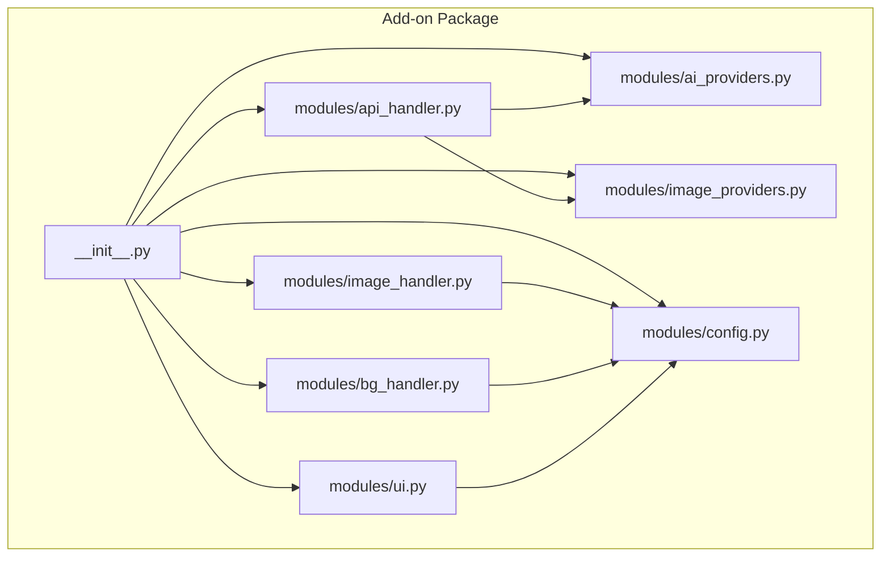
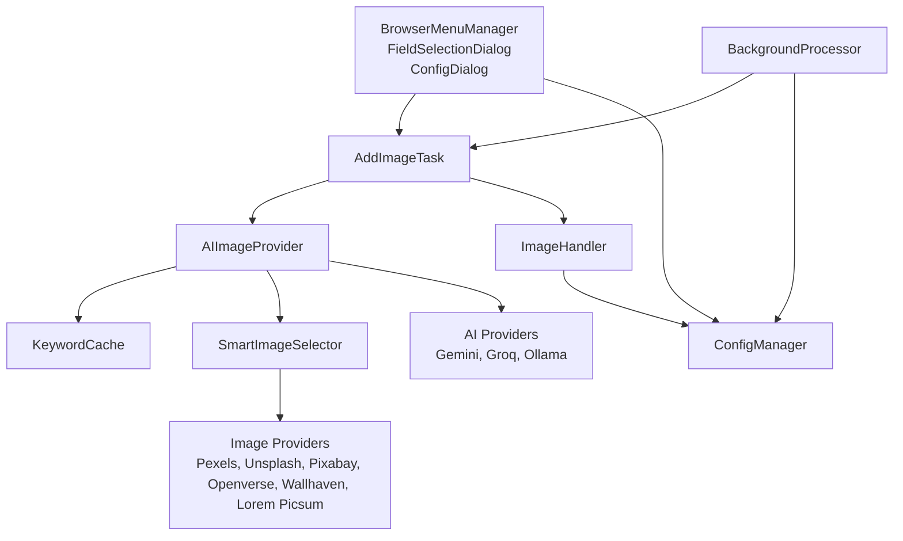
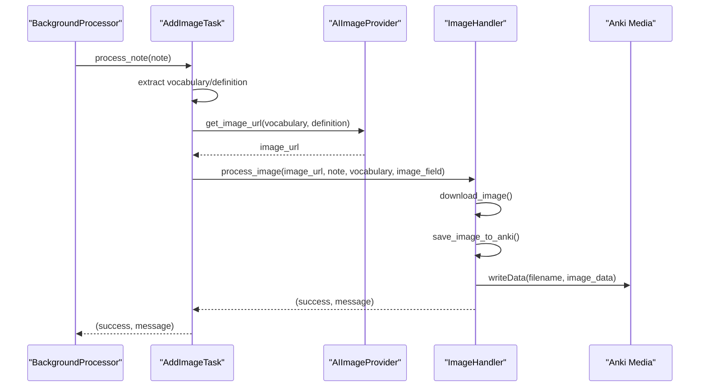
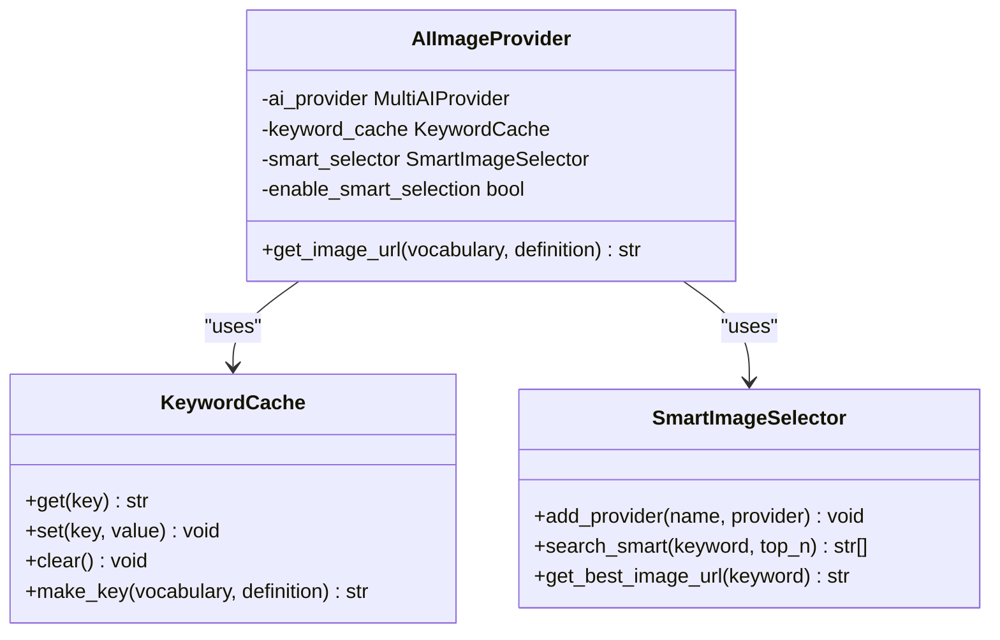
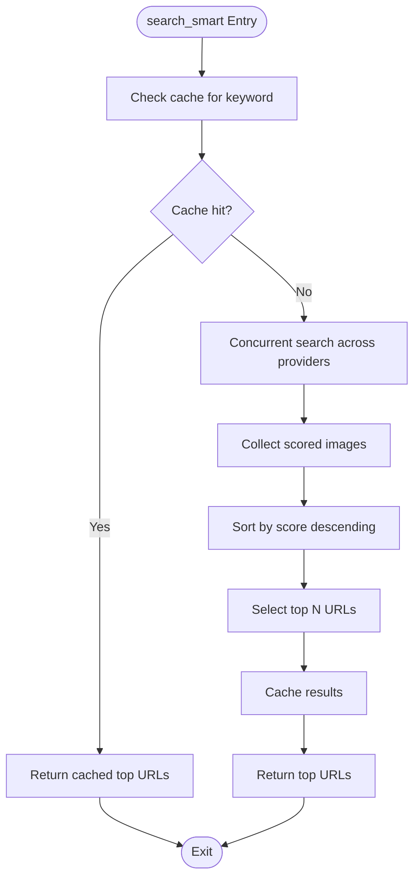
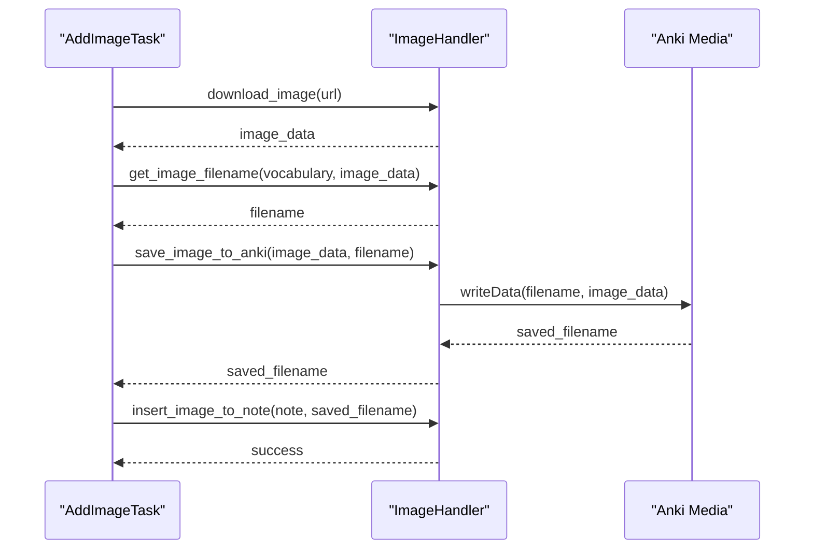
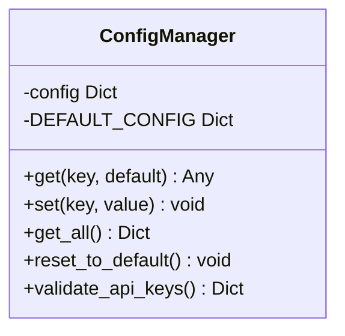
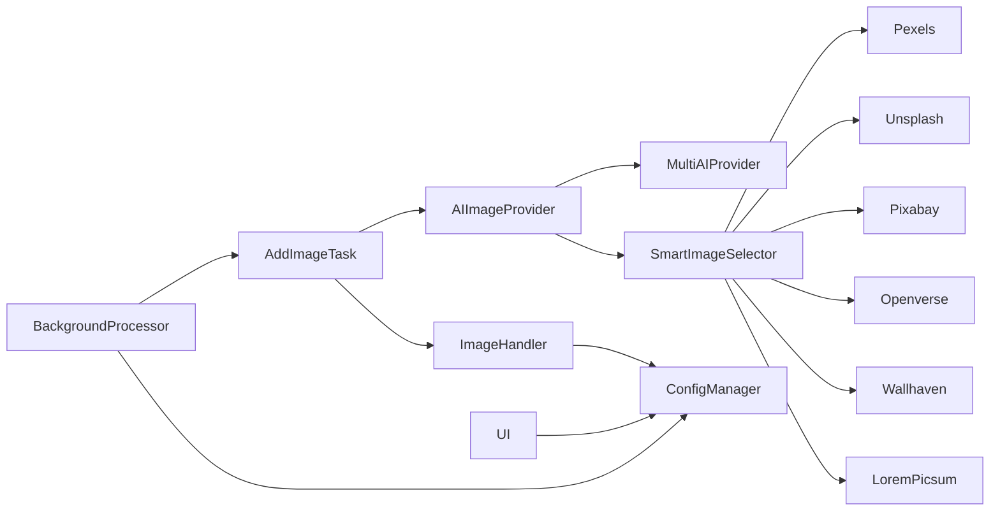

# API Reference

<cite>
**Referenced Files in This Document**
- [__init__.py](file://AnkiAI_ImageAddon/__init__.py)
- [api_handler.py](file://AnkiAI_ImageAddon/modules/api_handler.py)
- [ai_providers.py](file://AnkiAI_ImageAddon/modules/ai_providers.py)
- [image_providers.py](file://AnkiAI_ImageAddon/modules/image_providers.py)
- [image_handler.py](file://AnkiAI_ImageAddon/modules/image_handler.py)
- [bg_handler.py](file://AnkiAI_ImageAddon/modules/bg_handler.py)
- [config.py](file://AnkiAI_ImageAddon/modules/config.py)
- [ui.py](file://AnkiAI_ImageAddon/modules/ui.py)
- [config.json](file://AnkiAI_ImageAddon/config.json)
- [manifest.json](file://AnkiAI_ImageAddon/manifest.json)
</cite>

## Table of Contents
1. [Introduction](#introduction)
2. [Project Structure](#project-structure)
3. [Core Components](#core-components)
4. [Architecture Overview](#architecture-overview)
5. [Detailed Component Analysis](#detailed-component-analysis)
6. [Dependency Analysis](#dependency-analysis)
7. [Performance Considerations](#performance-considerations)
8. [Troubleshooting Guide](#troubleshooting-guide)
9. [Conclusion](#conclusion)
10. [Appendices](#appendices)

## Introduction
This API reference documents the public interfaces and internal APIs of the AnkiAI Image Addon v4.0. It covers:
- Main entry points including the AddImageTask class and its process_note method for initiating image processing workflows
- The AIImageProvider interface and its implementations for different AI services
- The SmartImageSelector class with its search_smart method, explaining the concurrent provider search mechanism and result ranking algorithms
- The ImageHandler class methods for downloading, optimizing, and embedding images into Anki media
- The BackgroundProcessor API for managing long-running operations with progress tracking
- Configuration-related APIs including ConfigManager methods for settings retrieval and validation
- Comprehensive examples of method usage, error conditions, and integration patterns
- Parameter validation rules, exception handling, and performance considerations

## Project Structure
The add-on is organized into modular components under the AnkiAI_ImageAddon package. The primary modules include:
- api_handler.py: Orchestrates AI keyword generation and smart image selection
- ai_providers.py: Implements AI provider interfaces and concrete providers (Gemini, Groq, Ollama)
- image_providers.py: Implements image search providers and SmartImageSelector
- image_handler.py: Handles image download, optimization, and embedding into Anki
- bg_handler.py: Provides background processing and progress tracking
- config.py: Manages configuration via ConfigManager
- ui.py: Provides UI hooks and dialogs for browser menu and configuration
- __init__.py: Main entry point, integrates all components and exposes public APIs



**Diagram sources**
- [__init__.py:1-349](file://AnkiAI_ImageAddon/__init__.py#L1-L349)
- [api_handler.py:1-229](file://AnkiAI_ImageAddon/modules/api_handler.py#L1-L229)
- [ai_providers.py:1-393](file://AnkiAI_ImageAddon/modules/ai_providers.py#L1-L393)
- [image_providers.py:1-463](file://AnkiAI_ImageAddon/modules/image_providers.py#L1-L463)
- [image_handler.py:1-364](file://AnkiAI_ImageAddon/modules/image_handler.py#L1-L364)
- [bg_handler.py:1-205](file://AnkiAI_ImageAddon/modules/bg_handler.py#L1-L205)
- [config.py:1-132](file://AnkiAI_ImageAddon/modules/config.py#L1-L132)
- [ui.py:1-444](file://AnkiAI_ImageAddon/modules/ui.py#L1-L444)

**Section sources**
- [__init__.py:1-349](file://AnkiAI_ImageAddon/__init__.py#L1-L349)
- [manifest.json:1-12](file://AnkiAI_ImageAddon/manifest.json#L1-L12)

## Core Components
This section outlines the primary public and internal APIs exposed by the add-on.

- AddImageTask
  - Purpose: Encapsulates the workflow to extract vocabulary and definition from a note, generate an image URL via AI, download and embed the image, and persist the note.
  - Key method: process_note(note) -> Tuple[bool, str]
  - Integration: Used by BackgroundProcessor to handle batches of notes asynchronously.

- AIImageProvider
  - Purpose: Wraps AI keyword generation and SmartImageSelector to produce the best image URL for a given vocabulary and definition.
  - Key method: get_image_url(vocabulary: str, definition: str) -> str
  - Composition: Uses MultiAIProvider for keyword generation and SmartImageSelector for concurrent image search.

- SmartImageSelector
  - Purpose: Concurrently queries multiple image providers, scores results, and returns the best URLs.
  - Key methods:
    - add_provider(name: str, provider) -> None
    - search_smart(keyword: str, top_n: int = 3) -> List[str]
    - get_best_image_url(keyword: str) -> str

- ImageHandler
  - Purpose: Downloads, optimizes, and embeds images into Anki’s media collection.
  - Key methods:
    - download_image(url: str, timeout: int = None, optimize: bool = True) -> bytes
    - get_image_filename(vocabulary: str, image_data: bytes) -> str
    - save_image_to_anki(image_data: bytes, filename: str) -> str
    - insert_image_to_note(note, image_filename: str, image_field_name: str = "Ảnh", responsive: bool = True) -> bool
    - process_image(url: str, note, vocabulary: str, image_field_name: str = "Ảnh") -> Tuple[bool, str]

- BackgroundProcessor
  - Purpose: Executes long-running tasks in the background while providing progress updates and cancellation support.
  - Key methods:
    - process_cards_in_background(note_ids: List[int], process_func: Callable, on_progress: Optional[Callable] = None, on_success: Optional[Callable] = None, on_error: Optional[Callable] = None, title: str = "Processing...") -> None
    - cancel() -> None
    - is_processing() -> bool

- ConfigManager
  - Purpose: Centralized configuration management backed by Anki’s addon configuration system.
  - Key methods:
    - get(key: str, default: Any = None) -> Any
    - set(key: str, value: Any) -> None
    - get_all() -> Dict[str, Any]
    - reset_to_default() -> None
    - validate_api_keys() -> Dict[str, bool]

- UI Components
  - BrowserMenuManager: Adds context menu actions in Anki Browser and extracts selected note IDs.
  - FieldSelectionDialog: Allows users to select vocabulary, definition, and image fields.
  - ConfigDialog: Collects and validates API keys and settings.
  - get_note_data(note) -> Tuple[str, str]: Extracts vocabulary and definition from a note.

**Section sources**
- [__init__.py:27-97](file://AnkiAI_ImageAddon/__init__.py#L27-L97)
- [api_handler.py:74-229](file://AnkiAI_ImageAddon/modules/api_handler.py#L74-L229)
- [image_providers.py:373-463](file://AnkiAI_ImageAddon/modules/image_providers.py#L373-L463)
- [image_handler.py:36-364](file://AnkiAI_ImageAddon/modules/image_handler.py#L36-L364)
- [bg_handler.py:12-109](file://AnkiAI_ImageAddon/modules/bg_handler.py#L12-L109)
- [config.py:18-120](file://AnkiAI_ImageAddon/modules/config.py#L18-L120)
- [ui.py:13-94](file://AnkiAI_ImageAddon/modules/ui.py#L13-L94)

## Architecture Overview
The add-on follows a layered architecture:
- UI Layer: Browser menu integration and configuration dialogs
- Orchestration Layer: AddImageTask and BackgroundProcessor coordinate workflows
- AI Layer: AIImageProvider orchestrates keyword generation and image selection
- Provider Layer: AI providers (Gemini, Groq, Ollama) and image providers (Pexels, Unsplash, Pixabay, Openverse, Wallhaven, Lorem Picsum)
- Data Layer: ImageHandler manages downloads, optimization, and Anki media embedding



**Diagram sources**
- [__init__.py:99-274](file://AnkiAI_ImageAddon/__init__.py#L99-L274)
- [api_handler.py:74-229](file://AnkiAI_ImageAddon/modules/api_handler.py#L74-L229)
- [image_providers.py:373-463](file://AnkiAI_ImageAddon/modules/image_providers.py#L373-L463)
- [ai_providers.py:24-393](file://AnkiAI_ImageAddon/modules/ai_providers.py#L24-L393)
- [image_handler.py:36-364](file://AnkiAI_ImageAddon/modules/image_handler.py#L36-L364)
- [config.py:18-120](file://AnkiAI_ImageAddon/modules/config.py#L18-L120)
- [ui.py:13-94](file://AnkiAI_ImageAddon/modules/ui.py#L13-L94)

## Detailed Component Analysis

### AddImageTask
- Responsibilities:
  - Extract vocabulary and definition from a note
  - Check for existing images to avoid duplicates
  - Obtain an image URL via AIImageProvider
  - Delegate image download, optimization, and embedding to ImageHandler
  - Persist the note and report success/failure
- Method signature: process_note(note) -> Tuple[bool, str]
- Error handling:
  - Validates non-empty vocabulary
  - Skips notes with existing images
  - Catches APIError and ImageError from underlying components
  - Returns descriptive messages for UI feedback



**Diagram sources**
- [__init__.py:39-97](file://AnkiAI_ImageAddon/__init__.py#L39-L97)
- [api_handler.py:187-228](file://AnkiAI_ImageAddon/modules/api_handler.py#L187-L228)
- [image_handler.py:326-364](file://AnkiAI_ImageAddon/modules/image_handler.py#L326-L364)

**Section sources**
- [__init__.py:27-97](file://AnkiAI_ImageAddon/__init__.py#L27-L97)

### AIImageProvider
- Responsibilities:
  - Initialize AI providers (MultiAIProvider) and keyword cache
  - Optionally initialize SmartImageSelector with multiple image providers
  - Generate keywords via AI and return the best image URL using SmartImageSelector
- Constructor parameters:
  - gemini_key, groq_key, use_ollama, ollama_url
  - unsplash_key, pixabay_key, pexels_key, wallhaven_key
  - enable_smart_selection, max_concurrent_providers
- Method signature: get_image_url(vocabulary: str, definition: str) -> str
- Error handling:
  - Raises APIError when AI provider initialization fails or image selection fails



**Diagram sources**
- [api_handler.py:74-229](file://AnkiAI_ImageAddon/modules/api_handler.py#L74-L229)
- [api_handler.py:42-72](file://AnkiAI_ImageAddon/modules/api_handler.py#L42-L72)
- [image_providers.py:373-463](file://AnkiAI_ImageAddon/modules/image_providers.py#L373-L463)

**Section sources**
- [api_handler.py:74-229](file://AnkiAI_ImageAddon/modules/api_handler.py#L74-L229)

### SmartImageSelector
- Responsibilities:
  - Concurrently search multiple image providers
  - Score results based on provider reliability, URL quality, and title relevance
  - Return top-N URLs or the single best URL
  - Cache results for performance
- Methods:
  - add_provider(name: str, provider) -> None
  - search_smart(keyword: str, top_n: int = 3) -> List[str]
  - get_best_image_url(keyword: str) -> str
- Ranking algorithm:
  - Base score per provider (Pexels > Unsplash > Pixabay > Openverse > Wallhaven > Lorem Picsum)
  - URL length penalty (shorter URLs preferred)
  - Title relevance bonus (if available)
  - Final score clamped to 0–100



**Diagram sources**
- [image_providers.py:411-455](file://AnkiAI_ImageAddon/modules/image_providers.py#L411-L455)
- [image_providers.py:29-67](file://AnkiAI_ImageAddon/modules/image_providers.py#L29-L67)

**Section sources**
- [image_providers.py:373-463](file://AnkiAI_ImageAddon/modules/image_providers.py#L373-L463)

### ImageHandler
- Responsibilities:
  - Download images with optimized timeouts and retries
  - Detect and convert image formats, resize, and compress
  - Generate unique filenames and embed into Anki media
  - Insert responsive HTML image tags into note fields
- Methods:
  - download_image(url: str, timeout: int = None, optimize: bool = True) -> bytes
  - get_image_filename(vocabulary: str, image_data: bytes) -> str
  - save_image_to_anki(image_data: bytes, filename: str) -> str
  - insert_image_to_note(note, image_filename: str, image_field_name: str = "Ảnh", responsive: bool = True) -> bool
  - process_image(url: str, note, vocabulary: str, image_field_name: str = "Ảnh") -> Tuple[bool, str]
- Validation and error handling:
  - Validates non-empty URLs and handles network timeouts and request failures
  - Falls back to original image if optimization fails
  - Ensures single image insertion per note field



**Diagram sources**
- [image_handler.py:59-129](file://AnkiAI_ImageAddon/modules/image_handler.py#L59-L129)
- [image_handler.py:197-268](file://AnkiAI_ImageAddon/modules/image_handler.py#L197-L268)
- [image_handler.py:269-325](file://AnkiAI_ImageAddon/modules/image_handler.py#L269-L325)
- [image_handler.py:326-364](file://AnkiAI_ImageAddon/modules/image_handler.py#L326-L364)

**Section sources**
- [image_handler.py:36-364](file://AnkiAI_ImageAddon/modules/image_handler.py#L36-L364)

### BackgroundProcessor
- Responsibilities:
  - Run long-running operations in the background using Anki’s QueryOp
  - Provide progress callbacks and completion/error callbacks
  - Support cancellation and state tracking
- Methods:
  - process_cards_in_background(note_ids: List[int], process_func: Callable, on_progress: Optional[Callable] = None, on_success: Optional[Callable] = None, on_error: Optional[Callable] = None, title: str = "Processing...") -> None
  - cancel() -> None
  - is_processing() -> bool
- Integration:
  - Used by AddImageTask to process batches of notes without blocking the UI

```mermaid
sequenceDiagram
participant UI as "BrowserMenuManager"
participant BG as "BackgroundProcessor"
participant Task as "AddImageTask"
participant Note as "Anki Note"
UI->>BG : process_cards_in_background(note_ids, process_func, callbacks)
loop For each note_id
BG->>Note : get_note(note_id)
BG->>Task : process_note(note)
Task-->>BG : (success, message)
BG->>UI : on_progress(current, total, message)
end
BG-->>UI : on_success(results) or on_error(error)
```

**Diagram sources**
- [bg_handler.py:23-101](file://AnkiAI_ImageAddon/modules/bg_handler.py#L23-L101)
- [__init__.py:262-273](file://AnkiAI_ImageAddon/__init__.py#L262-L273)

**Section sources**
- [bg_handler.py:12-109](file://AnkiAI_ImageAddon/modules/bg_handler.py#L12-L109)

### ConfigManager
- Responsibilities:
  - Manage add-on configuration via Anki’s addonManager
  - Provide default values and validation helpers
- Methods:
  - get(key: str, default: Any = None) -> Any
  - set(key: str, value: Any) -> None
  - get_all() -> Dict[str, Any]
  - reset_to_default() -> None
  - validate_api_keys() -> Dict[str, bool]
- Defaults and keys:
  - AI providers: gemini_api_key, groq_api_key, use_ollama, ollama_url
  - Image providers: pexels_api_key, unsplash_api_key, pixabay_api_key, wallhaven_api_key
  - Smart selection: enable_smart_selection, max_concurrent_providers, smart_cache_ttl_minutes
  - Image download: image_download_timeout, image_download_retries, enable_image_optimization, image_max_width, image_quality
  - Keyword cache: enable_keyword_cache, keyword_cache_size
  - Fields: vocabulary_field, definition_field, image_field, image_generation_mode
  - Concurrency: max_concurrent_requests, enable_concurrent_downloads
  - Other: auto_add_on_sync



**Diagram sources**
- [config.py:18-120](file://AnkiAI_ImageAddon/modules/config.py#L18-L120)

**Section sources**
- [config.py:18-120](file://AnkiAI_ImageAddon/modules/config.py#L18-L120)
- [config.json:1-35](file://AnkiAI_ImageAddon/config.json#L1-L35)

### UI Components
- BrowserMenuManager
  - Adds “AnkiAI: Tự động thêm ảnh bằng AI” to the Browser context menu
  - Extracts selected note IDs and displays informational dialogs
- FieldSelectionDialog
  - Presents dropdowns for selecting vocabulary, definition, and image fields
- ConfigDialog
  - Collects API keys for AI and image providers
  - Validates that at least one AI provider and one image provider are configured
  - Tests connectivity to AI providers
- get_note_data(note) -> Tuple[str, str]
  - Extracts vocabulary and definition from a note, stripping HTML tags

**Section sources**
- [ui.py:13-94](file://AnkiAI_ImageAddon/modules/ui.py#L13-L94)
- [ui.py:96-172](file://AnkiAI_ImageAddon/modules/ui.py#L96-L172)
- [ui.py:174-400](file://AnkiAI_ImageAddon/modules/ui.py#L174-L400)
- [ui.py:402-444](file://AnkiAI_ImageAddon/modules/ui.py#L402-L444)

## Dependency Analysis
- Internal dependencies:
  - AddImageTask depends on AIImageProvider and ImageHandler
  - BackgroundProcessor executes AddImageTask.process_note
  - AIImageProvider composes MultiAIProvider and SmartImageSelector
  - SmartImageSelector composes multiple image providers
  - UI components depend on ConfigManager for settings
- External dependencies:
  - Requests library for HTTP operations
  - PIL/Pillow for image optimization
  - Anki’s addonManager and GUI hooks



**Diagram sources**
- [__init__.py:27-97](file://AnkiAI_ImageAddon/__init__.py#L27-L97)
- [api_handler.py:74-229](file://AnkiAI_ImageAddon/modules/api_handler.py#L74-L229)
- [image_providers.py:373-463](file://AnkiAI_ImageAddon/modules/image_providers.py#L373-L463)
- [config.py:18-120](file://AnkiAI_ImageAddon/modules/config.py#L18-L120)
- [image_handler.py:36-364](file://AnkiAI_ImageAddon/modules/image_handler.py#L36-L364)

**Section sources**
- [__init__.py:1-349](file://AnkiAI_ImageAddon/__init__.py#L1-L349)
- [api_handler.py:1-229](file://AnkiAI_ImageAddon/modules/api_handler.py#L1-L229)
- [image_providers.py:1-463](file://AnkiAI_ImageAddon/modules/image_providers.py#L1-L463)
- [ai_providers.py:1-393](file://AnkiAI_ImageAddon/modules/ai_providers.py#L1-L393)
- [image_handler.py:1-364](file://AnkiAI_ImageAddon/modules/image_handler.py#L1-L364)
- [bg_handler.py:1-205](file://AnkiAI_ImageAddon/modules/bg_handler.py#L1-L205)
- [config.py:1-132](file://AnkiAI_ImageAddon/modules/config.py#L1-L132)
- [ui.py:1-444](file://AnkiAI_ImageAddon/modules/ui.py#L1-L444)

## Performance Considerations
- Concurrent image search:
  - SmartImageSelector uses ThreadPoolExecutor with configurable max_workers to query providers concurrently
  - Results are cached to reduce repeated searches
- Image optimization:
  - Reduced default max width and quality to balance speed and file size
  - Streamed downloads minimize memory usage
- AI provider fallback:
  - MultiAIProvider prioritizes fast providers (Groq) and falls back to others (Gemini, Ollama)
- Background processing:
  - BackgroundProcessor runs operations off the main thread and provides progress updates
- Configuration defaults:
  - Lower retries and shorter timeouts improve responsiveness
  - Keyword caching reduces redundant AI calls

[No sources needed since this section provides general guidance]

## Troubleshooting Guide
Common issues and resolutions:
- API key validation failures:
  - Ensure at least one AI provider (Groq, Gemini, or Ollama) and one image provider (Pexels, Unsplash, or Pixabay) are configured
  - Use ConfigDialog to test connections to AI providers
- Network timeouts:
  - Adjust image_download_timeout and image_download_retries in ConfigManager
  - Verify provider API keys and network connectivity
- Duplicate images:
  - ImageHandler skips notes that already contain an image tag in the target field
- Smart selection failures:
  - If no images are found, verify provider keys and try enabling fewer providers
- Background processing errors:
  - Check on_error callbacks for detailed messages
  - Cancel ongoing operations via BackgroundProcessor.cancel()

**Section sources**
- [config.py:100-119](file://AnkiAI_ImageAddon/modules/config.py#L100-L119)
- [ui.py:325-400](file://AnkiAI_ImageAddon/modules/ui.py#L325-L400)
- [image_handler.py:269-325](file://AnkiAI_ImageAddon/modules/image_handler.py#L269-L325)
- [bg_handler.py:102-109](file://AnkiAI_ImageAddon/modules/bg_handler.py#L102-L109)

## Conclusion
The AnkiAI Image Addon v4.0 provides a robust, extensible framework for automated image enrichment of Anki notes. Its modular design separates concerns across UI, orchestration, AI, provider, and data layers, enabling efficient concurrent operations, intelligent ranking, and reliable error handling. Developers can integrate these APIs to customize workflows, extend provider support, and tailor performance characteristics to their environments.

[No sources needed since this section summarizes without analyzing specific files]

## Appendices

### Public API Index
- AddImageTask.process_note(note) -> Tuple[bool, str]
- AIImageProvider.get_image_url(vocabulary: str, definition: str) -> str
- SmartImageSelector.search_smart(keyword: str, top_n: int = 3) -> List[str]
- SmartImageSelector.get_best_image_url(keyword: str) -> str
- ImageHandler.download_image(url: str, timeout: int = None, optimize: bool = True) -> bytes
- ImageHandler.save_image_to_anki(image_data: bytes, filename: str) -> str
- ImageHandler.insert_image_to_note(note, image_filename: str, image_field_name: str = "Ảnh", responsive: bool = True) -> bool
- ImageHandler.process_image(url: str, note, vocabulary: str, image_field_name: str = "Ảnh") -> Tuple[bool, str]
- BackgroundProcessor.process_cards_in_background(note_ids: List[int], process_func: Callable, on_progress: Optional[Callable] = None, on_success: Optional[Callable] = None, on_error: Optional[Callable] = None, title: str = "Processing...") -> None
- ConfigManager.get(key: str, default: Any = None) -> Any
- ConfigManager.set(key: str, value: Any) -> None
- ConfigManager.validate_api_keys() -> Dict[str, bool]

**Section sources**
- [__init__.py:27-97](file://AnkiAI_ImageAddon/__init__.py#L27-L97)
- [api_handler.py:74-229](file://AnkiAI_ImageAddon/modules/api_handler.py#L74-L229)
- [image_providers.py:373-463](file://AnkiAI_ImageAddon/modules/image_providers.py#L373-L463)
- [image_handler.py:36-364](file://AnkiAI_ImageAddon/modules/image_handler.py#L36-L364)
- [bg_handler.py:12-109](file://AnkiAI_ImageAddon/modules/bg_handler.py#L12-L109)
- [config.py:18-120](file://AnkiAI_ImageAddon/modules/config.py#L18-L120)