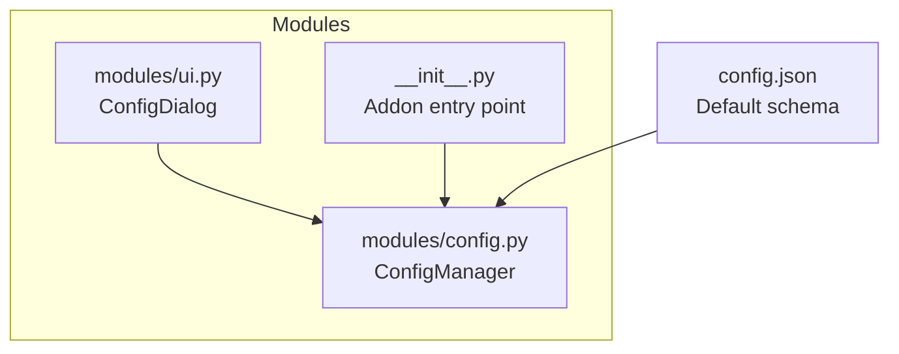
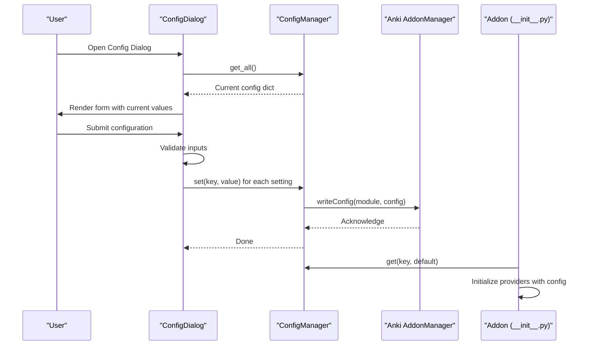
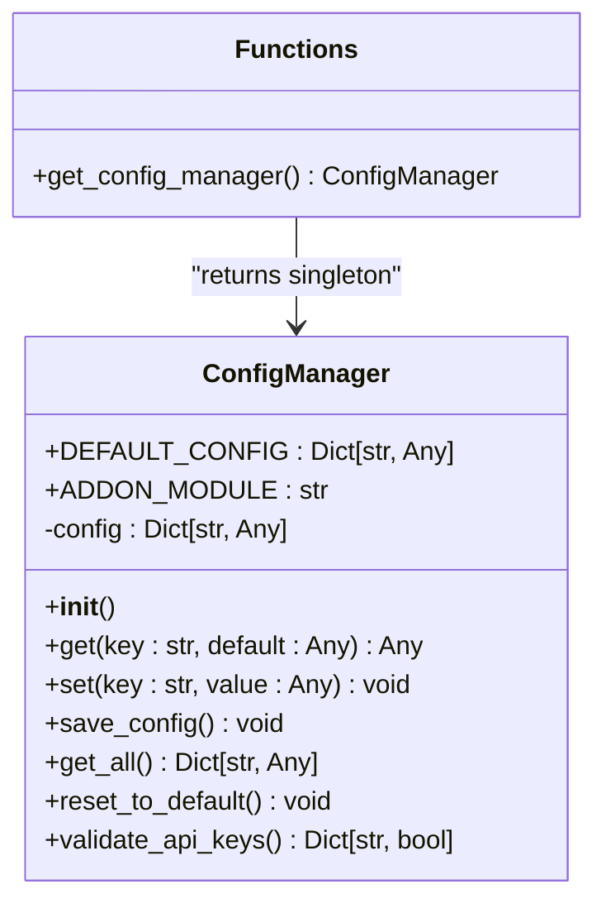
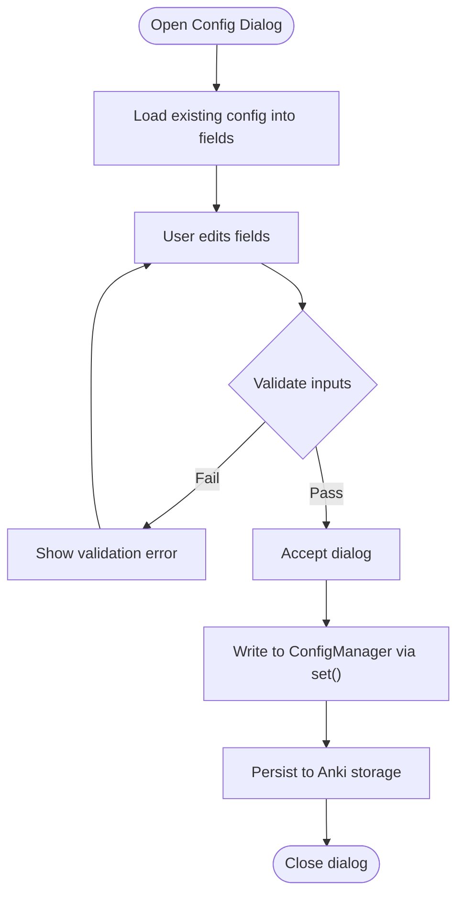
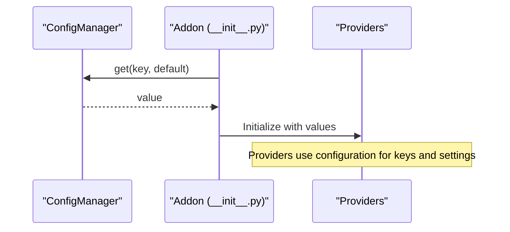
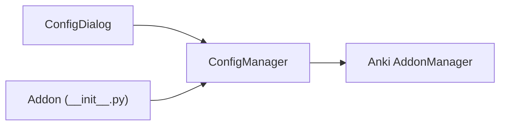

# Configuration API

<cite>
**Referenced Files in This Document**
- [config.py](file://AnkiAI_ImageAddon/modules/config.py)
- [ui.py](file://AnkiAI_ImageAddon/modules/ui.py)
- [__init__.py](file://AnkiAI_ImageAddon/__init__.py)
- [config.json](file://AnkiAI_ImageAddon/config.json)
- [API_REFERENCE.md](file://API_REFERENCE.md)
</cite>

## Table of Contents
1. [Introduction](#introduction)
2. [Project Structure](#project-structure)
3. [Core Components](#core-components)
4. [Architecture Overview](#architecture-overview)
5. [Detailed Component Analysis](#detailed-component-analysis)
6. [Dependency Analysis](#dependency-analysis)
7. [Performance Considerations](#performance-considerations)
8. [Troubleshooting Guide](#troubleshooting-guide)
9. [Conclusion](#conclusion)

## Introduction
This document provides API documentation for the configuration management system used by the AnkiAI add-on. It focuses on the ConfigManager class and its singleton accessor, detailing the get(), set(), reset_to_default(), and validate_api_keys() methods. It also documents the complete configuration schema, default values, validation rules, runtime update workflows, integration with the UI configuration dialog, and the relationship between configuration changes and provider initialization. Thread-safety considerations and best practices for multi-threaded access are included.

## Project Structure
The configuration system is implemented in a dedicated module and integrates with the UI and main add-on entry point. The configuration schema is defined in both the module’s default configuration and a JSON file shipped with the add-on.

**Diagram sources**
- [config.py:18-132](file://AnkiAI_ImageAddon/modules/config.py#L18-L132)
- [ui.py:174-400](file://AnkiAI_ImageAddon/modules/ui.py#L174-L400)
- [__init__.py:276-349](file://AnkiAI_ImageAddon/__init__.py#L276-L349)
- [config.json:1-35](file://AnkiAI_ImageAddon/config.json#L1-L35)

**Section sources**
- [config.py:18-132](file://AnkiAI_ImageAddon/modules/config.py#L18-L132)
- [ui.py:174-400](file://AnkiAI_ImageAddon/modules/ui.py#L174-L400)
- [__init__.py:276-349](file://AnkiAI_ImageAddon/__init__.py#L276-L349)
- [config.json:1-35](file://AnkiAI_ImageAddon/config.json#L1-L35)

## Core Components
- ConfigManager: Manages configuration values, persists them via Anki’s add-on manager, and validates API keys.
- Singleton accessor get_config_manager(): Ensures a single shared instance across the add-on lifecycle.
- UI configuration dialog ConfigDialog: Collects and validates user inputs, then writes them to ConfigManager.
- Integration points: The main add-on entry point reads configuration to initialize providers and runs background tasks.

Key responsibilities:
- Provide typed access to configuration values with defaults.
- Persist configuration changes to Anki’s storage.
- Validate that at least one AI provider and one image provider are configured (when applicable).
- Support resetting to default values.

**Section sources**
- [config.py:18-132](file://AnkiAI_ImageAddon/modules/config.py#L18-L132)
- [ui.py:174-400](file://AnkiAI_ImageAddon/modules/ui.py#L174-L400)
- [__init__.py:276-349](file://AnkiAI_ImageAddon/__init__.py#L276-L349)

## Architecture Overview
The configuration system is a thin wrapper around Anki’s add-on configuration storage. The UI dialog reads and writes configuration through the singleton ConfigManager, which persists changes to Anki. The main add-on uses configuration to initialize providers and run background processing.

**Diagram sources**
- [ui.py:262-324](file://AnkiAI_ImageAddon/modules/ui.py#L262-L324)
- [config.py:75-98](file://AnkiAI_ImageAddon/modules/config.py#L75-L98)
- [__init__.py:276-349](file://AnkiAI_ImageAddon/__init__.py#L276-L349)

## Detailed Component Analysis

### ConfigManager API
The ConfigManager class encapsulates configuration access, persistence, and validation.

- Constructor
  - Initializes from Anki’s add-on configuration. If empty, initializes with defaults and persists them.
  - Uses the add-on module name derived from the module path to target the correct configuration.

- Methods
  - get(key: str, default: Any = None) -> Any
    - Retrieves a configuration value with a fallback to the default if not present.
  - set(key: str, value: Any) -> None
    - Updates a configuration value and persists immediately via Anki’s add-on manager.
  - save_config() -> None
    - Writes the current configuration dictionary to Anki’s storage.
  - get_all() -> Dict[str, Any]
    - Returns a copy of the current configuration dictionary.
  - reset_to_default() -> None
    - Resets the in-memory configuration to defaults and persists.
  - validate_api_keys() -> Dict[str, bool]
    - Validates that at least one AI provider is configured.
    - Validates that at least one image provider is configured when the image generation mode requires it.

- Singleton Accessor
  - get_config_manager() -> ConfigManager
    - Returns a globally shared instance, lazily initializing it if needed.

- Thread Safety
  - The class does not use locks internally. Persistence is delegated to Anki’s add-on manager, which is responsible for safe serialization. For multi-threaded access, treat configuration reads/writes as atomic per operation and avoid long-lived references to mutable configuration objects.

**Section sources**
- [config.py:18-132](file://AnkiAI_ImageAddon/modules/config.py#L18-L132)

#### Class Diagram

**Diagram sources**
- [config.py:18-132](file://AnkiAI_ImageAddon/modules/config.py#L18-L132)

### Configuration Schema and Defaults
The configuration schema defines all supported keys, their types, and default values. Defaults are loaded from the module’s DEFAULT_CONFIG and persisted if no configuration exists.

- AI Providers
  - gemini_api_key: string
  - groq_api_key: string
  - use_ollama: boolean
  - ollama_url: string

- Image Search Providers
  - pexels_api_key: string
  - unsplash_api_key: string
  - pixabay_api_key: string
  - wallhaven_api_key: string

- Smart Selection Settings
  - enable_smart_selection: boolean
  - max_concurrent_providers: integer
  - smart_cache_ttl_minutes: integer

- Image Download Settings
  - image_download_timeout: integer
  - image_download_retries: integer
  - enable_image_optimization: boolean
  - image_max_width: integer
  - image_quality: integer

- Keyword Caching
  - enable_keyword_cache: boolean
  - keyword_cache_size: integer

- UI Settings
  - vocabulary_field: string
  - definition_field: string
  - image_field: string
  - image_generation_mode: string ("search")

- Concurrency Settings
  - max_concurrent_requests: integer
  - enable_concurrent_downloads: boolean

- Other
  - auto_add_on_sync: boolean

Notes:
- The shipped default JSON file reflects the v3 schema. The module’s DEFAULT_CONFIG reflects the v4 schema with expanded provider support and performance settings.

**Section sources**
- [config.py:21-63](file://AnkiAI_ImageAddon/modules/config.py#L21-L63)
- [config.json:1-35](file://AnkiAI_ImageAddon/config.json#L1-L35)

### Validation Rules
- At least one AI provider must be configured:
  - gemini_api_key non-empty, or
  - groq_api_key non-empty, or
  - use_ollama is True
- At least one image provider must be configured when image_generation_mode is "search":
  - pexels_api_key non-empty, or
  - unsplash_api_key non-empty, or
  - pixabay_api_key non-empty

Validation returns a dictionary indicating whether AI providers and image providers are configured.

**Section sources**
- [config.py:100-119](file://AnkiAI_ImageAddon/modules/config.py#L100-L119)

### Runtime Configuration Updates
- From UI:
  - The ConfigDialog collects values and calls get_config() to produce a configuration dictionary.
  - The add-on’s open_config_dialog() writes each key-value pair to ConfigManager via set().
  - After writing, a success message is shown to the user.

- From code:
  - Use get_config_manager() to obtain the singleton.
  - Call set(key, value) to update a single setting.
  - Use get_all() to read the current configuration for inspection or UI population.

- Persistence:
  - Each set() call triggers save_config(), which writes to Anki’s add-on configuration.

**Section sources**
- [ui.py:296-324](file://AnkiAI_ImageAddon/modules/ui.py#L296-L324)
- [__init__.py:276-299](file://AnkiAI_ImageAddon/__init__.py#L276-L299)
- [config.py:75-98](file://AnkiAI_ImageAddon/modules/config.py#L75-L98)

### Integration with UI Configuration Dialog
- ConfigDialog displays fields for AI providers and image providers, with placeholders and optional testing.
- It validates that at least one AI provider and at least one image provider are configured before accepting.
- It exposes get_config() to return a normalized configuration dictionary suitable for writing to ConfigManager.

**Diagram sources**
- [ui.py:262-324](file://AnkiAI_ImageAddon/modules/ui.py#L262-L324)
- [config.py:75-98](file://AnkiAI_ImageAddon/modules/config.py#L75-L98)

**Section sources**
- [ui.py:174-400](file://AnkiAI_ImageAddon/modules/ui.py#L174-L400)
- [ui.py:296-324](file://AnkiAI_ImageAddon/modules/ui.py#L296-L324)

### Relationship Between Configuration Changes and Provider Initialization
- The main add-on reads configuration to initialize providers:
  - AI providers (Gemini, Groq, Ollama) and image providers (Pexels, Unsplash, Pixabay, Wallhaven, plus free providers) are read from configuration.
  - Smart selection settings influence provider concurrency and caching.
- When configuration changes, the add-on should re-initialize providers to reflect new settings.
- The add-on registers a configuration change callback to update the in-memory configuration when changed externally.

**Diagram sources**
- [__init__.py:176-211](file://AnkiAI_ImageAddon/__init__.py#L176-L211)
- [config.py:75-98](file://AnkiAI_ImageAddon/modules/config.py#L75-L98)

**Section sources**
- [__init__.py:176-211](file://AnkiAI_ImageAddon/__init__.py#L176-L211)
- [__init__.py:301-307](file://AnkiAI_ImageAddon/__init__.py#L301-L307)

## Dependency Analysis
- ConfigManager depends on Anki’s add-on manager for persistence.
- UI components depend on ConfigManager for reading and writing configuration.
- The main add-on depends on ConfigManager for provider initialization and runtime behavior.

**Diagram sources**
- [config.py:84-89](file://AnkiAI_ImageAddon/modules/config.py#L84-L89)
- [ui.py:296-324](file://AnkiAI_ImageAddon/modules/ui.py#L296-L324)
- [__init__.py:176-211](file://AnkiAI_ImageAddon/__init__.py#L176-L211)

**Section sources**
- [config.py:84-89](file://AnkiAI_ImageAddon/modules/config.py#L84-L89)
- [ui.py:296-324](file://AnkiAI_ImageAddon/modules/ui.py#L296-L324)
- [__init__.py:176-211](file://AnkiAI_ImageAddon/__init__.py#L176-L211)

## Performance Considerations
- Configuration reads are lightweight dictionary lookups with default fallbacks.
- Persisting configuration occurs on each set() call; batching updates reduces I/O overhead.
- Smart selection and caching settings influence provider performance; tune max_concurrent_providers and cache TTL for your workload.

[No sources needed since this section provides general guidance]

## Troubleshooting Guide
- Configuration not persisting:
  - Ensure set() is called and no exceptions occur during save_config().
  - Verify that the add-on module name matches the expected path.
- Validation failures:
  - For AI providers, ensure at least one of gemini_api_key, groq_api_key, or use_ollama is configured.
  - For image providers, ensure at least one of pexels_api_key, unsplash_api_key, or pixabay_api_key is configured when image_generation_mode is "search".
- UI dialog not loading existing values:
  - Confirm that ConfigDialog is constructed with existing_config and load_existing_config() is invoked.

**Section sources**
- [config.py:84-89](file://AnkiAI_ImageAddon/modules/config.py#L84-L89)
- [config.py:100-119](file://AnkiAI_ImageAddon/modules/config.py#L100-L119)
- [ui.py:262-324](file://AnkiAI_ImageAddon/modules/ui.py#L262-L324)

## Conclusion
The configuration management system provides a clean, persistent interface for storing and retrieving add-on settings. The ConfigManager singleton ensures consistent access, while the UI dialog offers a guided way to configure providers and image settings. Proper validation and integration with provider initialization ensure reliable behavior. For multi-threaded environments, treat configuration updates as atomic and avoid holding long-lived mutable references.