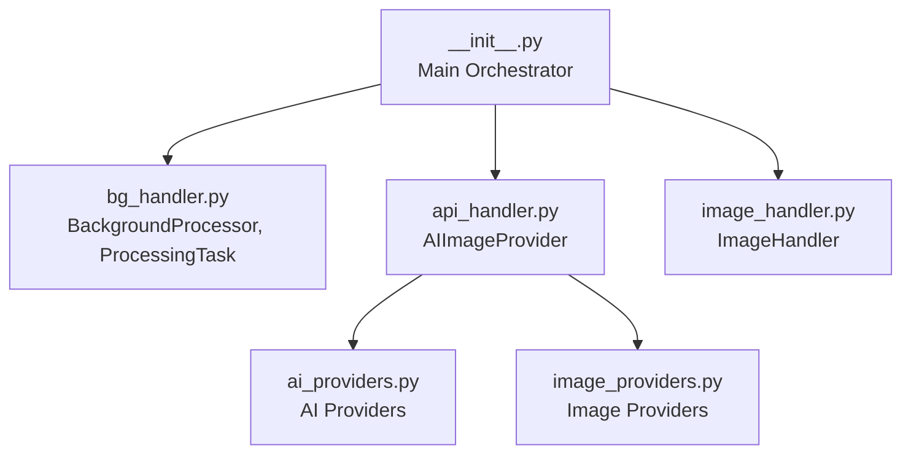
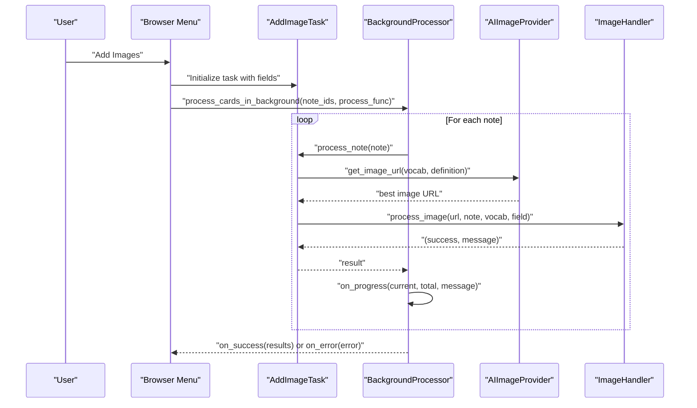
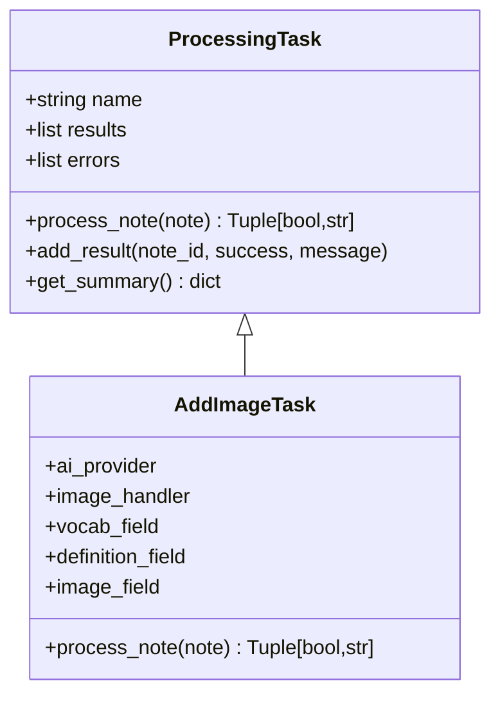
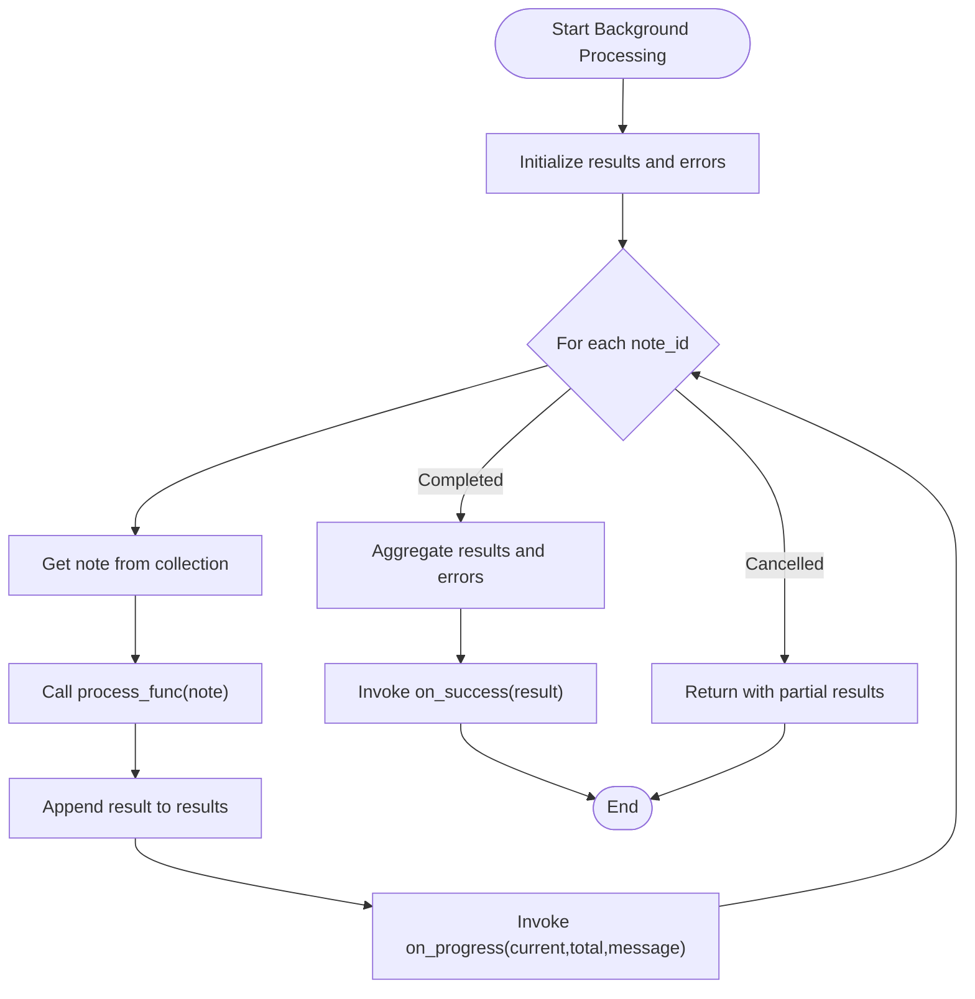
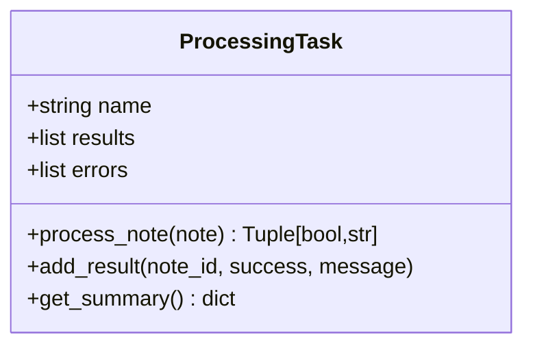
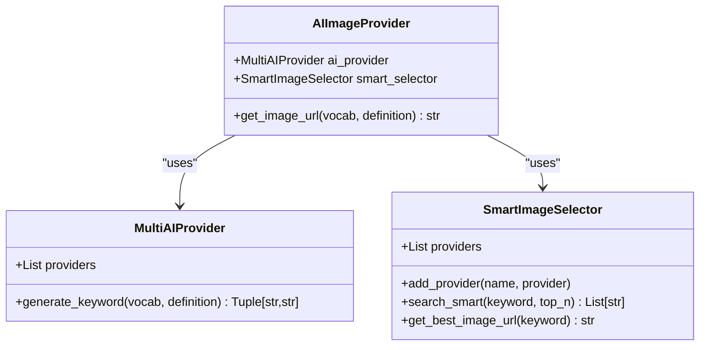
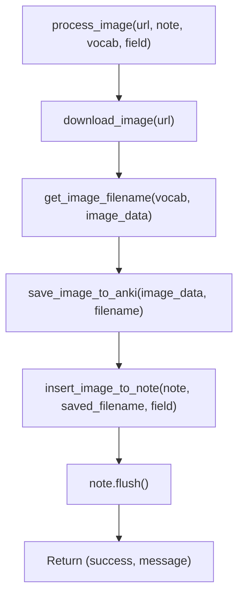
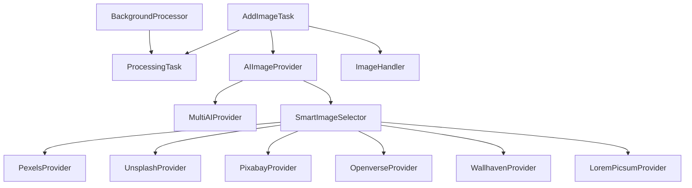

# Core Workflow API

<cite>
**Referenced Files in This Document**
- [__init__.py](file://AnkiAI_ImageAddon/__init__.py)
- [bg_handler.py](file://AnkiAI_ImageAddon/modules/bg_handler.py)
- [image_handler.py](file://AnkiAI_ImageAddon/modules/image_handler.py)
- [api_handler.py](file://AnkiAI_ImageAddon/modules/api_handler.py)
- [ai_providers.py](file://AnkiAI_ImageAddon/modules/ai_providers.py)
- [image_providers.py](file://AnkiAI_ImageAddon/modules/image_providers.py)
- [API_REFERENCE.md](file://API_REFERENCE.md)
- [ARCHITECTURE.md](file://ARCHITECTURE.md)
</cite>

## Table of Contents
1. [Introduction](#introduction)
2. [Project Structure](#project-structure)
3. [Core Components](#core-components)
4. [Architecture Overview](#architecture-overview)
5. [Detailed Component Analysis](#detailed-component-analysis)
6. [Dependency Analysis](#dependency-analysis)
7. [Performance Considerations](#performance-considerations)
8. [Troubleshooting Guide](#troubleshooting-guide)
9. [Conclusion](#conclusion)
10. [Appendices](#appendices)

## Introduction
This document provides API documentation for the core workflow APIs that orchestrate the complete image processing pipeline in the AnkiAI add-on. It focuses on:
- AddImageTask class and its process_note method for initiating image processing workflows on Anki notes
- BackgroundProcessor class with its process_cards_in_background method for running long-running operations without blocking the UI
- ProcessingTask base class and how to extend it for custom processing workflows
- Method signatures, parameter specifications, return value formats, and callback mechanisms for progress tracking and completion handling
- Comprehensive examples showing how to chain these APIs together for batch processing multiple notes
- Error handling patterns, cancellation mechanisms, and progress reporting
- Best practices for integrating these APIs into Anki browser menus and custom workflows

## Project Structure
The add-on is organized into a main orchestrator module and modular components:
- Main orchestrator: defines AddImageTask and integrates UI, API, image, and background processing
- Modules:
  - bg_handler: background processing and task base class
  - api_handler: AI integration and image provider orchestration
  - image_handler: image download, optimization, and insertion
  - ai_providers: Gemini, Groq, Ollama providers
  - image_providers: Pexels, Unsplash, Pixabay, Openverse, Wallhaven, Lorem Picsum providers

**Diagram sources**
- [__init__.py:1-349](file://AnkiAI_ImageAddon/__init__.py#L1-L349)
- [bg_handler.py:1-205](file://AnkiAI_ImageAddon/modules/bg_handler.py#L1-L205)
- [api_handler.py:1-229](file://AnkiAI_ImageAddon/modules/api_handler.py#L1-L229)
- [image_handler.py:1-364](file://AnkiAI_ImageAddon/modules/image_handler.py#L1-L364)
- [ai_providers.py:1-393](file://AnkiAI_ImageAddon/modules/ai_providers.py#L1-L393)
- [image_providers.py:1-463](file://AnkiAI_ImageAddon/modules/image_providers.py#L1-L463)

**Section sources**
- [__init__.py:1-349](file://AnkiAI_ImageAddon/__init__.py#L1-L349)
- [ARCHITECTURE.md:1-481](file://ARCHITECTURE.md#L1-L481)

## Core Components
This section documents the primary classes and their public APIs used to orchestrate image processing workflows.

- AddImageTask
  - Purpose: Encapsulates the end-to-end workflow for adding images to Anki notes
  - Inherits from: ProcessingTask
  - Key method: process_note(note) -> Tuple[bool, str]
  - Responsibilities:
    - Extract vocabulary and definition from note fields
    - Skip if image already present
    - Generate keyword via AI provider
    - Retrieve best image URL via SmartImageSelector
    - Download, optimize, save, and insert image into note
    - Persist changes via note.flush()

- BackgroundProcessor
  - Purpose: Runs long-running operations in the background without freezing the UI
  - Key method: process_cards_in_background(note_ids, process_func, on_progress, on_success, on_error, title) -> None
  - Supports cancellation via cancel() and status via is_processing()
  - Uses Anki’s QueryOp for background execution and built-in progress dialog

- ProcessingTask (Base)
  - Purpose: Base class for custom processing workflows
  - Key method: process_note(note) -> Tuple[bool, str] (abstract; must be overridden)
  - Helpers:
    - add_result(note_id, success, message) to record outcomes
    - get_summary() -> dict for aggregated results

**Section sources**
- [__init__.py:27-96](file://AnkiAI_ImageAddon/__init__.py#L27-L96)
- [bg_handler.py:12-108](file://AnkiAI_ImageAddon/modules/bg_handler.py#L12-L108)
- [bg_handler.py:166-205](file://AnkiAI_ImageAddon/modules/bg_handler.py#L166-L205)

## Architecture Overview
The workflow follows a four-stage pipeline:
1. UI selection and configuration
2. AI keyword generation and smart image selection
3. Image download, optimization, and insertion
4. Background processing with progress and completion callbacks

**Diagram sources**
- [__init__.py:99-273](file://AnkiAI_ImageAddon/__init__.py#L99-L273)
- [bg_handler.py:23-100](file://AnkiAI_ImageAddon/modules/bg_handler.py#L23-L100)
- [api_handler.py:187-227](file://AnkiAI_ImageAddon/modules/api_handler.py#L187-L227)
- [image_handler.py:326-364](file://AnkiAI_ImageAddon/modules/image_handler.py#L326-L364)

## Detailed Component Analysis

### AddImageTask
- Class: AddImageTask
- Inherits: ProcessingTask
- Constructor parameters:
  - ai_provider: AIImageProvider instance
  - image_handler_obj: ImageHandler instance
  - vocab_field: str (field name for vocabulary)
  - definition_field: str (field name for definition)
  - image_field: str (field name for image)
- process_note(note) -> Tuple[bool, str]
  - Extracts vocabulary and definition from note fields
  - Strips HTML tags and skips if image already present
  - Calls ai_provider.get_image_url(vocabulary, definition) to obtain best image URL
  - Delegates to image_handler.process_image(url, note, vocabulary, image_field)
  - Flushes note changes and returns success status and message
  - Handles APIError and ImageError and returns failure messages

**Diagram sources**
- [bg_handler.py:166-205](file://AnkiAI_ImageAddon/modules/bg_handler.py#L166-L205)
- [__init__.py:27-96](file://AnkiAI_ImageAddon/__init__.py#L27-L96)

**Section sources**
- [__init__.py:27-96](file://AnkiAI_ImageAddon/__init__.py#L27-L96)

### BackgroundProcessor
- Class: BackgroundProcessor
- Methods:
  - process_cards_in_background(note_ids, process_func, on_progress=None, on_success=None, on_error=None, title="Processing...") -> None
    - Executes process_func(note) for each note in background
    - Emits progress updates via on_progress(current, total, message)
    - Aggregates results and errors; invokes on_success(result) or on_error(error_msg)
    - Uses Anki’s QueryOp for non-blocking execution
  - cancel() -> None: Sets cancellation flag
  - is_processing() -> bool: Indicates whether processing is currently active

**Diagram sources**
- [bg_handler.py:23-100](file://AnkiAI_ImageAddon/modules/bg_handler.py#L23-L100)

**Section sources**
- [bg_handler.py:12-108](file://AnkiAI_ImageAddon/modules/bg_handler.py#L12-L108)

### ProcessingTask (Base)
- Class: ProcessingTask
- Purpose: Base class for custom processing workflows
- Methods:
  - process_note(note) -> Tuple[bool, str] (abstract)
  - add_result(note_id, success, message) -> None
  - get_summary() -> dict with task_name, total_processed, successful, failed, results, errors

**Diagram sources**
- [bg_handler.py:166-205](file://AnkiAI_ImageAddon/modules/bg_handler.py#L166-L205)

**Section sources**
- [bg_handler.py:166-205](file://AnkiAI_ImageAddon/modules/bg_handler.py#L166-L205)

### AIImageProvider and Smart Image Selection
- Class: AIImageProvider
- Purpose: Orchestrates AI keyword generation and smart image selection
- Methods:
  - get_image_url(vocabulary, definition) -> str
    - Generates keyword via MultiAIProvider (fallback across Gemini, Groq, Ollama)
    - Uses SmartImageSelector to concurrently search multiple image providers
    - Returns best image URL based on quality scoring

**Diagram sources**
- [api_handler.py:74-227](file://AnkiAI_ImageAddon/modules/api_handler.py#L74-L227)
- [ai_providers.py:297-393](file://AnkiAI_ImageAddon/modules/ai_providers.py#L297-L393)
- [image_providers.py:373-463](file://AnkiAI_ImageAddon/modules/image_providers.py#L373-L463)

**Section sources**
- [api_handler.py:74-227](file://AnkiAI_ImageAddon/modules/api_handler.py#L74-L227)

### ImageHandler
- Class: ImageHandler
- Purpose: Downloads, optimizes, saves, and inserts images into Anki notes
- Methods:
  - download_image(url, timeout=None, optimize=True) -> bytes
  - get_image_filename(vocabulary, image_data) -> str
  - save_image_to_anki(image_data, filename) -> str
  - insert_image_to_note(note, image_filename, image_field_name="Ảnh", responsive=True) -> bool
  - process_image(url, note, vocabulary, image_field_name="Ảnh") -> Tuple[bool, str]

**Diagram sources**
- [image_handler.py:326-364](file://AnkiAI_ImageAddon/modules/image_handler.py#L326-L364)

**Section sources**
- [image_handler.py:36-364](file://AnkiAI_ImageAddon/modules/image_handler.py#L36-L364)

## Dependency Analysis
The following diagram shows the key dependencies among the core components:

**Diagram sources**
- [__init__.py:27-96](file://AnkiAI_ImageAddon/__init__.py#L27-L96)
- [bg_handler.py:12-108](file://AnkiAI_ImageAddon/modules/bg_handler.py#L12-L108)
- [api_handler.py:74-227](file://AnkiAI_ImageAddon/modules/api_handler.py#L74-L227)
- [image_providers.py:104-463](file://AnkiAI_ImageAddon/modules/image_providers.py#L104-L463)

**Section sources**
- [__init__.py:1-349](file://AnkiAI_ImageAddon/__init__.py#L1-L349)
- [bg_handler.py:1-205](file://AnkiAI_ImageAddon/modules/bg_handler.py#L1-L205)
- [api_handler.py:1-229](file://AnkiAI_ImageAddon/modules/api_handler.py#L1-L229)
- [image_providers.py:1-463](file://AnkiAI_ImageAddon/modules/image_providers.py#L1-L463)

## Performance Considerations
- Batch size: Process 100–200 notes per batch to avoid memory overflow
- Concurrency: SmartImageSelector supports concurrent provider requests; tune max_workers appropriately
- Timeouts: Image download and API calls use optimized timeouts; adjust based on network conditions
- Caching: Keyword cache reduces repeated AI calls; image search results cached for TTL
- UI responsiveness: BackgroundProcessor runs tasks off the main thread using Anki’s QueryOp

[No sources needed since this section provides general guidance]

## Troubleshooting Guide
Common issues and resolutions:
- API key validation failures
  - Ensure API keys are configured and validated before running workflows
  - MultiAIProvider attempts fallback across providers; check fallback logs
- Network timeouts or rate limits
  - Reduce concurrent requests or increase timeouts
  - SmartImageSelector retries and caches results
- Image insertion errors
  - Verify target field exists and is writable
  - Ensure image was saved via Anki’s media write API
- Cancellation and progress
  - Use BackgroundProcessor.cancel() to stop processing early
  - Monitor progress via on_progress callbacks

**Section sources**
- [ARCHITECTURE.md:360-411](file://ARCHITECTURE.md#L360-L411)
- [API_REFERENCE.md:467-545](file://API_REFERENCE.md#L467-L545)

## Conclusion
The core workflow APIs provide a robust, extensible framework for automating image addition to Anki notes. By combining AddImageTask, BackgroundProcessor, and ProcessingTask, developers can implement custom workflows that remain responsive and reliable under real-world conditions. The included examples demonstrate how to integrate these APIs into Anki browser menus and how to handle progress, completion, and error scenarios effectively.

[No sources needed since this section summarizes without analyzing specific files]

## Appendices

### API Reference Index
- AddImageTask.process_note(note) -> Tuple[bool, str]
- BackgroundProcessor.process_cards_in_background(note_ids, process_func, on_progress=None, on_success=None, on_error=None, title="Processing...") -> None
- BackgroundProcessor.cancel() -> None
- BackgroundProcessor.is_processing() -> bool
- ProcessingTask.process_note(note) -> Tuple[bool, str]
- ProcessingTask.add_result(note_id, success, message) -> None
- ProcessingTask.get_summary() -> dict
- AIImageProvider.get_image_url(vocabulary, definition) -> str
- ImageHandler.process_image(url, note, vocabulary, image_field_name="Ảnh") -> Tuple[bool, str]

**Section sources**
- [API_REFERENCE.md:303-394](file://API_REFERENCE.md#L303-L394)
- [__init__.py:27-96](file://AnkiAI_ImageAddon/__init__.py#L27-L96)
- [bg_handler.py:12-108](file://AnkiAI_ImageAddon/modules/bg_handler.py#L12-L108)
- [bg_handler.py:166-205](file://AnkiAI_ImageAddon/modules/bg_handler.py#L166-L205)
- [api_handler.py:187-227](file://AnkiAI_ImageAddon/modules/api_handler.py#L187-L227)
- [image_handler.py:326-364](file://AnkiAI_ImageAddon/modules/image_handler.py#L326-L364)

### Example: Chain APIs Together for Batch Processing
- Steps:
  1. Instantiate AIImageProvider with desired providers and configuration
  2. Create ImageHandler bound to Anki’s main window
  3. Build AddImageTask with field mappings
  4. Wrap task.process_note into a process_func
  5. Invoke BackgroundProcessor.process_cards_in_background with callbacks
- Notes:
  - Use on_progress to update UI and track progress
  - Use on_success to summarize results and refresh browser
  - Use on_error to surface errors to the user

**Section sources**
- [__init__.py:99-273](file://AnkiAI_ImageAddon/__init__.py#L99-L273)
- [API_REFERENCE.md:398-463](file://API_REFERENCE.md#L398-L463)