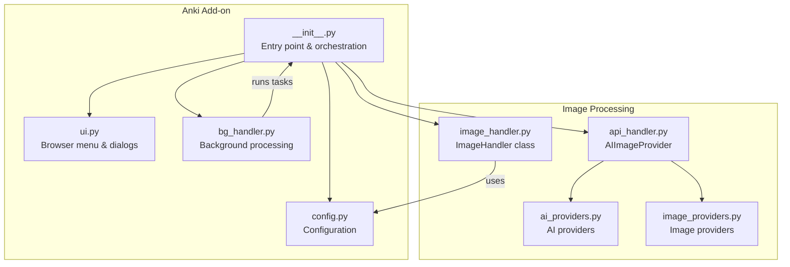
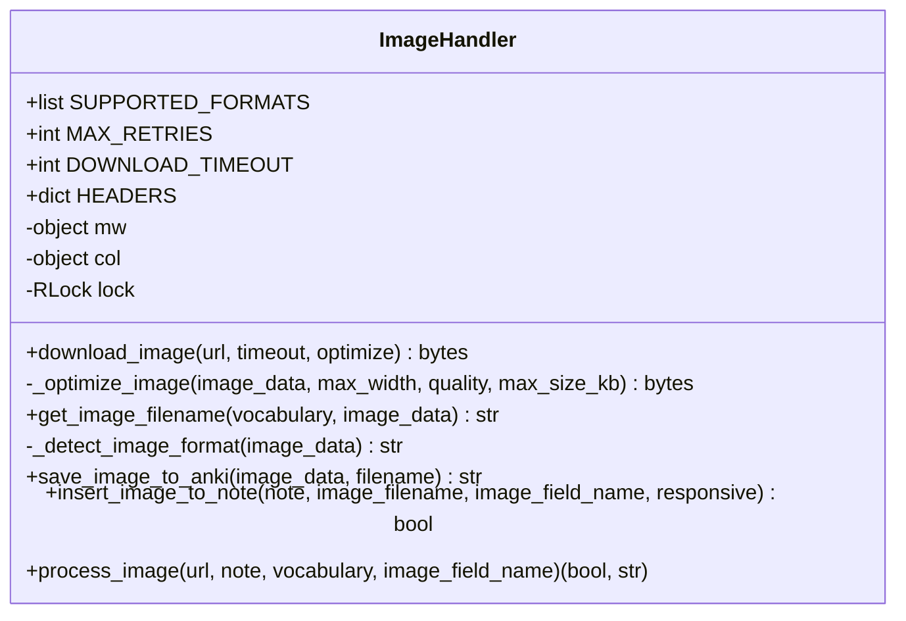
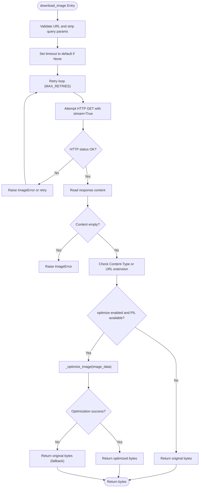
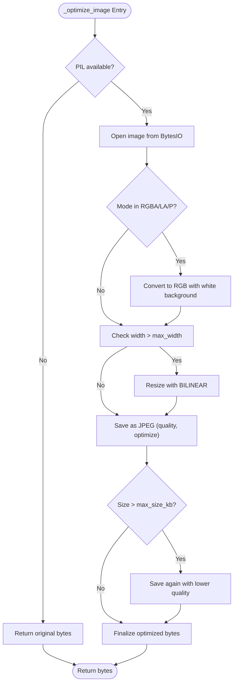
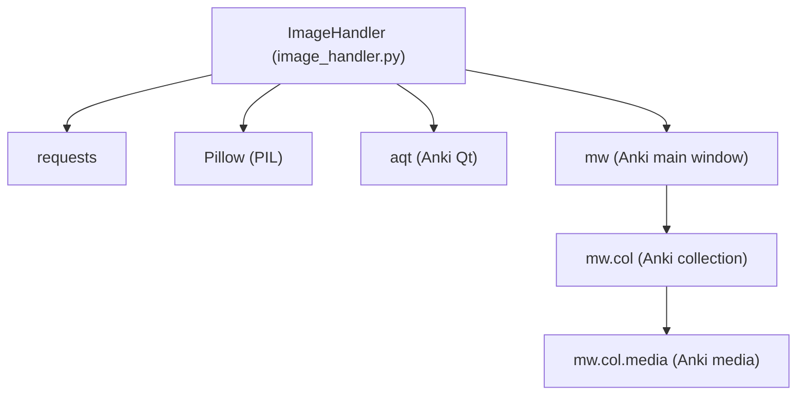

# Image Processing API

<cite>
**Referenced Files in This Document**
- [image_handler.py](file://AnkiAI_ImageAddon/modules/image_handler.py)
- [__init__.py](file://AnkiAI_ImageAddon/__init__.py)
- [api_handler.py](file://AnkiAI_ImageAddon/modules/api_handler.py)
- [ai_providers.py](file://AnkiAI_ImageAddon/modules/ai_providers.py)
- [image_providers.py](file://AnkiAI_ImageAddon/modules/image_providers.py)
- [bg_handler.py](file://AnkiAI_ImageAddon/modules/bg_handler.py)
- [ui.py](file://AnkiAI_ImageAddon/modules/ui.py)
- [config.py](file://AnkiAI_ImageAddon/modules/config.py)
- [manifest.json](file://AnkiAI_ImageAddon/manifest.json)
- [API_REFERENCE.md](file://API_REFERENCE.md)
</cite>

## Table of Contents
1. [Introduction](#introduction)
2. [Project Structure](#project-structure)
3. [Core Components](#core-components)
4. [Architecture Overview](#architecture-overview)
5. [Detailed Component Analysis](#detailed-component-analysis)
6. [Dependency Analysis](#dependency-analysis)
7. [Performance Considerations](#performance-considerations)
8. [Troubleshooting Guide](#troubleshooting-guide)
9. [Conclusion](#conclusion)
10. [Appendices](#appendices)

## Introduction
This document provides comprehensive API documentation for the image processing and Anki integration subsystem. It focuses on the ImageHandler class and its role in the complete pipeline from URL to Anki media integration. The documentation covers method signatures, parameter specifications, supported image formats, automatic format detection, Anki media integration using mw.col.media.writeData(), note flushing, error handling with ImageError exceptions, validation patterns, and practical examples for full pipeline processing, individual steps, and error recovery strategies. It also includes performance considerations, memory management, and best practices for handling large images.

## Project Structure
The image processing API resides in the modules directory under AnkiAI_ImageAddon. The primary entry point integrates with Anki’s browser menu and background processing. The key modules involved are:
- image_handler.py: Implements ImageHandler with download, optimization, naming, saving to Anki media, and insertion into notes.
- __init__.py: Orchestrates the add-on lifecycle, sets up the browser menu, and runs background tasks.
- api_handler.py: Provides AI integration and smart image selection.
- ai_providers.py: Implements AI providers (Gemini, Groq, Ollama) and keyword generation.
- image_providers.py: Implements image providers (Pexels, Unsplash, Pixabay, Openverse, Wallhaven, Lorem Picsum) and smart selection.
- bg_handler.py: Background processing utilities for asynchronous operations.
- ui.py: Browser menu management and configuration dialogs.
- config.py: Configuration management for API keys, modes, and performance settings.
- manifest.json: Add-on metadata and versioning.



**Diagram sources**
- [__init__.py:310-349](file://AnkiAI_ImageAddon/__init__.py#L310-L349)
- [image_handler.py:36-58](file://AnkiAI_ImageAddon/modules/image_handler.py#L36-L58)
- [api_handler.py:74-229](file://AnkiAI_ImageAddon/modules/api_handler.py#L74-L229)
- [ai_providers.py:297-393](file://AnkiAI_ImageAddon/modules/ai_providers.py#L297-L393)
- [image_providers.py:373-463](file://AnkiAI_ImageAddon/modules/image_providers.py#L373-L463)
- [bg_handler.py:12-109](file://AnkiAI_ImageAddon/modules/bg_handler.py#L12-L109)
- [ui.py:13-94](file://AnkiAI_ImageAddon/modules/ui.py#L13-L94)
- [config.py:18-63](file://AnkiAI_ImageAddon/modules/config.py#L18-L63)

**Section sources**
- [__init__.py:310-349](file://AnkiAI_ImageAddon/__init__.py#L310-L349)
- [image_handler.py:36-58](file://AnkiAI_ImageAddon/modules/image_handler.py#L36-L58)
- [api_handler.py:74-229](file://AnkiAI_ImageAddon/modules/api_handler.py#L74-L229)
- [ai_providers.py:297-393](file://AnkiAI_ImageAddon/modules/ai_providers.py#L297-L393)
- [image_providers.py:373-463](file://AnkiAI_ImageAddon/modules/image_providers.py#L373-L463)
- [bg_handler.py:12-109](file://AnkiAI_ImageAddon/modules/bg_handler.py#L12-L109)
- [ui.py:13-94](file://AnkiAI_ImageAddon/modules/ui.py#L13-L94)
- [config.py:18-63](file://AnkiAI_ImageAddon/modules/config.py#L18-L63)

## Core Components
This section documents the ImageHandler class and its methods, focusing on the complete image processing pipeline from URL to Anki media integration.

- ImageHandler class
  - Purpose: Manage downloading, optimizing, naming, saving, and inserting images into Anki notes.
  - Key constants:
    - SUPPORTED_FORMATS: List of supported extensions.
    - MAX_RETRIES: Number of retry attempts for downloads.
    - DOWNLOAD_TIMEOUT: Default timeout for downloads.
    - HEADERS: Optimized HTTP headers for faster requests.
  - Constructor parameters:
    - mw: Anki’s main window object, used to access mw.col for media operations.
  - Thread safety: Uses a threading.Lock for thread-safe operations.

- Method: download_image
  - Purpose: Download an image from a URL with optimized timeouts and retries.
  - Parameters:
    - url: Target image URL.
    - timeout: Optional download timeout in seconds; defaults to DOWNLOAD_TIMEOUT.
    - optimize: Boolean flag to enable lightweight optimization via PIL.
  - Returns: bytes containing the image data.
  - Behavior:
    - Validates URL and strips query parameters.
    - Attempts up to MAX_RETRIES with exponential backoff-like retries.
    - Streams response to reduce memory usage.
    - Verifies content type and falls back to extension-based detection if needed.
    - Optionally optimizes image using internal _optimize_image.
  - Exceptions: Raises ImageError on failure after retries.

- Method: _optimize_image
  - Purpose: Lightweight image optimization focused on speed and memory efficiency.
  - Parameters:
    - image_data: Raw image bytes.
    - max_width: Maximum width (default reduced from previous versions).
    - quality: JPEG quality (default reduced from previous versions).
    - max_size_kb: Maximum file size threshold.
  - Behavior:
    - Converts RGBA/LA/P to RGB to reduce size.
    - Resizes if width exceeds max_width using bilinear interpolation.
    - Saves as JPEG with optimization and checks size.
    - If still too large, reduces quality and saves again.
    - Prints optimization statistics.
  - Returns: Optimized image bytes.

- Method: get_image_filename
  - Purpose: Generate a unique filename for the image.
  - Parameters:
    - vocabulary: Vocabulary term used for naming.
    - image_data: Image bytes used to detect format.
  - Behavior:
    - Sanitizes vocabulary to a safe filename stem.
    - Detects format using _detect_image_format.
    - Appends a timestamp to ensure uniqueness.
  - Returns: Unique filename with detected extension.

- Method: _detect_image_format
  - Purpose: Detect image format from raw bytes using magic numbers.
  - Parameters:
    - image_data: Raw image bytes.
  - Behavior:
    - Checks magic numbers for JPEG, PNG, GIF, and WebP.
    - Defaults to .jpg if unknown.
  - Returns: Detected extension.

- Method: save_image_to_anki
  - Purpose: Save image data to Anki’s media directory using mw.col.media.writeData().
  - Parameters:
    - image_data: Image bytes.
    - filename: Target filename.
  - Behavior:
    - Calls mw.col.media.writeData(filename, image_data) to ensure AnkiWeb sync.
    - Validates returned filename and raises ImageError on failure.
  - Returns: Saved filename.

- Method: insert_image_to_note
  - Purpose: Insert an image tag into a note’s designated field.
  - Parameters:
    - note: Anki Note object.
    - image_filename: Saved filename from save_image_to_anki.
    - image_field_name: Name of the note field to insert into.
    - responsive: Boolean to add responsive attributes for mobile.
  - Behavior:
    - Validates that the field exists and is empty or contains no image.
    - Generates responsive HTML img tag with lazy loading and rounded corners.
    - Appends to existing content or sets directly if empty.
  - Returns: Boolean indicating success.

- Method: process_image
  - Purpose: End-to-end pipeline: download -> save -> insert -> flush.
  - Parameters:
    - url: Image URL.
    - note: Anki Note object.
    - vocabulary: Vocabulary term for naming.
    - image_field_name: Target field name.
  - Behavior:
    - Calls download_image, get_image_filename, save_image_to_anki, and insert_image_to_note.
    - Flushes the note after successful insertion.
  - Returns: Tuple (success: bool, message: str).

- Exceptions:
  - ImageError: Custom exception raised for image processing failures.

**Section sources**
- [image_handler.py:31-364](file://AnkiAI_ImageAddon/modules/image_handler.py#L31-L364)

## Architecture Overview
The image processing pipeline integrates with Anki’s browser interface and background processing. The flow begins when the user selects notes in the browser, triggers the add-on, and the system orchestrates AI keyword generation and image selection, followed by the ImageHandler pipeline to download, optimize, save, and insert images into notes.

```mermaid
sequenceDiagram
participant User as "User"
participant Browser as "Anki Browser"
participant Addon as "__init__.py"
participant Task as "AddImageTask"
participant AI as "AIImageProvider"
participant ImgSel as "SmartImageSelector"
participant ImgProv as "Image Providers"
participant Handler as "ImageHandler"
participant Media as "Anki Media"
User->>Browser : Right-click > "AnkiAI : Add images"
Browser->>Addon : on_browser_menu_add_images()
Addon->>AI : Initialize AIImageProvider
Addon->>ImgSel : Initialize SmartImageSelector
Addon->>Task : Create AddImageTask
Addon->>BG : process_cards_in_background()
loop For each selected note
Task->>Task : process_note(note)
Task->>AI : get_image_url(vocabulary, definition)
AI->>ImgSel : get_best_image_url(keyword)
ImgSel->>ImgProv : search(keyword) concurrently
ImgProv-->>ImgSel : URLs
ImgSel-->>AI : best URL
AI-->>Task : image_url
Task->>Handler : process_image(url, note, vocabulary, image_field)
Handler->>Handler : download_image(url)
Handler->>Handler : get_image_filename(vocabulary, image_data)
Handler->>Media : save_image_to_anki(image_data, filename)
Handler->>Handler : insert_image_to_note(note, saved_filename)
Handler->>Note : note.flush()
end
BG-->>Addon : on_success(summary)
Addon-->>Browser : Show results
```

**Diagram sources**
- [__init__.py:99-273](file://AnkiAI_ImageAddon/__init__.py#L99-L273)
- [api_handler.py:187-228](file://AnkiAI_ImageAddon/modules/api_handler.py#L187-L228)
- [image_providers.py:411-462](file://AnkiAI_ImageAddon/modules/image_providers.py#L411-L462)
- [image_handler.py:326-364](file://AnkiAI_ImageAddon/modules/image_handler.py#L326-L364)
- [bg_handler.py:23-100](file://AnkiAI_ImageAddon/modules/bg_handler.py#L23-L100)

**Section sources**
- [__init__.py:99-273](file://AnkiAI_ImageAddon/__init__.py#L99-L273)
- [api_handler.py:187-228](file://AnkiAI_ImageAddon/modules/api_handler.py#L187-L228)
- [image_providers.py:411-462](file://AnkiAI_ImageAddon/modules/image_providers.py#L411-L462)
- [image_handler.py:326-364](file://AnkiAI_ImageAddon/modules/image_handler.py#L326-L364)
- [bg_handler.py:23-100](file://AnkiAI_ImageAddon/modules/bg_handler.py#L23-L100)

## Detailed Component Analysis

### ImageHandler Class
The ImageHandler class encapsulates the entire image processing pipeline. It manages network downloads, lightweight optimization, filename generation, Anki media integration, and note insertion.



**Diagram sources**
- [image_handler.py:36-364](file://AnkiAI_ImageAddon/modules/image_handler.py#L36-L364)

**Section sources**
- [image_handler.py:36-364](file://AnkiAI_ImageAddon/modules/image_handler.py#L36-L364)

### Image Download and Optimization Flow
This flow illustrates the internal processing of download_image and the optional optimization step.



**Diagram sources**
- [image_handler.py:59-129](file://AnkiAI_ImageAddon/modules/image_handler.py#L59-L129)
- [image_handler.py:130-196](file://AnkiAI_ImageAddon/modules/image_handler.py#L130-L196)

**Section sources**
- [image_handler.py:59-129](file://AnkiAI_ImageAddon/modules/image_handler.py#L59-L129)
- [image_handler.py:130-196](file://AnkiAI_ImageAddon/modules/image_handler.py#L130-L196)

### Image Optimization Details
The optimization routine converts RGBA/LA/P to RGB, resizes if necessary, and saves as JPEG with quality control and size checks.



**Diagram sources**
- [image_handler.py:130-196](file://AnkiAI_ImageAddon/modules/image_handler.py#L130-L196)

**Section sources**
- [image_handler.py:130-196](file://AnkiAI_ImageAddon/modules/image_handler.py#L130-L196)

### Anki Media Integration and Note Insertion
The integration with Anki’s media system ensures synchronization with AnkiWeb by using mw.col.media.writeData(). After saving, the note must be flushed to persist changes.

```mermaid
sequenceDiagram
participant Handler as "ImageHandler"
participant Media as "Anki Media"
participant Note as "Anki Note"
Handler->>Handler : save_image_to_anki(image_data, filename)
Handler->>Media : writeData(filename, image_data)
Media-->>Handler : saved_filename
Handler->>Handler : insert_image_to_note(note, saved_filename, field)
Handler->>Note : note.flush()
Note-->>Handler : success
```

**Diagram sources**
- [image_handler.py:243-268](file://AnkiAI_ImageAddon/modules/image_handler.py#L243-L268)
- [image_handler.py:269-325](file://AnkiAI_ImageAddon/modules/image_handler.py#L269-L325)
- [__init__.py:82-87](file://AnkiAI_ImageAddon/__init__.py#L82-L87)

**Section sources**
- [image_handler.py:243-268](file://AnkiAI_ImageAddon/modules/image_handler.py#L243-L268)
- [image_handler.py:269-325](file://AnkiAI_ImageAddon/modules/image_handler.py#L269-L325)
- [__init__.py:82-87](file://AnkiAI_ImageAddon/__init__.py#L82-L87)

### API Usage Examples
The following examples demonstrate typical usage patterns for the ImageHandler API.

- Full pipeline processing
  - Steps: download_image -> get_image_filename -> save_image_to_anki -> insert_image_to_note -> note.flush()
  - Use case: End-to-end automation within a background task.

- Individual step processing
  - Steps: download_image -> save_image_to_anki -> insert_image_to_note
  - Use case: Manual control over each stage for debugging or custom logic.

- Error recovery strategies
  - Retry on timeout or request failure.
  - Fallback to original image if optimization fails.
  - Validate field existence and content before insertion.
  - Catch ImageError and handle gracefully in higher-level tasks.

**Section sources**
- [API_REFERENCE.md:150-223](file://API_REFERENCE.md#L150-L223)
- [image_handler.py:326-364](file://AnkiAI_ImageAddon/modules/image_handler.py#L326-L364)

## Dependency Analysis
The ImageHandler depends on external libraries and Anki’s media system. It also integrates with AI and image providers for URL generation and selection.



**Diagram sources**
- [image_handler.py:15-28](file://AnkiAI_ImageAddon/modules/image_handler.py#L15-L28)
- [image_handler.py:48-57](file://AnkiAI_ImageAddon/modules/image_handler.py#L48-L57)
- [__init__.py:6-10](file://AnkiAI_ImageAddon/__init__.py#L6-L10)

**Section sources**
- [image_handler.py:15-28](file://AnkiAI_ImageAddon/modules/image_handler.py#L15-L28)
- [image_handler.py:48-57](file://AnkiAI_ImageAddon/modules/image_handler.py#L48-L57)
- [__init__.py:6-10](file://AnkiAI_ImageAddon/__init__.py#L6-L10)

## Performance Considerations
- Network efficiency:
  - Streamed downloads reduce memory usage.
  - Optimized headers and reduced timeouts improve responsiveness.
- Image optimization:
  - Lightweight resizing and JPEG compression reduce file sizes.
  - Quality reduction balances file size and visual fidelity.
- Concurrency:
  - Background processing prevents UI blocking.
  - Smart image selection uses concurrent provider searches.
- Memory management:
  - Streaming and in-memory BytesIO minimize disk I/O.
  - Thread locks protect shared resources.
- Best practices:
  - Use save_image_to_anki to ensure AnkiWeb sync.
  - Call note.flush after modifications.
  - Validate fields and content before insertion to avoid redundant operations.

[No sources needed since this section provides general guidance]

## Troubleshooting Guide
Common issues and resolutions:
- Invalid URL or empty response:
  - Validate URL and strip query parameters.
  - Retry with reduced timeout or disable optimization temporarily.
- Timeout or request failures:
  - Increase timeout cautiously; ensure network stability.
  - Verify API keys for AI and image providers.
- Unsupported or unknown image formats:
  - Automatic detection uses magic numbers; default to .jpg if unknown.
  - Ensure supported formats are used or adjust detection logic.
- AnkiWeb sync issues:
  - Always use save_image_to_anki; avoid direct filesystem writes.
  - Confirm note.flush is called after modifications.
- Field conflicts:
  - Check if the target field exists and does not already contain an image.
  - Use responsive insertion to ensure compatibility across devices.

**Section sources**
- [image_handler.py:71-129](file://AnkiAI_ImageAddon/modules/image_handler.py#L71-L129)
- [image_handler.py:243-268](file://AnkiAI_ImageAddon/modules/image_handler.py#L243-L268)
- [image_handler.py:269-325](file://AnkiAI_ImageAddon/modules/image_handler.py#L269-L325)

## Conclusion
The ImageHandler class provides a robust, efficient pipeline for downloading, optimizing, naming, saving, and inserting images into Anki notes. Its integration with Anki’s media system and background processing ensures reliable, scalable operation. By following the documented patterns, validations, and best practices, developers can implement resilient image processing workflows tailored to their needs.

[No sources needed since this section summarizes without analyzing specific files]

## Appendices

### API Reference Highlights
- ImageHandler.download_image
  - Parameters: url, timeout, optimize
  - Returns: bytes
  - Notes: Streamed download, retry logic, optional optimization
- ImageHandler.save_image_to_anki
  - Parameters: image_data, filename
  - Returns: saved filename
  - Notes: Uses mw.col.media.writeData() for AnkiWeb sync
- ImageHandler.insert_image_to_note
  - Parameters: note, image_filename, image_field_name, responsive
  - Returns: success boolean
  - Notes: Responsive HTML insertion with lazy loading
- ImageHandler.process_image
  - Parameters: url, note, vocabulary, image_field_name
  - Returns: (success, message)
  - Notes: End-to-end pipeline with note.flush()

**Section sources**
- [API_REFERENCE.md:150-223](file://API_REFERENCE.md#L150-L223)

### Supported Image Formats
- .jpg, .jpeg
- .png
- .gif
- .webp

Automatic format detection is performed using magic numbers with a fallback to .jpg.

**Section sources**
- [image_handler.py:39](file://AnkiAI_ImageAddon/modules/image_handler.py#L39)
- [image_handler.py:220-242](file://AnkiAI_ImageAddon/modules/image_handler.py#L220-L242)

### Configuration and Settings
- Default timeouts and retries:
  - DOWNLOAD_TIMEOUT: Reduced from previous versions.
  - MAX_RETRIES: Reduced from previous versions.
- Image optimization settings:
  - image_max_width, image_quality, enable_image_optimization
- Smart selection settings:
  - enable_smart_selection, max_concurrent_providers, smart_cache_ttl_minutes

**Section sources**
- [config.py:21-63](file://AnkiAI_ImageAddon/modules/config.py#L21-L63)
- [image_handler.py:40-46](file://AnkiAI_ImageAddon/modules/image_handler.py#L40-L46)

### Add-on Metadata
- Version: 4.0.0
- Compatibility: Anki 24.04+
- Description: 6 image providers with smart selection, optimized performance, and free usage.

**Section sources**
- [manifest.json:1-12](file://AnkiAI_ImageAddon/manifest.json#L1-L12)