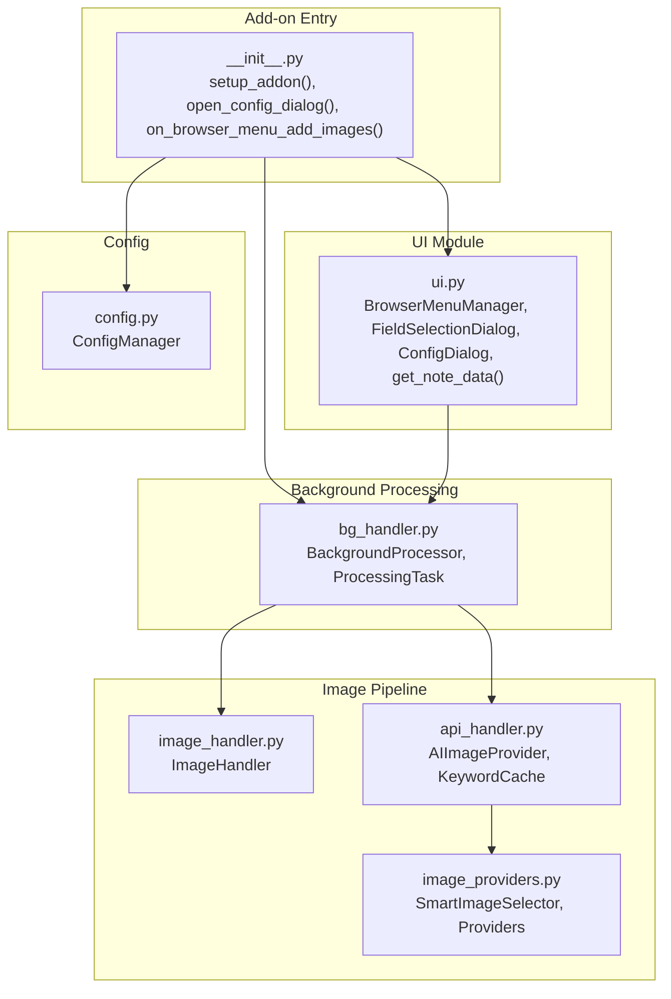
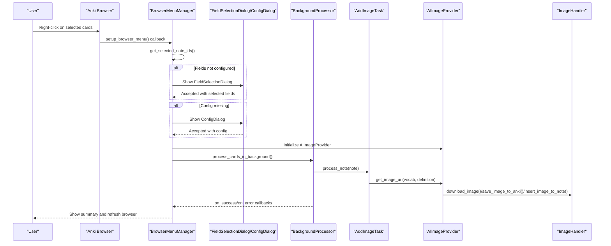
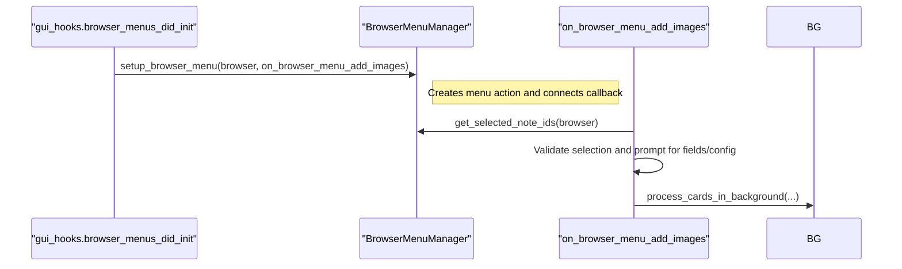
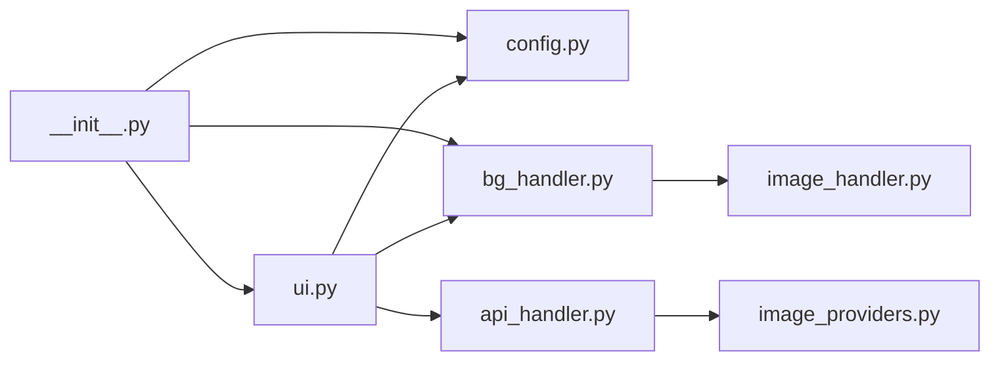

# UI Components API

<cite>
**Referenced Files in This Document**
- [ui.py](file://AnkiAI_ImageAddon/modules/ui.py)
- [__init__.py](file://AnkiAI_ImageAddon/__init__.py)
- [config.py](file://AnkiAI_ImageAddon/modules/config.py)
- [bg_handler.py](file://AnkiAI_ImageAddon/modules/bg_handler.py)
- [image_handler.py](file://AnkiAI_ImageAddon/modules/image_handler.py)
- [api_handler.py](file://AnkiAI_ImageAddon/modules/api_handler.py)
- [image_providers.py](file://AnkiAI_ImageAddon/modules/image_providers.py)
- [README.md](file://README.md)
</cite>

## Table of Contents
1. [Introduction](#introduction)
2. [Project Structure](#project-structure)
3. [Core Components](#core-components)
4. [Architecture Overview](#architecture-overview)
5. [Detailed Component Analysis](#detailed-component-analysis)
6. [Dependency Analysis](#dependency-analysis)
7. [Performance Considerations](#performance-considerations)
8. [Troubleshooting Guide](#troubleshooting-guide)
9. [Conclusion](#conclusion)
10. [Appendices](#appendices)

## Introduction
This document provides API documentation for the UI components and helper functions used by the Anki add-on. It focuses on:
- BrowserMenuManager for adding context menu actions and extracting selected note IDs
- FieldSelectionDialog for dynamic field mapping configuration
- ConfigDialog for comprehensive configuration management
- Utility functions like get_note_data() for extracting clean text from notes
It also covers method signatures, parameter specifications, return value formats, integration examples, lifecycle management, error handling, user feedback, and accessibility considerations.

## Project Structure
The UI-related functionality resides primarily in the modules directory and is wired into Anki’s browser and configuration systems via the add-on entry point.

**Diagram sources**
- [__init__.py:309-349](file://AnkiAI_ImageAddon/__init__.py#L309-L349)
- [ui.py:13-444](file://AnkiAI_ImageAddon/modules/ui.py#L13-L444)
- [bg_handler.py:12-205](file://AnkiAI_ImageAddon/modules/bg_handler.py#L12-L205)
- [image_handler.py:36-364](file://AnkiAI_ImageAddon/modules/image_handler.py#L36-L364)
- [api_handler.py:74-229](file://AnkiAI_ImageAddon/modules/api_handler.py#L74-L229)
- [image_providers.py:373-463](file://AnkiAI_ImageAddon/modules/image_providers.py#L373-L463)
- [config.py:18-132](file://AnkiAI_ImageAddon/modules/config.py#L18-L132)

**Section sources**
- [__init__.py:12-349](file://AnkiAI_ImageAddon/__init__.py#L12-L349)
- [ui.py:1-444](file://AnkiAI_ImageAddon/modules/ui.py#L1-L444)

## Core Components
This section documents the primary UI components and helper functions.

- BrowserMenuManager
  - Purpose: Adds a browser context menu action and extracts selected note IDs
  - Key methods:
    - setup_browser_menu(browser, callback_add_images)
    - get_selected_note_ids(browser) -> List[int]
    - show_error(title, message), show_warning(title, message), show_info(title, message), show_question(title, message) -> bool

- FieldSelectionDialog
  - Purpose: Allows users to select vocabulary, definition, and image fields for mapping
  - Constructor: __init__(model_name, available_fields, parent=None)
  - Methods:
    - accept_with_values(vocab_field, definition_field, image_field)
    - Executed via exec() and accessed via selected_* fields after accepted

- ConfigDialog
  - Purpose: Graphical interface for configuring API keys and provider settings
  - Constructor: __init__(parent=None, existing_config=None)
  - Methods:
    - init_ui(): builds the form
    - load_existing_config(): pre-fills fields from existing config
    - get_config() -> dict: validates and returns configuration values
    - test_connection(): tests connectivity for configured providers

- Utility get_note_data(note) -> tuple
  - Purpose: Extracts clean vocabulary and definition text from a note
  - Returns: (vocabulary, definition) with HTML tags removed

**Section sources**
- [ui.py:13-94](file://AnkiAI_ImageAddon/modules/ui.py#L13-L94)
- [ui.py:96-172](file://AnkiAI_ImageAddon/modules/ui.py#L96-L172)
- [ui.py:174-400](file://AnkiAI_ImageAddon/modules/ui.py#L174-L400)
- [ui.py:402-444](file://AnkiAI_ImageAddon/modules/ui.py#L402-L444)

## Architecture Overview
The UI components integrate with Anki’s browser hooks and configuration system. The typical flow is:
- Setup browser menu on profile open
- On menu click, collect selected note IDs
- Prompt for field mapping if needed
- Prompt for configuration if missing
- Build AIImageProvider with configured providers
- Confirm operation and run background processing
- Present results and refresh browser

**Diagram sources**
- [__init__.py:99-274](file://AnkiAI_ImageAddon/__init__.py#L99-L274)
- [ui.py:13-94](file://AnkiAI_ImageAddon/modules/ui.py#L13-L94)
- [bg_handler.py:23-101](file://AnkiAI_ImageAddon/modules/bg_handler.py#L23-L101)
- [api_handler.py:187-228](file://AnkiAI_ImageAddon/modules/api_handler.py#L187-L228)
- [image_handler.py:326-364](file://AnkiAI_ImageAddon/modules/image_handler.py#L326-L364)

## Detailed Component Analysis

### BrowserMenuManager
- Responsibilities
  - Adds a browser context menu action for triggering image addition
  - Extracts selected note IDs from selected cards
  - Provides convenience dialogs for user feedback and confirmation

- Method Signatures and Behavior
  - setup_browser_menu(browser, callback_add_images)
    - Parameters:
      - browser: Anki Browser window
      - callback_add_images: callable invoked on menu trigger
    - Behavior: Attempts modern menu insertion; falls back to legacy method if needed
  - get_selected_note_ids(browser) -> List[int]
    - Parameters:
      - browser: Anki Browser window
    - Returns: List of unique note IDs for selected cards
    - Notes: Returns empty list if no selection; handles exceptions gracefully
  - show_error(title, message), show_warning(title, message), show_info(title, message), show_question(title, message) -> bool
    - Parameters:
      - title: Dialog title
      - message: Dialog body
    - Behavior: Displays appropriate QMessageBox; show_question returns user choice

- Integration Example
  - Hook into browser menus and register the callback that orchestrates the workflow
  - Use get_selected_note_ids() to validate selection and proceed to configuration and field mapping

- Accessibility and UX
  - Uses standard QMessageBox for consistent UX
  - Error/warning/info dialogs provide immediate feedback
  - show_question allows confirmation before long-running operations

**Section sources**
- [ui.py:13-94](file://AnkiAI_ImageAddon/modules/ui.py#L13-L94)
- [__init__.py:325-331](file://AnkiAI_ImageAddon/__init__.py#L325-L331)

### FieldSelectionDialog
- Purpose
  - Presents a dialog to select vocabulary, definition, and image fields for mapping
  - Stores selections in instance fields after acceptance

- Constructor and Initialization
  - __init__(model_name, available_fields, parent=None)
  - Initializes UI with combo boxes for each field type and OK/Cancel buttons

- Execution Lifecycle
  - Executed via exec() and returns QDialog.Accepted on confirmation
  - After accepted, selected fields are accessible via:
    - selected_vocab_field
    - selected_definition_field
    - selected_image_field

- Access Pattern
  - After exec() returns Accepted, read the selected_* fields for downstream processing

- Best Practices
  - Preselect sensible defaults when available (e.g., “Front”, “Back”, “Image”)
  - Validate that selected fields exist in the note before proceeding

**Section sources**
- [ui.py:96-172](file://AnkiAI_ImageAddon/modules/ui.py#L96-L172)

### ConfigDialog
- Purpose
  - Graphical interface for configuring AI providers and image search providers
  - Validates that at least one provider is configured for both AI and image search modes

- Initialization and UI
  - __init__(parent=None, existing_config=None)
  - init_ui(): builds form with inputs for API keys, checkboxes, and test connection button
  - load_existing_config(): populates fields from existing configuration

- Validation and Retrieval
  - get_config() -> dict
    - Validates that at least one AI provider is configured
    - Validates that at least one image provider is configured
    - Returns a normalized configuration dictionary suitable for saving

- Testing Connectivity
  - test_connection(): performs lightweight connectivity checks against configured providers and reports results

- Integration Example
  - Invoke from add-on manager action or during initial setup
  - On acceptance, persist configuration via ConfigManager

**Section sources**
- [ui.py:174-400](file://AnkiAI_ImageAddon/modules/ui.py#L174-L400)
- [config.py:18-132](file://AnkiAI_ImageAddon/modules/config.py#L18-L132)

### Utility get_note_data(note) -> tuple
- Purpose
  - Extracts clean vocabulary and definition text from a note by scanning available fields
  - Removes HTML tags for clean text extraction

- Parameters and Return
  - Parameters:
    - note: Anki Note object
  - Returns:
    - Tuple (vocabulary, definition) with HTML tags stripped

- Implementation Notes
  - Scans note keys for common field names (English and localized variants)
  - Falls back to first or second field if preferred names are not found
  - Strips HTML tags using a simple regex

**Section sources**
- [ui.py:402-444](file://AnkiAI_ImageAddon/modules/ui.py#L402-L444)

### Integration Examples

#### Adding Browser Menu Action
- Hook into Anki’s browser initialization and register the callback
- The callback triggers the workflow: selection, field mapping, configuration, and background processing

**Diagram sources**
- [__init__.py:325-331](file://AnkiAI_ImageAddon/__init__.py#L325-L331)
- [__init__.py:99-274](file://AnkiAI_ImageAddon/__init__.py#L99-L274)
- [ui.py:13-94](file://AnkiAI_ImageAddon/modules/ui.py#L13-L94)

#### Handling User Interactions and Dialog Lifecycles
- FieldSelectionDialog
  - Show dialog and await exec()
  - On accepted, read selected fields and persist to configuration
- ConfigDialog
  - Show dialog and await exec()
  - On accepted, call get_config() and save to ConfigManager
  - Optionally run test_connection() prior to accepting

**Section sources**
- [ui.py:96-172](file://AnkiAI_ImageAddon/modules/ui.py#L96-L172)
- [ui.py:174-400](file://AnkiAI_ImageAddon/modules/ui.py#L174-L400)
- [__init__.py:158-174](file://AnkiAI_ImageAddon/__init__.py#L158-L174)
- [__init__.py:282-299](file://AnkiAI_ImageAddon/__init__.py#L282-L299)

## Dependency Analysis
The UI components depend on Anki’s browser hooks, configuration manager, and background processing pipeline. The image pipeline integrates AI providers and image providers for intelligent selection.

**Diagram sources**
- [ui.py:13-444](file://AnkiAI_ImageAddon/modules/ui.py#L13-L444)
- [config.py:18-132](file://AnkiAI_ImageAddon/modules/config.py#L18-L132)
- [bg_handler.py:12-205](file://AnkiAI_ImageAddon/modules/bg_handler.py#L12-L205)
- [api_handler.py:74-229](file://AnkiAI_ImageAddon/modules/api_handler.py#L74-L229)
- [image_providers.py:373-463](file://AnkiAI_ImageAddon/modules/image_providers.py#L373-L463)
- [image_handler.py:36-364](file://AnkiAI_ImageAddon/modules/image_handler.py#L36-L364)
- [__init__.py:12-349](file://AnkiAI_ImageAddon/__init__.py#L12-L349)

**Section sources**
- [__init__.py:12-349](file://AnkiAI_ImageAddon/__init__.py#L12-L349)
- [ui.py:13-444](file://AnkiAI_ImageAddon/modules/ui.py#L13-L444)

## Performance Considerations
- Background Processing
  - Use BackgroundProcessor to avoid UI freezes during long-running tasks
  - Provide progress callbacks and handle cancellation gracefully
- Image Handling
  - ImageHandler optimizes downloads and compression to reduce latency and storage
  - Respect timeouts and retries to balance speed and reliability
- Smart Selection
  - AIImageProvider caches generated keywords and uses concurrent image provider searches for faster results

[No sources needed since this section provides general guidance]

## Troubleshooting Guide
- Browser Menu Not Appearing
  - Ensure setup_addon() is called on profile open and gui_hooks.browser_menus_did_init is connected
- No Selected Notes
  - get_selected_note_ids() returns empty list if no cards are selected; prompt user to select cards
- Configuration Validation Failures
  - get_config() raises ValueError if required providers are missing; catch and inform the user
- Connectivity Tests
  - test_connection() reports provider availability; guide users to fix keys or network issues
- Error Handling Patterns
  - Use show_error(), show_warning(), show_info(), and show_question() for consistent feedback
  - Wrap long operations in try/except and surface meaningful messages

**Section sources**
- [__init__.py:309-349](file://AnkiAI_ImageAddon/__init__.py#L309-L349)
- [ui.py:13-94](file://AnkiAI_ImageAddon/modules/ui.py#L13-L94)
- [ui.py:174-400](file://AnkiAI_ImageAddon/modules/ui.py#L174-L400)

## Conclusion
The UI components provide a robust, user-friendly interface for configuring and executing AI-powered image addition in Anki. They integrate seamlessly with Anki’s browser hooks, configuration system, and background processing pipeline. By following the documented patterns for dialog lifecycle, validation, and error handling, developers can extend or customize the UI while maintaining a consistent user experience.

[No sources needed since this section summarizes without analyzing specific files]

## Appendices

### API Reference Summary

- BrowserMenuManager
  - setup_browser_menu(browser, callback_add_images)
  - get_selected_note_ids(browser) -> List[int]
  - show_error(title, message), show_warning(title, message), show_info(title, message), show_question(title, message) -> bool

- FieldSelectionDialog
  - __init__(model_name, available_fields, parent=None)
  - accept_with_values(vocab_field, definition_field, image_field)
  - exec() -> int; after accepted, read selected_vocab_field, selected_definition_field, selected_image_field

- ConfigDialog
  - __init__(parent=None, existing_config=None)
  - init_ui(), load_existing_config()
  - get_config() -> dict
  - test_connection()

- Utility
  - get_note_data(note) -> tuple

**Section sources**
- [ui.py:13-94](file://AnkiAI_ImageAddon/modules/ui.py#L13-L94)
- [ui.py:96-172](file://AnkiAI_ImageAddon/modules/ui.py#L96-L172)
- [ui.py:174-400](file://AnkiAI_ImageAddon/modules/ui.py#L174-L400)
- [ui.py:402-444](file://AnkiAI_ImageAddon/modules/ui.py#L402-L444)