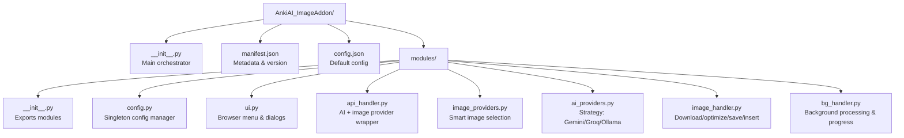
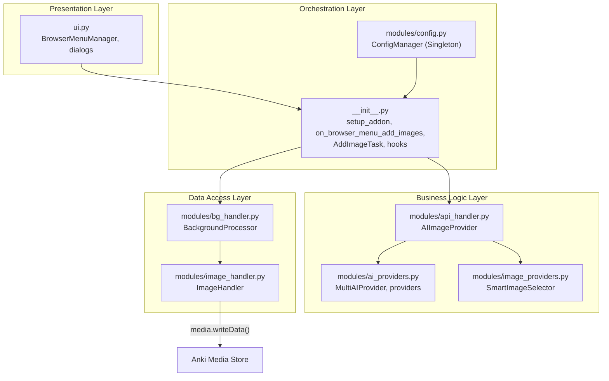
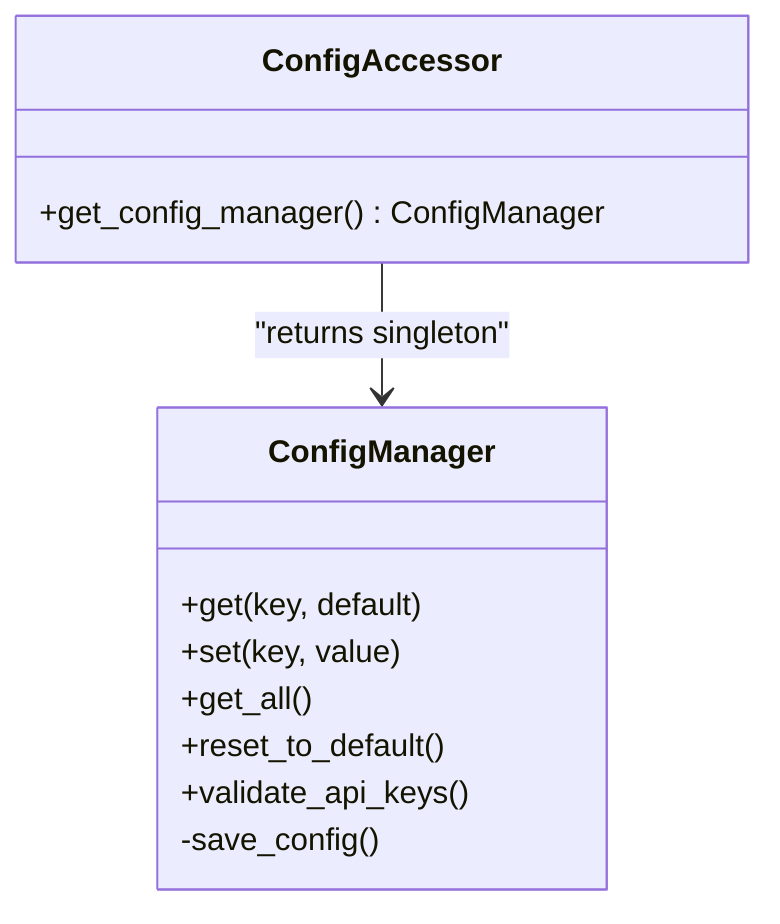
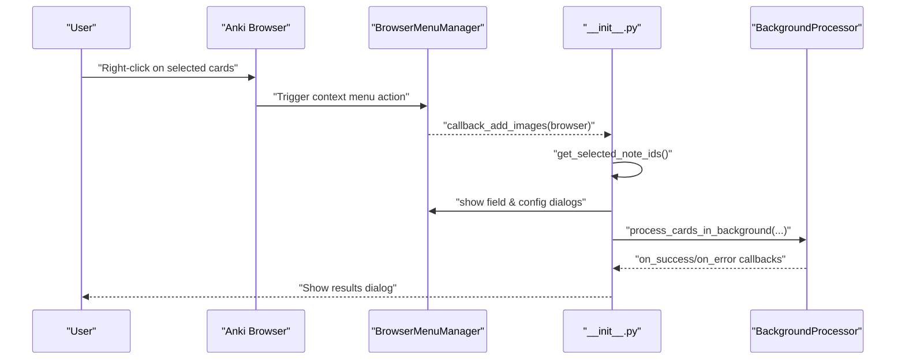
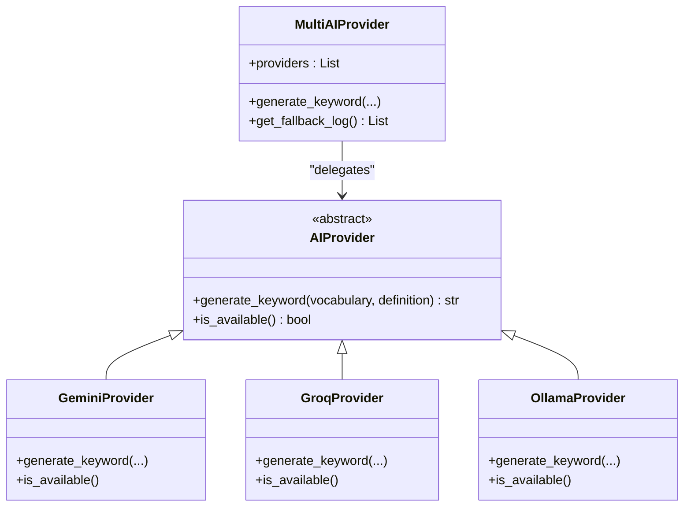
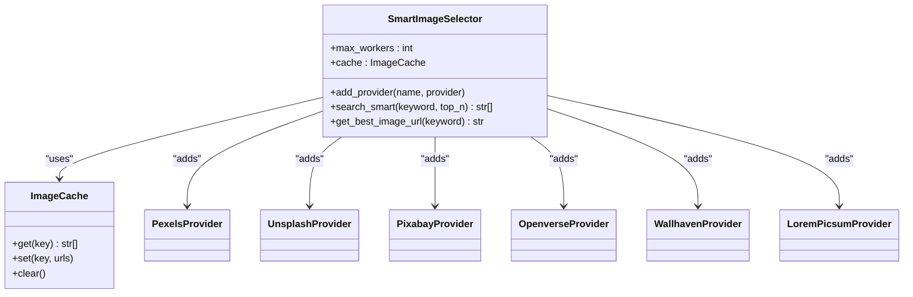
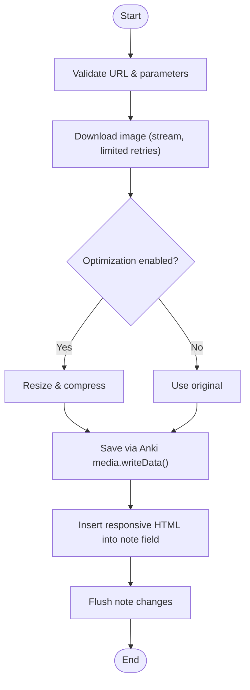
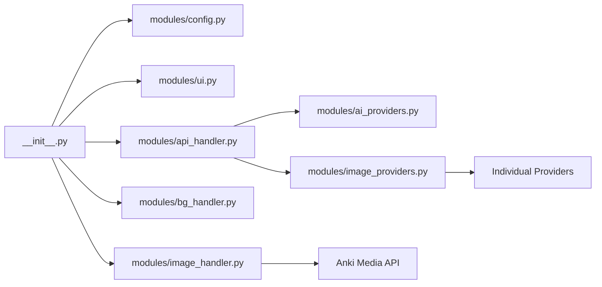
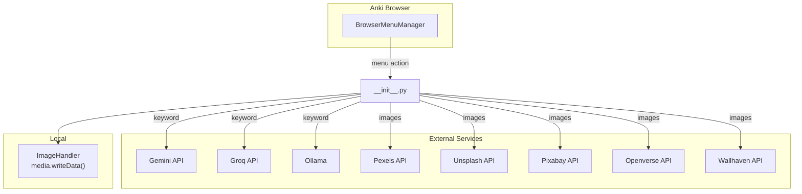

# Architecture & Design

<cite>
**Referenced Files in This Document**
- [__init__.py](file://AnkiAI_ImageAddon/__init__.py)
- [modules/__init__.py](file://AnkiAI_ImageAddon/modules/__init__.py)
- [modules/config.py](file://AnkiAI_ImageAddon/modules/config.py)
- [modules/ui.py](file://AnkiAI_ImageAddon/modules/ui.py)
- [modules/api_handler.py](file://AnkiAI_ImageAddon/modules/api_handler.py)
- [modules/image_providers.py](file://AnkiAI_ImageAddon/modules/image_providers.py)
- [modules/ai_providers.py](file://AnkiAI_ImageAddon/modules/ai_providers.py)
- [modules/image_handler.py](file://AnkiAI_ImageAddon/modules/image_handler.py)
- [modules/bg_handler.py](file://AnkiAI_ImageAddon/modules/bg_handler.py)
- [config.json](file://AnkiAI_ImageAddon/config.json)
- [manifest.json](file://AnkiAI_ImageAddon/manifest.json)
- [ARCHITECTURE.md](file://ARCHITECTURE.md)
- [API_REFERENCE.md](file://API_REFERENCE.md)
- [PERFORMANCE_TIPS.md](file://PERFORMANCE_TIPS.md)
</cite>

## Table of Contents
1. [Introduction](#introduction)
2. [Project Structure](#project-structure)
3. [Core Components](#core-components)
4. [Architecture Overview](#architecture-overview)
5. [Detailed Component Analysis](#detailed-component-analysis)
6. [Dependency Analysis](#dependency-analysis)
7. [Performance Considerations](#performance-considerations)
8. [Troubleshooting Guide](#troubleshooting-guide)
9. [Conclusion](#conclusion)
10. [Appendices](#appendices)

## Introduction
This document describes the architectural design and component organization of the AnkiAI Image Addon. The system follows a layered architecture separating UI integration, business logic, and data access concerns. It is modular with six core modules covering configuration management, user interface integration, AI provider handling, image provider coordination, image processing, and background operations. The design leverages several patterns: Strategy for pluggable AI providers, Factory for dynamic provider instantiation, Observer-style hooks for Anki’s browser integration, and Singleton for centralized configuration. The document also explains the end-to-end data flow from user actions to final image embedding, along with system context diagrams, concurrency and caching strategies, and error recovery mechanisms.

## Project Structure
The add-on is organized around a main entry point orchestrating six modules under a dedicated namespace. The manifest defines metadata and compatibility, while default configuration is stored in a JSON file.



**Diagram sources**
- [__init__.py:1-349](file://AnkiAI_ImageAddon/__init__.py#L1-L349)
- [manifest.json:1-12](file://AnkiAI_ImageAddon/manifest.json#L1-L12)
- [config.json:1-35](file://AnkiAI_ImageAddon/config.json#L1-L35)
- [modules/__init__.py:1-12](file://AnkiAI_ImageAddon/modules/__init__.py#L1-L12)

**Section sources**
- [__init__.py:1-349](file://AnkiAI_ImageAddon/__init__.py#L1-L349)
- [manifest.json:1-12](file://AnkiAI_ImageAddon/manifest.json#L1-L12)
- [config.json:1-35](file://AnkiAI_ImageAddon/config.json#L1-L35)
- [modules/__init__.py:1-12](file://AnkiAI_ImageAddon/modules/__init__.py#L1-L12)

## Core Components
The system comprises six core modules implementing distinct responsibilities:

- Configuration Management (config.py): Centralized, persistent configuration with validation and a Singleton accessor.
- User Interface Integration (ui.py): Browser menu creation, selection of note IDs, field selection dialog, and configuration dialog with connectivity testing.
- AI Provider Handling (ai_providers.py): Pluggable AI providers (Gemini, Groq, Ollama) with fallback and availability checks.
- Image Provider Coordination (image_providers.py): Smart selection across multiple image providers with concurrent requests, scoring, and caching.
- Image Processing (image_handler.py): Download, lightweight optimization, safe file naming, and insertion into notes via Anki’s media API.
- Background Operations (bg_handler.py): Non-blocking batch processing with progress reporting and cancellation.

These modules are orchestrated by the main entry point (__init__.py) which sets up hooks, validates configuration, and runs tasks in the background.

**Section sources**
- [modules/config.py:1-132](file://AnkiAI_ImageAddon/modules/config.py#L1-L132)
- [modules/ui.py:1-444](file://AnkiAI_ImageAddon/modules/ui.py#L1-L444)
- [modules/ai_providers.py:1-393](file://AnkiAI_ImageAddon/modules/ai_providers.py#L1-L393)
- [modules/image_providers.py:1-463](file://AnkiAI_ImageAddon/modules/image_providers.py#L1-L463)
- [modules/image_handler.py:1-364](file://AnkiAI_ImageAddon/modules/image_handler.py#L1-L364)
- [modules/bg_handler.py:1-205](file://AnkiAI_ImageAddon/modules/bg_handler.py#L1-L205)
- [__init__.py:1-349](file://AnkiAI_ImageAddon/__init__.py#L1-L349)

## Architecture Overview
The system uses a layered architecture:
- Presentation Layer: UI module integrates with Anki’s browser context menu and dialogs.
- Orchestration Layer: Main entry point coordinates user actions, configuration retrieval, and background execution.
- Business Logic Layer: AI provider wrapper and smart image selector encapsulate provider strategies and selection logic.
- Data Access Layer: Image handler interacts with Anki’s media API and performs network downloads.



**Diagram sources**
- [__init__.py:1-349](file://AnkiAI_ImageAddon/__init__.py#L1-L349)
- [modules/config.py:1-132](file://AnkiAI_ImageAddon/modules/config.py#L1-L132)
- [modules/api_handler.py:1-229](file://AnkiAI_ImageAddon/modules/api_handler.py#L1-L229)
- [modules/ai_providers.py:1-393](file://AnkiAI_ImageAddon/modules/ai_providers.py#L1-L393)
- [modules/image_providers.py:1-463](file://AnkiAI_ImageAddon/modules/image_providers.py#L1-L463)
- [modules/image_handler.py:1-364](file://AnkiAI_ImageAddon/modules/image_handler.py#L1-L364)
- [modules/bg_handler.py:1-205](file://AnkiAI_ImageAddon/modules/bg_handler.py#L1-L205)

## Detailed Component Analysis

### Configuration Management (Singleton)
- Responsibilities: Load/save configuration from Anki, validate API keys, provide defaults, and expose a global accessor.
- Key behaviors: Lazy initialization, persistence via Anki’s addon manager, and validation of AI and image provider readiness.
- Design pattern: Singleton via a global instance and a factory function.



**Diagram sources**
- [modules/config.py:18-132](file://AnkiAI_ImageAddon/modules/config.py#L18-L132)

**Section sources**
- [modules/config.py:1-132](file://AnkiAI_ImageAddon/modules/config.py#L1-L132)
- [config.json:1-35](file://AnkiAI_ImageAddon/config.json#L1-L35)

### User Interface Integration (Observer-style Hooks)
- Responsibilities: Hook into Anki’s browser lifecycle, add context menu items, extract selected note IDs, and present configuration and field selection dialogs.
- Integration: Uses Anki GUI hooks to attach menus and dialogs; supports both modern and legacy menu APIs.



**Diagram sources**
- [modules/ui.py:13-94](file://AnkiAI_ImageAddon/modules/ui.py#L13-L94)
- [__init__.py:99-274](file://AnkiAI_ImageAddon/__init__.py#L99-L274)
- [modules/bg_handler.py:12-109](file://AnkiAI_ImageAddon/modules/bg_handler.py#L12-L109)

**Section sources**
- [modules/ui.py:1-444](file://AnkiAI_ImageAddon/modules/ui.py#L1-L444)
- [__init__.py:99-274](file://AnkiAI_ImageAddon/__init__.py#L99-L274)

### AI Provider Handling (Strategy Pattern)
- Responsibilities: Encapsulate multiple AI providers (Gemini, Groq, Ollama) with a unified interface and automatic fallback.
- Strategy: Priority-based selection with availability checks; errors are captured and chained for fallback attempts.



**Diagram sources**
- [modules/ai_providers.py:24-393](file://AnkiAI_ImageAddon/modules/ai_providers.py#L24-L393)

**Section sources**
- [modules/ai_providers.py:1-393](file://AnkiAI_ImageAddon/modules/ai_providers.py#L1-L393)

### Image Provider Coordination (Factory + Strategy)
- Responsibilities: Concurrently query multiple image providers, score results, and return the best image URL. Includes caching and provider registration.
- Strategy: SmartImageSelector composes providers (Pexels, Unsplash, Pixabay, Openverse, Wallhaven, Lorem Picsum) and ranks by quality.



**Diagram sources**
- [modules/image_providers.py:373-463](file://AnkiAI_ImageAddon/modules/image_providers.py#L373-L463)

**Section sources**
- [modules/image_providers.py:1-463](file://AnkiAI_ImageAddon/modules/image_providers.py#L1-L463)

### Image Processing Pipeline (Factory + Pipeline)
- Responsibilities: Download images with optimized timeouts and retries, detect format, optimize size/quality, write to Anki media, and insert responsive HTML into notes.
- Integration: Uses Anki’s media.writeData to ensure synchronization and dependency tracking.



**Diagram sources**
- [modules/image_handler.py:59-364](file://AnkiAI_ImageAddon/modules/image_handler.py#L59-L364)

**Section sources**
- [modules/image_handler.py:1-364](file://AnkiAI_ImageAddon/modules/image_handler.py#L1-L364)

### Background Operations (Task Pattern + Observer-style Progress)
- Responsibilities: Run long-running tasks without blocking the UI, report progress, handle cancellation, and aggregate results.
- Integration: Uses Anki’s QueryOp to execute background operations and report progress.

```mermaid
sequenceDiagram
participant Main as "__init__.py"
participant Task as "AddImageTask"
participant BG as "BackgroundProcessor"
participant Note as "Note"
participant API as "AIImageProvider"
participant Img as "ImageHandler"
Main->>BG : "process_cards_in_background(note_ids, process_func)"
loop For each note
BG->>Task : "process_note(note)"
Task->>Note : "read fields"
Task->>API : "get_image_url(vocab, def)"
API-->>Task : "best image URL"
Task->>Img : "process_image(url, note, vocab)"
Img-->>Task : "success/failure"
Task-->>BG : "result"
BG-->>Main : "on_progress(current,total,msg)"
end
BG-->>Main : "on_success(results) or on_error(error)"
```

**Diagram sources**
- [__init__.py:27-97](file://AnkiAI_ImageAddon/__init__.py#L27-L97)
- [modules/bg_handler.py:12-109](file://AnkiAI_ImageAddon/modules/bg_handler.py#L12-L109)
- [modules/api_handler.py:74-229](file://AnkiAI_ImageAddon/modules/api_handler.py#L74-L229)
- [modules/image_handler.py:326-364](file://AnkiAI_ImageAddon/modules/image_handler.py#L326-L364)

**Section sources**
- [modules/bg_handler.py:1-205](file://AnkiAI_ImageAddon/modules/bg_handler.py#L1-L205)
- [__init__.py:27-97](file://AnkiAI_ImageAddon/__init__.py#L27-L97)

## Dependency Analysis
The main entry point depends on all modules to coordinate the workflow. The AI provider wrapper composes AI and image providers, while the image handler depends on Anki’s media API. UI and background handlers depend on Anki’s Qt and GUI hooks.



**Diagram sources**
- [__init__.py:12-18](file://AnkiAI_ImageAddon/__init__.py#L12-L18)
- [modules/api_handler.py:24-34](file://AnkiAI_ImageAddon/modules/api_handler.py#L24-L34)
- [modules/image_providers.py:104-371](file://AnkiAI_ImageAddon/modules/image_providers.py#L104-L371)
- [modules/ai_providers.py:24-393](file://AnkiAI_ImageAddon/modules/ai_providers.py#L24-L393)
- [modules/image_handler.py:23-29](file://AnkiAI_ImageAddon/modules/image_handler.py#L23-L29)

**Section sources**
- [__init__.py:12-18](file://AnkiAI_ImageAddon/__init__.py#L12-L18)
- [modules/api_handler.py:24-34](file://AnkiAI_ImageAddon/modules/api_handler.py#L24-L34)
- [modules/image_providers.py:104-371](file://AnkiAI_ImageAddon/modules/image_providers.py#L104-L371)
- [modules/ai_providers.py:24-393](file://AnkiAI_ImageAddon/modules/ai_providers.py#L24-L393)
- [modules/image_handler.py:23-29](file://AnkiAI_ImageAddon/modules/image_handler.py#L23-L29)

## Performance Considerations
- Concurrent Processing: SmartImageSelector uses a thread pool to query multiple providers concurrently; configurable worker count balances speed and rate-limit risk.
- Caching Strategies:
  - Keyword cache: Reduces repeated AI calls for identical vocabulary/definition pairs.
  - Smart image cache: Stores ranked URLs for a keyword with a TTL to avoid repeated searches.
  - Image optimization: Resizes and compresses images to reduce bandwidth and storage.
- Error Recovery: MultiAIProvider and SmartImageSelector capture provider errors and fall back to next available provider or free fallback provider.
- Background Execution: Long-running loops run off the UI thread to prevent freezes and provide progress updates.

**Section sources**
- [modules/api_handler.py:42-72](file://AnkiAI_ImageAddon/modules/api_handler.py#L42-L72)
- [modules/image_providers.py:69-102](file://AnkiAI_ImageAddon/modules/image_providers.py#L69-L102)
- [modules/image_providers.py:411-455](file://AnkiAI_ImageAddon/modules/image_providers.py#L411-L455)
- [modules/ai_providers.py:357-393](file://AnkiAI_ImageAddon/modules/ai_providers.py#L357-L393)
- [modules/image_handler.py:130-196](file://AnkiAI_ImageAddon/modules/image_handler.py#L130-L196)
- [PERFORMANCE_TIPS.md:124-287](file://PERFORMANCE_TIPS.md#L124-L287)

## Troubleshooting Guide
Common issues and remedies:
- API Key Validation Failures: Use the built-in connectivity tester in the configuration dialog to validate providers.
- Slow Downloads or Timeouts: Adjust concurrent requests and timeouts; process in smaller batches.
- No Images Found: Verify provider keys and try alternative providers; ensure keyword cache is functioning.
- UI Freezes: Ensure background processing is used; avoid large batches exceeding system capacity.
- Image Not Embedding: Confirm the target field exists and is writable; ensure note.flush() is called.

**Section sources**
- [modules/ui.py:325-400](file://AnkiAI_ImageAddon/modules/ui.py#L325-L400)
- [modules/image_handler.py:269-325](file://AnkiAI_ImageAddon/modules/image_handler.py#L269-L325)
- [modules/bg_handler.py:12-109](file://AnkiAI_ImageAddon/modules/bg_handler.py#L12-L109)
- [PERFORMANCE_TIPS.md:240-287](file://PERFORMANCE_TIPS.md#L240-L287)

## Conclusion
The AnkiAI Image Addon employs a clean, layered architecture with six cohesive modules. It leverages Strategy and Factory patterns for extensibility, Singleton for configuration, and Observer-style hooks for seamless Anki integration. The end-to-end pipeline from user action to embedded image is robust, concurrent, and resilient, with caching and background processing ensuring responsiveness and reliability.

## Appendices

### System Context Diagrams
- Browser Integration: The add-on hooks into Anki’s browser lifecycle to add a context menu and process selected notes.
- External Services: Integrates with AI providers (Gemini, Groq, Ollama) and image providers (Pexels, Unsplash, Pixabay, Openverse, Wallhaven, Lorem Picsum).
- Local Storage: Uses Anki’s media API for secure, synchronized image storage.



**Diagram sources**
- [modules/ui.py:13-94](file://AnkiAI_ImageAddon/modules/ui.py#L13-L94)
- [modules/ai_providers.py:38-295](file://AnkiAI_ImageAddon/modules/ai_providers.py#L38-L295)
- [modules/image_providers.py:104-371](file://AnkiAI_ImageAddon/modules/image_providers.py#L104-L371)
- [modules/image_handler.py:243-268](file://AnkiAI_ImageAddon/modules/image_handler.py#L243-L268)
- [__init__.py:99-274](file://AnkiAI_ImageAddon/__init__.py#L99-L274)

### API Definitions and Usage References
- Configuration Management: [API Reference:15-60](file://API_REFERENCE.md#L15-L60)
- AI Integration: [API Reference:63-147](file://API_REFERENCE.md#L63-L147)
- Image Processing: [API Reference:150-223](file://API_REFERENCE.md#L150-L223)
- UI Components: [API Reference:225-300](file://API_REFERENCE.md#L225-L300)
- Background Processing: [API Reference:303-395](file://API_REFERENCE.md#L303-L395)

**Section sources**
- [API_REFERENCE.md:1-545](file://API_REFERENCE.md#L1-L545)