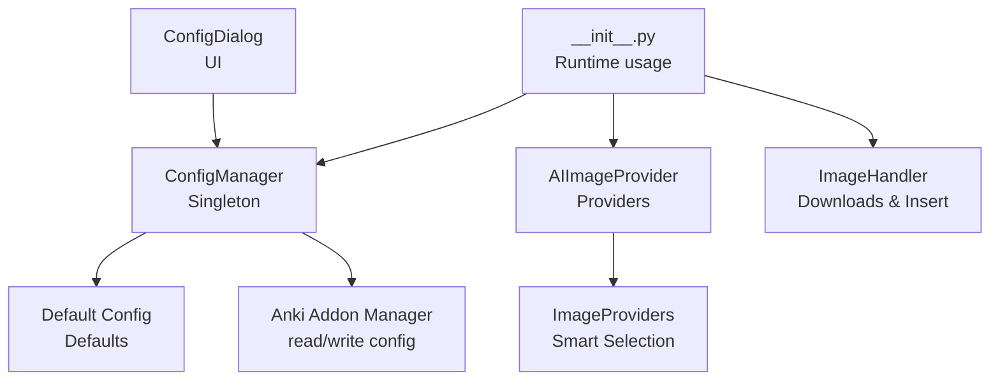
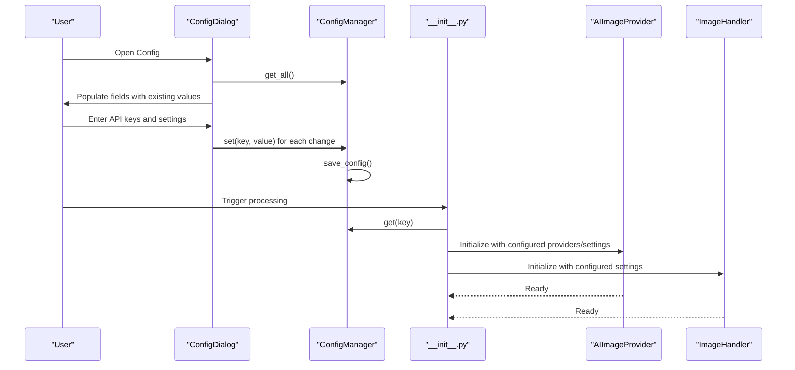
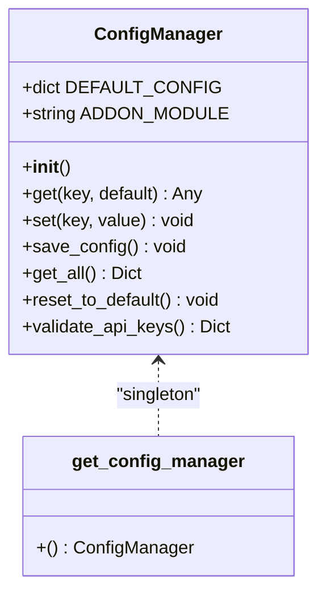
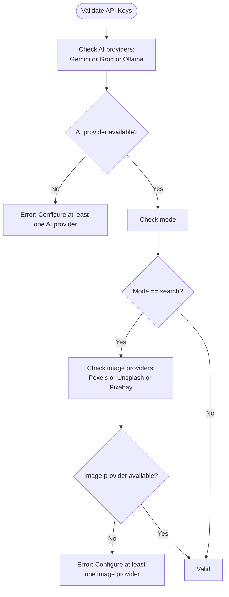
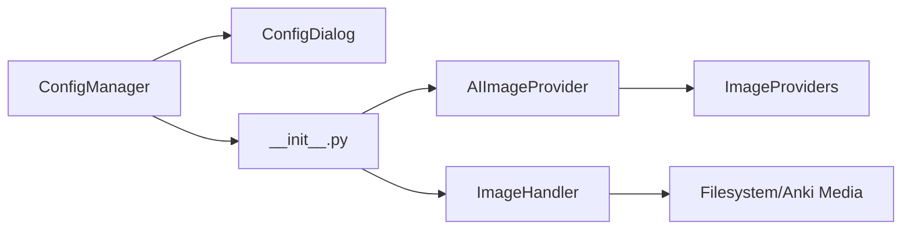

# Configuration & Customization

<cite>
**Referenced Files in This Document**
- [config.py](file://AnkiAI_ImageAddon/modules/config.py)
- [config.json](file://AnkiAI_ImageAddon/config.json)
- [__init__.py](file://AnkiAI_ImageAddon/__init__.py)
- [ui.py](file://AnkiAI_ImageAddon/modules/ui.py)
- [api_handler.py](file://AnkiAI_ImageAddon/modules/api_handler.py)
- [image_providers.py](file://AnkiAI_ImageAddon/modules/image_providers.py)
- [ai_providers.py](file://AnkiAI_ImageAddon/modules/ai_providers.py)
- [image_handler.py](file://AnkiAI_ImageAddon/modules/image_handler.py)
- [bg_handler.py](file://AnkiAI_ImageAddon/modules/bg_handler.py)
- [manifest.json](file://AnkiAI_ImageAddon/manifest.json)
- [CHANGELOG_V3.md](file://CHANGELOG_V3.md)
- [MIGRATION_V3.md](file://MIGRATION_V3.md)
</cite>

## Table of Contents
1. [Introduction](#introduction)
2. [Project Structure](#project-structure)
3. [Core Components](#core-components)
4. [Architecture Overview](#architecture-overview)
5. [Detailed Component Analysis](#detailed-component-analysis)
6. [Dependency Analysis](#dependency-analysis)
7. [Performance Considerations](#performance-considerations)
8. [Troubleshooting Guide](#troubleshooting-guide)
9. [Conclusion](#conclusion)
10. [Appendices](#appendices)

## Introduction
This document explains the configuration and customization features of the AnkiAI Image Addon v4.0. It focuses on the ConfigManager singleton that centralizes settings, details all configurable parameters (API keys for AI and image providers, field mappings, processing modes, concurrency, and performance settings), and describes configuration file structure, validation, defaults, and runtime behavior. It also covers advanced options such as timeouts, retries, caching, and provider-specific parameters, along with practical examples, troubleshooting, migration guidance, and optimization recommendations.

## Project Structure
The configuration system spans the modules and main entry point:
- Central configuration manager and defaults
- UI dialogs for configuration and validation
- Provider integrations for AI and image search
- Background processing and runtime application of settings

**Diagram sources**
- [config.py:18-132](file://AnkiAI_ImageAddon/modules/config.py#L18-L132)
- [__init__.py:13,14,16,274-307:13-307](file://AnkiAI_ImageAddon/__init__.py#L13-L307)
- [api_handler.py:74-229](file://AnkiAI_ImageAddon/modules/api_handler.py#L74-L229)
- [image_providers.py:373-463](file://AnkiAI_ImageAddon/modules/image_providers.py#L373-L463)
- [image_handler.py:36-364](file://AnkiAI_ImageAddon/modules/image_handler.py#L36-L364)

**Section sources**
- [config.py:18-132](file://AnkiAI_ImageAddon/modules/config.py#L18-L132)
- [__init__.py:13,14,16,274-307:13-307](file://AnkiAI_ImageAddon/__init__.py#L13-L307)

## Core Components
- ConfigManager: Singleton that reads/writes Anki’s configuration, merges defaults, validates providers, and persists changes.
- ConfigDialog: UI for configuring API keys and testing connections.
- AIImageProvider: Orchestrates AI keyword generation and smart image selection using configured providers.
- ImageHandler: Downloads, optimizes, and inserts images into notes.
- SmartImageSelector: Concurrently queries multiple image providers, ranks results, and caches outcomes.

Key responsibilities:
- Centralized settings management with defaults and persistence
- Validation of required API keys per provider category
- Runtime application of settings to processing pipeline
- Advanced features: concurrent requests, caching, timeouts, retries, and optimization

**Section sources**
- [config.py:18-132](file://AnkiAI_ImageAddon/modules/config.py#L18-L132)
- [ui.py:174-400](file://AnkiAI_ImageAddon/modules/ui.py#L174-L400)
- [api_handler.py:74-229](file://AnkiAI_ImageAddon/modules/api_handler.py#L74-L229)
- [image_providers.py:373-463](file://AnkiAI_ImageAddon/modules/image_providers.py#L373-L463)
- [image_handler.py:36-364](file://AnkiAI_ImageAddon/modules/image_handler.py#L36-L364)

## Architecture Overview
The configuration lifecycle:
- Defaults loaded from ConfigManager.DEFAULT_CONFIG
- On first run, Anki’s addon manager supplies empty config; ConfigManager writes defaults
- Users edit via ConfigDialog; changes saved via ConfigManager.save_config
- Runtime reads settings from ConfigManager to initialize AIImageProvider and ImageHandler
- Background processing applies settings immediately

**Diagram sources**
- [config.py:75-99](file://AnkiAI_ImageAddon/modules/config.py#L75-L99)
- [ui.py:262-324](file://AnkiAI_ImageAddon/modules/ui.py#L262-L324)
- [__init__.py:176-212](file://AnkiAI_ImageAddon/__init__.py#L176-L212)
- [api_handler.py:80-186](file://AnkiAI_ImageAddon/modules/api_handler.py#L80-L186)
- [image_handler.py:48-58](file://AnkiAI_ImageAddon/modules/image_handler.py#L48-L58)

## Detailed Component Analysis

### ConfigManager: Centralized Settings Management
- Singleton pattern via module-level instance and factory function
- Reads initial config from Anki’s addon manager; if empty, writes defaults
- Provides get/set/save/get_all/reset_to_default
- Validates provider configuration for AI and image search categories

**Diagram sources**
- [config.py:18-132](file://AnkiAI_ImageAddon/modules/config.py#L18-L132)

**Section sources**
- [config.py:18-132](file://AnkiAI_ImageAddon/modules/config.py#L18-L132)

### Configuration File Structure and Defaults
- The default configuration defines:
  - AI providers: Gemini, Groq, Ollama
  - Image search providers: Pexels, Unsplash, Pixabay, Wallhaven
  - Smart selection: enable, max concurrent providers, cache TTL
  - Image download: timeout, retries, optimization, max width, quality
  - Keyword caching: enable, size
  - Field mappings: vocabulary, definition, image
  - Processing mode: image_generation_mode
  - Concurrency: max concurrent requests, enable concurrent downloads
  - Other: auto_add_on_sync

- The JSON file shipped with the addon mirrors the default structure.

Practical notes:
- The runtime initialization in the main module reads from ConfigManager and passes values to AIImageProvider and ImageHandler.
- The UI dialog loads existing values and validates that at least one AI provider and one image provider are configured.

**Section sources**
- [config.py:21-63](file://AnkiAI_ImageAddon/modules/config.py#L21-L63)
- [config.json:1-35](file://AnkiAI_ImageAddon/config.json#L1-L35)
- [__init__.py:176-212](file://AnkiAI_ImageAddon/__init__.py#L176-L212)
- [ui.py:262-324](file://AnkiAI_ImageAddon/modules/ui.py#L262-L324)

### Provider Configuration and Validation
- AI providers:
  - Gemini API key
  - Groq API key
  - Ollama toggle and URL
- Image search providers:
  - Pexels API key
  - Unsplash API key
  - Pixabay API key
  - Wallhaven API key
- Validation ensures at least one AI provider is configured and, when using search mode, at least one image provider is configured.

**Diagram sources**
- [config.py:100-119](file://AnkiAI_ImageAddon/modules/config.py#L100-L119)
- [ui.py:302-313](file://AnkiAI_ImageAddon/modules/ui.py#L302-L313)

**Section sources**
- [config.py:100-119](file://AnkiAI_ImageAddon/modules/config.py#L100-L119)
- [ui.py:302-313](file://AnkiAI_ImageAddon/modules/ui.py#L302-L313)

### Field Mappings and Processing Modes
- Field mappings:
  - vocabulary_field
  - definition_field
  - image_field
- Processing mode:
  - image_generation_mode: “search” (AI keyword + image search)
- These are read at runtime to construct tasks and UI prompts.

**Section sources**
- [config.py:52-55](file://AnkiAI_ImageAddon/modules/config.py#L52-L55)
- [__init__.py:152-154](file://AnkiAI_ImageAddon/__init__.py#L152-L154)
- [ui.py:166-171](file://AnkiAI_ImageAddon/modules/ui.py#L166-L171)

### Performance Settings and Concurrency
- Image download:
  - image_download_timeout
  - image_download_retries
  - enable_image_optimization
  - image_max_width
  - image_quality
- Keyword caching:
  - enable_keyword_cache
  - keyword_cache_size
- Smart selection:
  - enable_smart_selection
  - max_concurrent_providers
  - smart_cache_ttl_minutes
- Concurrency:
  - max_concurrent_requests
  - enable_concurrent_downloads

These settings influence:
- Request timeouts and retries
- Image optimization and size
- Provider concurrency and caching
- Background processing throughput

**Section sources**
- [config.py:40-63](file://AnkiAI_ImageAddon/modules/config.py#L40-L63)
- [image_providers.py:69-102](file://AnkiAI_ImageAddon/modules/image_providers.py#L69-L102)
- [image_handler.py:36-58](file://AnkiAI_ImageAddon/modules/image_handler.py#L36-L58)

### Provider-Specific Parameters
- AI providers:
  - Gemini: API key
  - Groq: API key
  - Ollama: use_ollama flag and ollama_url
- Image providers:
  - Pexels: API key
  - Unsplash: API key
  - Pixabay: API key
  - Wallhaven: API key
- Smart selection:
  - enable_smart_selection
  - max_concurrent_providers
  - smart_cache_ttl_minutes

**Section sources**
- [config.py:21-63](file://AnkiAI_ImageAddon/modules/config.py#L21-L63)
- [api_handler.py:80-186](file://AnkiAI_ImageAddon/modules/api_handler.py#L80-L186)
- [image_providers.py:373-463](file://AnkiAI_ImageAddon/modules/image_providers.py#L373-L463)

### Runtime Configuration Changes and Immediate Effects
- Changes made via ConfigDialog are persisted immediately via ConfigManager.save_config.
- The main entry point reads current values from ConfigManager when initializing AIImageProvider and ImageHandler.
- Background processing uses the latest settings for each processed note.

Practical effects:
- Changing API keys takes effect on next run
- Adjusting timeouts/retries affects download behavior
- Enabling/disabling smart selection changes image search behavior
- Changing field mappings affects which note fields are used

**Section sources**
- [ui.py:284-299](file://AnkiAI_ImageAddon/modules/ui.py#L284-L299)
- [config.py:84-90](file://AnkiAI_ImageAddon/modules/config.py#L84-L90)
- [__init__.py:176-212](file://AnkiAI_ImageAddon/__init__.py#L176-L212)

### Practical Configuration Scenarios
- Minimal setup (free, fast):
  - Configure Groq and Pexels
  - Keep smart selection enabled
  - Keep image optimization enabled
- High-quality search:
  - Configure Gemini, Pexels, Unsplash, Pixabay
  - Increase max_concurrent_providers
- Offline-first:
  - Enable Ollama and set ollama_url
  - Optionally configure Pexels for fallback
- Performance tuning:
  - Reduce image_download_timeout for stricter responsiveness
  - Increase image_max_width and image_quality for larger images
  - Adjust max_concurrent_requests for batch processing

[No sources needed since this section provides general guidance]

### Troubleshooting Invalid Configurations
Common issues and resolutions:
- No AI provider configured:
  - Ensure at least one of Gemini, Groq, or Ollama is set
- No image provider configured:
  - Ensure at least one of Pexels, Unsplash, or Pixabay is set
- API key validation failures:
  - Use the “Test AI Connections” button to verify connectivity
- Provider-specific errors:
  - Check timeouts and network connectivity
  - Verify API keys and quotas
- Smart selection failures:
  - Confirm at least one provider is reachable
  - Reduce max_concurrent_providers if rate-limited

**Section sources**
- [ui.py:325-400](file://AnkiAI_ImageAddon/modules/ui.py#L325-L400)
- [config.py:100-119](file://AnkiAI_ImageAddon/modules/config.py#L100-L119)

### Migrating Settings Between Versions
- v3.x to v4.x:
  - The main entry point reads legacy keys and writes them under new keys
  - Ensure all new keys are configured (e.g., wallhaven_api_key)
  - Smart selection settings are new in v4.0; defaults are applied on first run
- Migration steps:
  - Open the configuration dialog
  - Enter new API keys for providers
  - Save and test connections
  - Run a small batch to verify behavior

**Section sources**
- [CHANGELOG_V3.md:85-111](file://CHANGELOG_V3.md#L85-L111)
- [MIGRATION_V3.md:32-49](file://MIGRATION_V3.md#L32-L49)
- [__init__.py:123-146](file://AnkiAI_ImageAddon/__init__.py#L123-L146)

## Dependency Analysis
- ConfigManager depends on Anki’s addon manager for persistence
- UI dialog depends on ConfigManager for loading and saving
- Main entry point depends on ConfigManager for runtime settings
- AIImageProvider depends on configured AI and image providers
- ImageHandler depends on configured download and optimization settings

**Diagram sources**
- [config.py:68-90](file://AnkiAI_ImageAddon/modules/config.py#L68-L90)
- [ui.py:262-324](file://AnkiAI_ImageAddon/modules/ui.py#L262-L324)
- [__init__.py:176-212](file://AnkiAI_ImageAddon/__init__.py#L176-L212)
- [api_handler.py:80-186](file://AnkiAI_ImageAddon/modules/api_handler.py#L80-L186)
- [image_providers.py:373-463](file://AnkiAI_ImageAddon/modules/image_providers.py#L373-L463)
- [image_handler.py:243-268](file://AnkiAI_ImageAddon/modules/image_handler.py#L243-L268)

**Section sources**
- [config.py:68-90](file://AnkiAI_ImageAddon/modules/config.py#L68-L90)
- [__init__.py:176-212](file://AnkiAI_ImageAddon/__init__.py#L176-L212)

## Performance Considerations
- Concurrency:
  - max_concurrent_providers controls parallel image searches
  - max_concurrent_requests controls background processing throughput
- Timeouts and retries:
  - image_download_timeout and image_download_retries balance responsiveness and reliability
- Optimization:
  - image_max_width and image_quality trade off image fidelity and storage
- Caching:
  - Keyword cache reduces repeated AI calls
  - Smart image cache reduces repeated provider queries
- Provider selection:
  - Prefer faster providers (Groq) for keyword generation
  - Use multiple image providers for higher success rates

[No sources needed since this section provides general guidance]

## Troubleshooting Guide
- API connectivity:
  - Use the “Test AI Connections” button to validate providers
- Provider fallback:
  - MultiAIProvider logs fallback attempts; review for insights
- Smart selection:
  - Ensure at least one provider is configured and reachable
- Image download:
  - Adjust timeouts and retries for unstable networks
  - Disable optimization if encountering format issues
- Background processing:
  - Monitor progress callbacks and error summaries

**Section sources**
- [ui.py:325-400](file://AnkiAI_ImageAddon/modules/ui.py#L325-L400)
- [ai_providers.py:358-392](file://AnkiAI_ImageAddon/modules/ai_providers.py#L358-L392)
- [image_providers.py:411-456](file://AnkiAI_ImageAddon/modules/image_providers.py#L411-L456)
- [image_handler.py:59-129](file://AnkiAI_ImageAddon/modules/image_handler.py#L59-L129)

## Conclusion
The AnkiAI Image Addon v4.0 provides a robust, centralized configuration system through ConfigManager. Users can tailor AI and image provider settings, field mappings, and performance parameters to match their workflows. The configuration is validated, persisted, and applied immediately at runtime, enabling flexible and efficient image automation for Anki decks.

[No sources needed since this section summarizes without analyzing specific files]

## Appendices

### Configuration Reference
- AI Providers
  - gemini_api_key
  - groq_api_key
  - use_ollama
  - ollama_url
- Image Search Providers
  - pexels_api_key
  - unsplash_api_key
  - pixabay_api_key
  - wallhaven_api_key
- Smart Selection
  - enable_smart_selection
  - max_concurrent_providers
  - smart_cache_ttl_minutes
- Image Download
  - image_download_timeout
  - image_download_retries
  - enable_image_optimization
  - image_max_width
  - image_quality
- Keyword Caching
  - enable_keyword_cache
  - keyword_cache_size
- Field Mappings
  - vocabulary_field
  - definition_field
  - image_field
- Processing Mode
  - image_generation_mode
- Concurrency
  - max_concurrent_requests
  - enable_concurrent_downloads
- Other
  - auto_add_on_sync

**Section sources**
- [config.py:21-63](file://AnkiAI_ImageAddon/modules/config.py#L21-L63)
- [config.json:1-35](file://AnkiAI_ImageAddon/config.json#L1-L35)

### Version Metadata
- Add-on version and metadata are defined in manifest.json.

**Section sources**
- [manifest.json:1-12](file://AnkiAI_ImageAddon/manifest.json#L1-L12)