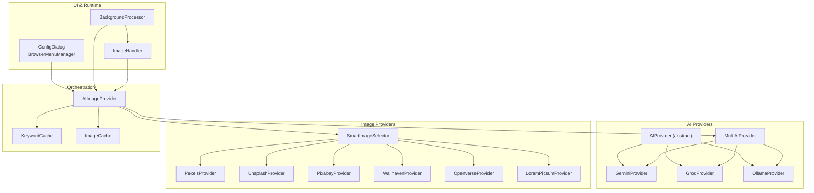
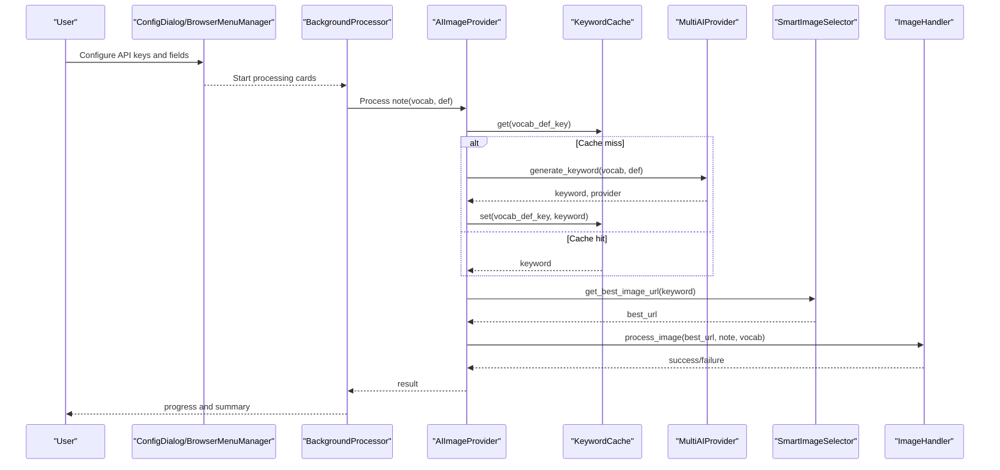
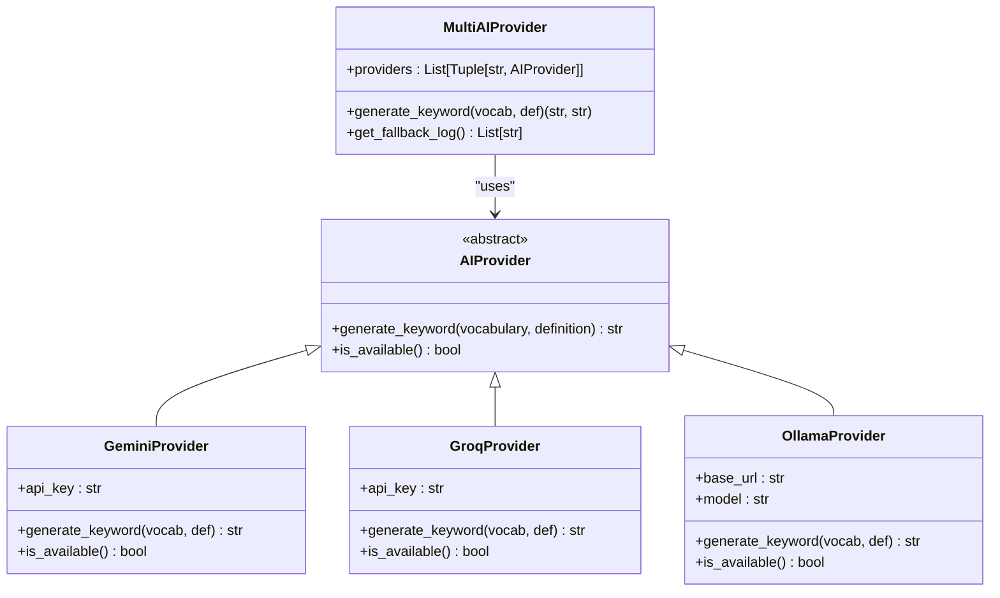
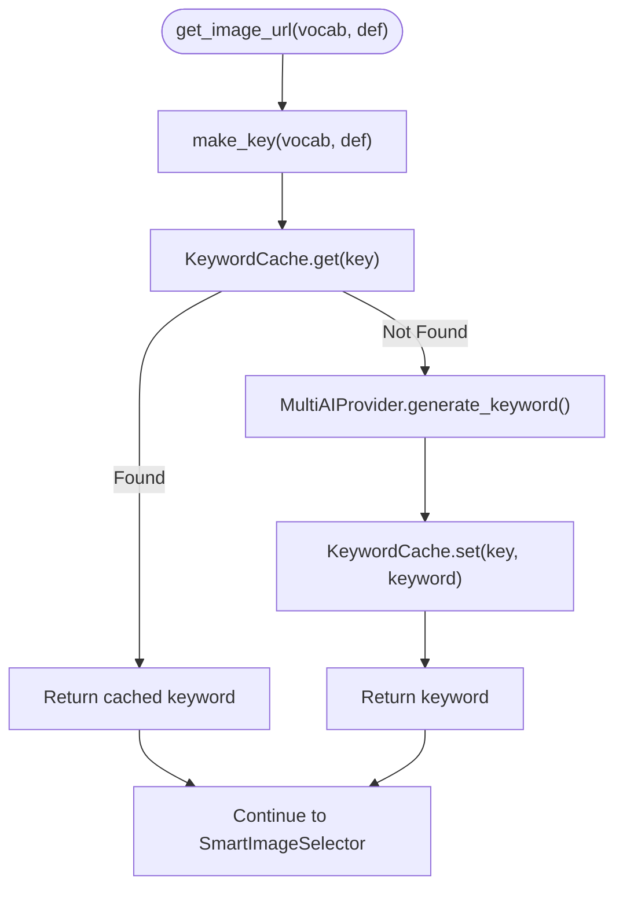
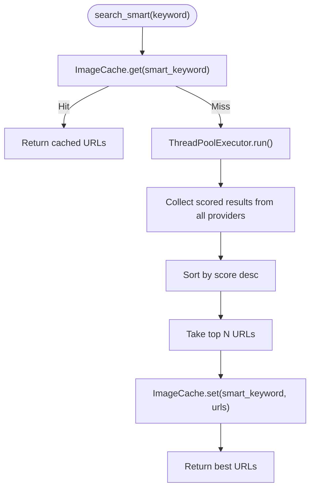
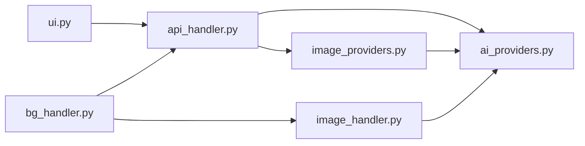

# AI Image Generation

<cite>
**Referenced Files in This Document**
- [ai_providers.py](file://AnkiAI_ImageAddon/modules/ai_providers.py)
- [api_handler.py](file://AnkiAI_ImageAddon/modules/api_handler.py)
- [image_providers.py](file://AnkiAI_ImageAddon/modules/image_providers.py)
- [config.py](file://AnkiAI_ImageAddon/modules/config.py)
- [config.json](file://AnkiAI_ImageAddon/config.json)
- [ui.py](file://AnkiAI_ImageAddon/modules/ui.py)
- [bg_handler.py](file://AnkiAI_ImageAddon/modules/bg_handler.py)
- [image_handler.py](file://AnkiAI_ImageAddon/modules/image_handler.py)
- [manifest.json](file://AnkiAI_ImageAddon/manifest.json)
- [requirements.txt](file://requirements.txt)
</cite>

## Table of Contents
1. [Introduction](#introduction)
2. [Project Structure](#project-structure)
3. [Core Components](#core-components)
4. [Architecture Overview](#architecture-overview)
5. [Detailed Component Analysis](#detailed-component-analysis)
6. [Dependency Analysis](#dependency-analysis)
7. [Performance Considerations](#performance-considerations)
8. [Troubleshooting Guide](#troubleshooting-guide)
9. [Conclusion](#conclusion)
10. [Appendices](#appendices)

## Introduction
This document explains the AI image generation feature integrated into the Anki add-on. It focuses on the multi-provider AI keyword generation system supporting Gemini, Groq, and Ollama, along with the intelligent image search and selection pipeline. It covers:
- How vocabulary and definitions are transformed into optimized search terms
- The keyword caching system with configurable TTL and capacity
- Provider fallback mechanisms and performance characteristics
- Configuration options for API keys, provider selection, and local Ollama setup
- Practical workflows, error handling strategies, and best practices for cost and performance

## Project Structure
The AI image generation feature spans several modules:
- AI providers: Gemini, Groq, Ollama
- Smart image selection: concurrent search across multiple providers with scoring
- Keyword caching and API handler orchestration
- UI dialogs for configuration and connection testing
- Background processing and image handling utilities

**Diagram sources**
- [ai_providers.py:24-393](file://AnkiAI_ImageAddon/modules/ai_providers.py#L24-L393)
- [image_providers.py:104-463](file://AnkiAI_ImageAddon/modules/image_providers.py#L104-L463)
- [api_handler.py:74-229](file://AnkiAI_ImageAddon/modules/api_handler.py#L74-L229)
- [ui.py:174-444](file://AnkiAI_ImageAddon/modules/ui.py#L174-L444)
- [bg_handler.py:12-205](file://AnkiAI_ImageAddon/modules/bg_handler.py#L12-L205)
- [image_handler.py:36-364](file://AnkiAI_ImageAddon/modules/image_handler.py#L36-L364)

**Section sources**
- [manifest.json:1-12](file://AnkiAI_ImageAddon/manifest.json#L1-L12)
- [requirements.txt:1-19](file://requirements.txt#L1-L19)

## Core Components
- AI providers: Abstract base and concrete implementations for Gemini, Groq, and Ollama. Each provider validates availability and generates a concise English keyword for image search.
- MultiAIProvider: Manages provider initialization and automatic fallback across Groq → Gemini → Ollama.
- KeywordCache: Thread-safe LRU-like cache for generated keywords with configurable size.
- SmartImageSelector: Concurrently queries multiple image providers, scores results, and returns top images.
- ImageCache: Lightweight cache for smart search results with TTL.
- AIImageProvider: Orchestrates keyword generation and image selection, integrating caches and provider fallback.
- UI and runtime: ConfigDialog for API keys and provider selection, BackgroundProcessor for non-blocking operations, ImageHandler for downloading and embedding images.

**Section sources**
- [ai_providers.py:24-393](file://AnkiAI_ImageAddon/modules/ai_providers.py#L24-L393)
- [api_handler.py:42-229](file://AnkiAI_ImageAddon/modules/api_handler.py#L42-L229)
- [image_providers.py:69-463](file://AnkiAI_ImageAddon/modules/image_providers.py#L69-L463)
- [ui.py:174-444](file://AnkiAI_ImageAddon/modules/ui.py#L174-L444)
- [bg_handler.py:12-205](file://AnkiAI_ImageAddon/modules/bg_handler.py#L12-L205)
- [image_handler.py:36-364](file://AnkiAI_ImageAddon/modules/image_handler.py#L36-L364)

## Architecture Overview
The AI image generation workflow:
1. Extract vocabulary and definition from notes.
2. Generate a keyword via AI providers with caching and fallback.
3. Perform smart image search across multiple providers concurrently.
4. Download, optimize, and embed the best image into the note.
5. Run the entire pipeline in the background to keep the UI responsive.

**Diagram sources**
- [api_handler.py:187-229](file://AnkiAI_ImageAddon/modules/api_handler.py#L187-L229)
- [ai_providers.py:297-393](file://AnkiAI_ImageAddon/modules/ai_providers.py#L297-L393)
- [image_providers.py:373-463](file://AnkiAI_ImageAddon/modules/image_providers.py#L373-L463)
- [image_handler.py:326-364](file://AnkiAI_ImageAddon/modules/image_handler.py#L326-L364)
- [bg_handler.py:23-101](file://AnkiAI_ImageAddon/modules/bg_handler.py#L23-L101)

## Detailed Component Analysis

### AI Providers and MultiAIProvider
- AIProvider defines the contract for keyword generation and availability checks.
- GeminiProvider: Uses a free model with a short generationConfig; validates availability via a lightweight request.
- GroqProvider: Uses a free model optimized for speed; validates availability quickly.
- OllamaProvider: Runs locally; validates by querying tags endpoint.
- MultiAIProvider: Initializes providers in priority order (Groq first, then Gemini, then Ollama), collects fallback logs, and returns the first successful result.

**Diagram sources**
- [ai_providers.py:24-393](file://AnkiAI_ImageAddon/modules/ai_providers.py#L24-L393)

**Section sources**
- [ai_providers.py:24-393](file://AnkiAI_ImageAddon/modules/ai_providers.py#L24-L393)

### Keyword Generation and Caching
- KeywordCache: Thread-safe cache keyed by vocabulary + definition, with a maximum size. On miss, delegates to MultiAIProvider; on hit, returns cached keyword.
- TTL: The AIImageProvider orchestrator does not enforce a separate TTL for keyword cache; the cache size limit acts as a practical eviction mechanism.

**Diagram sources**
- [api_handler.py:42-72](file://AnkiAI_ImageAddon/modules/api_handler.py#L42-L72)
- [api_handler.py:187-229](file://AnkiAI_ImageAddon/modules/api_handler.py#L187-L229)
- [ai_providers.py:297-393](file://AnkiAI_ImageAddon/modules/ai_providers.py#L297-L393)

**Section sources**
- [api_handler.py:42-72](file://AnkiAI_ImageAddon/modules/api_handler.py#L42-L72)
- [api_handler.py:187-229](file://AnkiAI_ImageAddon/modules/api_handler.py#L187-L229)

### Smart Image Selection and Scoring
- SmartImageSelector adds multiple providers and performs concurrent searches using a thread pool. Each provider’s results are wrapped in ImageScore and scored based on provider reliability, URL quality, and title relevance. Results are sorted by score and top-N URLs are returned.
- ImageCache: Caches smart search results with a configurable TTL to avoid repeated provider calls for the same keyword.

**Diagram sources**
- [image_providers.py:373-463](file://AnkiAI_ImageAddon/modules/image_providers.py#L373-L463)
- [image_providers.py:69-102](file://AnkiAI_ImageAddon/modules/image_providers.py#L69-L102)

**Section sources**
- [image_providers.py:29-67](file://AnkiAI_ImageAddon/modules/image_providers.py#L29-L67)
- [image_providers.py:69-102](file://AnkiAI_ImageAddon/modules/image_providers.py#L69-L102)
- [image_providers.py:373-463](file://AnkiAI_ImageAddon/modules/image_providers.py#L373-L463)

### Orchestration: AIImageProvider
- Initializes MultiAIProvider and SmartImageSelector based on configuration.
- Coordinates keyword generation with caching and fallback, then performs smart image selection and returns the best URL.
- Integrates with ImageHandler for downloading, optimizing, and embedding images.

**Section sources**
- [api_handler.py:74-229](file://AnkiAI_ImageAddon/modules/api_handler.py#L74-L229)

### UI and Configuration
- ConfigDialog: Allows configuring Gemini, Groq, and Ollama keys, enabling Ollama, selecting image providers (Pexels, Unsplash, Pixabay), and testing connections.
- BrowserMenuManager: Adds a context menu item to trigger the add-on from the browser.
- ConfigManager: Provides default configuration values and validation for AI and image provider keys.

**Section sources**
- [ui.py:174-444](file://AnkiAI_ImageAddon/modules/ui.py#L174-L444)
- [config.py:18-132](file://AnkiAI_ImageAddon/modules/config.py#L18-L132)
- [config.json:1-35](file://AnkiAI_ImageAddon/config.json#L1-L35)

### Background Processing and Image Handling
- BackgroundProcessor: Runs long-running tasks in the background using Anki’s QueryOp to prevent UI freezing, reporting progress and handling cancellation.
- ImageHandler: Downloads images with optimized timeouts and retries, optionally optimizes images, saves them via Anki’s media API, and inserts responsive HTML into notes.

**Section sources**
- [bg_handler.py:12-205](file://AnkiAI_ImageAddon/modules/bg_handler.py#L12-L205)
- [image_handler.py:36-364](file://AnkiAI_ImageAddon/modules/image_handler.py#L36-L364)

## Dependency Analysis
- Internal dependencies:
  - api_handler.py depends on ai_providers.py and image_providers.py.
  - image_providers.py depends on requests and concurrent.futures.
  - ui.py integrates with Anki’s browser and dialog APIs.
  - bg_handler.py uses Anki’s QueryOp for background operations.
  - image_handler.py uses requests and optionally PIL for optimization.
- External dependencies:
  - requests, PyQt6, aqt, anki are required by Anki itself; development/testing requirements are listed in requirements.txt.

**Diagram sources**
- [api_handler.py:24-34](file://AnkiAI_ImageAddon/modules/api_handler.py#L24-L34)
- [ai_providers.py:13-16](file://AnkiAI_ImageAddon/modules/ai_providers.py#L13-L16)
- [image_providers.py:16-21](file://AnkiAI_ImageAddon/modules/image_providers.py#L16-L21)
- [ui.py:6-10](file://AnkiAI_ImageAddon/modules/ui.py#L6-L10)
- [bg_handler.py:6-9](file://AnkiAI_ImageAddon/modules/bg_handler.py#L6-L9)
- [image_handler.py:15-28](file://AnkiAI_ImageAddon/modules/image_handler.py#L15-L28)

**Section sources**
- [requirements.txt:10-19](file://requirements.txt#L10-L19)

## Performance Considerations
- Provider latency and throughput:
  - Groq: Free tier, extremely fast (~50 ms) with a free model; recommended as primary provider.
  - Gemini: Free tier with a quality model; suitable for balanced performance.
  - Ollama: Local, no network dependency; slower startup and inference time; useful as fallback.
- Smart image selection:
  - Concurrent requests across providers reduce total wait time.
  - Scoring prioritizes reliable providers and clean URLs.
- Caching:
  - KeywordCache avoids redundant AI calls for identical vocabulary + definition pairs.
  - ImageCache reduces repeated provider queries for the same keyword.
- Image optimization:
  - Reduced download timeouts and retries improve responsiveness.
  - Lightweight optimization reduces file sizes while preserving quality.

[No sources needed since this section provides general guidance]

## Troubleshooting Guide
Common issues and resolutions:
- Invalid API keys:
  - Verify keys in ConfigDialog and test connections using the built-in test button.
- Provider unavailability:
  - Check network connectivity and provider quotas; fallback to next provider is automatic.
- No images found:
  - Retry with a different keyword; consider switching to DALL-E mode if available in older versions.
- Timeout errors:
  - Reduce concurrent requests or increase timeouts in advanced configuration.
- Lagging UI:
  - Use background processing and smaller batches; adjust concurrency settings.

**Section sources**
- [ui.py:325-400](file://AnkiAI_ImageAddon/modules/ui.py#L325-L400)
- [bg_handler.py:23-101](file://AnkiAI_ImageAddon/modules/bg_handler.py#L23-L101)
- [image_handler.py:59-129](file://AnkiAI_ImageAddon/modules/image_handler.py#L59-L129)

## Conclusion
The AI image generation feature combines multi-provider AI keyword generation with a robust, concurrent image selection pipeline. The system emphasizes cost-effectiveness and performance by leveraging fast free providers (Groq/Gemini), local fallback (Ollama), intelligent caching, and optimized image handling. Users can configure providers and fields via the UI, and the background processor ensures smooth operation.

[No sources needed since this section summarizes without analyzing specific files]

## Appendices

### Configuration Options
- AI providers:
  - Gemini API key
  - Groq API key
  - Use Ollama (boolean)
  - Ollama URL
- Image providers:
  - Pexels API key
  - Unsplash API key
  - Pixabay API key
  - Wallhaven API key (optional)
- Smart selection:
  - Enable smart selection (boolean)
  - Max concurrent providers
  - Smart cache TTL minutes
- Image download and optimization:
  - Image download timeout
  - Image download retries
  - Enable image optimization
  - Image max width
  - Image quality
- Keyword caching:
  - Enable keyword cache (boolean)
  - Keyword cache size
- UI and behavior:
  - Vocabulary field
  - Definition field
  - Image field
  - Image generation mode
  - Max concurrent requests
  - Enable concurrent downloads
  - Auto add on sync

**Section sources**
- [config.py:21-63](file://AnkiAI_ImageAddon/modules/config.py#L21-L63)
- [config.json:1-35](file://AnkiAI_ImageAddon/config.json#L1-L35)

### Practical Workflows and Best Practices
- Workflow:
  - Configure API keys and fields in ConfigDialog.
  - Select cards in the browser and run the add-on.
  - Background processing handles keyword generation, image search, and embedding.
- Best practices:
  - Prefer Groq for speed; Gemini for quality; Ollama for privacy/local control.
  - Keep keyword cache enabled to minimize API calls.
  - Use smart selection with concurrent providers for higher-quality results.
  - Batch large operations to avoid UI lag.
  - Monitor logs for failures and adjust timeouts or providers accordingly.

**Section sources**
- [ui.py:174-444](file://AnkiAI_ImageAddon/modules/ui.py#L174-L444)
- [bg_handler.py:23-101](file://AnkiAI_ImageAddon/modules/bg_handler.py#L23-L101)
- [api_handler.py:187-229](file://AnkiAI_ImageAddon/modules/api_handler.py#L187-L229)