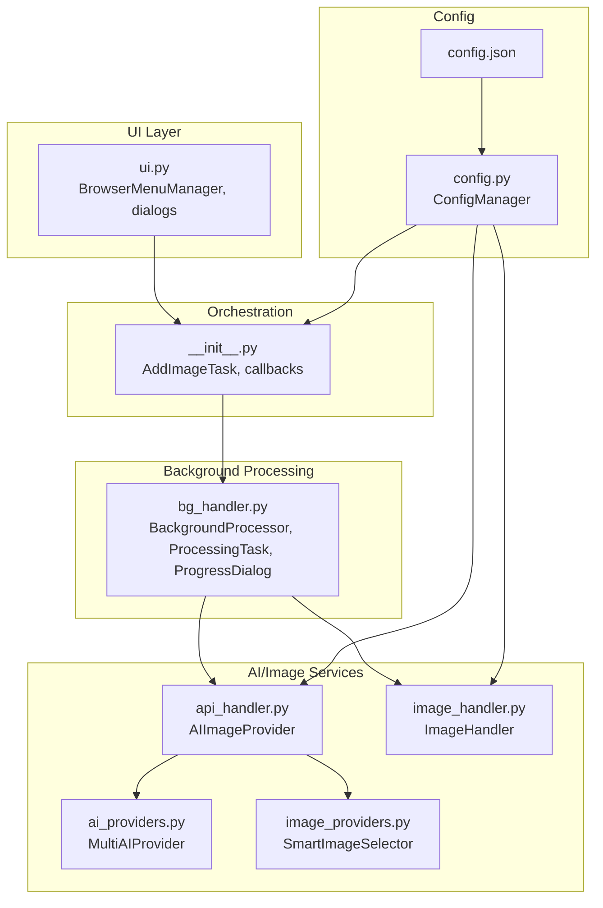
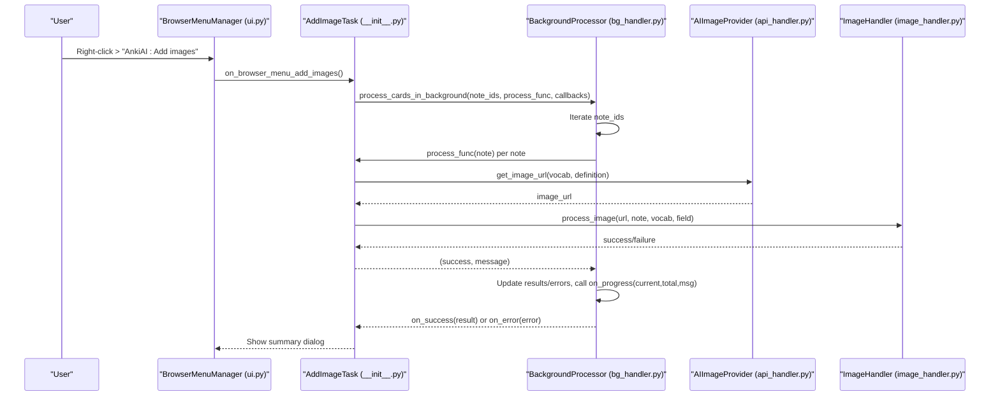
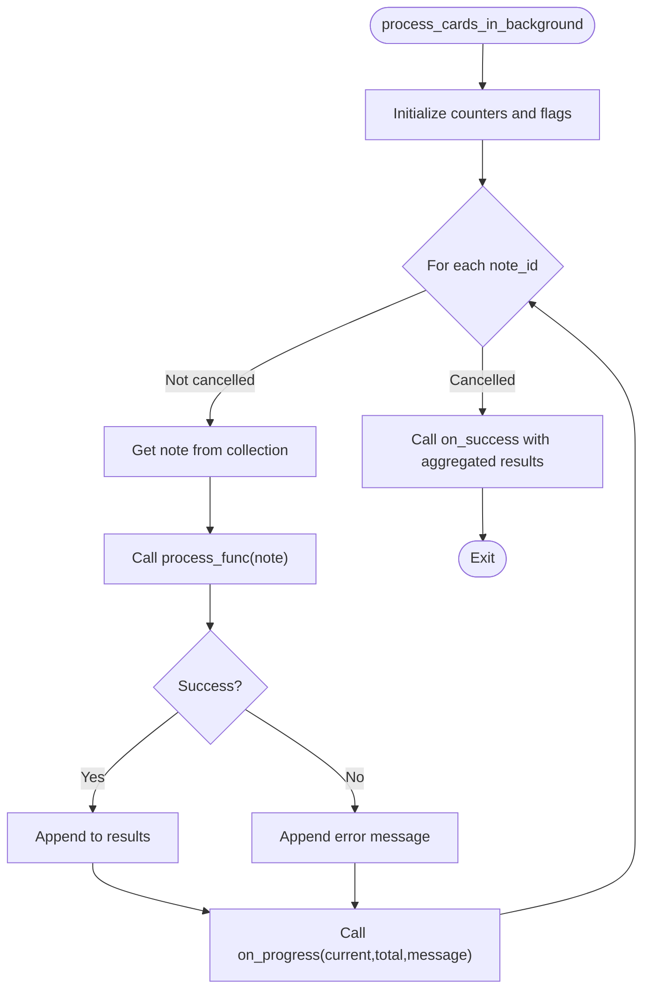
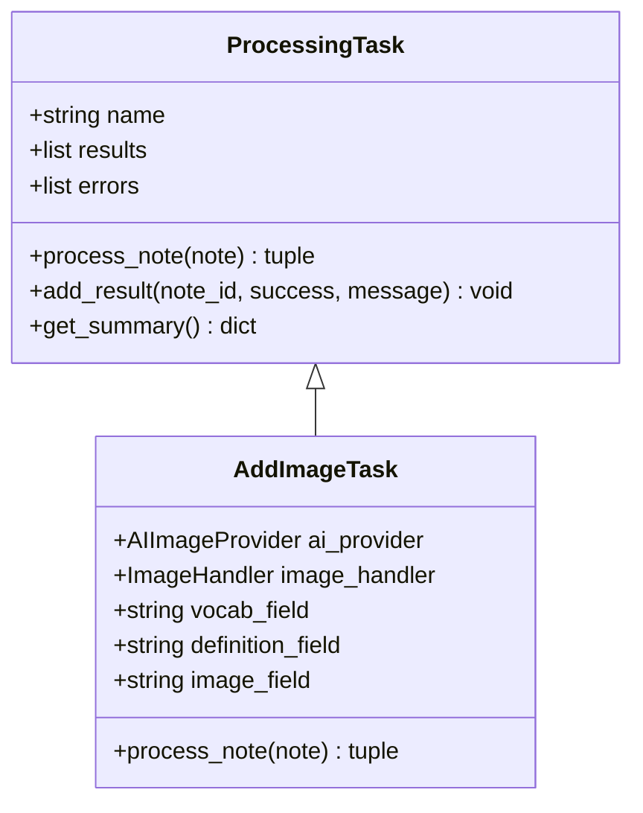
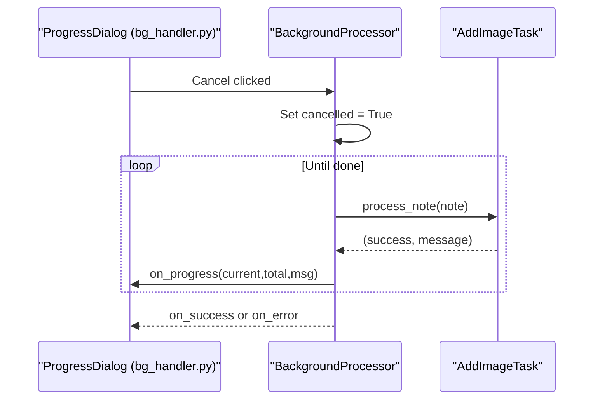
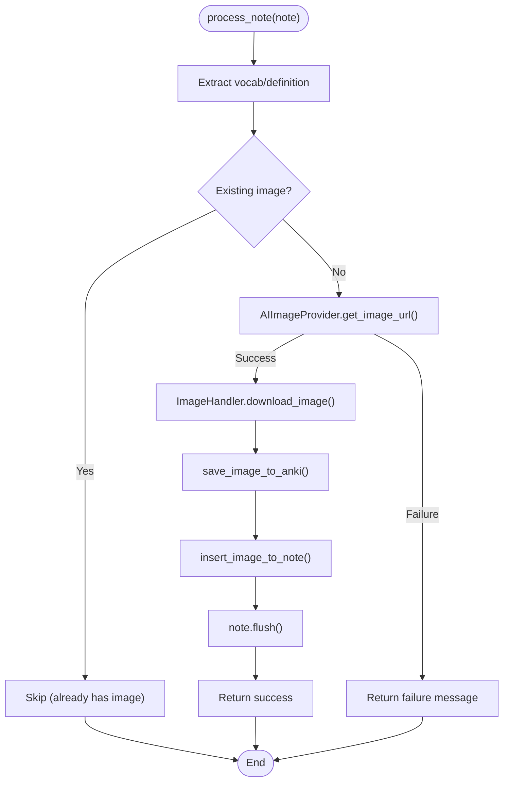
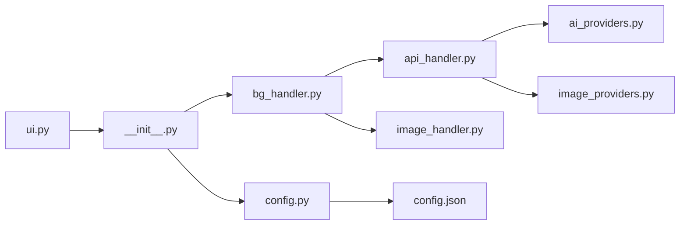

# Background Processing

<cite>
**Referenced Files in This Document**
- [bg_handler.py](file://AnkiAI_ImageAddon/modules/bg_handler.py)
- [__init__.py](file://AnkiAI_ImageAddon/__init__.py)
- [config.py](file://AnkiAI_ImageAddon/modules/config.py)
- [config.json](file://AnkiAI_ImageAddon/config.json)
- [ARCHITECTURE.md](file://ARCHITECTURE.md)
- [api_handler.py](file://AnkiAI_ImageAddon/modules/api_handler.py)
- [image_handler.py](file://AnkiAI_ImageAddon/modules/image_handler.py)
- [ui.py](file://AnkiAI_ImageAddon/modules/ui.py)
- [ai_providers.py](file://AnkiAI_ImageAddon/modules/ai_providers.py)
- [image_providers.py](file://AnkiAI_ImageAddon/modules/image_providers.py)
- [README.md](file://README.md)
- [QUICKSTART.md](file://QUICKSTART.md)
- [PERFORMANCE_TIPS.md](file://PERFORMANCE_TIPS.md)
- [V4_COMPLETE_SUMMARY.md](file://V4_COMPLETE_SUMMARY.md)
</cite>

## Table of Contents
1. [Introduction](#introduction)
2. [Project Structure](#project-structure)
3. [Core Components](#core-components)
4. [Architecture Overview](#architecture-overview)
5. [Detailed Component Analysis](#detailed-component-analysis)
6. [Dependency Analysis](#dependency-analysis)
7. [Performance Considerations](#performance-considerations)
8. [Troubleshooting Guide](#troubleshooting-guide)
9. [Conclusion](#conclusion)
10. [Appendices](#appendices)

## Introduction
This document explains the background processing system that powers the add-on’s ability to process many flashcards without freezing the Anki UI. It covers how the system leverages Anki’s QueryOp for non-blocking operations, real-time progress tracking, robust error handling and recovery, batch processing capabilities, memory management, and configuration options for limits and timeouts. It also includes practical workflows, progress monitoring examples, and strategies for handling edge cases such as network failures and API quota exhaustion.

## Project Structure
The background processing spans several modules:
- Background orchestration and progress UI live in the background handler module.
- The main add-on orchestrates tasks, wires UI callbacks, and invokes background processing.
- Configuration controls concurrency, timeouts, and feature toggles.
- API and image handlers implement the heavy-lifting for AI keyword generation and image retrieval.
- UI components manage selection, dialogs, and user feedback.

**Diagram sources**
- [bg_handler.py:12-108](file://AnkiAI_ImageAddon/modules/bg_handler.py#L12-L108)
- [__init__.py:27-274](file://AnkiAI_ImageAddon/__init__.py#L27-L274)
- [config.py:18-132](file://AnkiAI_ImageAddon/modules/config.py#L18-L132)
- [config.json:1-35](file://AnkiAI_ImageAddon/config.json#L1-L35)
- [api_handler.py:74-229](file://AnkiAI_ImageAddon/modules/api_handler.py#L74-L229)
- [image_handler.py:36-364](file://AnkiAI_ImageAddon/modules/image_handler.py#L36-L364)
- [ai_providers.py:297-393](file://AnkiAI_ImageAddon/modules/ai_providers.py#L297-L393)
- [image_providers.py:373-463](file://AnkiAI_ImageAddon/modules/image_providers.py#L373-L463)
- [ui.py:13-94](file://AnkiAI_ImageAddon/modules/ui.py#L13-L94)

**Section sources**
- [ARCHITECTURE.md:1-481](file://ARCHITECTURE.md#L1-L481)
- [__init__.py:1-349](file://AnkiAI_ImageAddon/__init__.py#L1-L349)
- [bg_handler.py:1-205](file://AnkiAI_ImageAddon/modules/bg_handler.py#L1-L205)
- [config.py:1-132](file://AnkiAI_ImageAddon/modules/config.py#L1-L132)
- [config.json:1-35](file://AnkiAI_ImageAddon/config.json#L1-L35)

## Core Components
- BackgroundProcessor: Runs long-running tasks off the UI thread using Anki’s QueryOp, tracks progress, and supports cancellation.
- ProcessingTask: Base class for tasks that operate on individual notes; collects per-note results and errors.
- ProgressDialog: Qt-based progress dialog with cancel support.
- AddImageTask: Concrete task that orchestrates keyword generation, image retrieval, download, saving, and insertion into notes.
- ConfigManager: Centralized configuration with defaults, validation, and persistence.

Key responsibilities:
- Non-blocking UI: Uses QueryOp to keep Anki responsive.
- Real-time progress: on_progress callback receives current/total counts and a message.
- Partial success: Continues processing after per-item errors; aggregates successes and failures.
- Cancellation: Supports stopping mid-batch via cancel flag.
- Resource cleanup: Each note is flushed after successful updates; media writes go through Anki’s media API.

**Section sources**
- [bg_handler.py:12-108](file://AnkiAI_ImageAddon/modules/bg_handler.py#L12-L108)
- [__init__.py:27-97](file://AnkiAI_ImageAddon/__init__.py#L27-L97)
- [config.py:18-132](file://AnkiAI_ImageAddon/modules/config.py#L18-L132)

## Architecture Overview
The background processing pipeline integrates UI selection, configuration, AI/image services, and background execution:

**Diagram sources**
- [__init__.py:99-274](file://AnkiAI_ImageAddon/__init__.py#L99-L274)
- [bg_handler.py:23-100](file://AnkiAI_ImageAddon/modules/bg_handler.py#L23-L100)
- [api_handler.py:187-229](file://AnkiAI_ImageAddon/modules/api_handler.py#L187-L229)
- [image_handler.py:326-364](file://AnkiAI_ImageAddon/modules/image_handler.py#L326-L364)
- [ui.py:13-94](file://AnkiAI_ImageAddon/modules/ui.py#L13-L94)

## Detailed Component Analysis

### BackgroundProcessor
- Purpose: Run batch operations without blocking the UI using Anki’s QueryOp.
- Execution model:
  - Accepts a list of note IDs and a process function.
  - Iterates notes, invoking the process function for each.
  - Aggregates per-item results and errors.
  - Emits progress updates via on_progress(current, total, message).
  - Calls on_success(result) or on_error(error) upon completion.
- Cancellation: Sets a cancelled flag; stops iteration early if triggered.
- Thread safety: Uses Anki’s internal threading via QueryOp; per-item work runs in background thread.

**Diagram sources**
- [bg_handler.py:23-100](file://AnkiAI_ImageAddon/modules/bg_handler.py#L23-L100)

**Section sources**
- [bg_handler.py:12-108](file://AnkiAI_ImageAddon/modules/bg_handler.py#L12-L108)

### ProcessingTask and AddImageTask
- ProcessingTask:
  - Base class for per-note operations.
  - Tracks results and errors; provides get_summary() for reporting.
- AddImageTask:
  - Implements process_note() to extract vocabulary/definition, check for existing images, call AI provider, download/save/insert image, and flush the note.
  - Wraps API and image errors into task-level messages.

**Diagram sources**
- [bg_handler.py:166-205](file://AnkiAI_ImageAddon/modules/bg_handler.py#L166-L205)
- [__init__.py:27-97](file://AnkiAI_ImageAddon/__init__.py#L27-L97)

**Section sources**
- [bg_handler.py:166-205](file://AnkiAI_ImageAddon/modules/bg_handler.py#L166-L205)
- [__init__.py:27-97](file://AnkiAI_ImageAddon/__init__.py#L27-L97)

### Progress Tracking and Cancellation
- Progress: The on_progress callback receives current/total counts and a message string. The processor updates the UI via Anki’s built-in progress dialog.
- Cancellation: The user can trigger cancellation via the progress dialog; the processor checks a cancelled flag between iterations and exits gracefully.
- UI integration: The main orchestrator sets up on_progress, on_success, and on_error callbacks that update the UI and refresh the browser.

**Diagram sources**
- [bg_handler.py:111-164](file://AnkiAI_ImageAddon/modules/bg_handler.py#L111-L164)
- [bg_handler.py:23-100](file://AnkiAI_ImageAddon/modules/bg_handler.py#L23-L100)
- [__init__.py:234-273](file://AnkiAI_ImageAddon/__init__.py#L234-L273)

**Section sources**
- [bg_handler.py:111-164](file://AnkiAI_ImageAddon/modules/bg_handler.py#L111-L164)
- [__init__.py:234-273](file://AnkiAI_ImageAddon/__init__.py#L234-L273)

### Error Handling and Recovery
- Per-item errors: Each note’s failure is captured separately; processing continues for remaining items.
- Layered error handling:
  - API layer: AI provider errors surfaced as APIError.
  - Image layer: Download and insertion errors as ImageError.
  - Task layer: Converts lower-level errors into task messages.
  - Background layer: Catches exceptions, logs, and appends to errors list; continues processing.
- Recovery strategies:
  - Retry logic in image download (limited attempts).
  - Smart fallback among AI providers.
  - Partial success reporting: Users can retry failed items later.
  - Graceful degradation: If a provider fails, others are tried automatically.

**Diagram sources**
- [__init__.py:39-97](file://AnkiAI_ImageAddon/__init__.py#L39-L97)
- [api_handler.py:187-229](file://AnkiAI_ImageAddon/modules/api_handler.py#L187-L229)
- [image_handler.py:326-364](file://AnkiAI_ImageAddon/modules/image_handler.py#L326-L364)

**Section sources**
- [__init__.py:39-97](file://AnkiAI_ImageAddon/__init__.py#L39-L97)
- [api_handler.py:37-40](file://AnkiAI_ImageAddon/modules/api_handler.py#L37-L40)
- [image_handler.py:31-34](file://AnkiAI_ImageAddon/modules/image_handler.py#L31-L34)

### Batch Processing and Concurrency
- Batch size: The system processes lists of note IDs; batching avoids UI freezes and reduces memory pressure.
- Concurrency:
  - AI keyword generation uses multiple providers with automatic fallback.
  - Smart image selection concurrently queries multiple image providers and ranks results.
  - Configuration keys control concurrency and timeouts for optimal throughput.

**Section sources**
- [bg_handler.py:23-100](file://AnkiAI_ImageAddon/modules/bg_handler.py#L23-L100)
- [api_handler.py:74-126](file://AnkiAI_ImageAddon/modules/api_handler.py#L74-L126)
- [image_providers.py:373-463](file://AnkiAI_ImageAddon/modules/image_providers.py#L373-L463)
- [config.py:57-63](file://AnkiAI_ImageAddon/modules/config.py#L57-L63)

### Memory Management and Resource Cleanup
- Media writes: Images are saved via Anki’s media API to ensure proper synchronization and dependency tracking.
- Note flushing: Successful updates are flushed to persist changes.
- Streaming and optimization: Image downloads use streaming and optional optimization to reduce memory footprint.
- Locking: Thread locks are used in image handling to maintain thread safety.

**Section sources**
- [image_handler.py:243-267](file://AnkiAI_ImageAddon/modules/image_handler.py#L243-L267)
- [image_handler.py:326-364](file://AnkiAI_ImageAddon/modules/image_handler.py#L326-L364)
- [__init__.py:82-88](file://AnkiAI_ImageAddon/__init__.py#L82-L88)

### Configuration Options for Processing Limits, Timeouts, and Notifications
- Concurrency:
  - max_concurrent_requests: Controls concurrent network operations.
  - max_concurrent_providers: Controls concurrent image provider searches.
- Timeouts:
  - image_download_timeout: Network timeout for image downloads.
  - image_download_retries: Number of retry attempts for downloads.
- Smart selection:
  - enable_smart_selection: Enable intelligent provider ranking.
  - smart_cache_ttl_minutes: Cache TTL for provider search results.
- Image optimization:
  - enable_image_optimization: Toggle optimization.
  - image_max_width, image_quality: Target width and JPEG quality.
- Keyword caching:
  - enable_keyword_cache: Toggle keyword cache.
  - keyword_cache_size: Maximum number of cached entries.
- UI and fields:
  - vocabulary_field, definition_field, image_field: Field names used for processing.
  - image_generation_mode: Mode selection (search or generate).
- Other:
  - auto_add_on_sync: Auto-add behavior on sync.

These options are exposed via the configuration manager and persisted to Anki’s configuration system.

**Section sources**
- [config.py:18-132](file://AnkiAI_ImageAddon/modules/config.py#L18-L132)
- [config.json:1-35](file://AnkiAI_ImageAddon/config.json#L1-L35)
- [V4_COMPLETE_SUMMARY.md:180-201](file://V4_COMPLETE_SUMMARY.md#L180-L201)

## Dependency Analysis
The background processing system exhibits clear separation of concerns:
- UI depends on orchestration to prepare tasks and present results.
- Orchestration depends on background processing for non-blocking execution.
- Background processing depends on AI and image handlers for external services.
- Configuration underpins all layers with tunable parameters.

**Diagram sources**
- [ui.py:13-94](file://AnkiAI_ImageAddon/modules/ui.py#L13-L94)
- [__init__.py:27-274](file://AnkiAI_ImageAddon/__init__.py#L27-L274)
- [bg_handler.py:12-108](file://AnkiAI_ImageAddon/modules/bg_handler.py#L12-L108)
- [api_handler.py:74-229](file://AnkiAI_ImageAddon/modules/api_handler.py#L74-L229)
- [image_handler.py:36-364](file://AnkiAI_ImageAddon/modules/image_handler.py#L36-L364)
- [ai_providers.py:297-393](file://AnkiAI_ImageAddon/modules/ai_providers.py#L297-L393)
- [image_providers.py:373-463](file://AnkiAI_ImageAddon/modules/image_providers.py#L373-L463)
- [config.py:18-132](file://AnkiAI_ImageAddon/modules/config.py#L18-L132)
- [config.json:1-35](file://AnkiAI_ImageAddon/config.json#L1-L35)

**Section sources**
- [ARCHITECTURE.md:1-481](file://ARCHITECTURE.md#L1-L481)
- [__init__.py:1-349](file://AnkiAI_ImageAddon/__init__.py#L1-L349)

## Performance Considerations
- Batch size: Process manageable batches to avoid UI lag and memory spikes.
- Concurrency tuning: Adjust max_concurrent_requests and max_concurrent_providers based on network conditions.
- Timeouts: Reduce timeouts for faster failure detection on slower networks.
- Smart selection: Enable concurrent provider searches and caching to improve responsiveness.
- Image optimization: Lower target width and quality to reduce bandwidth and storage overhead.
- UI responsiveness: Use QueryOp to keep the interface interactive; avoid long synchronous operations.

Practical guidance:
- Prefer Search mode for speed and cost-efficiency.
- Split large batches into smaller chunks.
- Monitor memory usage and adjust optimization settings.

**Section sources**
- [PERFORMANCE_TIPS.md:157-247](file://PERFORMANCE_TIPS.md#L157-L247)
- [V4_COMPLETE_SUMMARY.md:204-232](file://V4_COMPLETE_SUMMARY.md#L204-L232)
- [image_handler.py:130-196](file://AnkiAI_ImageAddon/modules/image_handler.py#L130-L196)
- [config.py:57-63](file://AnkiAI_ImageAddon/modules/config.py#L57-L63)

## Troubleshooting Guide
Common issues and resolutions:
- API key validation failures:
  - Ensure at least one AI provider is configured; verify keys in the configuration dialog.
- Network timeouts:
  - Increase image_download_timeout or reduce max_concurrent_requests.
  - Retry after network stabilization.
- No images found:
  - Switch providers or adjust keyword generation mode.
  - Verify smart selection is enabled and providers are configured.
- Partial failures:
  - Inspect the summary dialog for failed items; retry selectively.
- UI lag:
  - Reduce batch size and concurrency; optimize timeouts.
- Cancellation:
  - Use the progress dialog’s cancel button to stop processing.

Operational tips:
- Use Search mode for quicker results.
- Split large decks into batches.
- Confirm provider availability via the configuration dialog’s connection test.

**Section sources**
- [ui.py:174-400](file://AnkiAI_ImageAddon/modules/ui.py#L174-L400)
- [config.py:100-119](file://AnkiAI_ImageAddon/modules/config.py#L100-L119)
- [PERFORMANCE_TIPS.md:240-247](file://PERFORMANCE_TIPS.md#L240-L247)
- [README.md:117-134](file://README.md#L117-L134)

## Conclusion
The background processing system ensures smooth, non-blocking batch operations by leveraging Anki’s QueryOp, providing real-time progress, and implementing robust error handling with partial success reporting. With configurable concurrency, timeouts, and smart selection, it balances performance, reliability, and user control. Proper batching, optimization, and provider fallbacks help mitigate network and API limitations while maintaining a responsive UI.

## Appendices

### Example Workflows
- Batch image addition:
  - Select cards in the browser.
  - Invoke “AnkiAI: Add images”.
  - Configure fields and providers if needed.
  - Confirm and observe the progress dialog.
  - Review the summary and refresh the browser.

- Progress monitoring:
  - on_progress receives current/total and a message; use it to update UI or log progress.

- Handling edge cases:
  - Network failures: Reduce concurrency and timeouts; retry later.
  - API quota exhaustion: Switch providers or reduce concurrent requests.
  - Partial failures: Re-run the background process on failed items.

**Section sources**
- [QUICKSTART.md:55-69](file://QUICKSTART.md#L55-L69)
- [__init__.py:234-273](file://AnkiAI_ImageAddon/__init__.py#L234-L273)
- [bg_handler.py:23-100](file://AnkiAI_ImageAddon/modules/bg_handler.py#L23-L100)