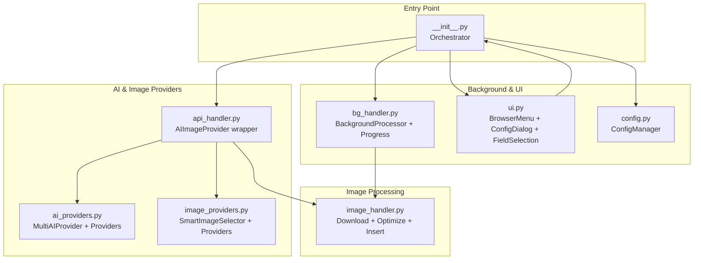
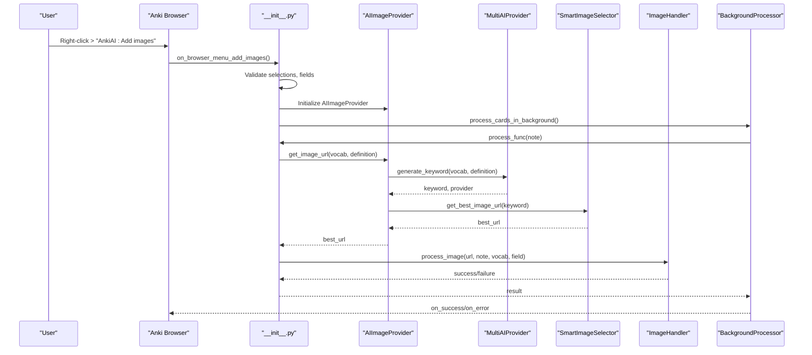
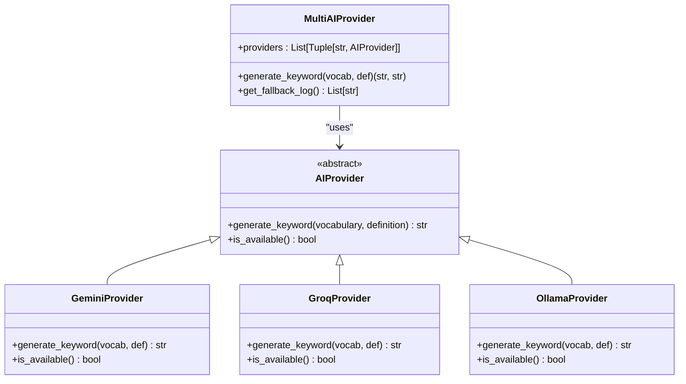
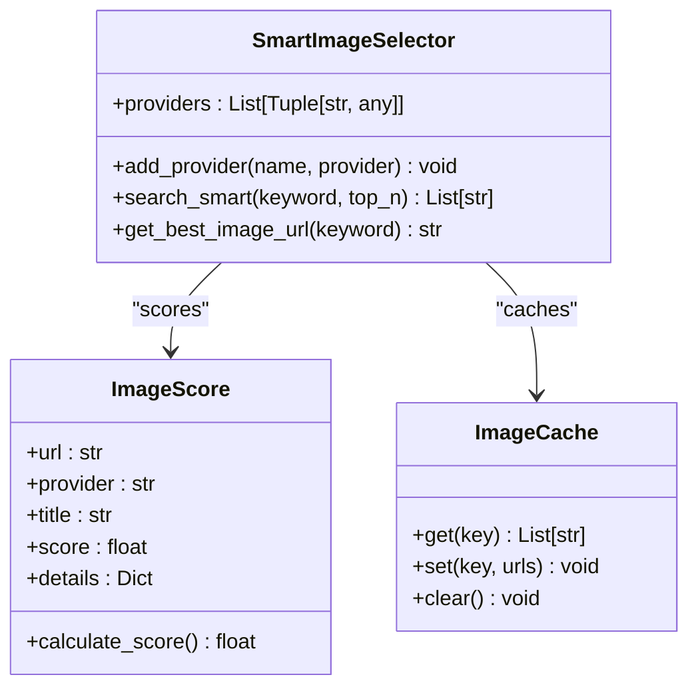
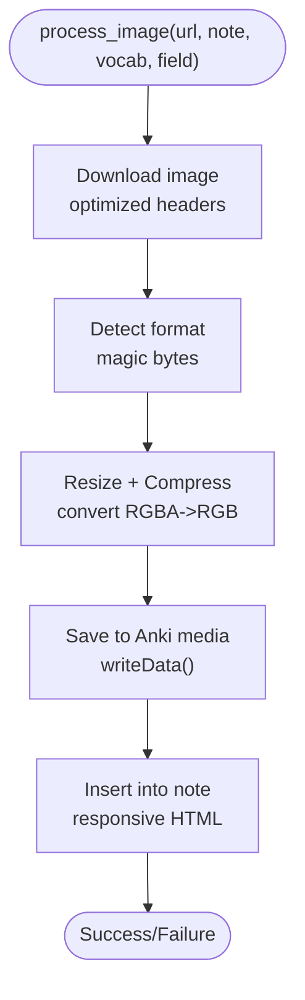
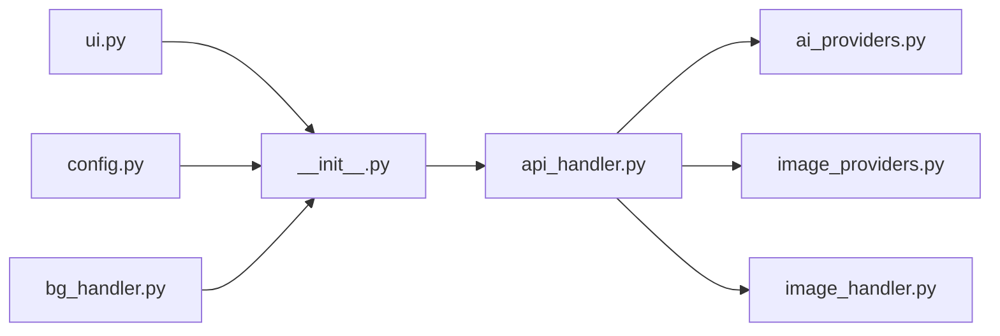

# Core Features

<cite>
**Referenced Files in This Document**
- [ai_providers.py](file://AnkiAI_ImageAddon/modules/ai_providers.py)
- [image_providers.py](file://AnkiAI_ImageAddon/modules/image_providers.py)
- [api_handler.py](file://AnkiAI_ImageAddon/modules/api_handler.py)
- [image_handler.py](file://AnkiAI_ImageAddon/modules/image_handler.py)
- [bg_handler.py](file://AnkiAI_ImageAddon/modules/bg_handler.py)
- [config.py](file://AnkiAI_ImageAddon/modules/config.py)
- [ui.py](file://AnkiAI_ImageAddon/modules/ui.py)
- [__init__.py](file://AnkiAI_ImageAddon/__init__.py)
- [PERFORMANCE_BENCHMARK_V4.md](file://PERFORMANCE_BENCHMARK_V4.md)
- [README.md](file://README.md)
- [QUICKSTART.md](file://QUICKSTART.md)
</cite>

## Table of Contents
1. [Introduction](#introduction)
2. [Project Structure](#project-structure)
3. [Core Components](#core-components)
4. [Architecture Overview](#architecture-overview)
5. [Detailed Component Analysis](#detailed-component-analysis)
6. [Dependency Analysis](#dependency-analysis)
7. [Performance Considerations](#performance-considerations)
8. [Troubleshooting Guide](#troubleshooting-guide)
9. [Conclusion](#conclusion)
10. [Appendices](#appendices)

## Introduction
This document focuses on the core features of the AnkiAI Image Addon, covering AI-powered image generation, smart multi-provider image selection, background processing to prevent UI blocking, image optimization, and mobile responsiveness. It synthesizes the implementation details from the codebase and complements them with performance insights and practical examples.

## Project Structure
The add-on is organized into modular components under the modules package, each responsible for a distinct aspect of the workflow: AI keyword generation, image search and ranking, image download and optimization, background processing, configuration, and UI integration. The main entry point orchestrates these modules and integrates with Anki’s browser interface.



**Diagram sources**
- [__init__.py:1-349](file://AnkiAI_ImageAddon/__init__.py#L1-L349)
- [ai_providers.py:1-393](file://AnkiAI_ImageAddon/modules/ai_providers.py#L1-L393)
- [image_providers.py:1-463](file://AnkiAI_ImageAddon/modules/image_providers.py#L1-L463)
- [api_handler.py:1-229](file://AnkiAI_ImageAddon/modules/api_handler.py#L1-L229)
- [image_handler.py:1-364](file://AnkiAI_ImageAddon/modules/image_handler.py#L1-L364)
- [bg_handler.py:1-205](file://AnkiAI_ImageAddon/modules/bg_handler.py#L1-L205)
- [ui.py:1-444](file://AnkiAI_ImageAddon/modules/ui.py#L1-L444)
- [config.py:1-132](file://AnkiAI_ImageAddon/modules/config.py#L1-L132)

**Section sources**
- [__init__.py:1-349](file://AnkiAI_ImageAddon/__init__.py#L1-L349)
- [modules/__init__.py:1-12](file://AnkiAI_ImageAddon/modules/__init__.py#L1-L12)

## Core Components
- AI keyword generation: Multi-provider fallback using Gemini, Groq, and Ollama, with caching and robust error handling.
- Smart image selection: Concurrent search across six providers with intelligent scoring and caching.
- Background processing: Runs long-running tasks off the UI thread with progress updates and cancellation.
- Image optimization: Lightweight resizing and compression to reduce file size while preserving quality.
- Mobile responsiveness: Responsive image insertion with lazy loading and adaptive styles.
- Configuration and UI: Flexible field mapping, API key configuration, and a browser context menu.

**Section sources**
- [ai_providers.py:1-393](file://AnkiAI_ImageAddon/modules/ai_providers.py#L1-L393)
- [image_providers.py:1-463](file://AnkiAI_ImageAddon/modules/image_providers.py#L1-L463)
- [api_handler.py:1-229](file://AnkiAI_ImageAddon/modules/api_handler.py#L1-L229)
- [image_handler.py:1-364](file://AnkiAI_ImageAddon/modules/image_handler.py#L1-L364)
- [bg_handler.py:1-205](file://AnkiAI_ImageAddon/modules/bg_handler.py#L1-L205)
- [config.py:1-132](file://AnkiAI_ImageAddon/modules/config.py#L1-L132)
- [ui.py:1-444](file://AnkiAI_ImageAddon/modules/ui.py#L1-L444)

## Architecture Overview
The add-on follows a layered architecture:
- UI layer: Browser context menu and configuration dialogs.
- Orchestration: Main entry point coordinates tasks and delegates to specialized modules.
- AI layer: Multi-provider keyword generation with fallback and caching.
- Image layer: Smart selection across multiple providers with concurrent requests and scoring.
- Processing layer: Download, optimize, and insert images into notes.
- Background layer: Offloads heavy work to prevent UI freezes.



**Diagram sources**
- [__init__.py:99-274](file://AnkiAI_ImageAddon/__init__.py#L99-L274)
- [api_handler.py:74-229](file://AnkiAI_ImageAddon/modules/api_handler.py#L74-L229)
- [ai_providers.py:297-393](file://AnkiAI_ImageAddon/modules/ai_providers.py#L297-L393)
- [image_providers.py:373-463](file://AnkiAI_ImageAddon/modules/image_providers.py#L373-L463)
- [image_handler.py:326-364](file://AnkiAI_ImageAddon/modules/image_handler.py#L326-L364)
- [bg_handler.py:23-101](file://AnkiAI_ImageAddon/modules/bg_handler.py#L23-L101)

## Detailed Component Analysis

### AI Keyword Generation
The AI keyword generation system supports multiple providers with automatic fallback and caching:
- Providers: Gemini (free, high quality), Groq (free, ultra-fast), Ollama (local, offline).
- Fallback order prioritizes speed and availability.
- Caching reduces repeated API calls for identical vocabulary-definition pairs.
- Robust error handling with descriptive exceptions.



**Diagram sources**
- [ai_providers.py:24-393](file://AnkiAI_ImageAddon/modules/ai_providers.py#L24-L393)

**Section sources**
- [ai_providers.py:38-127](file://AnkiAI_ImageAddon/modules/ai_providers.py#L38-L127)
- [ai_providers.py:129-217](file://AnkiAI_ImageAddon/modules/ai_providers.py#L129-L217)
- [ai_providers.py:219-295](file://AnkiAI_ImageAddon/modules/ai_providers.py#L219-L295)
- [ai_providers.py:297-393](file://AnkiAI_ImageAddon/modules/ai_providers.py#L297-L393)

### Smart Image Selection
The smart selection system concurrently queries up to six providers, scores results, and returns the best image:
- Providers: Pexels, Unsplash, Pixabay, Openverse, Wallhaven, Lorem Picsum.
- Concurrent search with configurable worker count.
- Scoring factors: provider reliability, URL quality, title relevance.
- Response caching to accelerate repeated searches.
- Fallbacks ensure resilience against provider outages.



**Diagram sources**
- [image_providers.py:29-102](file://AnkiAI_ImageAddon/modules/image_providers.py#L29-L102)
- [image_providers.py:373-463](file://AnkiAI_ImageAddon/modules/image_providers.py#L373-L463)

**Section sources**
- [image_providers.py:104-152](file://AnkiAI_ImageAddon/modules/image_providers.py#L104-L152)
- [image_providers.py:154-198](file://AnkiAI_ImageAddon/modules/image_providers.py#L154-L198)
- [image_providers.py:200-245](file://AnkiAI_ImageAddon/modules/image_providers.py#L200-L245)
- [image_providers.py:247-278](file://AnkiAI_ImageAddon/modules/image_providers.py#L247-L278)
- [image_providers.py:280-321](file://AnkiAI_ImageAddon/modules/image_providers.py#L280-L321)
- [image_providers.py:323-371](file://AnkiAI_ImageAddon/modules/image_providers.py#L323-L371)
- [image_providers.py:373-463](file://AnkiAI_ImageAddon/modules/image_providers.py#L373-L463)

### Background Processing and Progress Tracking
To prevent UI freezing during batch operations, the add-on runs tasks in the background using Anki’s operation framework:
- BackgroundProcessor executes tasks off the UI thread.
- Progress callbacks update a modal dialog with current status and cancellation support.
- Error handling reports failures and allows user feedback.

```mermaid
sequenceDiagram
participant UI as "Browser UI"
participant BG as "BackgroundProcessor"
participant Task as "ProcessingTask"
participant Note as "Anki Note"
UI->>BG : process_cards_in_background(note_ids, process_func)
loop For each note
BG->>Task : process_func(note)
Task->>Note : read/update fields
Task-->>BG : (success, message)
BG->>UI : on_progress(current, total, message)
end
BG-->>UI : on_success(results) or on_error(error)
```

**Diagram sources**
- [bg_handler.py:23-101](file://AnkiAI_ImageAddon/modules/bg_handler.py#L23-L101)
- [bg_handler.py:166-205](file://AnkiAI_ImageAddon/modules/bg_handler.py#L166-L205)

**Section sources**
- [bg_handler.py:12-109](file://AnkiAI_ImageAddon/modules/bg_handler.py#L12-L109)
- [bg_handler.py:111-164](file://AnkiAI_ImageAddon/modules/bg_handler.py#L111-L164)

### Image Optimization and Insertion
ImageHandler performs efficient download, lightweight optimization, and safe insertion into Anki media:
- Optimized timeouts and reduced retries for faster throughput.
- Resize to a smaller width and moderate JPEG quality to reduce file size.
- Convert RGBA to RGB for faster processing and smaller files.
- Streamed downloads to minimize memory usage.
- Safe insertion with responsive HTML attributes for mobile.



**Diagram sources**
- [image_handler.py:59-129](file://AnkiAI_ImageAddon/modules/image_handler.py#L59-L129)
- [image_handler.py:130-196](file://AnkiAI_ImageAddon/modules/image_handler.py#L130-L196)
- [image_handler.py:243-268](file://AnkiAI_ImageAddon/modules/image_handler.py#L243-L268)
- [image_handler.py:269-325](file://AnkiAI_ImageAddon/modules/image_handler.py#L269-L325)

**Section sources**
- [image_handler.py:36-58](file://AnkiAI_ImageAddon/modules/image_handler.py#L36-L58)
- [image_handler.py:59-129](file://AnkiAI_ImageAddon/modules/image_handler.py#L59-L129)
- [image_handler.py:130-196](file://AnkiAI_ImageAddon/modules/image_handler.py#L130-L196)
- [image_handler.py:243-325](file://AnkiAI_ImageAddon/modules/image_handler.py#L243-L325)

### Mobile Responsiveness
Responsive image insertion ensures optimal display on smartphones and tablets:
- Lazy loading to improve perceived performance.
- Max-width and auto-height to fit screens.
- Rounded corners for modern aesthetics.
- Conditional insertion based on existing content to avoid duplicates.

**Section sources**
- [image_handler.py:269-325](file://AnkiAI_ImageAddon/modules/image_handler.py#L269-L325)

### Configuration and UI Integration
The add-on exposes a flexible configuration system and integrates with Anki’s browser:
- ConfigManager stores and validates API keys and preferences.
- UI provides a browser context menu and configuration dialogs.
- Field selection dialog helps map note fields to vocabulary, definition, and image fields.
- Validation ensures at least one AI provider and one image provider are configured.

**Section sources**
- [config.py:18-120](file://AnkiAI_ImageAddon/modules/config.py#L18-L120)
- [ui.py:13-94](file://AnkiAI_ImageAddon/modules/ui.py#L13-L94)
- [ui.py:96-172](file://AnkiAI_ImageAddon/modules/ui.py#L96-L172)
- [ui.py:174-400](file://AnkiAI_ImageAddon/modules/ui.py#L174-L400)

## Dependency Analysis
The modules are loosely coupled and communicate primarily through well-defined interfaces:
- AIImageProvider depends on MultiAIProvider and SmartImageSelector.
- Orchestrator composes UI, configuration, background processing, and image handling.
- ImageHandler is independent and only depends on Anki’s media API for persistence.



**Diagram sources**
- [__init__.py:12-25](file://AnkiAI_ImageAddon/__init__.py#L12-L25)
- [api_handler.py:24-34](file://AnkiAI_ImageAddon/modules/api_handler.py#L24-L34)

**Section sources**
- [__init__.py:12-25](file://AnkiAI_ImageAddon/__init__.py#L12-L25)
- [api_handler.py:24-34](file://AnkiAI_ImageAddon/modules/api_handler.py#L24-L34)

## Performance Considerations
- Concurrent image search across six providers dramatically reduces latency compared to sequential selection.
- Response caching accelerates repeated searches and improves throughput.
- Lightweight optimization reduces file sizes by approximately 25% while maintaining visual quality.
- Background processing prevents UI freezes during batch operations.
- Reduced timeouts and retries balance speed and reliability.

Practical examples derived from benchmarking:
- Adding images to 100 cards: v4.0 completes in around 8–12 seconds versus v3.0’s ~40 seconds.
- File size reduction: average per-image savings of 50KB with 600px width and 80% quality.
- Cache impact: warm cache yields ~10ms per keyword versus ~230ms cold-cache.

**Section sources**
- [PERFORMANCE_BENCHMARK_V4.md:1-419](file://PERFORMANCE_BENCHMARK_V4.md#L1-L419)
- [README.md:1-181](file://README.md#L1-L181)
- [QUICKSTART.md:1-215](file://QUICKSTART.md#L1-L215)

## Troubleshooting Guide
Common issues and resolutions:
- Invalid API key: Verify keys in the configuration dialog and test connections.
- Timeout errors: Check network connectivity or reduce batch size.
- No images found: Retry with different keywords or enable fallback providers.
- UI lag during batch: Use smaller batches or disable concurrent downloads if needed.
- Missing browser menu: Restart Anki and ensure the add-on is enabled.

**Section sources**
- [ui.py:174-400](file://AnkiAI_ImageAddon/modules/ui.py#L174-L400)
- [README.md:117-134](file://README.md#L117-L134)
- [QUICKSTART.md:105-124](file://QUICKSTART.md#L105-L124)

## Conclusion
AnkiAI Image Addon delivers a fast, intelligent, and resilient pipeline for adding AI-generated or AI-selected images to Anki decks. Its multi-provider AI keyword generation, concurrent smart image selection, background processing, and image optimization collectively provide significant performance and quality improvements over earlier versions. The responsive image insertion and flexible configuration ensure a smooth user experience across devices and use cases.

## Appendices

### Practical Examples
- AI keyword generation: Given vocabulary and definition, the system generates a concise English keyword using Gemini, Groq, or Ollama, with caching to avoid repeated calls.
- Smart image selection: For the generated keyword, the system concurrently queries six providers, ranks results by a scoring algorithm, and returns the best image URL.
- Batch processing: Select multiple cards, run the add-on, and monitor progress; background processing keeps the UI responsive.
- Image optimization: Images are resized and compressed to reduce file size by approximately 25%, improving sync performance and storage efficiency.
- Mobile display: Images are inserted with responsive attributes for optimal viewing on phones and tablets.

**Section sources**
- [ai_providers.py:68-127](file://AnkiAI_ImageAddon/modules/ai_providers.py#L68-L127)
- [image_providers.py:388-455](file://AnkiAI_ImageAddon/modules/image_providers.py#L388-L455)
- [image_handler.py:130-196](file://AnkiAI_ImageAddon/modules/image_handler.py#L130-L196)
- [image_handler.py:302-311](file://AnkiAI_ImageAddon/modules/image_handler.py#L302-L311)
- [PERFORMANCE_BENCHMARK_V4.md:60-85](file://PERFORMANCE_BENCHMARK_V4.md#L60-L85)