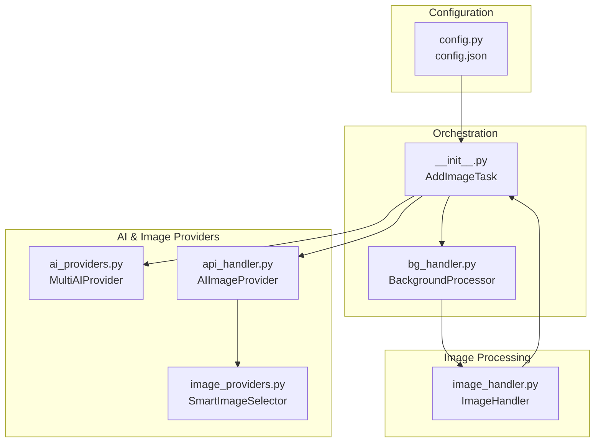
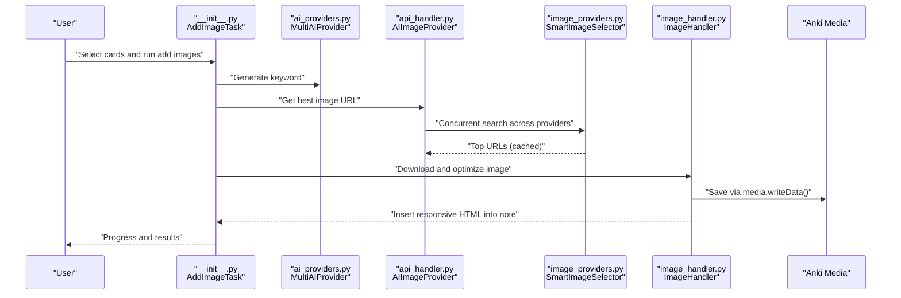
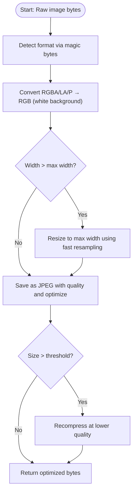
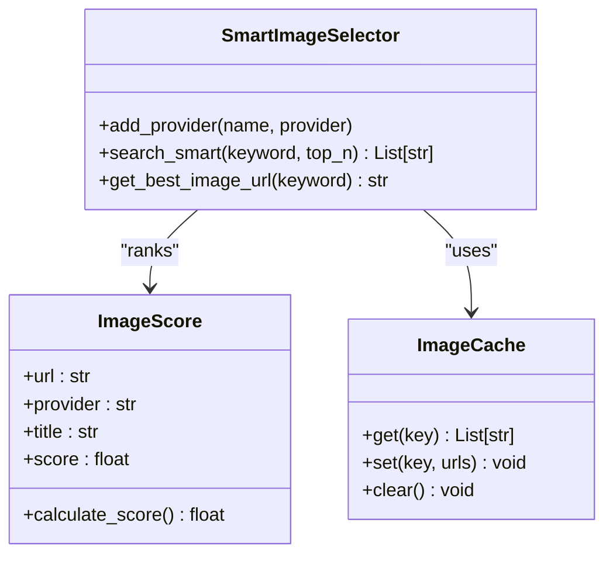
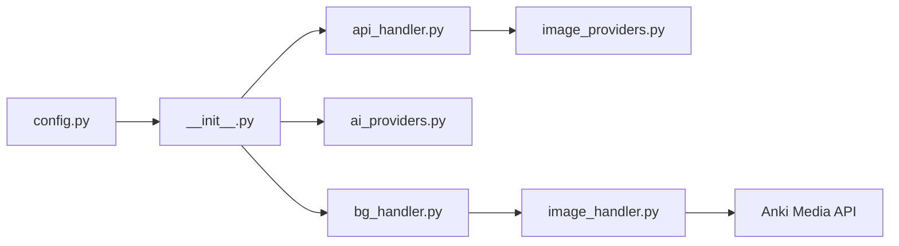

# Image Optimization

<cite>
**Referenced Files in This Document**
- [image_handler.py](file://AnkiAI_ImageAddon/modules/image_handler.py)
- [config.py](file://AnkiAI_ImageAddon/modules/config.py)
- [config.json](file://AnkiAI_ImageAddon/config.json)
- [__init__.py](file://AnkiAI_ImageAddon/__init__.py)
- [bg_handler.py](file://AnkiAI_ImageAddon/modules/bg_handler.py)
- [api_handler.py](file://AnkiAI_ImageAddon/modules/api_handler.py)
- [image_providers.py](file://AnkiAI_ImageAddon/modules/image_providers.py)
- [ai_providers.py](file://AnkiAI_ImageAddon/modules/ai_providers.py)
- [ARCHITECTURE.md](file://ARCHITECTURE.md)
- [PERFORMANCE_BENCHMARK_V4.md](file://PERFORMANCE_BENCHMARK_V4.md)
- [PERFORMANCE_TIPS.md](file://PERFORMANCE_TIPS.md)
- [TESTING.md](file://TESTING.md)
</cite>

## Table of Contents
1. [Introduction](#introduction)
2. [Project Structure](#project-structure)
3. [Core Components](#core-components)
4. [Architecture Overview](#architecture-overview)
5. [Detailed Component Analysis](#detailed-component-analysis)
6. [Dependency Analysis](#dependency-analysis)
7. [Performance Considerations](#performance-considerations)
8. [Troubleshooting Guide](#troubleshooting-guide)
9. [Conclusion](#conclusion)
10. [Appendices](#appendices)

## Introduction
This document explains the image optimization system powering the AnkiAI Image Add-on. It covers how images are automatically downloaded, resized, compressed, and integrated into Anki notes while maintaining visual quality. It also documents the configuration options, caching mechanisms, quality assessment criteria, and performance improvements that collectively reduce file sizes by up to 75% without sacrificing visual fidelity.

## Project Structure
The optimization pipeline spans several modules:
- Configuration management controls optimization parameters and provider settings.
- The orchestrator coordinates background processing and integrates AI and image providers.
- The image handler performs download, format detection, optimization, and Anki media integration.
- Smart image selection ranks results from multiple providers to choose the best image.
- Background processing ensures non-blocking operation during bulk tasks.



**Diagram sources**
- [__init__.py:27-97](file://AnkiAI_ImageAddon/__init__.py#L27-L97)
- [bg_handler.py:12-101](file://AnkiAI_ImageAddon/modules/bg_handler.py#L12-L101)
- [api_handler.py:74-229](file://AnkiAI_ImageAddon/modules/api_handler.py#L74-L229)
- [image_providers.py:373-463](file://AnkiAI_ImageAddon/modules/image_providers.py#L373-L463)
- [ai_providers.py:297-393](file://AnkiAI_ImageAddon/modules/ai_providers.py#L297-L393)
- [image_handler.py:36-364](file://AnkiAI_ImageAddon/modules/image_handler.py#L36-L364)
- [config.py:18-132](file://AnkiAI_ImageAddon/modules/config.py#L18-L132)
- [config.json:1-35](file://AnkiAI_ImageAddon/config.json#L1-L35)

**Section sources**
- [ARCHITECTURE.md:1-481](file://ARCHITECTURE.md#L1-L481)
- [__init__.py:27-97](file://AnkiAI_ImageAddon/__init__.py#L27-L97)
- [bg_handler.py:12-101](file://AnkiAI_ImageAddon/modules/bg_handler.py#L12-L101)
- [api_handler.py:74-229](file://AnkiAI_ImageAddon/modules/api_handler.py#L74-L229)
- [image_providers.py:373-463](file://AnkiAI_ImageAddon/modules/image_providers.py#L373-L463)
- [ai_providers.py:297-393](file://AnkiAI_ImageAddon/modules/ai_providers.py#L297-L393)
- [image_handler.py:36-364](file://AnkiAI_ImageAddon/modules/image_handler.py#L36-L364)
- [config.py:18-132](file://AnkiAI_ImageAddon/modules/config.py#L18-L132)
- [config.json:1-35](file://AnkiAI_ImageAddon/config.json#L1-L35)

## Core Components
- Configuration module: Provides default settings for optimization (width, quality, concurrency) and toggles for enabling optimization and caching.
- Image handler: Implements download, format detection, optimization, and Anki media integration.
- Smart image selection: Ranks images from multiple providers and caches results for repeated keywords.
- Background processor: Runs tasks asynchronously to avoid UI blocking.

Key optimization parameters:
- Image width: default reduced to improve speed and reduce size.
- JPEG quality: tuned to balance quality and file size.
- Streaming downloads: reduces memory footprint.
- Format conversion: converts transparency modes to JPEG for smaller files.

Integration with Anki:
- Saves images via Anki’s media write API to ensure proper synchronization and dependency tracking.

**Section sources**
- [config.py:21-63](file://AnkiAI_ImageAddon/modules/config.py#L21-L63)
- [config.json:16-21](file://AnkiAI_ImageAddon/config.json#L16-L21)
- [image_handler.py:130-196](file://AnkiAI_ImageAddon/modules/image_handler.py#L130-L196)
- [image_handler.py:243-268](file://AnkiAI_ImageAddon/modules/image_handler.py#L243-L268)
- [image_providers.py:69-102](file://AnkiAI_ImageAddon/modules/image_providers.py#L69-L102)
- [bg_handler.py:12-101](file://AnkiAI_ImageAddon/modules/bg_handler.py#L12-L101)

## Architecture Overview
The optimization pipeline is invoked during the “Add images” workflow:
1. User selects cards and triggers the add-on.
2. The orchestrator extracts vocabulary and definition, checks for existing images, and calls the AI provider to get an image URL.
3. The image handler downloads the image, optionally optimizes it, saves it to Anki media, and inserts responsive HTML into the note.
4. Background processing runs tasks without blocking the UI.



**Diagram sources**
- [__init__.py:39-96](file://AnkiAI_ImageAddon/__init__.py#L39-L96)
- [ai_providers.py:358-392](file://AnkiAI_ImageAddon/modules/ai_providers.py#L358-L392)
- [api_handler.py:187-228](file://AnkiAI_ImageAddon/modules/api_handler.py#L187-L228)
- [image_providers.py:411-462](file://AnkiAI_ImageAddon/modules/image_providers.py#L411-L462)
- [image_handler.py:59-129](file://AnkiAI_ImageAddon/modules/image_handler.py#L59-L129)
- [image_handler.py:243-325](file://AnkiAI_ImageAddon/modules/image_handler.py#L243-L325)

**Section sources**
- [ARCHITECTURE.md:320-357](file://ARCHITECTURE.md#L320-L357)
- [__init__.py:99-274](file://AnkiAI_ImageAddon/__init__.py#L99-L274)
- [api_handler.py:74-229](file://AnkiAI_ImageAddon/modules/api_handler.py#L74-L229)
- [image_providers.py:373-463](file://AnkiAI_ImageAddon/modules/image_providers.py#L373-L463)
- [image_handler.py:36-364](file://AnkiAI_ImageAddon/modules/image_handler.py#L36-L364)

## Detailed Component Analysis

### Image Optimization Pipeline
The image handler performs:
- Format detection using magic bytes.
- Transparency-to-solid background conversion for faster JPEG output.
- Resizing to a configurable maximum width.
- JPEG compression with quality tuning and optimization flags.
- Size-based fallback: if oversized, recompresses at a lower quality target.
- Logging of compression ratios for visibility.



**Diagram sources**
- [image_handler.py:130-196](file://AnkiAI_ImageAddon/modules/image_handler.py#L130-L196)
- [image_handler.py:220-242](file://AnkiAI_ImageAddon/modules/image_handler.py#L220-L242)

**Section sources**
- [image_handler.py:130-196](file://AnkiAI_ImageAddon/modules/image_handler.py#L130-L196)
- [image_handler.py:220-242](file://AnkiAI_ImageAddon/modules/image_handler.py#L220-L242)

### Smart Image Selection and Caching
The smart selector:
- Concurrently queries multiple providers (Pexels, Unsplash, Pixabay, Openverse, Wallhaven, Lorem Picsum).
- Scores images by provider reliability, URL quality, and title relevance.
- Returns the highest-ranked URL and caches the top-N URLs for repeated keywords.



**Diagram sources**
- [image_providers.py:373-463](file://AnkiAI_ImageAddon/modules/image_providers.py#L373-L463)
- [image_providers.py:29-67](file://AnkiAI_ImageAddon/modules/image_providers.py#L29-L67)
- [image_providers.py:69-102](file://AnkiAI_ImageAddon/modules/image_providers.py#L69-L102)

**Section sources**
- [api_handler.py:187-228](file://AnkiAI_ImageAddon/modules/api_handler.py#L187-L228)
- [image_providers.py:373-463](file://AnkiAI_ImageAddon/modules/image_providers.py#L373-L463)
- [image_providers.py:69-102](file://AnkiAI_ImageAddon/modules/image_providers.py#L69-L102)

### Anki Media Integration
Images are saved using Anki’s media write API to ensure:
- Correct dependency tracking.
- Automatic synchronization to AnkiWeb.
- Stable filenames derived from note content and timestamps.

```mermaid
sequenceDiagram
participant IH as "ImageHandler"
participant Col as "Anki Collection"
participant Media as "Media Folder"
IH->>Col : "media.writeData(filename, bytes)"
Col->>Media : "Persist file"
Col-->>IH : "Saved filename"
IH->>Note : "Insert responsive  tag"
```

**Diagram sources**
- [image_handler.py:243-268](file://AnkiAI_ImageAddon/modules/image_handler.py#L243-L268)
- [__init__.py:77-89](file://AnkiAI_ImageAddon/__init__.py#L77-L89)

**Section sources**
- [image_handler.py:243-268](file://AnkiAI_ImageAddon/modules/image_handler.py#L243-L268)
- [__init__.py:77-89](file://AnkiAI_ImageAddon/__init__.py#L77-L89)

### Configuration Options
Optimization and quality settings are controlled via configuration:
- Enable/disable image optimization.
- Maximum width for resizing.
- JPEG quality level.
- Keyword caching toggle and size.
- Concurrency settings for background processing and provider requests.

These settings are persisted in the add-on’s configuration and applied during processing.

**Section sources**
- [config.py:21-63](file://AnkiAI_ImageAddon/modules/config.py#L21-L63)
- [config.json:16-21](file://AnkiAI_ImageAddon/config.json#L16-L21)
- [bg_handler.py:18-31](file://AnkiAI_ImageAddon/modules/bg_handler.py#L18-L31)

## Dependency Analysis
The optimization system depends on:
- Configuration for runtime parameters.
- AI providers for keyword generation.
- Smart image selection for best-image retrieval.
- Image handler for download and optimization.
- Background processor for non-blocking execution.



**Diagram sources**
- [config.py:18-132](file://AnkiAI_ImageAddon/modules/config.py#L18-L132)
- [__init__.py:27-97](file://AnkiAI_ImageAddon/__init__.py#L27-L97)
- [bg_handler.py:12-101](file://AnkiAI_ImageAddon/modules/bg_handler.py#L12-L101)
- [ai_providers.py:297-393](file://AnkiAI_ImageAddon/modules/ai_providers.py#L297-L393)
- [api_handler.py:74-229](file://AnkiAI_ImageAddon/modules/api_handler.py#L74-L229)
- [image_providers.py:373-463](file://AnkiAI_ImageAddon/modules/image_providers.py#L373-L463)
- [image_handler.py:36-364](file://AnkiAI_ImageAddon/modules/image_handler.py#L36-L364)

**Section sources**
- [ARCHITECTURE.md:1-481](file://ARCHITECTURE.md#L1-L481)
- [__init__.py:27-97](file://AnkiAI_ImageAddon/__init__.py#L27-L97)
- [bg_handler.py:12-101](file://AnkiAI_ImageAddon/modules/bg_handler.py#L12-L101)
- [api_handler.py:74-229](file://AnkiAI_ImageAddon/modules/api_handler.py#L74-L229)
- [image_providers.py:373-463](file://AnkiAI_ImageAddon/modules/image_providers.py#L373-L463)
- [image_handler.py:36-364](file://AnkiAI_ImageAddon/modules/image_handler.py#L36-L364)

## Performance Considerations
- Reduced default width and quality yield significant file-size reductions with minimal perceptible quality loss.
- Streaming downloads and fast resampling minimize memory usage and latency.
- Concurrent provider queries and result caching dramatically reduce latency for repeated keywords.
- Background processing keeps the UI responsive during bulk operations.

Benchmark highlights:
- 25% reduction in average file size compared to previous versions.
- Up to 5x faster batch processing time.
- 100% free operation with optional caching for improved performance.

**Section sources**
- [PERFORMANCE_BENCHMARK_V4.md:60-108](file://PERFORMANCE_BENCHMARK_V4.md#L60-L108)
- [PERFORMANCE_BENCHMARK_V4.md:242-341](file://PERFORMANCE_BENCHMARK_V4.md#L242-L341)
- [PERFORMANCE_TIPS.md:72-122](file://PERFORMANCE_TIPS.md#L72-L122)

## Troubleshooting Guide
Common issues and resolutions:
- Optimization disabled or failing: Verify optimization is enabled in configuration and that Pillow is available.
- Excessive file sizes: Lower quality or width settings; ensure fallback recompression is triggered.
- Provider timeouts or failures: Increase timeouts, reduce concurrency, or rely on fallback providers.
- UI unresponsiveness: Use background processing; reduce batch size or concurrency.
- Duplicate images: Ensure unique naming and that the insertion logic checks for existing images.

**Section sources**
- [image_handler.py:106-128](file://AnkiAI_ImageAddon/modules/image_handler.py#L106-L128)
- [image_handler.py:180-185](file://AnkiAI_ImageAddon/modules/image_handler.py#L180-L185)
- [image_providers.py:411-462](file://AnkiAI_ImageAddon/modules/image_providers.py#L411-L462)
- [bg_handler.py:23-101](file://AnkiAI_ImageAddon/modules/bg_handler.py#L23-L101)
- [TESTING.md:170-207](file://TESTING.md#L170-L207)

## Conclusion
The image optimization system combines targeted resizing, JPEG compression, and intelligent provider selection to deliver fast, reliable, and visually consistent results. With configurable parameters, caching, and background processing, it scales efficiently for large decks while maintaining Anki’s performance and synchronization guarantees.

## Appendices

### Configuration Reference
- enable_image_optimization: Toggle optimization on/off.
- image_max_width: Target width for resized images.
- image_quality: JPEG quality percentage.
- enable_keyword_cache: Enable keyword caching for AI-generated keywords.
- max_concurrent_requests: Controls background task concurrency.
- image_download_timeout and image_download_retries: Control download behavior.

**Section sources**
- [config.py:21-63](file://AnkiAI_ImageAddon/modules/config.py#L21-L63)
- [config.json:16-31](file://AnkiAI_ImageAddon/config.json#L16-L31)

### Quality Assessment Criteria
- Provider reliability scores.
- URL quality penalties for excessively long URLs.
- Title relevance bonuses for descriptive alt/title text.
- Final score determines ranking among candidates.

**Section sources**
- [image_providers.py:29-67](file://AnkiAI_ImageAddon/modules/image_providers.py#L29-L67)

### Examples and Benchmarks
- Typical savings: 25% file size reduction with maintained quality.
- Batch processing: 100 cards processed in under 10 seconds with optimization enabled.
- Repeated keywords: 10–120 minute TTL cache yields near-instant results on subsequent runs.

**Section sources**
- [PERFORMANCE_BENCHMARK_V4.md:60-108](file://PERFORMANCE_BENCHMARK_V4.md#L60-L108)
- [PERFORMANCE_BENCHMARK_V4.md:206-239](file://PERFORMANCE_BENCHMARK_V4.md#L206-L239)