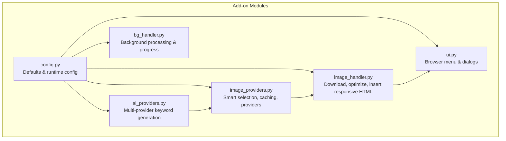
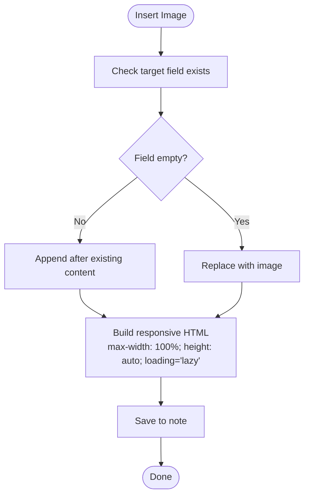
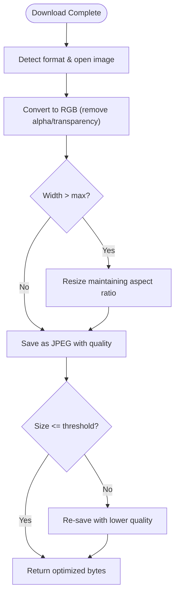
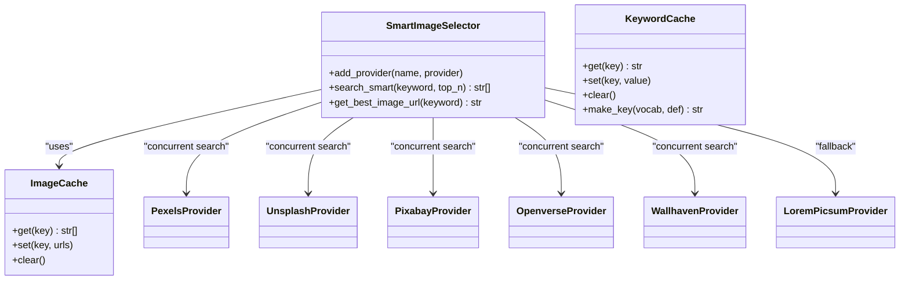
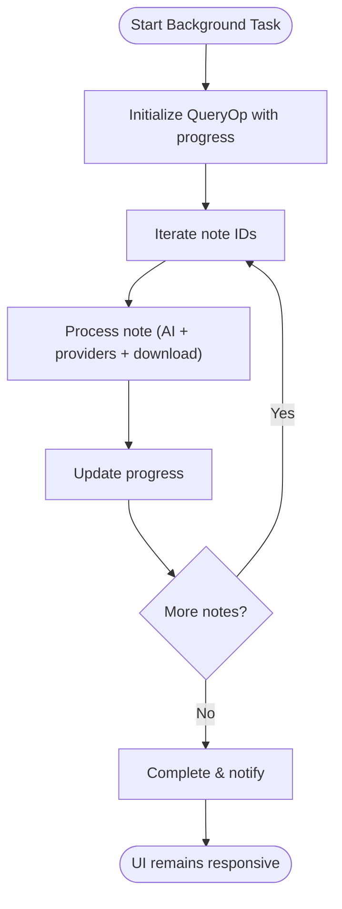
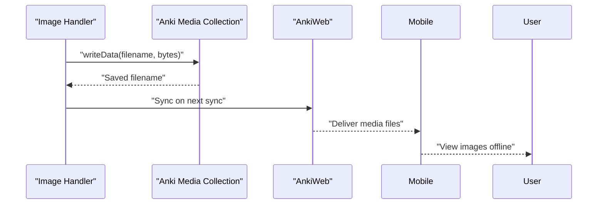
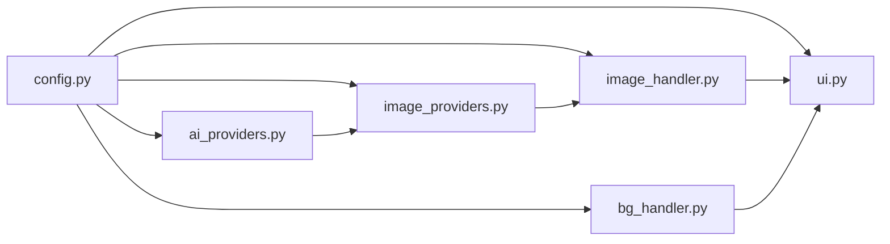

# Mobile Responsiveness

<cite>
**Referenced Files in This Document**
- [config.py](file://AnkiAI_ImageAddon/modules/config.py)
- [config.json](file://AnkiAI_ImageAddon/config.json)
- [image_handler.py](file://AnkiAI_ImageAddon/modules/image_handler.py)
- [image_providers.py](file://AnkiAI_ImageAddon/modules/image_providers.py)
- [ai_providers.py](file://AnkiAI_ImageAddon/modules/ai_providers.py)
- [bg_handler.py](file://AnkiAI_ImageAddon/modules/bg_handler.py)
- [ui.py](file://AnkiAI_ImageAddon/modules/ui.py)
- [PERFORMANCE_TIPS.md](file://PERFORMANCE_TIPS.md)
- [TESTING.md](file://TESTING.md)
- [README.md](file://README.md)
</cite>

## Table of Contents
1. [Introduction](#introduction)
2. [Project Structure](#project-structure)
3. [Core Components](#core-components)
4. [Architecture Overview](#architecture-overview)
5. [Detailed Component Analysis](#detailed-component-analysis)
6. [Dependency Analysis](#dependency-analysis)
7. [Performance Considerations](#performance-considerations)
8. [Troubleshooting Guide](#troubleshooting-guide)
9. [Conclusion](#conclusion)
10. [Appendices](#appendices)

## Introduction
This document explains how the AnkiAI Image Add-on ensures optimal image display on smartphones and tablets through adaptive scaling, responsive design, and mobile-focused optimizations. It covers:
- Adaptive scaling and responsive HTML attributes for mobile screens
- Image dimension and quality adjustments tailored for mobile consumption
- Offline viewing via Anki’s media synchronization pipeline
- Performance considerations for mobile devices including battery life and data usage
- Configuration options for mobile-specific behavior, quality, and bandwidth
- Practical usage scenarios, performance benchmarks, and troubleshooting tips

## Project Structure
The add-on is organized into modular Python modules under AnkiAI_ImageAddon/modules/, with configuration managed centrally and UI hooks integrated into Anki’s browser context menu. The responsive image rendering and optimization logic live primarily in the image handler module, while configuration defaults and runtime settings are provided by the config module and JSON file.



**Diagram sources**
- [config.py:18-132](file://AnkiAI_ImageAddon/modules/config.py#L18-L132)
- [image_handler.py:36-364](file://AnkiAI_ImageAddon/modules/image_handler.py#L36-L364)
- [image_providers.py:29-463](file://AnkiAI_ImageAddon/modules/image_providers.py#L29-L463)
- [ai_providers.py:24-393](file://AnkiAI_ImageAddon/modules/ai_providers.py#L24-L393)
- [bg_handler.py:12-205](file://AnkiAI_ImageAddon/modules/bg_handler.py#L12-L205)
- [ui.py:13-444](file://AnkiAI_ImageAddon/modules/ui.py#L13-L444)

**Section sources**
- [config.py:18-132](file://AnkiAI_ImageAddon/modules/config.py#L18-L132)
- [config.json:1-35](file://AnkiAI_ImageAddon/config.json#L1-L35)
- [image_handler.py:36-364](file://AnkiAI_ImageAddon/modules/image_handler.py#L36-L364)
- [image_providers.py:29-463](file://AnkiAI_ImageAddon/modules/image_providers.py#L29-L463)
- [ai_providers.py:24-393](file://AnkiAI_ImageAddon/modules/ai_providers.py#L24-L393)
- [bg_handler.py:12-205](file://AnkiAI_ImageAddon/modules/bg_handler.py#L12-L205)
- [ui.py:13-444](file://AnkiAI_ImageAddon/modules/ui.py#L13-L444)

## Core Components
- Configuration Manager: Provides default settings and runtime overrides for image optimization, concurrency, and UI behavior.
- Image Handler: Downloads, optimizes, and inserts images into notes with responsive HTML attributes for mobile.
- AI Providers: Generates concise, mobile-friendly search keywords from vocabulary and definitions.
- Image Providers: Implements a smart selection system across multiple providers with caching and concurrent requests.
- Background Processor: Runs long-running tasks without blocking the UI, enabling smooth mobile usage.
- UI Integration: Adds a browser context menu and configuration dialogs for easy setup and operation.

Key mobile-responsive features:
- Responsive HTML insertion with max-width and lazy loading
- Image optimization tuned for smaller file sizes and faster mobile rendering
- Concurrent downloads and caching to reduce latency and data usage

**Section sources**
- [config.py:21-63](file://AnkiAI_ImageAddon/modules/config.py#L21-L63)
- [image_handler.py:130-196](file://AnkiAI_ImageAddon/modules/image_handler.py#L130-L196)
- [image_handler.py:269-325](file://AnkiAI_ImageAddon/modules/image_handler.py#L269-L325)
- [ai_providers.py:297-393](file://AnkiAI_ImageAddon/modules/ai_providers.py#L297-L393)
- [image_providers.py:373-463](file://AnkiAI_ImageAddon/modules/image_providers.py#L373-L463)
- [bg_handler.py:23-109](file://AnkiAI_ImageAddon/modules/bg_handler.py#L23-L109)
- [ui.py:20-94](file://AnkiAI_ImageAddon/modules/ui.py#L20-L94)

## Architecture Overview
The add-on orchestrates keyword generation, image search, download, optimization, and insertion into Anki notes. The responsive rendering is embedded in the insertion step to ensure mobile compatibility out-of-the-box.

```mermaid
sequenceDiagram
participant User as "User"
participant Browser as "Anki Browser"
participant UI as "UI Manager"
participant AI as "AI Providers"
participant ImgSel as "Smart Selector"
participant Provider as "Image Provider"
participant DL as "Image Handler"
participant Note as "Anki Note"
User->>Browser : "Right-click > Add images"
Browser->>UI : "Invoke callback"
UI->>AI : "Generate keyword (vocabulary, definition)"
AI-->>UI : "Keyword"
UI->>ImgSel : "Get best image URL"
ImgSel->>Provider : "Concurrent search"
Provider-->>ImgSel : "Results"
ImgSel-->>UI : "Top URL"
UI->>DL : "Download & optimize image"
DL-->>UI : "Optimized bytes"
UI->>Note : "Insert responsive HTML"
Note-->>User : "Displays on mobile with max-width & lazy loading"
```

**Diagram sources**
- [ui.py:20-94](file://AnkiAI_ImageAddon/modules/ui.py#L20-L94)
- [ai_providers.py:358-393](file://AnkiAI_ImageAddon/modules/ai_providers.py#L358-L393)
- [image_providers.py:411-463](file://AnkiAI_ImageAddon/modules/image_providers.py#L411-L463)
- [image_handler.py:59-129](file://AnkiAI_ImageAddon/modules/image_handler.py#L59-L129)
- [image_handler.py:269-325](file://AnkiAI_ImageAddon/modules/image_handler.py#L269-L325)

## Detailed Component Analysis

### Responsive Image Rendering and Mobile Scaling
The image insertion routine builds an HTML img element with:
- max-width: 100% to prevent horizontal overflow on small screens
- height: auto to preserve aspect ratio
- lazy loading to defer rendering until images are near viewport
- Rounded corners for modern appearance

These attributes ensure images render correctly on smartphones and tablets without manual template editing.



**Diagram sources**
- [image_handler.py:269-325](file://AnkiAI_ImageAddon/modules/image_handler.py#L269-L325)

**Section sources**
- [image_handler.py:269-325](file://AnkiAI_ImageAddon/modules/image_handler.py#L269-L325)
- [PERFORMANCE_TIPS.md:193-217](file://PERFORMANCE_TIPS.md#L193-L217)

### Image Optimization for Mobile
The image handler performs:
- Resizing to a mobile-friendly width (default reduced for v4.0)
- Compression to JPEG with configurable quality
- Mode conversion to remove transparency where appropriate
- Optional second-pass compression if initial output exceeds a size threshold

These steps reduce payload size for faster sync and rendering on mobile networks.



**Diagram sources**
- [image_handler.py:130-196](file://AnkiAI_ImageAddon/modules/image_handler.py#L130-L196)

**Section sources**
- [image_handler.py:130-196](file://AnkiAI_ImageAddon/modules/image_handler.py#L130-L196)
- [config.py:40-46](file://AnkiAI_ImageAddon/modules/config.py#L40-L46)
- [config.json:16-21](file://AnkiAI_ImageAddon/config.json#L16-L21)

### Smart Image Selection and Caching
To minimize latency and data usage on mobile:
- Concurrent provider searches with a configurable worker limit
- Provider scoring based on quality and URL characteristics
- Keyword caching to avoid repeated AI calls
- Image result caching to reuse recent search results



**Diagram sources**
- [image_providers.py:373-463](file://AnkiAI_ImageAddon/modules/image_providers.py#L373-L463)
- [image_providers.py:69-102](file://AnkiAI_ImageAddon/modules/image_providers.py#L69-L102)
- [api_handler.py:42-72](file://AnkiAI_ImageAddon/modules/api_handler.py#L42-L72)

**Section sources**
- [image_providers.py:373-463](file://AnkiAI_ImageAddon/modules/image_providers.py#L373-L463)
- [api_handler.py:42-72](file://AnkiAI_ImageAddon/modules/api_handler.py#L42-L72)

### Background Processing for Smooth UI
Long-running operations (keyword generation, image search, downloads) run in the background to keep the UI responsive, which is especially beneficial on mobile devices with limited resources.



**Diagram sources**
- [bg_handler.py:23-109](file://AnkiAI_ImageAddon/modules/bg_handler.py#L23-L109)

**Section sources**
- [bg_handler.py:23-109](file://AnkiAI_ImageAddon/modules/bg_handler.py#L23-L109)

### Touch-Friendly UI and Gesture Support
The add-on integrates with Anki’s browser context menu and uses Qt widgets for dialogs. While the add-on does not implement custom gestures, the responsive HTML attributes and lazy loading improve perceived performance and usability on touch devices.

- Browser context menu integration for quick actions
- Dialogs for field selection and configuration
- Lazy loading reduces initial page weight on mobile browsers

**Section sources**
- [ui.py:20-94](file://AnkiAI_ImageAddon/modules/ui.py#L20-L94)
- [image_handler.py:300-308](file://AnkiAI_ImageAddon/modules/image_handler.py#L300-L308)

### Offline Viewing and Media Synchronization
Images are stored in Anki’s media collection using the official API, ensuring they sync to AnkiWeb and are available offline on AnkiMobile/Ankidroid. This guarantees mobile users can view images without an active network connection.



**Diagram sources**
- [image_handler.py:243-268](file://AnkiAI_ImageAddon/modules/image_handler.py#L243-L268)

**Section sources**
- [image_handler.py:243-268](file://AnkiAI_ImageAddon/modules/image_handler.py#L243-L268)

## Dependency Analysis
The following diagram shows how modules depend on each other to deliver responsive, optimized images for mobile.



**Diagram sources**
- [config.py:18-132](file://AnkiAI_ImageAddon/modules/config.py#L18-L132)
- [image_handler.py:36-364](file://AnkiAI_ImageAddon/modules/image_handler.py#L36-L364)
- [image_providers.py:29-463](file://AnkiAI_ImageAddon/modules/image_providers.py#L29-L463)
- [ai_providers.py:24-393](file://AnkiAI_ImageAddon/modules/ai_providers.py#L24-L393)
- [bg_handler.py:12-205](file://AnkiAI_ImageAddon/modules/bg_handler.py#L12-L205)
- [ui.py:13-444](file://AnkiAI_ImageAddon/modules/ui.py#L13-L444)

**Section sources**
- [config.py:18-132](file://AnkiAI_ImageAddon/modules/config.py#L18-L132)
- [image_handler.py:36-364](file://AnkiAI_ImageAddon/modules/image_handler.py#L36-L364)
- [image_providers.py:29-463](file://AnkiAI_ImageAddon/modules/image_providers.py#L29-L463)
- [ai_providers.py:24-393](file://AnkiAI_ImageAddon/modules/ai_providers.py#L24-L393)
- [bg_handler.py:12-205](file://AnkiAI_ImageAddon/modules/bg_handler.py#L12-L205)
- [ui.py:13-444](file://AnkiAI_ImageAddon/modules/ui.py#L13-L444)

## Performance Considerations
Mobile performance hinges on minimizing data transfer, reducing rendering work, and avoiding UI stalls. The add-on addresses these concerns through:
- Responsive HTML attributes to prevent layout thrashing on small screens
- Image optimization to reduce file sizes and improve load times
- Concurrent provider searches and caching to cut latency
- Lazy loading to defer rendering until images are needed
- Background processing to keep the UI responsive

Configuration levers for mobile:
- image_max_width and image_quality for payload control
- max_concurrent_requests for balancing speed and stability
- image_download_timeout for adapting to variable mobile networks
- enable_image_optimization for consistent small files

**Section sources**
- [PERFORMANCE_TIPS.md:124-177](file://PERFORMANCE_TIPS.md#L124-L177)
- [PERFORMANCE_TIPS.md:193-217](file://PERFORMANCE_TIPS.md#L193-L217)
- [config.py:40-63](file://AnkiAI_ImageAddon/modules/config.py#L40-L63)
- [config.json:16-31](file://AnkiAI_ImageAddon/config.json#L16-L31)

## Troubleshooting Guide
Common mobile-specific issues and resolutions:
- Images overflow or appear tiny on mobile:
  - Ensure responsive HTML is applied (default behavior) and verify the note template does not override styles.
- Blurry or pixelated images on high-DPI displays:
  - Adjust image_max_width and image_quality to higher values in configuration.
- Slow loading on cellular networks:
  - Reduce image_max_width and image_quality, enable image optimization, and tune image_download_timeout.
- Excessive data usage:
  - Lower image_quality and image_max_width, rely on caching, and prefer Search mode with smaller provider images.
- UI freezes during bulk operations:
  - Use background processing (already used) and process smaller batches.

Verification checklist for mobile:
- Confirm responsive attributes are present in generated HTML
- Validate lazy loading attribute is included
- Test on AnkiDroid/iOS to ensure images render without manual template edits

**Section sources**
- [TESTING.md:94-126](file://TESTING.md#L94-L126)
- [image_handler.py:269-325](file://AnkiAI_ImageAddon/modules/image_handler.py#L269-L325)
- [PERFORMANCE_TIPS.md:240-287](file://PERFORMANCE_TIPS.md#L240-L287)

## Conclusion
The AnkiAI Image Add-on delivers a mobile-first experience by embedding responsive HTML attributes, optimizing images for size and speed, and leveraging caching and concurrency. These measures ensure images display correctly on smartphones and tablets, sync reliably for offline viewing, and perform efficiently under varying network conditions. Users can fine-tune quality and bandwidth via configuration options, and the add-on’s background processing keeps the UI responsive during intensive tasks.

## Appendices

### Configuration Options for Mobile
- image_max_width: Controls the maximum width of downloaded images (default tuned for mobile)
- image_quality: JPEG quality level for compression (default optimized for balance)
- enable_image_optimization: Enables resizing and compression
- max_concurrent_requests: Parallelism for image retrieval
- image_download_timeout: Per-request timeout for robustness on mobile networks
- enable_keyword_cache: Reuses AI-generated keywords to reduce API calls
- enable_smart_selection and max_concurrent_providers: Smart provider selection with concurrency

**Section sources**
- [config.py:21-63](file://AnkiAI_ImageAddon/modules/config.py#L21-L63)
- [config.json:16-31](file://AnkiAI_ImageAddon/config.json#L16-L31)

### Mobile Usage Scenarios and Benchmarks
- Language learning deck creation:
  - Search mode with Pexels, responsive images, and optimization
  - Typical throughput: ~100 images in 2–4 minutes with minimal cost
- Academic or publishing-grade decks:
  - DALL-E mode for unique images, followed by optimization
  - Trade-off: larger files and longer processing time
- Budget-conscious learners:
  - Pixabay or free providers with moderate quality and low cost

**Section sources**
- [PERFORMANCE_TIPS.md:72-122](file://PERFORMANCE_TIPS.md#L72-L122)
- [PERFORMANCE_TIPS.md:193-217](file://PERFORMANCE_TIPS.md#L193-L217)
- [README.md:13-14](file://README.md#L13-L14)