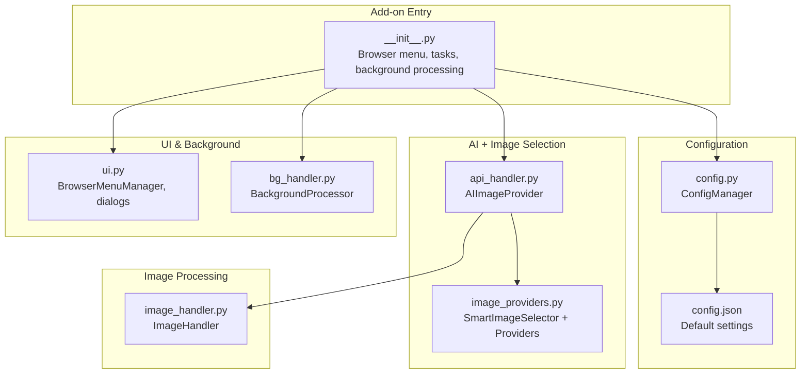
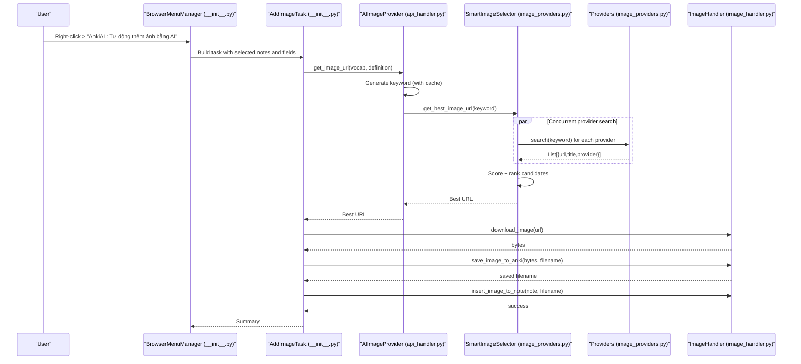
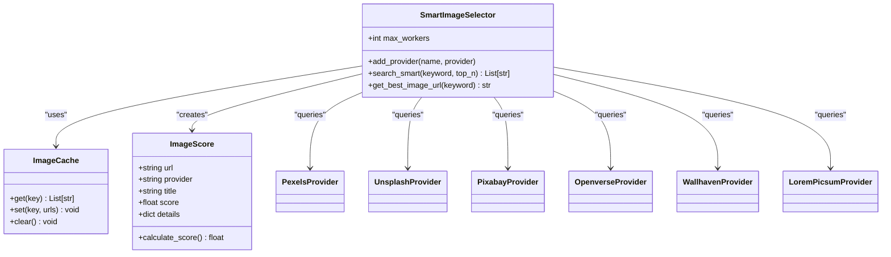
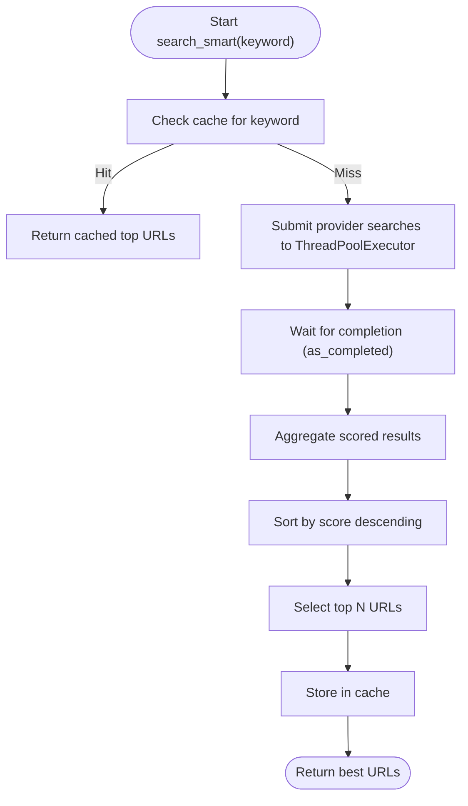
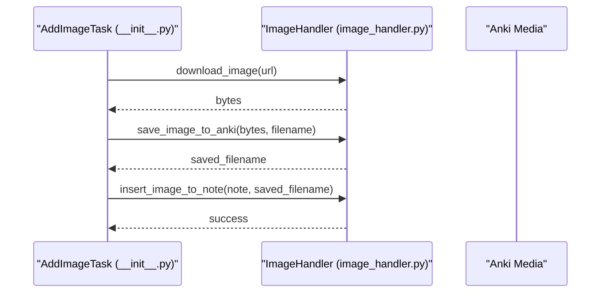
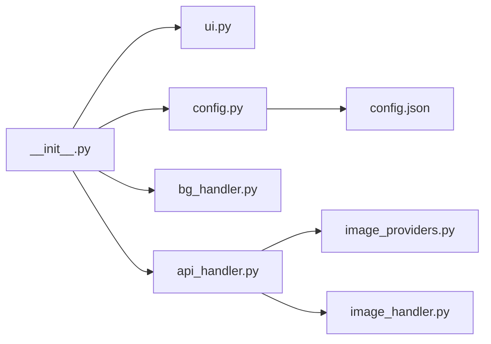

# Smart Image Selection

<cite>
**Referenced Files in This Document**
- [image_providers.py](file://AnkiAI_ImageAddon/modules/image_providers.py)
- [image_handler.py](file://AnkiAI_ImageAddon/modules/image_handler.py)
- [api_handler.py](file://AnkiAI_ImageAddon/modules/api_handler.py)
- [config.py](file://AnkiAI_ImageAddon/modules/config.py)
- [config.json](file://AnkiAI_ImageAddon/config.json)
- [__init__.py](file://AnkiAI_ImageAddon/__init__.py)
- [ui.py](file://AnkiAI_ImageAddon/modules/ui.py)
- [bg_handler.py](file://AnkiAI_ImageAddon/modules/bg_handler.py)
- [manifest.json](file://AnkiAI_ImageAddon/manifest.json)
- [requirements.txt](file://requirements.txt)
</cite>

## Table of Contents
1. [Introduction](#introduction)
2. [Project Structure](#project-structure)
3. [Core Components](#core-components)
4. [Architecture Overview](#architecture-overview)
5. [Detailed Component Analysis](#detailed-component-analysis)
6. [Dependency Analysis](#dependency-analysis)
7. [Performance Considerations](#performance-considerations)
8. [Troubleshooting Guide](#troubleshooting-guide)
9. [Conclusion](#conclusion)
10. [Appendices](#appendices)

## Introduction
This document explains the Smart Image Selection system that powers automatic image retrieval for flashcards. It covers:
- Concurrent search across six image providers (Pexels, Unsplash, Pixabay, Openverse, Wallhaven, Lorem Picsum)
- Intelligent ranking and scoring to pick the best image
- Provider priority and balance between free and paid providers
- Concurrency management, timeouts, and error recovery
- Configuration options for selection behavior and performance
- Example selection workflow, scoring criteria, and troubleshooting

## Project Structure
The Smart Image Selection lives primarily in the modules under AnkiAI_ImageAddon/modules. The main entrypoint integrates UI, configuration, and background processing.

**Diagram sources**
- [__init__.py:310-349](file://AnkiAI_ImageAddon/__init__.py#L310-L349)
- [config.py:18-132](file://AnkiAI_ImageAddon/modules/config.py#L18-L132)
- [config.json:1-35](file://AnkiAI_ImageAddon/config.json#L1-L35)
- [api_handler.py:74-229](file://AnkiAI_ImageAddon/modules/api_handler.py#L74-L229)
- [image_providers.py:373-463](file://AnkiAI_ImageAddon/modules/image_providers.py#L373-L463)
- [image_handler.py:36-364](file://AnkiAI_ImageAddon/modules/image_handler.py#L36-L364)
- [ui.py:13-444](file://AnkiAI_ImageAddon/modules/ui.py#L13-L444)
- [bg_handler.py:12-205](file://AnkiAI_ImageAddon/modules/bg_handler.py#L12-L205)

**Section sources**
- [__init__.py:12-349](file://AnkiAI_ImageAddon/__init__.py#L12-L349)
- [config.py:18-132](file://AnkiAI_ImageAddon/modules/config.py#L18-L132)
- [config.json:1-35](file://AnkiAI_ImageAddon/config.json#L1-L35)

## Core Components
- SmartImageSelector: Orchestrates concurrent provider searches, scores results, and selects the best image URL.
- Provider classes: PexelsProvider, UnsplashProvider, PixabayProvider, OpenverseProvider, WallhavenProvider, LoremPicsumProvider.
- ImageScore: Encapsulates scoring logic for each candidate image.
- ImageCache: Lightweight cache for search results keyed by query.
- ImageHandler: Downloads, optimizes, and inserts images into Anki notes.
- AIImageProvider: Wraps AI keyword generation and SmartImageSelector for end-to-end selection.
- ConfigManager and config.json: Centralized configuration for providers, concurrency, and performance.

**Section sources**
- [image_providers.py:29-463](file://AnkiAI_ImageAddon/modules/image_providers.py#L29-L463)
- [image_handler.py:36-364](file://AnkiAI_ImageAddon/modules/image_handler.py#L36-L364)
- [api_handler.py:74-229](file://AnkiAI_ImageAddon/modules/api_handler.py#L74-L229)
- [config.py:18-132](file://AnkiAI_ImageAddon/modules/config.py#L18-L132)
- [config.json:1-35](file://AnkiAI_ImageAddon/config.json#L1-L35)

## Architecture Overview
End-to-end flow from user action to inserted image:

**Diagram sources**
- [__init__.py:99-274](file://AnkiAI_ImageAddon/__init__.py#L99-L274)
- [api_handler.py:187-228](file://AnkiAI_ImageAddon/modules/api_handler.py#L187-L228)
- [image_providers.py:373-463](file://AnkiAI_ImageAddon/modules/image_providers.py#L373-L463)
- [image_handler.py:36-364](file://AnkiAI_ImageAddon/modules/image_handler.py#L36-L364)

## Detailed Component Analysis

### SmartImageSelector and Provider Ranking
SmartImageSelector coordinates concurrent searches across providers, applies a scoring system, and returns the best image URL.

Key behaviors:
- Concurrent search: Uses a thread pool to query all configured providers in parallel.
- Scoring: ImageScore computes a composite score considering provider base score, URL quality, and title relevance.
- Caching: Results are cached by query to reduce repeated network calls.
- Error handling: Per-provider failures are caught and logged; the selector continues with others.

**Diagram sources**
- [image_providers.py:29-463](file://AnkiAI_ImageAddon/modules/image_providers.py#L29-L463)

Scoring criteria:
- Provider base score: Reflects quality and reliability (higher for Pexels/Unsplash, lower for Lorem Picsum).
- URL quality: Penalizes overly long URLs to favor cleaner, shorter image URLs.
- Title relevance: Rewards meaningful titles for better relevance.

Concurrency and timeouts:
- max_workers controls parallelism for provider queries.
- Individual provider calls have short timeouts to keep the overall flow responsive.
- SmartImageSelector caches results to minimize repeated searches.

**Section sources**
- [image_providers.py:29-67](file://AnkiAI_ImageAddon/modules/image_providers.py#L29-L67)
- [image_providers.py:373-463](file://AnkiAI_ImageAddon/modules/image_providers.py#L373-L463)

### Provider Priority and Free vs Paid Balance
Provider priority and availability:
- Paid providers: Pexels, Unsplash, Pixabay require API keys and offer higher-quality results.
- Free providers: Openverse, Wallhaven (optional API key), Lorem Picsum (no API key) provide fallbacks and instant results.
- Priority ordering in SmartImageSelector is determined by provider addition order and base scores.

Configuration impact:
- ConfigManager enables/disables smart selection and sets max_concurrent_providers.
- Only providers with valid keys are added to the selector.

**Section sources**
- [api_handler.py:124-185](file://AnkiAI_ImageAddon/modules/api_handler.py#L124-L185)
- [config.py:28-63](file://AnkiAI_ImageAddon/modules/config.py#L28-L63)
- [config.json:7-14](file://AnkiAI_ImageAddon/config.json#L7-L14)

### Concurrent Request Management, Timeouts, and Error Recovery
- Concurrency: ThreadPoolExecutor runs provider searches concurrently with max_workers.
- Timeouts: Provider-specific timeouts are set to keep the system responsive.
- Error recovery: Exceptions are caught per provider; the selector proceeds with remaining providers and logs failures.

**Diagram sources**
- [image_providers.py:411-455](file://AnkiAI_ImageAddon/modules/image_providers.py#L411-L455)

**Section sources**
- [image_providers.py:411-455](file://AnkiAI_ImageAddon/modules/image_providers.py#L411-L455)

### Image Download and Insertion Pipeline
After selecting a URL, the system downloads, optimizes, saves, and inserts the image into the note.

Highlights:
- Download: Short timeout, reduced retries, streaming to save memory.
- Optimization: Optional resizing and compression; fallback to original on failure.
- Insertion: Generates a unique filename, writes to Anki media, and injects responsive HTML.

**Diagram sources**
- [image_handler.py:59-129](file://AnkiAI_ImageAddon/modules/image_handler.py#L59-L129)
- [image_handler.py:243-325](file://AnkiAI_ImageAddon/modules/image_handler.py#L243-L325)
- [__init__.py:69-96](file://AnkiAI_ImageAddon/__init__.py#L69-L96)

**Section sources**
- [image_handler.py:36-364](file://AnkiAI_ImageAddon/modules/image_handler.py#L36-L364)
- [__init__.py:27-97](file://AnkiAI_ImageAddon/__init__.py#L27-L97)

### Configuration Options
Key settings affecting Smart Selection and performance:
- enable_smart_selection: Toggle smart ranking.
- max_concurrent_providers: Controls parallel provider queries.
- smart_cache_ttl_minutes: Cache TTL for search results.
- image_download_timeout, image_download_retries: Download behavior.
- enable_image_optimization, image_max_width, image_quality: Optimization settings.
- enable_keyword_cache, keyword_cache_size: AI keyword caching.
- max_concurrent_requests, enable_concurrent_downloads: Concurrency for downloads.

These are exposed via ConfigManager and persisted in config.json.

**Section sources**
- [config.py:21-63](file://AnkiAI_ImageAddon/modules/config.py#L21-L63)
- [config.json:12-32](file://AnkiAI_ImageAddon/config.json#L12-L32)

## Dependency Analysis
External and internal dependencies:
- Internal modules depend on each other as shown in the architecture diagram.
- The add-on targets Anki 24.04+ and uses Anki’s Qt framework and operations.

**Diagram sources**
- [__init__.py:12-349](file://AnkiAI_ImageAddon/__init__.py#L12-L349)
- [api_handler.py:24-34](file://AnkiAI_ImageAddon/modules/api_handler.py#L24-L34)
- [image_providers.py:16-21](file://AnkiAI_ImageAddon/modules/image_providers.py#L16-L21)
- [image_handler.py:15-28](file://AnkiAI_ImageAddon/modules/image_handler.py#L15-L28)

**Section sources**
- [manifest.json:1-12](file://AnkiAI_ImageAddon/manifest.json#L1-L12)
- [requirements.txt:10-19](file://requirements.txt#L10-L19)

## Performance Considerations
- Concurrency: Use max_concurrent_providers to balance responsiveness and resource usage.
- Caching: Enable smart_cache_ttl_minutes and keyword_cache to reduce redundant calls.
- Download optimization: Tune image_max_width and image_quality to balance size and quality.
- Provider selection: Prefer paid providers (Pexels/Unsplash/Pixabay) for higher quality; use free providers as fallbacks.
- Timeouts: Provider timeouts are tuned for speed; adjust globally if needed.

[No sources needed since this section provides general guidance]

## Troubleshooting Guide
Common issues and resolutions:
- No images found:
  - Verify at least one provider key is configured.
  - Check provider availability and rate limits.
- Timeout errors:
  - Reduce max_concurrent_providers.
  - Ensure stable internet connection.
- Provider-specific issues:
  - Pexels/Unsplash/Pixabay: Confirm API keys and quotas.
  - Wallhaven: Provide API key if needed; otherwise expect fewer results.
  - Openverse/Lorem Picsum: No API key required; expect broader license coverage.
- UI freezes or lag:
  - Use background processing; avoid extremely large batches.
  - Reduce max_concurrent_requests and image_max_width.

**Section sources**
- [api_handler.py:124-185](file://AnkiAI_ImageAddon/modules/api_handler.py#L124-L185)
- [image_providers.py:104-371](file://AnkiAI_ImageAddon/modules/image_providers.py#L104-L371)
- [image_handler.py:114-128](file://AnkiAI_ImageAddon/modules/image_handler.py#L114-L128)

## Conclusion
The Smart Image Selection system combines concurrent provider queries, intelligent scoring, and robust error handling to deliver high-quality, relevant images efficiently. By balancing paid and free providers, leveraging caching, and offering configurable concurrency and timeouts, it adapts to diverse environments while maintaining performance and reliability.

[No sources needed since this section summarizes without analyzing specific files]

## Appendices

### Selection Workflow Example
- User selects cards and triggers “AnkiAI: Tự động thêm ảnh bằng AI.”
- The system extracts vocabulary and definition, generates a keyword (with caching), and performs concurrent searches across configured providers.
- Each candidate receives a score; the highest-ranked URL is downloaded, optimized, saved to Anki media, and inserted into the note.

**Section sources**
- [__init__.py:99-274](file://AnkiAI_ImageAddon/__init__.py#L99-L274)
- [api_handler.py:187-228](file://AnkiAI_ImageAddon/modules/api_handler.py#L187-L228)
- [image_providers.py:373-463](file://AnkiAI_ImageAddon/modules/image_providers.py#L373-L463)
- [image_handler.py:36-364](file://AnkiAI_ImageAddon/modules/image_handler.py#L36-L364)

### Scoring Criteria Reference
- Provider base score: Higher for Pexels/Unsplash/Pixabay; lower for Openverse/Wallhaven/Lorem Picsum.
- URL quality: Shorter URLs receive a bonus; longer URLs incur penalties.
- Title relevance: Titles improve score; empty titles have no effect.

**Section sources**
- [image_providers.py:29-67](file://AnkiAI_ImageAddon/modules/image_providers.py#L29-L67)