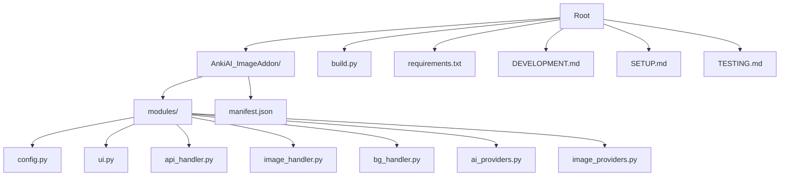
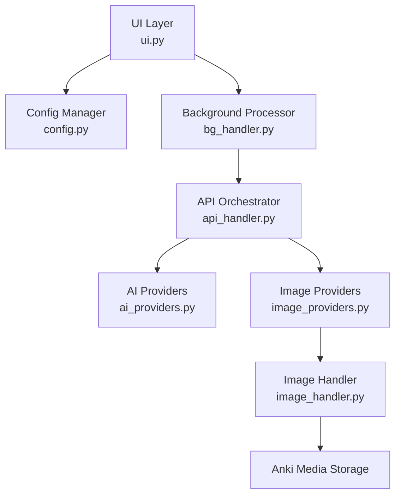
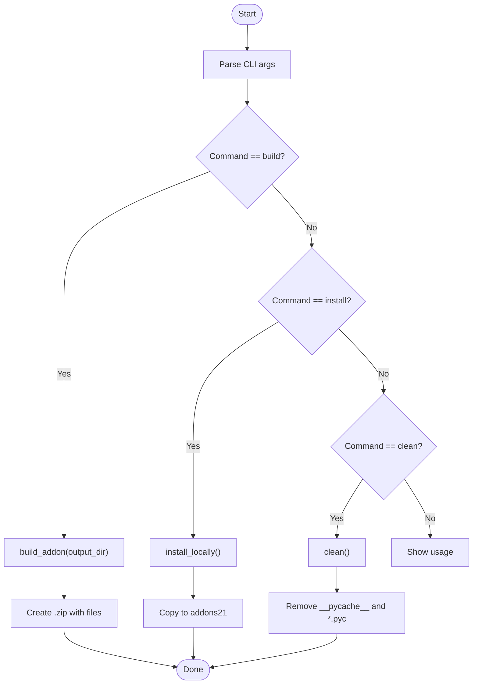
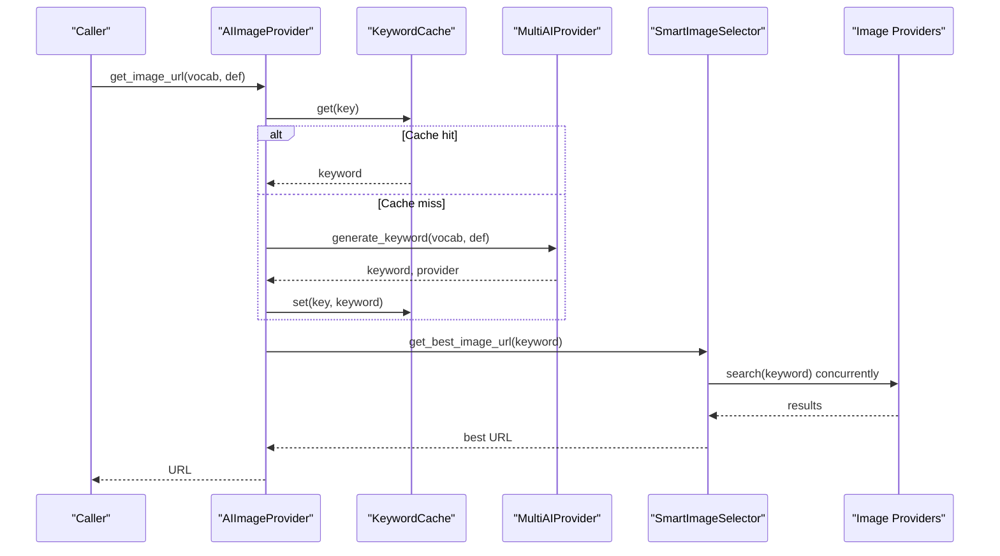
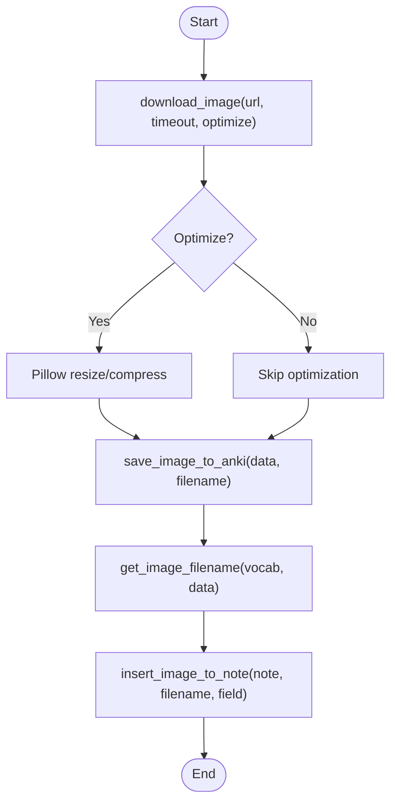
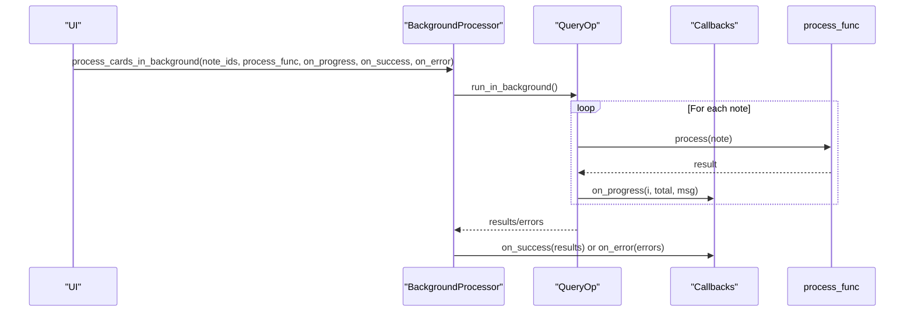
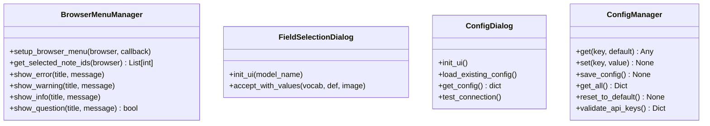
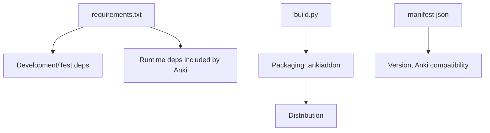

# Development Guide

<cite>
**Referenced Files in This Document**
- [DEVELOPMENT.md](file://DEVELOPMENT.md)
- [SETUP.md](file://SETUP.md)
- [TESTING.md](file://TESTING.md)
- [build.py](file://build.py)
- [requirements.txt](file://requirements.txt)
- [AnkiAI_ImageAddon/manifest.json](file://AnkiAI_ImageAddon/manifest.json)
- [AnkiAI_ImageAddon/modules/__init__.py](file://AnkiAI_ImageAddon/modules/__init__.py)
- [AnkiAI_ImageAddon/modules/config.py](file://AnkiAI_ImageAddon/modules/config.py)
- [AnkiAI_ImageAddon/modules/api_handler.py](file://AnkiAI_ImageAddon/modules/api_handler.py)
- [AnkiAI_ImageAddon/modules/image_handler.py](file://AnkiAI_ImageAddon/modules/image_handler.py)
- [AnkiAI_ImageAddon/modules/ui.py](file://AnkiAI_ImageAddon/modules/ui.py)
- [AnkiAI_ImageAddon/modules/bg_handler.py](file://AnkiAI_ImageAddon/modules/bg_handler.py)
- [AnkiAI_ImageAddon/modules/ai_providers.py](file://AnkiAI_ImageAddon/modules/ai_providers.py)
- [AnkiAI_ImageAddon/modules/image_providers.py](file://AnkiAI_ImageAddon/modules/image_providers.py)
</cite>

## Table of Contents
1. [Introduction](#introduction)
2. [Project Structure](#project-structure)
3. [Core Components](#core-components)
4. [Architecture Overview](#architecture-overview)
5. [Detailed Component Analysis](#detailed-component-analysis)
6. [Dependency Analysis](#dependency-analysis)
7. [Performance Considerations](#performance-considerations)
8. [Testing Framework and Procedures](#testing-framework-and-procedures)
9. [Contribution Guidelines](#contribution-guidelines)
10. [Debugging Techniques](#debugging-techniques)
11. [Extending the Add-on](#extending-the-add-on)
12. [Common Development Tasks and Best Practices](#common-development-tasks-and-best-practices)
13. [Troubleshooting Guide](#troubleshooting-guide)
14. [Conclusion](#conclusion)

## Introduction
This development guide provides a comprehensive overview for contributors and developers working on the AnkiAI Image Addon. It covers environment setup, project structure, coding standards, build and packaging, testing, contribution processes, debugging, and extension strategies. The guide references concrete files and line ranges to help you navigate the codebase effectively.

## Project Structure
The add-on is organized as a Python package with modular components under AnkiAI_ImageAddon/modules. The build system is centralized in build.py, while configuration metadata is defined in manifest.json. Development and setup documentation is provided in DEVELOPMENT.md and SETUP.md, and testing procedures are outlined in TESTING.md.

**Diagram sources**
- [AnkiAI_ImageAddon/modules/__init__.py:1-12](file://AnkiAI_ImageAddon/modules/__init__.py#L1-L12)
- [AnkiAI_ImageAddon/manifest.json:1-12](file://AnkiAI_ImageAddon/manifest.json#L1-L12)
- [build.py:1-187](file://build.py#L1-L187)
- [requirements.txt:1-19](file://requirements.txt#L1-L19)
- [DEVELOPMENT.md:37-66](file://DEVELOPMENT.md#L37-L66)
- [SETUP.md:1-353](file://SETUP.md#L1-L353)
- [TESTING.md:1-417](file://TESTING.md#L1-L417)

**Section sources**
- [AnkiAI_ImageAddon/modules/__init__.py:1-12](file://AnkiAI_ImageAddon/modules/__init__.py#L1-L12)
- [AnkiAI_ImageAddon/manifest.json:1-12](file://AnkiAI_ImageAddon/manifest.json#L1-L12)
- [build.py:1-187](file://build.py#L1-L187)
- [requirements.txt:1-19](file://requirements.txt#L1-L19)
- [DEVELOPMENT.md:37-66](file://DEVELOPMENT.md#L37-L66)
- [SETUP.md:1-353](file://SETUP.md#L1-L353)
- [TESTING.md:1-417](file://TESTING.md#L1-L417)

## Core Components
- Configuration management: Centralized in config.py with default settings and validation for API keys and modes.
- UI and browser integration: Context menu creation and dialogs for field selection and configuration.
- API orchestration: Multi-AI provider selection with fallback and keyword caching; Smart image selection across multiple providers.
- Image handling: Download, optimization, naming, saving to Anki media, and insertion into notes.
- Background processing: Asynchronous operations with progress reporting and cancellation support.
- AI providers: Gemini, Groq, and Ollama integrations with availability checks and error handling.
- Image providers: Pexels, Unsplash, Pixabay, Openverse, Wallhaven, and Lorem Picsum with concurrent search and scoring.

**Section sources**
- [AnkiAI_ImageAddon/modules/config.py:1-132](file://AnkiAI_ImageAddon/modules/config.py#L1-L132)
- [AnkiAI_ImageAddon/modules/ui.py:1-444](file://AnkiAI_ImageAddon/modules/ui.py#L1-L444)
- [AnkiAI_ImageAddon/modules/api_handler.py:1-229](file://AnkiAI_ImageAddon/modules/api_handler.py#L1-L229)
- [AnkiAI_ImageAddon/modules/image_handler.py:1-364](file://AnkiAI_ImageAddon/modules/image_handler.py#L1-L364)
- [AnkiAI_ImageAddon/modules/bg_handler.py:1-205](file://AnkiAI_ImageAddon/modules/bg_handler.py#L1-L205)
- [AnkiAI_ImageAddon/modules/ai_providers.py:1-393](file://AnkiAI_ImageAddon/modules/ai_providers.py#L1-L393)
- [AnkiAI_ImageAddon/modules/image_providers.py:1-463](file://AnkiAI_ImageAddon/modules/image_providers.py#L1-L463)

## Architecture Overview
The add-on follows a layered architecture:
- UI layer: Browser context menu and configuration dialogs.
- Orchestration layer: API handler coordinates AI keyword generation and image selection.
- Provider layer: AI providers and image providers encapsulate external service integrations.
- Data layer: Image handler manages downloads, optimization, storage, and note insertion.
- Background layer: Background processor runs long-running tasks without blocking the UI.

**Diagram sources**
- [AnkiAI_ImageAddon/modules/ui.py:1-444](file://AnkiAI_ImageAddon/modules/ui.py#L1-L444)
- [AnkiAI_ImageAddon/modules/config.py:1-132](file://AnkiAI_ImageAddon/modules/config.py#L1-L132)
- [AnkiAI_ImageAddon/modules/bg_handler.py:1-205](file://AnkiAI_ImageAddon/modules/bg_handler.py#L1-L205)
- [AnkiAI_ImageAddon/modules/api_handler.py:1-229](file://AnkiAI_ImageAddon/modules/api_handler.py#L1-L229)
- [AnkiAI_ImageAddon/modules/ai_providers.py:1-393](file://AnkiAI_ImageAddon/modules/ai_providers.py#L1-L393)
- [AnkiAI_ImageAddon/modules/image_providers.py:1-463](file://AnkiAI_ImageAddon/modules/image_providers.py#L1-L463)
- [AnkiAI_ImageAddon/modules/image_handler.py:1-364](file://AnkiAI_ImageAddon/modules/image_handler.py#L1-L364)

## Detailed Component Analysis

### Build System and Packaging (build.py)
The build system automates packaging and installation:
- Packaging: Creates a .ankiaddon file by zipping the add-on package excluding cache and bytecode files.
- Installation: Copies the add-on into the appropriate Anki addons21 directory per platform.
- Cleanup: Removes cache and bytecode artifacts.

**Diagram sources**
- [build.py:147-187](file://build.py#L147-L187)

**Section sources**
- [build.py:1-187](file://build.py#L1-L187)

### API Orchestration and Smart Selection
The AIImageProvider coordinates keyword generation and image selection:
- Keyword generation: Uses MultiAIProvider with fallback among Gemini, Groq, and Ollama.
- Image selection: SmartImageSelector concurrently queries multiple providers, scores results, and returns the best URL.
- Caching: KeywordCache stores generated keywords to reduce redundant API calls.

**Diagram sources**
- [AnkiAI_ImageAddon/modules/api_handler.py:74-229](file://AnkiAI_ImageAddon/modules/api_handler.py#L74-L229)
- [AnkiAI_ImageAddon/modules/ai_providers.py:297-393](file://AnkiAI_ImageAddon/modules/ai_providers.py#L297-L393)
- [AnkiAI_ImageAddon/modules/image_providers.py:373-463](file://AnkiAI_ImageAddon/modules/image_providers.py#L373-L463)

**Section sources**
- [AnkiAI_ImageAddon/modules/api_handler.py:1-229](file://AnkiAI_ImageAddon/modules/api_handler.py#L1-L229)
- [AnkiAI_ImageAddon/modules/ai_providers.py:1-393](file://AnkiAI_ImageAddon/modules/ai_providers.py#L1-L393)
- [AnkiAI_ImageAddon/modules/image_providers.py:1-463](file://AnkiAI_ImageAddon/modules/image_providers.py#L1-L463)

### Image Handling Pipeline
The ImageHandler performs optimized downloads, optional compression, naming, saving to Anki media, and insertion into notes:
- Download: Streamed, with reduced timeouts and retries.
- Optimization: Optional resizing and compression using Pillow when available.
- Naming: Safe filenames derived from vocabulary with timestamps.
- Storage: Uses Anki’s media write API to ensure synchronization.
- Insertion: Generates responsive HTML with lazy loading.

**Diagram sources**
- [AnkiAI_ImageAddon/modules/image_handler.py:36-364](file://AnkiAI_ImageAddon/modules/image_handler.py#L36-L364)

**Section sources**
- [AnkiAI_ImageAddon/modules/image_handler.py:1-364](file://AnkiAI_ImageAddon/modules/image_handler.py#L1-L364)

### Background Processing and Progress UI
BackgroundProcessor leverages Anki’s QueryOp to run long operations without freezing the UI, with callbacks for progress, success, and error handling. ProgressDialog provides a modal UI for progress and cancellation.

**Diagram sources**
- [AnkiAI_ImageAddon/modules/bg_handler.py:12-109](file://AnkiAI_ImageAddon/modules/bg_handler.py#L12-L109)

**Section sources**
- [AnkiAI_ImageAddon/modules/bg_handler.py:1-205](file://AnkiAI_ImageAddon/modules/bg_handler.py#L1-L205)

### UI and Configuration
The UI layer integrates with Anki’s browser to add a context menu and supports dialogs for field selection and configuration. The ConfigManager centralizes settings and validates provider configurations.

**Diagram sources**
- [AnkiAI_ImageAddon/modules/ui.py:13-94](file://AnkiAI_ImageAddon/modules/ui.py#L13-L94)
- [AnkiAI_ImageAddon/modules/ui.py:96-172](file://AnkiAI_ImageAddon/modules/ui.py#L96-L172)
- [AnkiAI_ImageAddon/modules/ui.py:174-400](file://AnkiAI_ImageAddon/modules/ui.py#L174-L400)
- [AnkiAI_ImageAddon/modules/config.py:18-132](file://AnkiAI_ImageAddon/modules/config.py#L18-L132)

**Section sources**
- [AnkiAI_ImageAddon/modules/ui.py:1-444](file://AnkiAI_ImageAddon/modules/ui.py#L1-L444)
- [AnkiAI_ImageAddon/modules/config.py:1-132](file://AnkiAI_ImageAddon/modules/config.py#L1-L132)

## Dependency Analysis
External dependencies are managed via requirements.txt and integrated into Anki’s runtime. The build system packages the add-on for distribution.

**Diagram sources**
- [requirements.txt:1-19](file://requirements.txt#L1-L19)
- [build.py:27-84](file://build.py#L27-L84)
- [AnkiAI_ImageAddon/manifest.json:1-12](file://AnkiAI_ImageAddon/manifest.json#L1-L12)

**Section sources**
- [requirements.txt:1-19](file://requirements.txt#L1-L19)
- [build.py:1-187](file://build.py#L1-L187)
- [AnkiAI_ImageAddon/manifest.json:1-12](file://AnkiAI_ImageAddon/manifest.json#L1-L12)

## Performance Considerations
- Reduced timeouts and retries: Image downloads use shorter timeouts and fewer retries to improve responsiveness.
- Concurrent operations: SmartImageSelector uses thread pools to query multiple providers simultaneously.
- Lightweight optimization: Optional image optimization reduces file sizes without heavy processing.
- Background processing: Long-running tasks are offloaded to avoid UI freezes.
- Keyword caching: Prevents repeated AI calls for identical vocabulary/definition pairs.

**Section sources**
- [AnkiAI_ImageAddon/modules/image_handler.py:36-129](file://AnkiAI_ImageAddon/modules/image_handler.py#L36-L129)
- [AnkiAI_ImageAddon/modules/image_providers.py:373-463](file://AnkiAI_ImageAddon/modules/image_providers.py#L373-L463)
- [AnkiAI_ImageAddon/modules/api_handler.py:42-72](file://AnkiAI_ImageAddon/modules/api_handler.py#L42-L72)
- [DEVELOPMENT.md:314-356](file://DEVELOPMENT.md#L314-L356)

## Testing Framework and Procedures
Testing is structured across unit and integration tests, with a comprehensive manual testing guide:
- Unit tests: pytest-based tests for individual modules (config, API handler, image handler, UI).
- Integration tests: End-to-end workflows validating full processing pipelines.
- Manual testing guide: Covers installation, API integration, image quality, performance, error handling, configuration persistence, cross-version and OS compatibility, and stress tests.

Recommended commands:
- pytest
- pytest tests/<module>.py
- pytest tests/<module>.py::<test_function>
- pytest -v
- pytest --cov=AnkiAI_ImageAddon

**Section sources**
- [DEVELOPMENT.md:173-213](file://DEVELOPMENT.md#L173-L213)
- [TESTING.md:1-417](file://TESTING.md#L1-L417)

## Contribution Guidelines
- Environment setup: Use a virtual environment, install dependencies from requirements.txt, and build/install locally using build.py.
- Coding standards: Follow PEP 8, use docstrings, and apply type hints.
- Changes workflow: Build with build.py install, launch Anki, test features, and inspect logs via Tools > Add-ons > AnkiAI > View Files > debug.log.
- Extensibility: Add new AI providers, image providers, or processing options by extending the respective provider classes and updating configuration/UI as needed.
- Submission: Build a release with build.py build and upload the .ankiaddon file to AnkiWeb.

**Section sources**
- [DEVELOPMENT.md:3-36](file://DEVELOPMENT.md#L3-L36)
- [DEVELOPMENT.md:214-265](file://DEVELOPMENT.md#L214-L265)
- [DEVELOPMENT.md:287-314](file://DEVELOPMENT.md#L287-L314)
- [DEVELOPMENT.md:390-404](file://DEVELOPMENT.md#L390-L404)

## Debugging Techniques
- Print statements: Use console prints for quick diagnostics.
- Anki console and logs: Access logs via Tools > Add-ons > AnkiAI > View Files > debug.log.
- Import validation: Verify module imports directly from the Python interpreter.
- Platform-specific paths: Ensure the add-on is installed in the correct addons21 directory per OS.

**Section sources**
- [DEVELOPMENT.md:102-114](file://DEVELOPMENT.md#L102-L114)
- [DEVELOPMENT.md:357-387](file://DEVELOPMENT.md#L357-L387)
- [SETUP.md:109-131](file://SETUP.md#L109-L131)

## Extending the Add-on
- New AI provider: Implement a new AIProvider subclass and integrate into MultiAIProvider with availability checks and keyword generation.
- New image provider: Implement a new provider class with a search method and add it to SmartImageSelector.
- New processing workflow: Extend ProcessingTask to define custom per-note processing steps and integrate with BackgroundProcessor.

Guidance and examples are provided in DEVELOPMENT.md for adding new API providers, processing options, and configuration entries.

**Section sources**
- [AnkiAI_ImageAddon/modules/ai_providers.py:24-393](file://AnkiAI_ImageAddon/modules/ai_providers.py#L24-L393)
- [AnkiAI_ImageAddon/modules/image_providers.py:104-463](file://AnkiAI_ImageAddon/modules/image_providers.py#L104-L463)
- [AnkiAI_ImageAddon/modules/bg_handler.py:166-205](file://AnkiAI_ImageAddon/modules/bg_handler.py#L166-L205)
- [DEVELOPMENT.md:115-172](file://DEVELOPMENT.md#L115-L172)

## Common Development Tasks and Best Practices
- Add a new dependency: Append to requirements.txt and reinstall.
- Update version: Modify manifest.json version field.
- Build release: Use build.py clean, build, and install for local testing.
- Code quality: Enforce PEP 8, use docstrings, and type hints.

**Section sources**
- [DEVELOPMENT.md:266-314](file://DEVELOPMENT.md#L266-L314)
- [AnkiAI_ImageAddon/manifest.json:8-8](file://AnkiAI_ImageAddon/manifest.json#L8-L8)

## Troubleshooting Guide
- Missing dependencies: Activate the virtual environment and reinstall requirements.
- Anki installation path: Confirm the addons21 directory location per OS.
- Import failures: Attempt direct import to surface syntax errors.
- API key issues: Validate keys and test connections via the configuration dialog.
- Network and timeouts: Adjust timeouts and retry settings; leverage concurrent providers for fallback.

**Section sources**
- [DEVELOPMENT.md:357-387](file://DEVELOPMENT.md#L357-L387)
- [SETUP.md:267-311](file://SETUP.md#L267-L311)

## Conclusion
This guide consolidates environment setup, architecture, build and packaging, testing, contribution practices, debugging, and extension strategies for the AnkiAI Image Addon. By following the documented processes and leveraging the provided diagrams and references, contributors can efficiently develop, validate, and extend the add-on across Anki versions and operating systems.