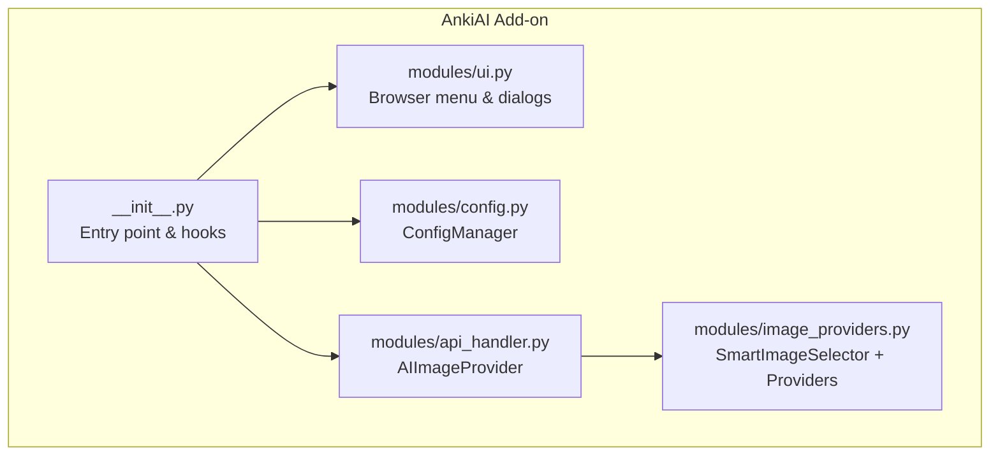
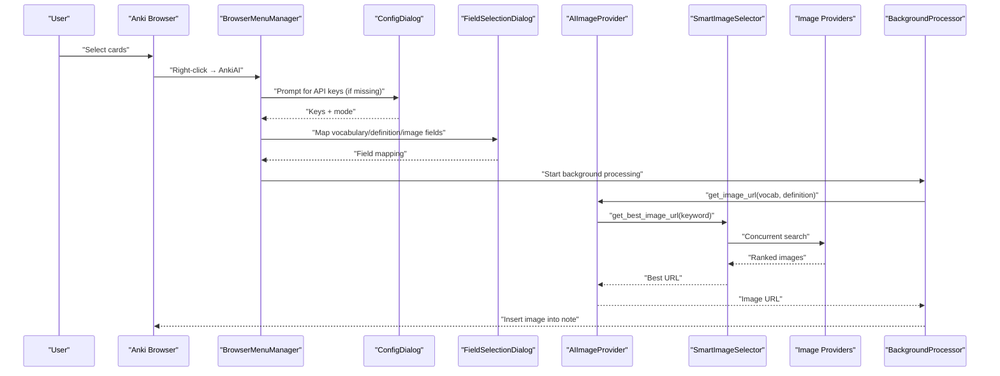
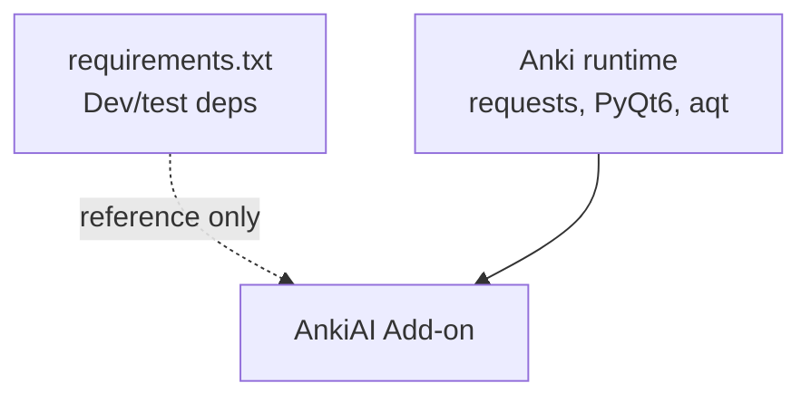

# Getting Started

<cite>
**Referenced Files in This Document**
- [README.md](file://README.md)
- [SETUP.md](file://SETUP.md)
- [QUICKSTART.md](file://QUICKSTART.md)
- [QUICKSTART_V3.md](file://QUICKSTART_V3.md)
- [QUICKSTART_V4.md](file://QUICKSTART_V4.md)
- [RELEASE_V4.md](file://RELEASE_V4.md)
- [AnkiAI_ImageAddon/__init__.py](file://AnkiAI_ImageAddon/__init__.py)
- [AnkiAI_ImageAddon/modules/config.py](file://AnkiAI_ImageAddon/modules/config.py)
- [AnkiAI_ImageAddon/modules/ui.py](file://AnkiAI_ImageAddon/modules/ui.py)
- [AnkiAI_ImageAddon/modules/api_handler.py](file://AnkiAI_ImageAddon/modules/api_handler.py)
- [AnkiAI_ImageAddon/modules/image_providers.py](file://AnkiAI_ImageAddon/modules/image_providers.py)
- [AnkiAI_ImageAddon/config.json](file://AnkiAI_ImageAddon/config.json)
- [AnkiAI_ImageAddon/manifest.json](file://AnkiAI_ImageAddon/manifest.json)
- [requirements.txt](file://requirements.txt)
</cite>

## Table of Contents
1. [Introduction](#introduction)
2. [Project Structure](#project-structure)
3. [Core Components](#core-components)
4. [Architecture Overview](#architecture-overview)
5. [Detailed Component Analysis](#detailed-component-analysis)
6. [Dependency Analysis](#dependency-analysis)
7. [Performance Considerations](#performance-considerations)
8. [Troubleshooting Guide](#troubleshooting-guide)
9. [Conclusion](#conclusion)
10. [Appendices](#appendices)

## Introduction
This guide helps you install and set up the AnkiAI Image Addon, configure API keys, and add images to your flashcards. It covers:
- Installation on Windows, macOS, and Linux via manual folder copy or Anki’s built-in add-on installer
- How to obtain and configure API keys for AI keyword generation and image search
- First-time configuration steps for field mapping
- Basic usage: selecting cards and running the add-on from the Browse window
- Two processing modes: AI-generated images and search-based image finding
- Troubleshooting common setup issues

## Project Structure
The add-on consists of a main entry point and modular components:
- Entry point initializes hooks and UI
- Config module manages persistent settings
- UI module adds the browser context menu and dialogs
- API handler integrates AI providers and image search providers
- Image providers implement concurrent, smart selection across six providers
- Background processor handles long-running tasks without freezing the UI

**Diagram sources**
- [AnkiAI_ImageAddon/__init__.py:310-349](file://AnkiAI_ImageAddon/__init__.py#L310-L349)
- [AnkiAI_ImageAddon/modules/config.py:18-132](file://AnkiAI_ImageAddon/modules/config.py#L18-L132)
- [AnkiAI_ImageAddon/modules/ui.py:13-94](file://AnkiAI_ImageAddon/modules/ui.py#L13-L94)
- [AnkiAI_ImageAddon/modules/api_handler.py:74-229](file://AnkiAI_ImageAddon/modules/api_handler.py#L74-L229)
- [AnkiAI_ImageAddon/modules/image_providers.py:373-463](file://AnkiAI_ImageAddon/modules/image_providers.py#L373-L463)

**Section sources**
- [AnkiAI_ImageAddon/__init__.py:310-349](file://AnkiAI_ImageAddon/__init__.py#L310-L349)
- [AnkiAI_ImageAddon/modules/config.py:18-132](file://AnkiAI_ImageAddon/modules/config.py#L18-L132)
- [AnkiAI_ImageAddon/modules/ui.py:13-94](file://AnkiAI_ImageAddon/modules/ui.py#L13-L94)
- [AnkiAI_ImageAddon/modules/api_handler.py:74-229](file://AnkiAI_ImageAddon/modules/api_handler.py#L74-L229)
- [AnkiAI_ImageAddon/modules/image_providers.py:373-463](file://AnkiAI_ImageAddon/modules/image_providers.py#L373-L463)

## Core Components
- Browser menu integration: Adds “AnkiAI: Automatically add images” to the Browse window context menu
- Config dialog: Collects AI and image provider keys, validates minimum requirements, and tests connections
- Field selection dialog: Lets you map vocabulary, definition, and image fields
- AI image provider: Generates keywords via Gemini, Groq, or Ollama and selects the best image URL
- Smart image selection: Concurrently queries up to six providers, ranks results, and returns the best image
- Background processing: Runs image addition without blocking the UI

**Section sources**
- [AnkiAI_ImageAddon/modules/ui.py:13-94](file://AnkiAI_ImageAddon/modules/ui.py#L13-L94)
- [AnkiAI_ImageAddon/modules/ui.py:174-400](file://AnkiAI_ImageAddon/modules/ui.py#L174-L400)
- [AnkiAI_ImageAddon/modules/config.py:18-132](file://AnkiAI_ImageAddon/modules/config.py#L18-L132)
- [AnkiAI_ImageAddon/modules/api_handler.py:74-229](file://AnkiAI_ImageAddon/modules/api_handler.py#L74-L229)
- [AnkiAI_ImageAddon/modules/image_providers.py:373-463](file://AnkiAI_ImageAddon/modules/image_providers.py#L373-L463)

## Architecture Overview
End-to-end flow from selecting cards to adding images:

**Diagram sources**
- [AnkiAI_ImageAddon/__init__.py:99-274](file://AnkiAI_ImageAddon/__init__.py#L99-L274)
- [AnkiAI_ImageAddon/modules/api_handler.py:187-229](file://AnkiAI_ImageAddon/modules/api_handler.py#L187-L229)
- [AnkiAI_ImageAddon/modules/image_providers.py:411-463](file://AnkiAI_ImageAddon/modules/image_providers.py#L411-L463)

## Detailed Component Analysis

### Installation and Setup

#### Platform-specific installation paths
- Windows: %APPDATA%\Anki2\addons21\
- macOS: ~/Library/Application Support/Anki2/addons21/
- Linux: ~/.local/share/Anki2/addons21/

You can also install from a .ankiaddon file via Anki’s built-in installer.

**Section sources**
- [README.md:21-26](file://README.md#L21-L26)
- [SETUP.md:113-119](file://SETUP.md#L113-L119)

#### Obtain and configure API keys
- AI keyword generation: Get keys for Gemini, Groq, and optionally Ollama
- Image search: Configure at least one of Pexels, Unsplash, or Pixabay
- Optional free providers: Openverse and Lorem Picsum require no API key

After obtaining keys, paste them into the add-on’s Config dialog and click “Test AI Connections”.

**Section sources**
- [QUICKSTART_V4.md:14-66](file://QUICKSTART_V4.md#L14-L66)
- [QUICKSTART_V3.md:48-87](file://QUICKSTART_V3.md#L48-L87)
- [SETUP.md:133-157](file://SETUP.md#L133-L157)

#### First-time configuration: field mapping
- Vocabulary field: word or term
- Definition field: meaning or explanation
- Image field: where the image tag will be inserted

If your note type uses different field names, the add-on prompts you to select them once.

**Section sources**
- [README.md:59-71](file://README.md#L59-L71)
- [AnkiAI_ImageAddon/modules/ui.py:96-172](file://AnkiAI_ImageAddon/modules/ui.py#L96-L172)

#### Basic usage
- Open Browse (Ctrl+B)
- Select cards (click first, Shift+click last, or Ctrl+A)
- Right-click → “AnkiAI: Automatically add images”
- Confirm the number of cards, mode, and fields
- Wait for progress; results appear after completion

**Section sources**
- [README.md:41-71](file://README.md#L41-L71)
- [QUICKSTART.md:55-69](file://QUICKSTART.md#L55-L69)

### Processing Modes

#### AI-generated images (DALL-E)
- Pros: Unique, thematic images
- Cons: Slower and more expensive
- Use when you want distinctive visuals

Note: The current implementation focuses on keyword generation and image search rather than DALL-E generation.

**Section sources**
- [README.md:72-96](file://README.md#L72-L96)

#### Search-based image finding
- Uses AI to generate a keyword, then searches multiple providers concurrently
- Smart selection ranks results and picks the best image
- Pros: Fast, cheap, and reliable
- Cons: Dependent on provider rankings and availability

**Section sources**
- [RELEASE_V4.md:10-54](file://RELEASE_V4.md#L10-L54)
- [AnkiAI_ImageAddon/modules/api_handler.py:187-229](file://AnkiAI_ImageAddon/modules/api_handler.py#L187-L229)
- [AnkiAI_ImageAddon/modules/image_providers.py:373-463](file://AnkiAI_ImageAddon/modules/image_providers.py#L373-L463)

### Configuration Options
Key configuration keys include:
- AI providers: gemini_api_key, groq_api_key, use_ollama, ollama_url
- Image providers: pexels_api_key, unsplash_api_key, pixabay_api_key, wallhaven_api_key
- Smart selection: enable_smart_selection, max_concurrent_providers, smart_cache_ttl_minutes
- Downloads and optimization: image_download_timeout, image_download_retries, enable_image_optimization, image_max_width, image_quality
- Field mapping: vocabulary_field, definition_field, image_field
- Concurrency: max_concurrent_requests, enable_concurrent_downloads

You can edit these in Anki’s Add-ons > AnkiAI > Config.

**Section sources**
- [AnkiAI_ImageAddon/config.json:1-35](file://AnkiAI_ImageAddon/config.json#L1-L35)
- [AnkiAI_ImageAddon/modules/config.py:21-63](file://AnkiAI_ImageAddon/modules/config.py#L21-L63)

## Dependency Analysis
- Runtime dependencies are provided by Anki itself (requests, PyQt6, aqt)
- The add-on declares optional dev/test dependencies for local development

**Diagram sources**
- [requirements.txt:10-19](file://requirements.txt#L10-L19)

**Section sources**
- [requirements.txt:10-19](file://requirements.txt#L10-L19)

## Performance Considerations
- Smart selection searches up to six providers concurrently and caches results, reducing repeated work
- Image optimization reduces file sizes and improves download speeds
- Batch processing runs in the background to avoid UI freezes

**Section sources**
- [RELEASE_V4.md:27-54](file://RELEASE_V4.md#L27-L54)
- [RELEASE_V4.md:141-167](file://RELEASE_V4.md#L141-L167)
- [AnkiAI_ImageAddon/modules/image_providers.py:411-463](file://AnkiAI_ImageAddon/modules/image_providers.py#L411-L463)

## Troubleshooting Guide
Common issues and resolutions:
- Invalid API key: Re-verify keys in the provider consoles and re-enter them in the Config dialog
- Timeout: Check network connectivity; reduce batch size or adjust timeouts
- No images found: Switch providers or try a different keyword
- Anki lagging: Process fewer cards at once; avoid extremely large batches
- Field not found: Reconfigure field names in the Config dialog or use the field selection prompt

Logs are accessible via Tools > Add-ons > AnkiAI > View Files > debug.log.

**Section sources**
- [README.md:117-167](file://README.md#L117-L167)
- [SETUP.md:267-311](file://SETUP.md#L267-L311)
- [QUICKSTART.md:105-124](file://QUICKSTART.md#L105-L124)

## Conclusion
You are ready to automate adding images to your Anki cards. Start by installing the add-on, obtaining API keys, configuring fields, and running the add-on from the Browse window. Use the smart selection mode for fast, reliable results, and consult the troubleshooting section if you encounter issues.

## Appendices

### A. Installation Quick Reference
- Manual copy: Place the add-on folder into the platform-specific addons21 directory
- From file: Use Anki’s “Install from file” to install the .ankiaddon package
- Restart Anki after installation

**Section sources**
- [README.md:21-26](file://README.md#L21-L26)
- [SETUP.md:113-119](file://SETUP.md#L113-L119)

### B. API Key Sources
- Gemini: makersuite.google.com/app/apikey
- Groq: console.groq.com/keys
- Pexels: pexels.com/api
- Unsplash: unsplash.com/developers
- Pixabay: pixabay.com/api/
- Ollama: ollama.com (local)

**Section sources**
- [QUICKSTART_V4.md:14-40](file://QUICKSTART_V4.md#L14-L40)
- [QUICKSTART_V3.md:9-45](file://QUICKSTART_V3.md#L9-L45)
- [SETUP.md:135-157](file://SETUP.md#L135-L157)

### C. Manifest and Compatibility
- Version: 4.0.0
- Minimum Anki version: 24.04
- Homepage and author metadata are defined in the manifest

**Section sources**
- [AnkiAI_ImageAddon/manifest.json:1-12](file://AnkiAI_ImageAddon/manifest.json#L1-L12)