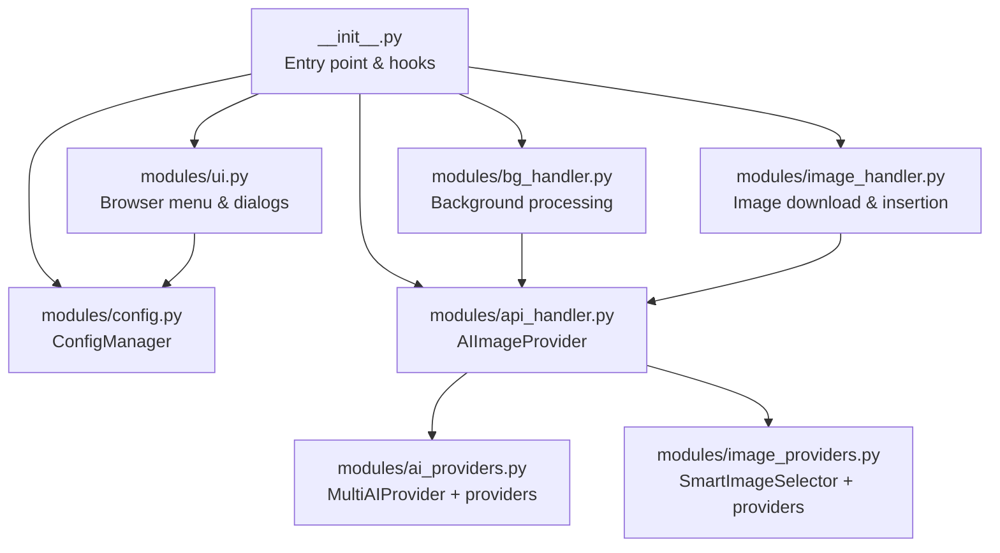
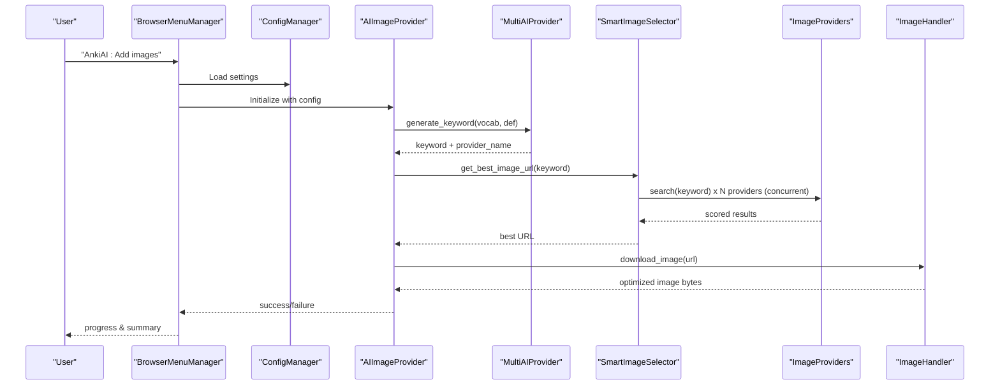
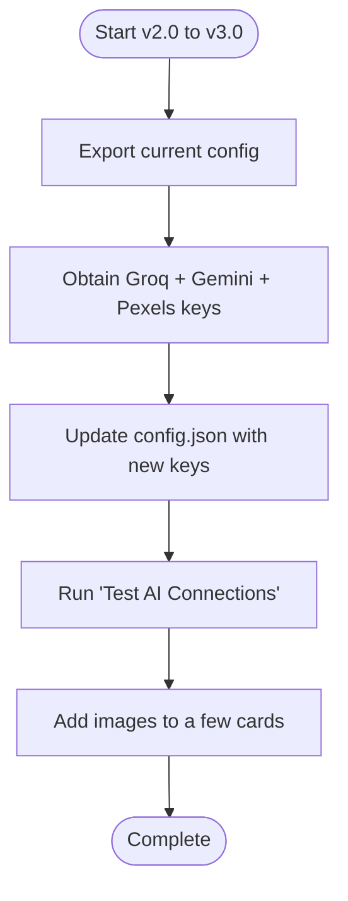
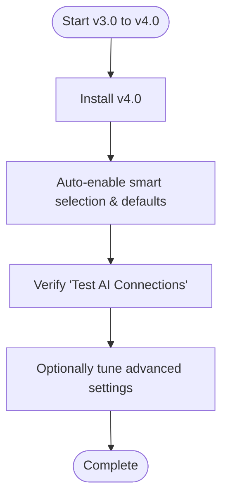
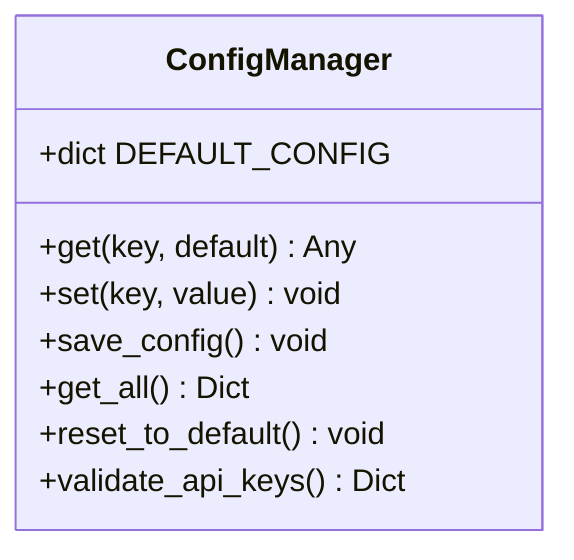
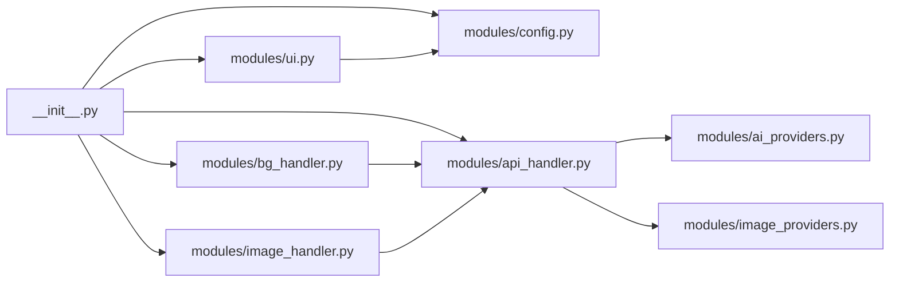

# Migration & Updates

<cite>
**Referenced Files in This Document**
- [CHANGELOG_V3.md](file://CHANGELOG_V3.md)
- [MIGRATION_V3.md](file://MIGRATION_V3.md)
- [RELEASE_V4.md](file://RELEASE_V4.md)
- [V3_RELEASE_NOTES.md](file://V3_RELEASE_NOTES.md)
- [README.md](file://README.md)
- [QUICKSTART_V3.md](file://QUICKSTART_V3.md)
- [QUICKSTART_V4.md](file://QUICKSTART_V4.md)
- [AnkiAI_ImageAddon/modules/config.py](file://AnkiAI_ImageAddon/modules/config.py)
- [AnkiAI_ImageAddon/modules/api_handler.py](file://AnkiAI_ImageAddon/modules/api_handler.py)
- [AnkiAI_ImageAddon/modules/image_providers.py](file://AnkiAI_ImageAddon/modules/image_providers.py)
- [AnkiAI_ImageAddon/modules/ai_providers.py](file://AnkiAI_ImageAddon/modules/ai_providers.py)
- [AnkiAI_ImageAddon/modules/ui.py](file://AnkiAI_ImageAddon/modules/ui.py)
- [AnkiAI_ImageAddon/modules/image_handler.py](file://AnkiAI_ImageAddon/modules/image_handler.py)
- [AnkiAI_ImageAddon/modules/bg_handler.py](file://AnkiAI_ImageAddon/modules/bg_handler.py)
- [AnkiAI_ImageAddon/config.json](file://AnkiAI_ImageAddon/config.json)
- [AnkiAI_ImageAddon/__init__.py](file://AnkiAI_ImageAddon/__init__.py)
- [DEVELOPMENT.md](file://DEVELOPMENT.md)
- [TESTING.md](file://TESTING.md)
</cite>

## Table of Contents
1. [Introduction](#introduction)
2. [Project Structure](#project-structure)
3. [Core Components](#core-components)
4. [Architecture Overview](#architecture-overview)
5. [Detailed Component Analysis](#detailed-component-analysis)
6. [Dependency Analysis](#dependency-analysis)
7. [Performance Considerations](#performance-considerations)
8. [Troubleshooting Guide](#troubleshooting-guide)
9. [Conclusion](#conclusion)
10. [Appendices](#appendices)

## Introduction
This document provides comprehensive guidance for migrating and updating the AnkiAI Image Addon across major versions. It covers version history, breaking changes, performance improvements, configuration migrations, provider API changes, and rollback strategies. It also documents automatic and manual update processes, backward compatibility considerations, and practical troubleshooting steps.

## Project Structure
The add-on follows a modular architecture with clear separation of concerns:
- Entry point initializes UI hooks, background processing, and configuration.
- Modules encapsulate configuration, UI dialogs, API integration, image handling, and background operations.
- Provider modules implement AI keyword generation and image search with concurrent orchestration.

**Diagram sources**
- [AnkiAI_ImageAddon/__init__.py:1-349](file://AnkiAI_ImageAddon/__init__.py#L1-L349)
- [AnkiAI_ImageAddon/modules/config.py:1-132](file://AnkiAI_ImageAddon/modules/config.py#L1-L132)
- [AnkiAI_ImageAddon/modules/api_handler.py:1-229](file://AnkiAI_ImageAddon/modules/api_handler.py#L1-L229)
- [AnkiAI_ImageAddon/modules/image_providers.py:1-463](file://AnkiAI_ImageAddon/modules/image_providers.py#L1-L463)
- [AnkiAI_ImageAddon/modules/ai_providers.py:1-393](file://AnkiAI_ImageAddon/modules/ai_providers.py#L1-L393)
- [AnkiAI_ImageAddon/modules/ui.py:1-444](file://AnkiAI_ImageAddon/modules/ui.py#L1-L444)
- [AnkiAI_ImageAddon/modules/image_handler.py:1-364](file://AnkiAI_ImageAddon/modules/image_handler.py#L1-L364)
- [AnkiAI_ImageAddon/modules/bg_handler.py:1-205](file://AnkiAI_ImageAddon/modules/bg_handler.py#L1-L205)

**Section sources**
- [AnkiAI_ImageAddon/__init__.py:1-349](file://AnkiAI_ImageAddon/__init__.py#L1-L349)
- [AnkiAI_ImageAddon/modules/config.py:1-132](file://AnkiAI_ImageAddon/modules/config.py#L1-L132)
- [AnkiAI_ImageAddon/modules/api_handler.py:1-229](file://AnkiAI_ImageAddon/modules/api_handler.py#L1-L229)
- [AnkiAI_ImageAddon/modules/image_providers.py:1-463](file://AnkiAI_ImageAddon/modules/image_providers.py#L1-L463)
- [AnkiAI_ImageAddon/modules/ai_providers.py:1-393](file://AnkiAI_ImageAddon/modules/ai_providers.py#L1-L393)
- [AnkiAI_ImageAddon/modules/ui.py:1-444](file://AnkiAI_ImageAddon/modules/ui.py#L1-L444)
- [AnkiAI_ImageAddon/modules/image_handler.py:1-364](file://AnkiAI_ImageAddon/modules/image_handler.py#L1-L364)
- [AnkiAI_ImageAddon/modules/bg_handler.py:1-205](file://AnkiAI_ImageAddon/modules/bg_handler.py#L1-L205)

## Core Components
- ConfigManager: Centralized configuration with defaults, validation, and persistence via Anki’s add-on manager.
- AIImageProvider: Orchestrates AI keyword generation and smart image selection with concurrency.
- SmartImageSelector: Concurrently queries multiple image providers, scores results, and selects the best image.
- MultiAIProvider: Manages multiple AI providers with auto-fallback and logging.
- ImageHandler: Downloads, optimizes, and inserts images into notes with responsive HTML.
- BackgroundProcessor: Runs long-running tasks without blocking the UI.
- UI Dialogs: Browser menu integration, field selection, and configuration dialogs.

Key migration-related responsibilities:
- Configuration migration: Automatic defaults and validation ensure smooth upgrades.
- Provider changes: AI providers moved from OpenAI to multi-provider; image providers expanded to six providers with smart selection.
- Backward compatibility: v4.0 preserves v3.0 configurations and enables new features by default.

**Section sources**
- [AnkiAI_ImageAddon/modules/config.py:1-132](file://AnkiAI_ImageAddon/modules/config.py#L1-L132)
- [AnkiAI_ImageAddon/modules/api_handler.py:1-229](file://AnkiAI_ImageAddon/modules/api_handler.py#L1-L229)
- [AnkiAI_ImageAddon/modules/image_providers.py:1-463](file://AnkiAI_ImageAddon/modules/image_providers.py#L1-L463)
- [AnkiAI_ImageAddon/modules/ai_providers.py:1-393](file://AnkiAI_ImageAddon/modules/ai_providers.py#L1-L393)
- [AnkiAI_ImageAddon/modules/image_handler.py:1-364](file://AnkiAI_ImageAddon/modules/image_handler.py#L1-L364)
- [AnkiAI_ImageAddon/modules/bg_handler.py:1-205](file://AnkiAI_ImageAddon/modules/bg_handler.py#L1-L205)
- [AnkiAI_ImageAddon/modules/ui.py:1-444](file://AnkiAI_ImageAddon/modules/ui.py#L1-L444)

## Architecture Overview
The add-on integrates AI keyword generation and image search with concurrent orchestration and caching to achieve fast, reliable results.

**Diagram sources**
- [AnkiAI_ImageAddon/__init__.py:99-273](file://AnkiAI_ImageAddon/__init__.py#L99-L273)
- [AnkiAI_ImageAddon/modules/api_handler.py:74-229](file://AnkiAI_ImageAddon/modules/api_handler.py#L74-L229)
- [AnkiAI_ImageAddon/modules/ai_providers.py:297-393](file://AnkiAI_ImageAddon/modules/ai_providers.py#L297-L393)
- [AnkiAI_ImageAddon/modules/image_providers.py:373-463](file://AnkiAI_ImageAddon/modules/image_providers.py#L373-L463)
- [AnkiAI_ImageAddon/modules/image_handler.py:36-364](file://AnkiAI_ImageAddon/modules/image_handler.py#L36-L364)

## Detailed Component Analysis

### Version History and Release Notes
- v3.0 (Multi-AI Provider): Replaced OpenAI dependency with Groq, Gemini, and Ollama; introduced auto-fallback and cost/performance improvements.
- v4.0 (Smart Image Selection): Expanded to six image providers with intelligent ranking, concurrent search, and performance optimizations.

**Section sources**
- [CHANGELOG_V3.md:1-213](file://CHANGELOG_V3.md#L1-L213)
- [RELEASE_V4.md:1-440](file://RELEASE_V4.md#L1-L440)
- [V3_RELEASE_NOTES.md:1-279](file://V3_RELEASE_NOTES.md#L1-L279)

### Migration Guides

#### From v2.0 to v3.0
- Replace OpenAI configuration with multi-provider keys (Groq, Gemini, Pexels).
- Update initialization parameters to use new provider classes.
- Validate configuration and test connections for all providers.

**Diagram sources**
- [MIGRATION_V3.md:51-61](file://MIGRATION_V3.md#L51-L61)
- [MIGRATION_V3.md:63-91](file://MIGRATION_V3.md#L63-L91)
- [MIGRATION_V3.md:179-196](file://MIGRATION_V3.md#L179-L196)

**Section sources**
- [MIGRATION_V3.md:1-247](file://MIGRATION_V3.md#L1-L247)
- [CHANGELOG_V3.md:85-122](file://CHANGELOG_V3.md#L85-L122)

#### From v3.0 to v4.0
- Automatic upgrade: v4.0 preserves v3.0 configurations and enables smart selection by default.
- Optional enhancements: adjust concurrent providers and caching settings.

**Diagram sources**
- [RELEASE_V4.md:197-220](file://RELEASE_V4.md#L197-L220)
- [RELEASE_V4.md:141-167](file://RELEASE_V4.md#L141-L167)

**Section sources**
- [RELEASE_V4.md:197-220](file://RELEASE_V4.md#L197-L220)
- [RELEASE_V4.md:141-167](file://RELEASE_V4.md#L141-L167)

### Configuration Migration and Validation
- ConfigManager loads defaults and validates provider keys; it ensures at least one AI provider and one image provider are configured.
- v4.0 adds smart selection settings and optimized image handling defaults.

**Diagram sources**
- [AnkiAI_ImageAddon/modules/config.py:18-120](file://AnkiAI_ImageAddon/modules/config.py#L18-L120)

**Section sources**
- [AnkiAI_ImageAddon/modules/config.py:1-132](file://AnkiAI_ImageAddon/modules/config.py#L1-L132)
- [AnkiAI_ImageAddon/config.json:1-35](file://AnkiAI_ImageAddon/config.json#L1-L35)

### Provider API Changes and Backward Compatibility
- AI providers: OpenAI removed; replaced by Groq, Gemini, and optional Ollama.
- Image providers: Expanded to six providers (Pexels, Unsplash, Pixabay, Openverse, Wallhaven, Lorem Picsum); smart selection replaces single-provider search.
- Backward compatibility: v4.0 retains v3.0 keys and enables new features automatically.

**Section sources**
- [CHANGELOG_V3.md:85-122](file://CHANGELOG_V3.md#L85-L122)
- [RELEASE_V4.md:141-175](file://RELEASE_V4.md#L141-L175)
- [RELEASE_V4.md:356-371](file://RELEASE_V4.md#L356-L371)

### Rollback Procedures
- To revert to OpenAI-based workflow, restore OpenAI handler, update UI fields, and repoint initialization. This is intended for exceptional circumstances.

**Section sources**
- [MIGRATION_V3.md:234-243](file://MIGRATION_V3.md#L234-L243)

### Update Mechanisms
- Automatic updates: v4.0 automatically migrates v3.0 configurations and enables new features.
- Manual updates: Use Anki’s add-on manager to install the new version; verify configuration via the “Test AI Connections” dialog.

**Section sources**
- [RELEASE_V4.md:197-220](file://RELEASE_V4.md#L197-L220)
- [QUICKSTART_V4.md:216-226](file://QUICKSTART_V4.md#L216-L226)

## Dependency Analysis
The following diagram shows key internal dependencies among modules:

**Diagram sources**
- [AnkiAI_ImageAddon/__init__.py:1-349](file://AnkiAI_ImageAddon/__init__.py#L1-L349)
- [AnkiAI_ImageAddon/modules/api_handler.py:1-229](file://AnkiAI_ImageAddon/modules/api_handler.py#L1-L229)
- [AnkiAI_ImageAddon/modules/image_providers.py:1-463](file://AnkiAI_ImageAddon/modules/image_providers.py#L1-L463)
- [AnkiAI_ImageAddon/modules/ai_providers.py:1-393](file://AnkiAI_ImageAddon/modules/ai_providers.py#L1-L393)
- [AnkiAI_ImageAddon/modules/config.py:1-132](file://AnkiAI_ImageAddon/modules/config.py#L1-L132)
- [AnkiAI_ImageAddon/modules/ui.py:1-444](file://AnkiAI_ImageAddon/modules/ui.py#L1-L444)
- [AnkiAI_ImageAddon/modules/image_handler.py:1-364](file://AnkiAI_ImageAddon/modules/image_handler.py#L1-L364)
- [AnkiAI_ImageAddon/modules/bg_handler.py:1-205](file://AnkiAI_ImageAddon/modules/bg_handler.py#L1-L205)

**Section sources**
- [AnkiAI_ImageAddon/__init__.py:1-349](file://AnkiAI_ImageAddon/__init__.py#L1-L349)
- [AnkiAI_ImageAddon/modules/api_handler.py:1-229](file://AnkiAI_ImageAddon/modules/api_handler.py#L1-L229)
- [AnkiAI_ImageAddon/modules/image_providers.py:1-463](file://AnkiAI_ImageAddon/modules/image_providers.py#L1-L463)
- [AnkiAI_ImageAddon/modules/ai_providers.py:1-393](file://AnkiAI_ImageAddon/modules/ai_providers.py#L1-L393)
- [AnkiAI_ImageAddon/modules/config.py:1-132](file://AnkiAI_ImageAddon/modules/config.py#L1-L132)
- [AnkiAI_ImageAddon/modules/ui.py:1-444](file://AnkiAI_ImageAddon/modules/ui.py#L1-L444)
- [AnkiAI_ImageAddon/modules/image_handler.py:1-364](file://AnkiAI_ImageAddon/modules/image_handler.py#L1-L364)
- [AnkiAI_ImageAddon/modules/bg_handler.py:1-205](file://AnkiAI_ImageAddon/modules/bg_handler.py#L1-L205)

## Performance Considerations
- v4.0 introduces concurrent provider searches, intelligent ranking, and optimized image handling to reduce latency and file size.
- Smart caching reduces redundant API calls and improves throughput for repeated keywords.

**Section sources**
- [RELEASE_V4.md:39-54](file://RELEASE_V4.md#L39-L54)
- [RELEASE_V4.md:101-124](file://RELEASE_V4.md#L101-L124)
- [RELEASE_V4.md:223-261](file://RELEASE_V4.md#L223-L261)
- [AnkiAI_ImageAddon/modules/image_handler.py:36-46](file://AnkiAI_ImageAddon/modules/image_handler.py#L36-L46)
- [AnkiAI_ImageAddon/modules/image_providers.py:69-97](file://AnkiAI_ImageAddon/modules/image_providers.py#L69-L97)

## Troubleshooting Guide
Common issues and resolutions:
- No AI provider configured: Ensure at least one AI provider key is set.
- All providers failed: Verify network connectivity, keys, and test connections.
- Keyword generation timeout: Consider disabling Ollama or ensuring local model availability.
- Ollama not running: Start the Ollama server locally.
- Smart selection disabled: Confirm the setting is enabled; it auto-enables in v4.0.
- Slow image loading: Understand that concurrent search takes time but improves quality; caching mitigates subsequent delays.

**Section sources**
- [MIGRATION_V3.md:179-196](file://MIGRATION_V3.md#L179-L196)
- [RELEASE_V4.md:326-353](file://RELEASE_V4.md#L326-L353)
- [V3_RELEASE_NOTES.md:148-184](file://V3_RELEASE_NOTES.md#L148-L184)

## Conclusion
Upgrading AnkiAI Image Addon from v2.0 to v4.0 brings significant performance and reliability improvements through multi-provider AI keyword generation and six-image provider smart selection. The migration is largely automatic, with robust validation and backward compatibility. Users benefit from faster batch processing, smaller file sizes, and a more resilient pipeline, while maintaining complete control over configuration and provider choices.

## Appendices

### Version-Specific Highlights
- v3.0: Multi-provider AI (Groq, Gemini, Ollama), auto-fallback, cost-free operation, and improved speed.
- v4.0: Six image providers with concurrent search and intelligent ranking, optimized timeouts and image sizes, and automatic configuration migration.

**Section sources**
- [CHANGELOG_V3.md:3-44](file://CHANGELOG_V3.md#L3-L44)
- [RELEASE_V4.md:10-54](file://RELEASE_V4.md#L10-L54)

### Practical Migration Checklists
- v3.0 migration checklist: Obtain keys, update configuration, test connections, and validate batch operations.
- v4.0 migration checklist: Install update, verify automatic configuration, optionally tune advanced settings, and test performance.

**Section sources**
- [MIGRATION_V3.md:51-61](file://MIGRATION_V3.md#L51-L61)
- [QUICKSTART_V4.md:315-326](file://QUICKSTART_V4.md#L315-L326)

### Developer and Testing References
- Development workflow, building, and testing procedures are documented for contributors and maintainers.

**Section sources**
- [DEVELOPMENT.md:1-404](file://DEVELOPMENT.md#L1-L404)
- [TESTING.md:1-417](file://TESTING.md#L1-L417)