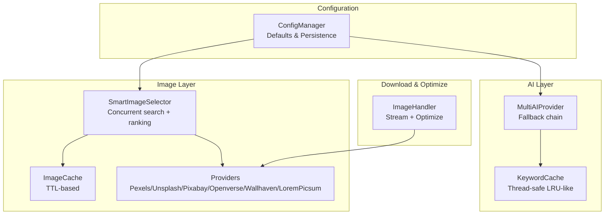
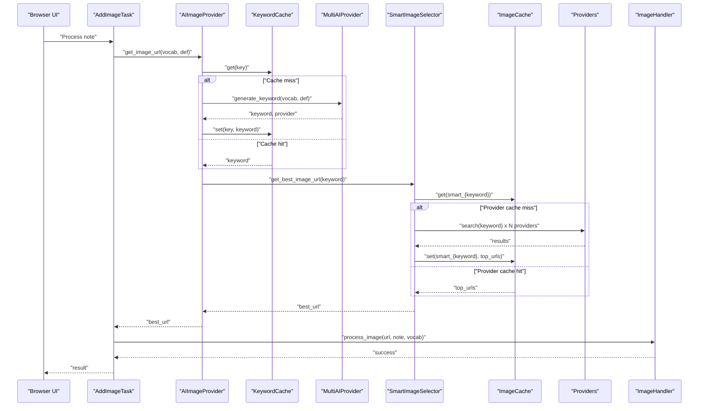
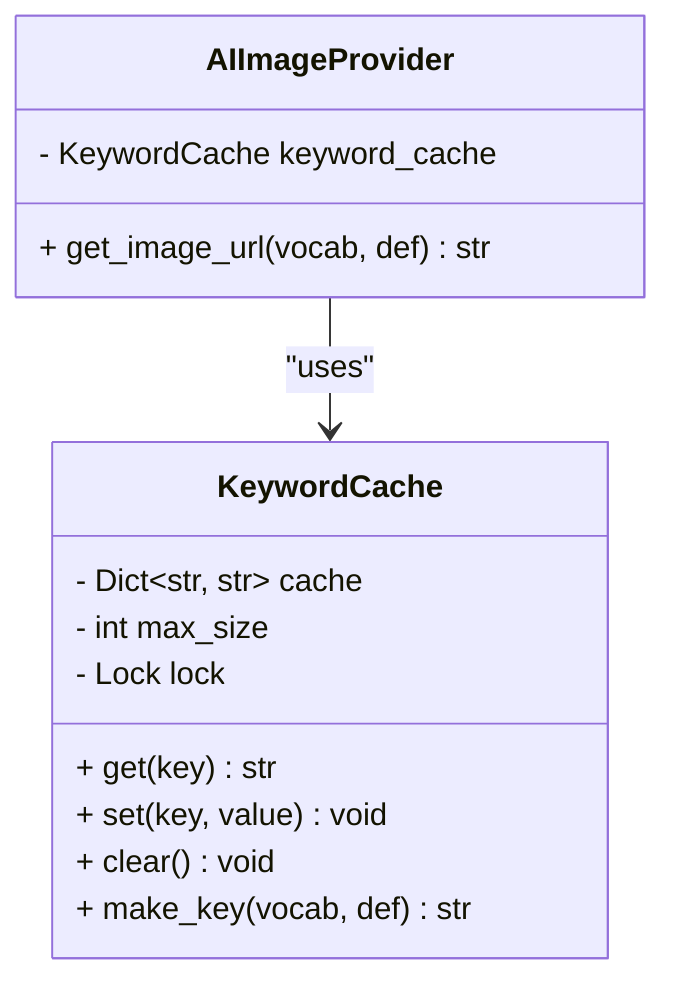
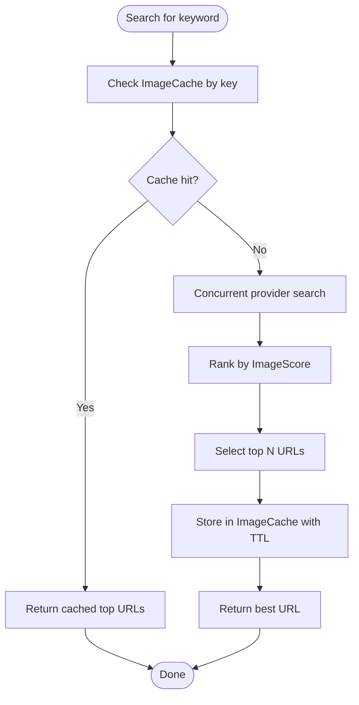
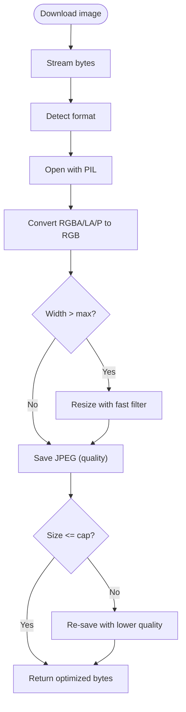
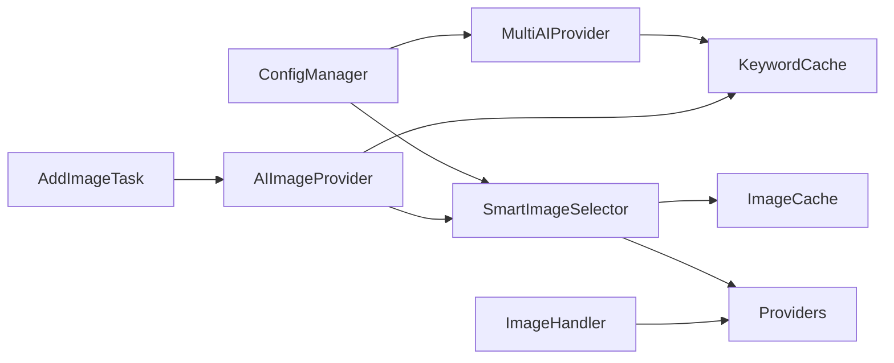

# Caching and Optimization Strategies

<cite>
**Referenced Files in This Document**
- [config.py](file://AnkiAI_ImageAddon/modules/config.py)
- [config.json](file://AnkiAI_ImageAddon/config.json)
- [api_handler.py](file://AnkiAI_ImageAddon/modules/api_handler.py)
- [image_providers.py](file://AnkiAI_ImageAddon/modules/image_providers.py)
- [image_handler.py](file://AnkiAI_ImageAddon/modules/image_handler.py)
- [ai_providers.py](file://AnkiAI_ImageAddon/modules/ai_providers.py)
- [__init__.py](file://AnkiAI_ImageAddon/__init__.py)
- [PERFORMANCE_TIPS.md](file://PERFORMANCE_TIPS.md)
- [PERFORMANCE_BENCHMARK_V4.md](file://PERFORMANCE_BENCHMARK_V4.md)
</cite>

## Table of Contents
1. [Introduction](#introduction)
2. [Project Structure](#project-structure)
3. [Core Components](#core-components)
4. [Architecture Overview](#architecture-overview)
5. [Detailed Component Analysis](#detailed-component-analysis)
6. [Dependency Analysis](#dependency-analysis)
7. [Performance Considerations](#performance-considerations)
8. [Troubleshooting Guide](#troubleshooting-guide)
9. [Conclusion](#conclusion)
10. [Appendices](#appendices)

## Introduction
This document explains the caching mechanisms and optimization strategies implemented in the AnkiAI Image Addon. It covers:
- Keyword caching to minimize redundant AI keyword generation calls
- Image optimization pipeline (resizing, compression, metadata handling)
- Intelligent caching of external image provider responses
- Memory optimization and resource cleanup
- Quality vs. size trade-offs and configurable compression settings
- Practical configuration examples and their performance impacts
- Cache warming, hit ratios, and monitoring approaches

## Project Structure
The caching and optimization logic spans several modules:
- Configuration management defines defaults and runtime toggles
- AI provider selection and keyword caching
- Smart image selection with concurrent provider queries and response caching
- Image download, streaming, and optimization pipeline
- Integration via the main add-on entry point

**Diagram sources**
- [config.py:18-132](file://AnkiAI_ImageAddon/modules/config.py#L18-L132)
- [api_handler.py:42-228](file://AnkiAI_ImageAddon/modules/api_handler.py#L42-L228)
- [image_providers.py:69-101](file://AnkiAI_ImageAddon/modules/image_providers.py#L69-L101)
- [image_providers.py:373-462](file://AnkiAI_ImageAddon/modules/image_providers.py#L373-L462)
- [image_handler.py:36-364](file://AnkiAI_ImageAddon/modules/image_handler.py#L36-L364)

**Section sources**
- [config.py:18-132](file://AnkiAI_ImageAddon/modules/config.py#L18-L132)
- [config.json:1-35](file://AnkiAI_ImageAddon/config.json#L1-L35)

## Core Components
- KeywordCache: Thread-safe cache for AI-generated keywords keyed by vocabulary + definition. Evicts oldest entries when exceeding capacity.
- ImageCache: Lightweight TTL-based cache for lists of image URLs returned by providers.
- SmartImageSelector: Concurrently queries multiple providers, ranks results, caches top URLs, and returns the best URL.
- ImageHandler: Downloads images with streaming, applies lightweight optimization (resize, JPEG compression), and writes to Anki media.

Key configuration toggles and defaults:
- Keyword cache enabled by default with a capacity of 1000
- Smart selection enabled with a 120-minute TTL for provider response cache
- Image optimization enabled with default max width and quality tuned for speed and size

**Section sources**
- [api_handler.py:42-72](file://AnkiAI_ImageAddon/modules/api_handler.py#L42-L72)
- [image_providers.py:69-101](file://AnkiAI_ImageAddon/modules/image_providers.py#L69-L101)
- [image_providers.py:373-462](file://AnkiAI_ImageAddon/modules/image_providers.py#L373-L462)
- [image_handler.py:130-196](file://AnkiAI_ImageAddon/modules/image_handler.py#L130-L196)
- [config.py:21-63](file://AnkiAI_ImageAddon/modules/config.py#L21-L63)
- [config.json:22-23](file://AnkiAI_ImageAddon/config.json#L22-L23)

## Architecture Overview
The system orchestrates keyword generation and image retrieval with layered caching and optimization:

**Diagram sources**
- [__init__.py:27-97](file://AnkiAI_ImageAddon/__init__.py#L27-L97)
- [api_handler.py:187-228](file://AnkiAI_ImageAddon/modules/api_handler.py#L187-L228)
- [api_handler.py:42-72](file://AnkiAI_ImageAddon/modules/api_handler.py#L42-L72)
- [ai_providers.py:297-393](file://AnkiAI_ImageAddon/modules/ai_providers.py#L297-L393)
- [image_providers.py:373-462](file://AnkiAI_ImageAddon/modules/image_providers.py#L373-L462)
- [image_providers.py:69-101](file://AnkiAI_ImageAddon/modules/image_providers.py#L69-L101)
- [image_handler.py:326-364](file://AnkiAI_ImageAddon/modules/image_handler.py#L326-L364)

## Detailed Component Analysis

### Keyword Caching System
- Purpose: Avoid repeated AI keyword generation for identical vocabulary + definition pairs.
- Implementation:
  - Key composition: lowercase concatenation of vocabulary and definition.
  - Storage: dictionary with thread lock; eviction policy removes the oldest entry when capacity is reached.
  - Integration: AIImageProvider checks cache before invoking MultiAIProvider.
- Persistence: In-memory only; cleared on restart.
- Configuration:
  - Toggle: enable_keyword_cache
  - Capacity: keyword_cache_size

**Diagram sources**
- [api_handler.py:42-72](file://AnkiAI_ImageAddon/modules/api_handler.py#L42-L72)
- [api_handler.py:187-228](file://AnkiAI_ImageAddon/modules/api_handler.py#L187-L228)

**Section sources**
- [api_handler.py:42-72](file://AnkiAI_ImageAddon/modules/api_handler.py#L42-L72)
- [api_handler.py:187-228](file://AnkiAI_ImageAddon/modules/api_handler.py#L187-L228)
- [config.py:47-50](file://AnkiAI_ImageAddon/modules/config.py#L47-L50)
- [config.json:22-23](file://AnkiAI_ImageAddon/config.json#L22-L23)

### Smart Image Selection and Provider Response Caching
- Purpose: Minimize redundant external API calls by caching ranked image URLs for a given keyword.
- Implementation:
  - SmartImageSelector concurrently queries configured providers.
  - ImageCache stores top URLs under a key derived from the keyword with a TTL.
  - Scoring considers provider reputation, URL length, and title relevance.
- Persistence: In-memory TTL-based cache; entries expire after the configured TTL.
- Configuration:
  - enable_smart_selection
  - max_concurrent_providers
  - smart_cache_ttl_minutes

**Diagram sources**
- [image_providers.py:373-462](file://AnkiAI_ImageAddon/modules/image_providers.py#L373-L462)
- [image_providers.py:69-101](file://AnkiAI_ImageAddon/modules/image_providers.py#L69-L101)
- [image_providers.py:29-67](file://AnkiAI_ImageAddon/modules/image_providers.py#L29-L67)

**Section sources**
- [image_providers.py:373-462](file://AnkiAI_ImageAddon/modules/image_providers.py#L373-L462)
- [image_providers.py:69-101](file://AnkiAI_ImageAddon/modules/image_providers.py#L69-L101)
- [config.py:36-38](file://AnkiAI_ImageAddon/modules/config.py#L36-L38)
- [config.json:12-14](file://AnkiAI_ImageAddon/config.json#L12-L14)

### Image Optimization Pipeline
- Purpose: Reduce bandwidth and storage by resizing and compressing images while preserving visual quality.
- Implementation:
  - Streaming download to avoid loading entire images into memory.
  - Convert transparent modes to solid RGB to reduce file size.
  - Resize if width exceeds configured max width using a fast resampling filter.
  - Save as JPEG with configurable quality and optimization flags.
  - If resulting size exceeds a cap, re-encode at a lower quality threshold.
- Configuration:
  - enable_image_optimization
  - image_max_width
  - image_quality

**Diagram sources**
- [image_handler.py:59-128](file://AnkiAI_ImageAddon/modules/image_handler.py#L59-L128)
- [image_handler.py:130-196](file://AnkiAI_ImageAddon/modules/image_handler.py#L130-L196)

**Section sources**
- [image_handler.py:59-128](file://AnkiAI_ImageAddon/modules/image_handler.py#L59-L128)
- [image_handler.py:130-196](file://AnkiAI_ImageAddon/modules/image_handler.py#L130-L196)
- [config.py:43-46](file://AnkiAI_ImageAddon/modules/config.py#L43-L46)
- [config.json:18-21](file://AnkiAI_ImageAddon/config.json#L18-L21)

### Memory Optimization and Resource Cleanup
- Streaming downloads: The downloader uses stream mode to avoid loading entire images into memory.
- Lightweight optimization: Uses fast resampling and single-pass JPEG encoding with optimization flags.
- Thread safety: KeywordCache and ImageCache use locks to guard concurrent access.
- Anki media write: Uses Anki’s media write API to ensure proper synchronization and avoid duplication.

Practical tips:
- Limit concurrency to prevent memory spikes.
- Process in batches to avoid sustained high memory usage.
- Clear caches periodically by restarting the add-on if needed.

**Section sources**
- [image_handler.py:80-89](file://AnkiAI_ImageAddon/modules/image_handler.py#L80-L89)
- [image_handler.py:164-165](file://AnkiAI_ImageAddon/modules/image_handler.py#L164-L165)
- [image_providers.py:75](file://AnkiAI_ImageAddon/modules/image_providers.py#L75)
- [api_handler.py:48](file://AnkiAI_ImageAddon/modules/api_handler.py#L48)

### Quality vs. Size Optimization and Configurable Compression
- Quality controls:
  - image_quality: JPEG quality percentage applied during optimization.
  - image_max_width: Maximum width to cap resolution.
- Trade-offs:
  - Lower quality and narrower width reduce file size and sync time.
  - Higher values improve fidelity but increase bandwidth and storage.
- Recommendations:
  - For language learning: default quality and width offer a strong balance.
  - For budget-conscious workflows: slightly lower quality and width further reduce size.
  - For professional decks: keep higher quality but enable optimization to keep files reasonable.

**Section sources**
- [image_handler.py:130-196](file://AnkiAI_ImageAddon/modules/image_handler.py#L130-L196)
- [config.py:43-46](file://AnkiAI_ImageAddon/modules/config.py#L43-L46)
- [config.json:18-21](file://AnkiAI_ImageAddon/config.json#L18-L21)

### Practical Cache Configuration Examples and Performance Impact
Below are representative configurations and their likely effects, based on documented defaults and behavior:

- Keyword cache enabled (default)
  - Reduces AI keyword generation calls for repeated vocabulary + definition pairs.
  - Typical warm-cache scenario yields faster subsequent runs.

- Smart selection enabled with 120-minute TTL
  - Reduces repeated provider searches for the same keyword.
  - Improves latency and reduces external API usage.

- Image optimization enabled with default width and quality
  - Substantial reduction in file size and sync time.
  - Maintains readability on mobile devices.

- Concurrency tuning
  - Increasing max_concurrent_requests accelerates processing on fast networks.
  - Decreasing it improves reliability on unstable connections.

Note: Specific benchmark metrics are documented in the performance report.

**Section sources**
- [config.py:36-38](file://AnkiAI_ImageAddon/modules/config.py#L36-L38)
- [config.py:43-46](file://AnkiAI_ImageAddon/modules/config.py#L43-L46)
- [config.json:12-14](file://AnkiAI_ImageAddon/config.json#L12-L14)
- [PERFORMANCE_BENCHMARK_V4.md:206-220](file://PERFORMANCE_BENCHMARK_V4.md#L206-L220)

### Cache Warming, Hit Ratios, and Monitoring
- Cache warming
  - Keyword cache warms on first use of a vocabulary + definition pair.
  - Provider response cache warms after the first search for a keyword across providers.
- Hit ratio estimation
  - Warm cache scenarios demonstrate reduced processing time compared to cold cache runs.
- Monitoring
  - Observe logs for cache hits and misses during operation.
  - Adjust TTL and capacities based on usage patterns.

**Section sources**
- [api_handler.py:198-214](file://AnkiAI_ImageAddon/modules/api_handler.py#L198-L214)
- [image_providers.py:417-423](file://AnkiAI_ImageAddon/modules/image_providers.py#L417-L423)
- [PERFORMANCE_BENCHMARK_V4.md:206-220](file://PERFORMANCE_BENCHMARK_V4.md#L206-L220)

## Dependency Analysis
The following diagram highlights key dependencies among caching and optimization components:

**Diagram sources**
- [config.py:18-132](file://AnkiAI_ImageAddon/modules/config.py#L18-L132)
- [api_handler.py:74-126](file://AnkiAI_ImageAddon/modules/api_handler.py#L74-L126)
- [image_providers.py:373-462](file://AnkiAI_ImageAddon/modules/image_providers.py#L373-L462)
- [image_handler.py:36-364](file://AnkiAI_ImageAddon/modules/image_handler.py#L36-L364)
- [__init__.py:27-97](file://AnkiAI_ImageAddon/__init__.py#L27-L97)

**Section sources**
- [config.py:18-132](file://AnkiAI_ImageAddon/modules/config.py#L18-L132)
- [api_handler.py:74-126](file://AnkiAI_ImageAddon/modules/api_handler.py#L74-L126)
- [image_providers.py:373-462](file://AnkiAI_ImageAddon/modules/image_providers.py#L373-L462)
- [image_handler.py:36-364](file://AnkiAI_ImageAddon/modules/image_handler.py#L36-L364)
- [__init__.py:27-97](file://AnkiAI_ImageAddon/__init__.py#L27-L97)

## Performance Considerations
- Concurrency: Tune max_concurrent_requests and max_concurrent_providers to match network conditions.
- Timeouts: image_download_timeout balances responsiveness and reliability.
- Provider selection: Prefer Pexels for speed and quality; fallback providers reduce dependency on a single service.
- Optimization: Keep image optimization enabled to reduce sync time and storage footprint.
- Batching: Process in smaller batches to avoid memory pressure and simplify error handling.

[No sources needed since this section provides general guidance]

## Troubleshooting Guide
Common issues and remedies:
- Slow processing
  - Switch to search mode and configure Pexels for faster provider responses.
  - Increase concurrency cautiously and monitor stability.
- High memory usage
  - Reduce concurrency and process smaller batches.
  - Ensure optimization remains enabled.
- API cost concerns
  - Use free providers (Pexels, Pixabay) and rely on keyword caching.
- Blurry or oversized images
  - Verify image_max_width and image_quality settings.
  - Confirm optimization is enabled.

**Section sources**
- [PERFORMANCE_TIPS.md:240-286](file://PERFORMANCE_TIPS.md#L240-L286)
- [image_handler.py:130-196](file://AnkiAI_ImageAddon/modules/image_handler.py#L130-L196)
- [config.py:43-46](file://AnkiAI_ImageAddon/modules/config.py#L43-L46)

## Conclusion
The AnkiAI Image Addon implements a layered caching and optimization strategy:
- KeywordCache prevents redundant AI calls
- SmartImageSelector with ImageCache minimizes external API usage
- Lightweight ImageHandler optimizes images for size and performance
- Configurable settings allow balancing quality, speed, and cost

Adopting recommended configurations and monitoring cache behavior will yield significant improvements in speed, reliability, and resource usage.

[No sources needed since this section summarizes without analyzing specific files]

## Appendices

### Configuration Reference
- Keyword caching
  - enable_keyword_cache: Boolean
  - keyword_cache_size: Integer
- Smart selection and provider caching
  - enable_smart_selection: Boolean
  - max_concurrent_providers: Integer
  - smart_cache_ttl_minutes: Integer
- Image optimization
  - enable_image_optimization: Boolean
  - image_max_width: Integer
  - image_quality: Integer
- Network and concurrency
  - image_download_timeout: Integer
  - image_download_retries: Integer
  - max_concurrent_requests: Integer
  - enable_concurrent_downloads: Boolean

**Section sources**
- [config.py:21-63](file://AnkiAI_ImageAddon/modules/config.py#L21-L63)
- [config.json:1-35](file://AnkiAI_ImageAddon/config.json#L1-L35)