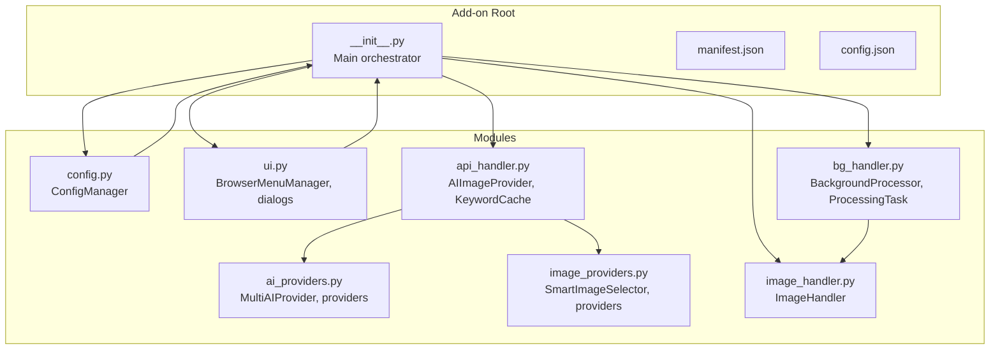
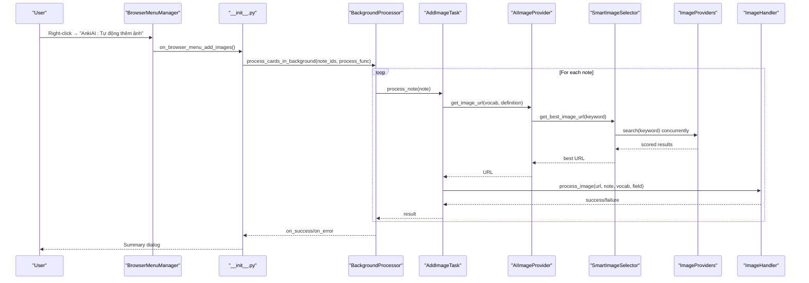
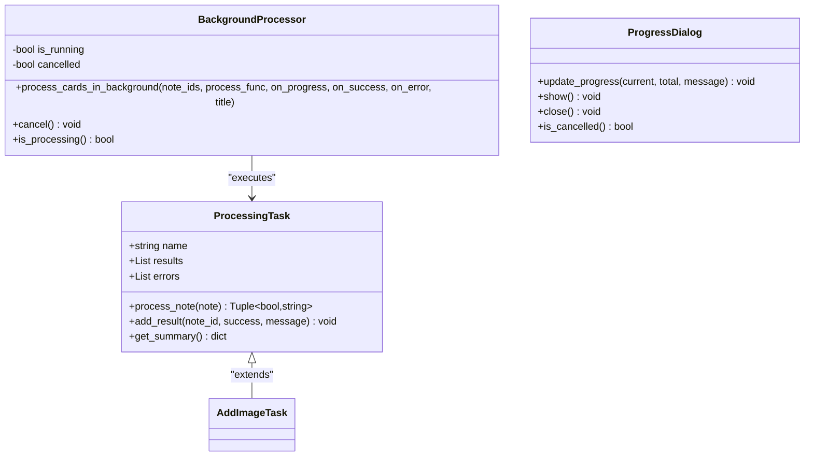
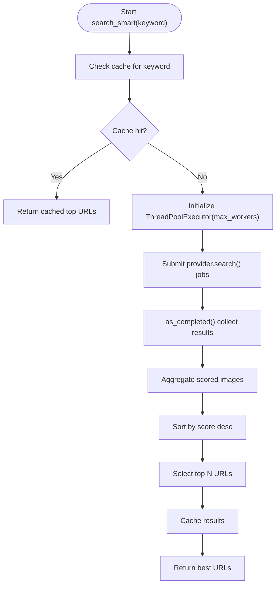
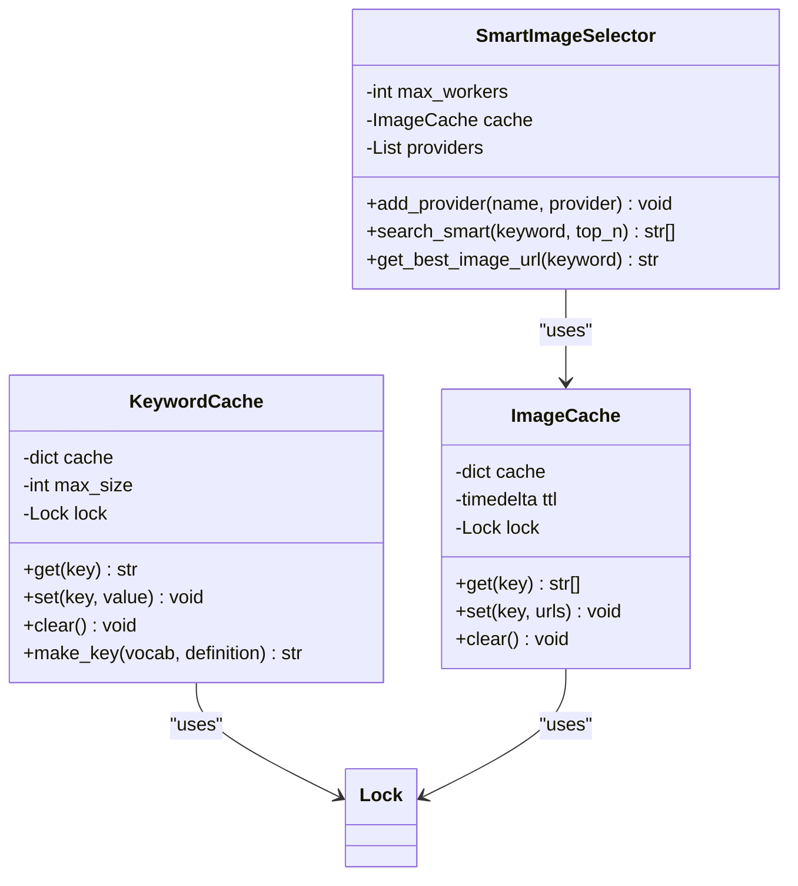
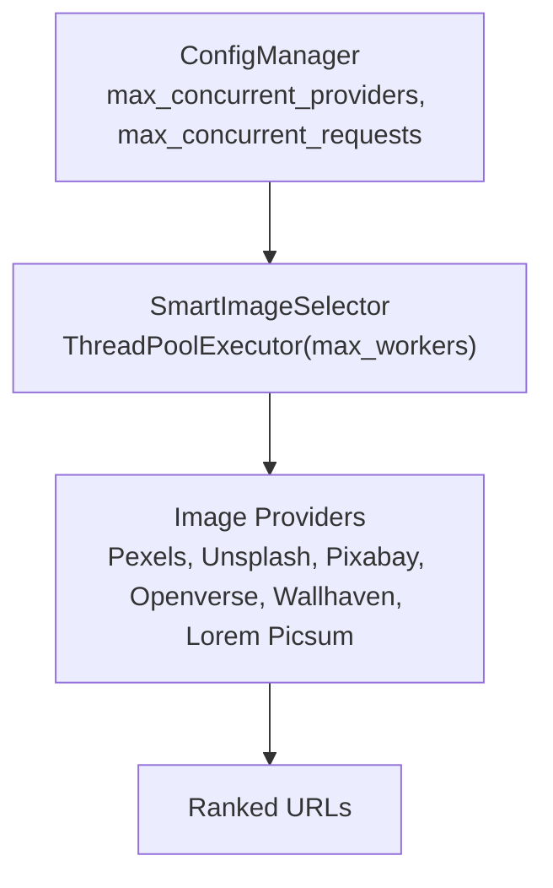
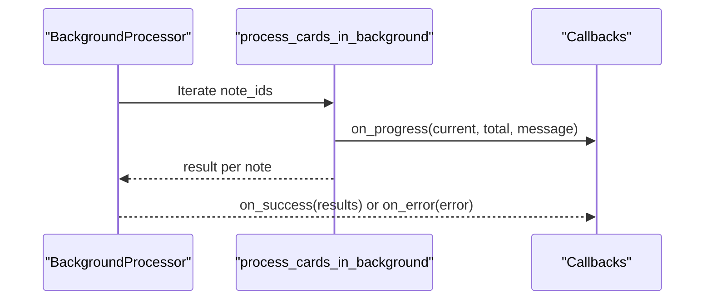
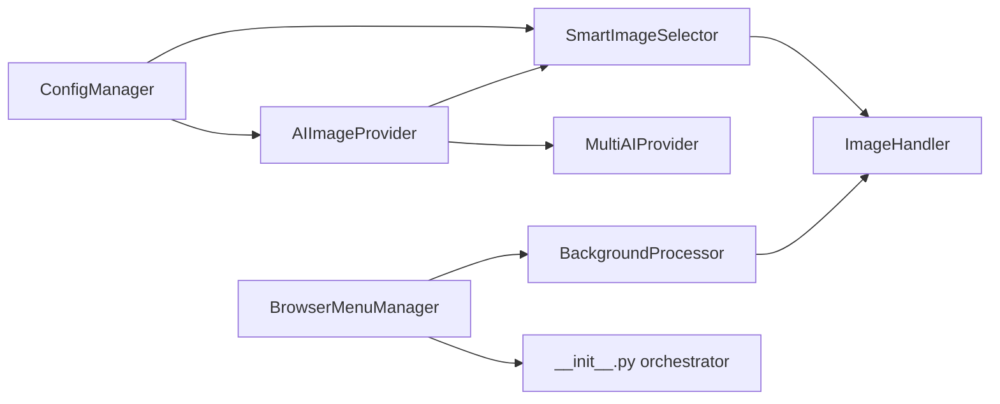

# Concurrent Processing Architecture

<cite>
**Referenced Files in This Document**
- [__init__.py](file://AnkiAI_ImageAddon/__init__.py)
- [bg_handler.py](file://AnkiAI_ImageAddon/modules/bg_handler.py)
- [api_handler.py](file://AnkiAI_ImageAddon/modules/api_handler.py)
- [ai_providers.py](file://AnkiAI_ImageAddon/modules/ai_providers.py)
- [image_providers.py](file://AnkiAI_ImageAddon/modules/image_providers.py)
- [image_handler.py](file://Anki_ImageAddon/modules/image_handler.py)
- [config.py](file://AnkiAI_ImageAddon/modules/config.py)
- [ui.py](file://AnkiAI_ImageAddon/modules/ui.py)
- [ARCHITECTURE.md](file://ARCHITECTURE.md)
- [config.json](file://AnkiAI_ImageAddon/config.json)
- [requirements.txt](file://requirements.txt)
</cite>

## Table of Contents
1. [Introduction](#introduction)
2. [Project Structure](#project-structure)
3. [Core Components](#core-components)
4. [Architecture Overview](#architecture-overview)
5. [Detailed Component Analysis](#detailed-component-analysis)
6. [Dependency Analysis](#dependency-analysis)
7. [Performance Considerations](#performance-considerations)
8. [Troubleshooting Guide](#troubleshooting-guide)
9. [Conclusion](#conclusion)
10. [Appendices](#appendices)

## Introduction
This document explains the concurrent processing architecture of the AnkiAI Image Addon. It focuses on how the add-on performs multi-threaded operations across AI and image providers while preventing UI blocking, managing background tasks, coordinating concurrent provider searches, and controlling resource usage. It also covers thread safety, exception handling, throttling, queue management, progress tracking, and practical configuration recommendations for different environments.

## Project Structure
The add-on is organized into modular components that handle configuration, UI, API integration, image processing, and background execution. The main orchestrator coordinates these modules and exposes a browser menu action to trigger batch operations.

**Diagram sources**
- [__init__.py:1-349](file://AnkiAI_ImageAddon/__init__.py#L1-L349)
- [config.py:1-132](file://AnkiAI_ImageAddon/modules/config.py#L1-L132)
- [ui.py:1-444](file://AnkiAI_ImageAddon/modules/ui.py#L1-L444)
- [api_handler.py:1-229](file://AnkiAI_ImageAddon/modules/api_handler.py#L1-L229)
- [ai_providers.py:1-393](file://AnkiAI_ImageAddon/modules/ai_providers.py#L1-L393)
- [image_providers.py:1-463](file://AnkiAI_ImageAddon/modules/image_providers.py#L1-L463)
- [image_handler.py:1-364](file://AnkiAI_ImageAddon/modules/image_handler.py#L1-L364)
- [bg_handler.py:1-205](file://AnkiAI_ImageAddon/modules/bg_handler.py#L1-L205)

**Section sources**
- [__init__.py:1-349](file://AnkiAI_ImageAddon/__init__.py#L1-L349)
- [ARCHITECTURE.md:1-481](file://ARCHITECTURE.md#L1-L481)

## Core Components
- BackgroundProcessor: Runs long-running operations off the UI thread using Anki’s QueryOp, with progress callbacks and cancellation support.
- ProcessingTask: Base class for tasks that operate on individual notes; subclasses implement per-note processing.
- AIImageProvider: Integrates AI keyword generation and smart image selection with concurrent provider search.
- SmartImageSelector: Concurrently queries multiple image providers, ranks results, and caches outcomes.
- ImageHandler: Downloads, optimizes, saves, and inserts images into notes with thread-safe operations.
- ConfigManager: Centralized configuration with concurrency-related settings and defaults.

**Section sources**
- [bg_handler.py:12-205](file://AnkiAI_ImageAddon/modules/bg_handler.py#L12-L205)
- [api_handler.py:74-229](file://AnkiAI_ImageAddon/modules/api_handler.py#L74-L229)
- [image_providers.py:373-463](file://AnkiAI_ImageAddon/modules/image_providers.py#L373-L463)
- [image_handler.py:36-364](file://AnkiAI_ImageAddon/modules/image_handler.py#L36-L364)
- [config.py:18-132](file://AnkiAI_ImageAddon/modules/config.py#L18-L132)

## Architecture Overview
The add-on follows a four-stage pipeline: UI selection, background processing, AI and image operations, and note updates. Background processing ensures the UI remains responsive, while concurrent provider search accelerates image discovery.

**Diagram sources**
- [__init__.py:99-274](file://AnkiAI_ImageAddon/__init__.py#L99-L274)
- [bg_handler.py:23-100](file://AnkiAI_ImageAddon/modules/bg_handler.py#L23-L100)
- [api_handler.py:187-229](file://AnkiAI_ImageAddon/modules/api_handler.py#L187-L229)
- [image_providers.py:411-455](file://AnkiAI_ImageAddon/modules/image_providers.py#L411-L455)
- [image_handler.py:326-364](file://AnkiAI_ImageAddon/modules/image_handler.py#L326-L364)

## Detailed Component Analysis

### Background Processing and UI Blocking Prevention
- Uses Anki’s QueryOp to run long operations in the background without freezing the UI.
- Provides progress callbacks, success/error handlers, and cancellation support.
- Tracks running state and cancellation flag to gracefully stop processing.

**Diagram sources**
- [bg_handler.py:12-205](file://AnkiAI_ImageAddon/modules/bg_handler.py#L12-L205)
- [__init__.py:27-97](file://AnkiAI_ImageAddon/__init__.py#L27-L97)

**Section sources**
- [bg_handler.py:12-109](file://AnkiAI_ImageAddon/modules/bg_handler.py#L12-L109)
- [__init__.py:27-97](file://AnkiAI_ImageAddon/__init__.py#L27-L97)

### Concurrent Provider Search Mechanism
- SmartImageSelector runs multiple image provider searches concurrently using ThreadPoolExecutor.
- Each provider search is wrapped in a future; results are collected as they complete.
- Scores are calculated per image using provider reputation, URL quality, and title relevance.
- Results are sorted by score and cached for subsequent queries.

**Diagram sources**
- [image_providers.py:411-455](file://AnkiAI_ImageAddon/modules/image_providers.py#L411-L455)
- [image_providers.py:379-455](file://AnkiAI_ImageAddon/modules/image_providers.py#L379-L455)

**Section sources**
- [image_providers.py:373-463](file://AnkiAI_ImageAddon/modules/image_providers.py#L373-L463)
- [api_handler.py:120-186](file://AnkiAI_ImageAddon/modules/api_handler.py#L120-L186)

### Thread Safety and Exception Handling
- KeywordCache and ImageCache use locks to ensure thread-safe access to shared dictionaries.
- SmartImageSelector catches exceptions per provider and logs failures without stopping the entire operation.
- BackgroundProcessor collects per-item errors and continues processing until completion or cancellation.
- AI providers wrap network errors into provider-specific exceptions for consistent handling.

**Diagram sources**
- [api_handler.py:42-72](file://AnkiAI_ImageAddon/modules/api_handler.py#L42-L72)
- [image_providers.py:69-102](file://AnkiAI_ImageAddon/modules/image_providers.py#L69-L102)
- [image_providers.py:379-455](file://AnkiAI_ImageAddon/modules/image_providers.py#L379-L455)
- [bg_handler.py:48-100](file://AnkiAI_ImageAddon/modules/bg_handler.py#L48-L100)

**Section sources**
- [api_handler.py:42-72](file://AnkiAI_ImageAddon/modules/api_handler.py#L42-L72)
- [image_providers.py:69-102](file://AnkiAI_ImageAddon/modules/image_providers.py#L69-L102)
- [bg_handler.py:48-100](file://AnkiAI_ImageAddon/modules/bg_handler.py#L48-L100)

### Semaphore-Based Throttling and Resource Allocation
- The SmartImageSelector uses ThreadPoolExecutor with a configurable max_workers parameter to cap concurrent provider requests.
- The configuration module defines max_concurrent_providers and max_concurrent_requests, enabling users to tune concurrency for their hardware and provider limits.
- ImageHandler reduces per-request timeouts and retries to balance responsiveness and reliability.

**Diagram sources**
- [config.py:57-63](file://AnkiAI_ImageAddon/modules/config.py#L57-L63)
- [api_handler.py:124-125](file://AnkiAI_ImageAddon/modules/api_handler.py#L124-L125)
- [image_providers.py:379-455](file://AnkiAI_ImageAddon/modules/image_providers.py#L379-L455)

**Section sources**
- [config.py:57-63](file://AnkiAI_ImageAddon/modules/config.py#L57-L63)
- [image_providers.py:379-455](file://AnkiAI_ImageAddon/modules/image_providers.py#L379-L455)

### Queue Management and Progress Tracking
- BackgroundProcessor iterates through note IDs sequentially, invoking a per-note process function and updating progress callbacks.
- The orchestrator passes on_progress, on_success, and on_error callbacks to the processor, which propagate results back to the UI.
- The UI displays a modal progress dialog and summarizes successes and failures upon completion.

**Diagram sources**
- [bg_handler.py:23-100](file://AnkiAI_ImageAddon/modules/bg_handler.py#L23-L100)
- [__init__.py:234-273](file://AnkiAI_ImageAddon/__init__.py#L234-L273)

**Section sources**
- [bg_handler.py:23-100](file://AnkiAI_ImageAddon/modules/bg_handler.py#L23-L100)
- [__init__.py:234-273](file://AnkiAI_ImageAddon/__init__.py#L234-L273)

### Practical Configuration Recommendations
- Default concurrency settings are tuned for balanced performance and stability. Adjust based on:
  - Network conditions and provider rate limits.
  - CPU/memory availability.
  - Batch size (larger batches increase memory pressure).
- Example scenarios:
  - Low-power devices: reduce max_concurrent_providers and max_concurrent_requests.
  - High-bandwidth machines: increase max_concurrent_providers moderately.
  - Shared networks: lower concurrency to avoid throttling.

**Section sources**
- [config.py:57-63](file://AnkiAI_ImageAddon/modules/config.py#L57-L63)
- [config.json:30-31](file://AnkiAI_ImageAddon/config.json#L30-L31)

## Dependency Analysis
The add-on’s concurrency relies on Python’s concurrent.futures for provider search and Anki’s QueryOp for background execution. Configuration drives concurrency limits, while thread-safe caches protect shared state.

**Diagram sources**
- [config.py:18-132](file://AnkiAI_ImageAddon/modules/config.py#L18-L132)
- [api_handler.py:74-229](file://AnkiAI_ImageAddon/modules/api_handler.py#L74-L229)
- [image_providers.py:373-463](file://AnkiAI_ImageAddon/modules/image_providers.py#L373-L463)
- [image_handler.py:36-364](file://AnkiAI_ImageAddon/modules/image_handler.py#L36-L364)
- [bg_handler.py:12-205](file://AnkiAI_ImageAddon/modules/bg_handler.py#L12-L205)
- [ui.py:13-94](file://AnkiAI_ImageAddon/modules/ui.py#L13-L94)
- [__init__.py:309-349](file://AnkiAI_ImageAddon/__init__.py#L309-L349)

**Section sources**
- [requirements.txt:10-19](file://requirements.txt#L10-L19)
- [ARCHITECTURE.md:114-149](file://ARCHITECTURE.md#L114-L149)

## Performance Considerations
- Concurrency tuning: Use max_concurrent_providers and max_concurrent_requests to match hardware and provider capacity.
- Caching: KeywordCache and ImageCache reduce redundant API calls and improve throughput.
- Image optimization: ImageHandler reduces file sizes and speeds up storage and sync.
- Timeouts and retries: Balanced defaults minimize stalls while preserving reliability.

[No sources needed since this section provides general guidance]

## Troubleshooting Guide
Common issues and remedies:
- UI freezes during batch operations: Verify background processing is active and not cancelled.
- Provider failures: Check API keys and provider availability; fallbacks are automatic.
- Memory pressure: Reduce concurrency settings or batch size.
- Rate limiting: Lower max_concurrent_requests and implement backoff strategies.

**Section sources**
- [bg_handler.py:48-100](file://AnkiAI_ImageAddon/modules/bg_handler.py#L48-L100)
- [image_providers.py:411-455](file://AnkiAI_ImageAddon/modules/image_providers.py#L411-L455)
- [config.py:57-63](file://AnkiAI_ImageAddon/modules/config.py#L57-L63)

## Conclusion
The AnkiAI Image Addon achieves responsive, scalable batch processing by combining Anki’s QueryOp for background execution with concurrent provider search powered by ThreadPoolExecutor. Robust configuration, thread-safe caching, and layered error handling ensure reliable operation across diverse environments. Tuning concurrency and leveraging caching yields significant performance gains while maintaining stability.

[No sources needed since this section summarizes without analyzing specific files]

## Appendices

### Configuration Reference
- Concurrency settings:
  - max_concurrent_providers: Controls concurrent image provider searches.
  - max_concurrent_requests: Controls concurrent image downloads.
- Caching:
  - enable_keyword_cache, keyword_cache_size: Keyword caching for AI calls.
  - enable_smart_selection, smart_cache_ttl_minutes: Smart selection caching.
- Image optimization:
  - image_download_timeout, image_download_retries, enable_image_optimization, image_max_width, image_quality.

**Section sources**
- [config.py:21-63](file://AnkiAI_ImageAddon/modules/config.py#L21-L63)
- [config.json:12-31](file://AnkiAI_ImageAddon/config.json#L12-L31)