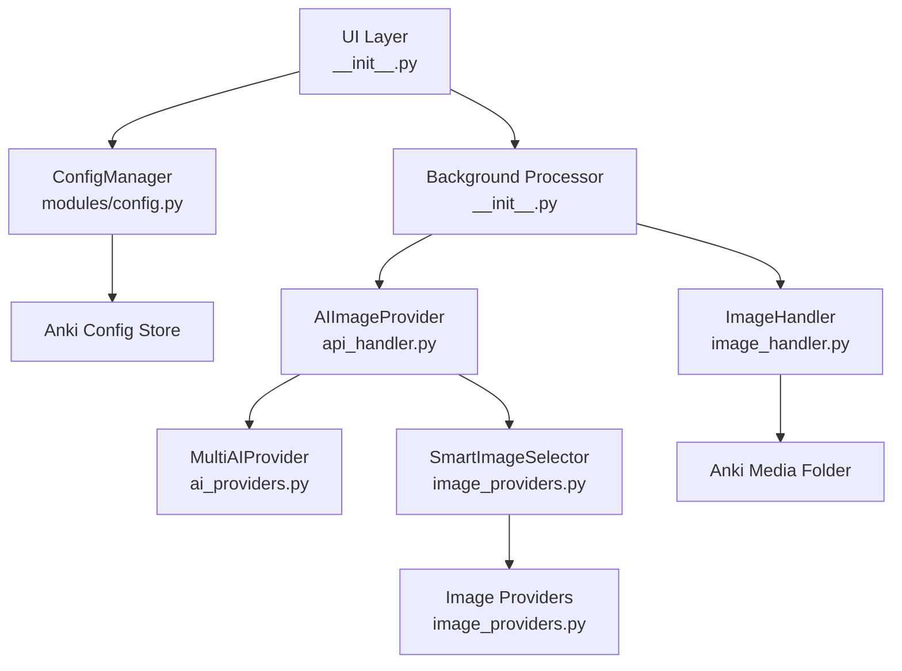
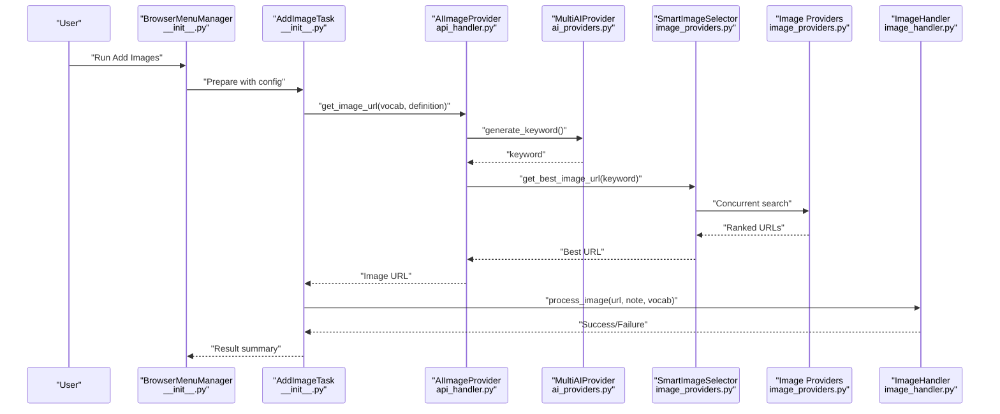
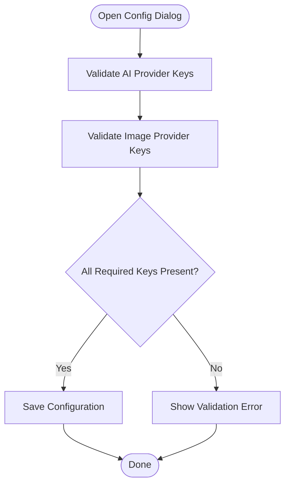
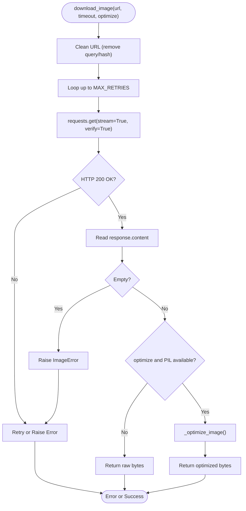
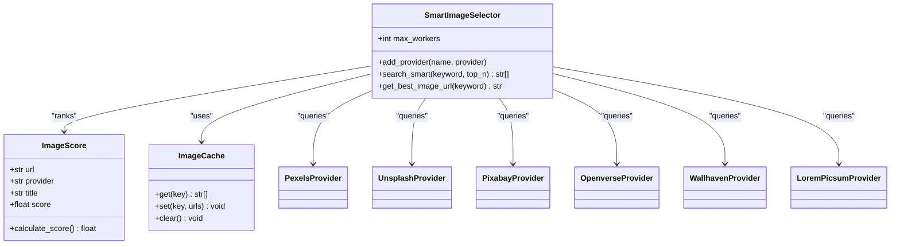
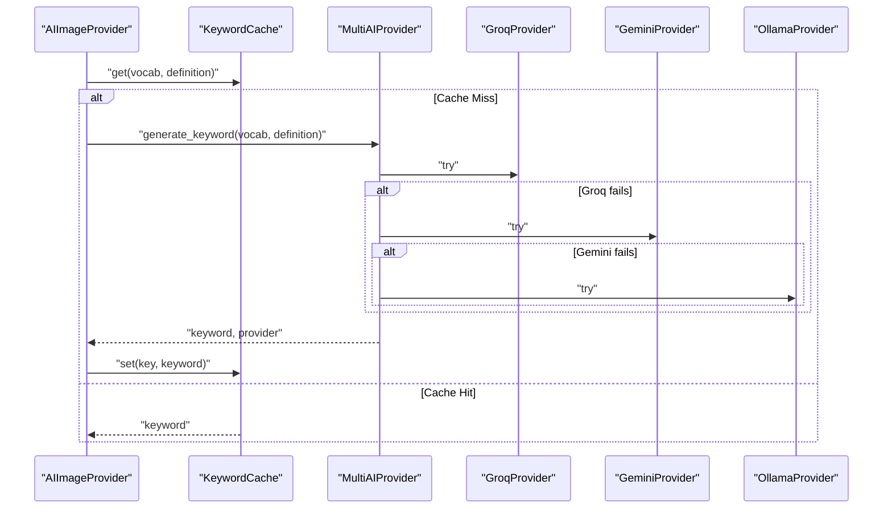
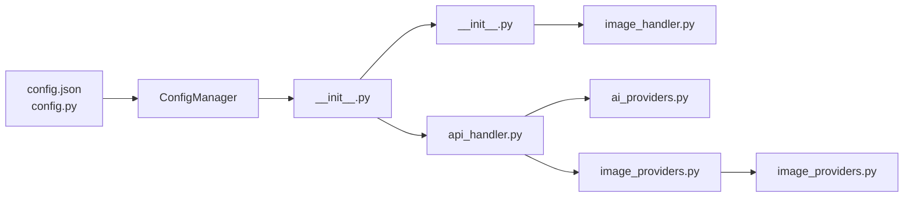

# Configuration and Parameter Tuning

<cite>
**Referenced Files in This Document**
- [config.json](file://AnkiAI_ImageAddon/config.json)
- [config.py](file://AnkiAI_ImageAddon/modules/config.py)
- [image_handler.py](file://AnkiAI_ImageAddon/modules/image_handler.py)
- [api_handler.py](file://AnkiAI_ImageAddon/modules/api_handler.py)
- [image_providers.py](file://AnkiAI_ImageAddon/modules/image_providers.py)
- [ai_providers.py](file://AnkiAI_ImageAddon/modules/ai_providers.py)
- [__init__.py](file://AnkiAI_ImageAddon/__init__.py)
- [PERFORMANCE_TIPS.md](file://PERFORMANCE_TIPS.md)
- [README.md](file://README.md)
- [manifest.json](file://AnkiAI_ImageAddon/manifest.json)
</cite>

## Table of Contents
1. [Introduction](#introduction)
2. [Project Structure](#project-structure)
3. [Core Components](#core-components)
4. [Architecture Overview](#architecture-overview)
5. [Detailed Component Analysis](#detailed-component-analysis)
6. [Dependency Analysis](#dependency-analysis)
7. [Performance Considerations](#performance-considerations)
8. [Troubleshooting Guide](#troubleshooting-guide)
9. [Conclusion](#conclusion)
10. [Appendices](#appendices)

## Introduction
This document provides a comprehensive guide to optimizing configuration and tuning parameters for the AnkiAI Image Addon. It focuses on performance-related settings including max_concurrent_requests, image_download_timeout, image_max_width, and image_quality. You will learn how each parameter affects processing speed, resource usage, and output quality, along with scenario-based recommendations for language learning, academic publishing, budget-conscious projects, and mobile-first workflows. Advanced tuning profiles for ultra-fast processing, ultra-reliable operations, and minimal storage are included, alongside the configuration validation system and error handling for suboptimal settings. Practical configuration profiles and dynamic adjustment strategies are provided to adapt to varying system capabilities and network conditions.

## Project Structure
The AnkiAI Image Addon is organized around modular components that handle configuration, UI, background processing, AI keyword generation, image downloading, and provider selection. The configuration system reads from and writes to Anki’s configuration store via a singleton manager, while the runtime pipeline integrates these settings into the processing chain.

**Diagram sources**
- [config.py:18-98](file://AnkiAI_ImageAddon/modules/config.py#L18-L98)
- [__init__.py:176-208](file://AnkiAI_ImageAddon/__init__.py#L176-L208)
- [api_handler.py:74-228](file://AnkiAI_ImageAddon/modules/api_handler.py#L74-L228)
- [ai_providers.py:297-393](file://AnkiAI_ImageAddon/modules/ai_providers.py#L297-L393)
- [image_providers.py:373-462](file://AnkiAI_ImageAddon/modules/image_providers.py#L373-L462)
- [image_handler.py:36-364](file://AnkiAI_ImageAddon/modules/image_handler.py#L36-L364)

**Section sources**
- [config.py:18-98](file://AnkiAI_ImageAddon/modules/config.py#L18-L98)
- [__init__.py:176-208](file://AnkiAI_ImageAddon/__init__.py#L176-L208)

## Core Components
This section documents the performance-related configuration parameters and their impact on the system.

- max_concurrent_requests
  - Purpose: Controls the number of concurrent image download operations.
  - Impact: Higher concurrency increases throughput but also CPU and memory usage; lower concurrency reduces resource consumption but may slow processing.
  - Default and typical ranges: Defaults vary by mode; adjust based on network stability and device resources.
  - Related settings: max_concurrent_providers influences concurrent provider searches in smart selection.

- image_download_timeout
  - Purpose: Sets the timeout for individual image download attempts.
  - Impact: Lower timeout accelerates failure detection but risks more timeouts on unstable networks; higher timeout improves reliability at the cost of latency.
  - Typical tuning: Fast internet: shorter; slow or unreliable connections: longer.

- image_max_width
  - Purpose: Resizes images to a maximum width during optimization.
  - Impact: Larger widths improve perceived quality but increase file size and sync time; smaller widths reduce storage and bandwidth usage.
  - Default behavior: The handler applies a default width optimized for speed and size.

- image_quality
  - Purpose: Controls JPEG compression quality during optimization.
  - Impact: Higher quality improves visual fidelity but increases file size; lower quality reduces size but may degrade appearance.
  - Default behavior: The handler applies a default quality optimized for a balance between size and quality.

- enable_image_optimization
  - Purpose: Enables automatic resizing and compression of downloaded images.
  - Impact: Reduces file size and improves sync performance; may slightly increase CPU usage during processing.

- enable_smart_selection and max_concurrent_providers
  - Purpose: Enables concurrent searches across multiple image providers and ranks results intelligently.
  - Impact: Improves quality and resilience by leveraging multiple providers; increases concurrency and potential network usage.

- enable_keyword_cache and keyword_cache_size
  - Purpose: Caches generated keywords to avoid repeated AI calls.
  - Impact: Reduces API usage and speeds up processing; tune cache size for memory constraints.

- enable_concurrent_downloads
  - Purpose: Controls whether concurrent downloads are used during processing.
  - Impact: Parallel downloads improve throughput; ensure sufficient CPU/memory headroom.

**Section sources**
- [config.json:16-31](file://AnkiAI_ImageAddon/config.json#L16-L31)
- [config.py:21-63](file://AnkiAI_ImageAddon/modules/config.py#L21-L63)
- [image_handler.py:130-195](file://AnkiAI_ImageAddon/modules/image_handler.py#L130-L195)
- [api_handler.py:74-228](file://AnkiAI_ImageAddon/modules/api_handler.py#L74-L228)
- [image_providers.py:373-462](file://AnkiAI_ImageAddon/modules/image_providers.py#L373-L462)

## Architecture Overview
The configuration-driven pipeline integrates AI keyword generation, smart image selection, and optimized image downloading and insertion.

**Diagram sources**
- [__init__.py:99-273](file://AnkiAI_ImageAddon/__init__.py#L99-L273)
- [api_handler.py:187-228](file://AnkiAI_ImageAddon/modules/api_handler.py#L187-L228)
- [ai_providers.py:358-393](file://AnkiAI_ImageAddon/modules/ai_providers.py#L358-L393)
- [image_providers.py:411-462](file://AnkiAI_ImageAddon/modules/image_providers.py#L411-L462)
- [image_handler.py:326-364](file://AnkiAI_ImageAddon/modules/image_handler.py#L326-L364)

## Detailed Component Analysis

### Configuration Validation and Error Handling
- API key validation ensures at least one AI provider and one image provider are configured when required by the selected mode.
- The configuration manager persists settings to Anki’s configuration store and exposes a reset-to-default capability.
- UI dialogs validate required inputs and surface errors to the user.

**Diagram sources**
- [config.py:100-119](file://AnkiAI_ImageAddon/modules/config.py#L100-L119)
- [__init__.py:123-145](file://AnkiAI_ImageAddon/__init__.py#L123-L145)

**Section sources**
- [config.py:100-119](file://AnkiAI_ImageAddon/modules/config.py#L100-L119)
- [__init__.py:123-145](file://AnkiAI_ImageAddon/__init__.py#L123-L145)

### Image Download and Optimization Pipeline
- The image handler enforces a reduced timeout and retry count compared to legacy defaults, prioritizing responsiveness.
- Streaming downloads minimize memory footprint; optional optimization resizes and compresses images to a default lightweight target.
- Content-type checks and fallbacks ensure robustness against unexpected responses.

**Diagram sources**
- [image_handler.py:59-128](file://AnkiAI_ImageAddon/modules/image_handler.py#L59-L128)
- [image_handler.py:130-195](file://AnkiAI_ImageAddon/modules/image_handler.py#L130-L195)

**Section sources**
- [image_handler.py:59-128](file://AnkiAI_ImageAddon/modules/image_handler.py#L59-L128)
- [image_handler.py:130-195](file://AnkiAI_ImageAddon/modules/image_handler.py#L130-L195)

### Smart Image Selection and Provider Ranking
- The smart selector concurrently queries multiple providers, computes scores based on provider reliability, URL quality, and title relevance, and caches results for a configurable TTL.
- The maximum number of concurrent provider workers is configurable to balance speed and resource usage.

**Diagram sources**
- [image_providers.py:373-462](file://AnkiAI_ImageAddon/modules/image_providers.py#L373-L462)
- [image_providers.py:29-66](file://AnkiAI_ImageAddon/modules/image_providers.py#L29-L66)
- [image_providers.py:69-101](file://AnkiAI_ImageAddon/modules/image_providers.py#L69-L101)

**Section sources**
- [image_providers.py:373-462](file://AnkiAI_ImageAddon/modules/image_providers.py#L373-L462)
- [image_providers.py:29-66](file://AnkiAI_ImageAddon/modules/image_providers.py#L29-L66)
- [image_providers.py:69-101](file://AnkiAI_ImageAddon/modules/image_providers.py#L69-L101)

### AI Keyword Generation and Fallback
- MultiAIProvider supports Groq (fast), Gemini (quality), and Ollama (local) with automatic fallback and logging.
- Keyword caching reduces redundant API calls and improves throughput.

**Diagram sources**
- [api_handler.py:42-71](file://AnkiAI_ImageAddon/modules/api_handler.py#L42-L71)
- [ai_providers.py:297-393](file://AnkiAI_ImageAddon/modules/ai_providers.py#L297-L393)

**Section sources**
- [api_handler.py:42-71](file://AnkiAI_ImageAddon/modules/api_handler.py#L42-L71)
- [ai_providers.py:297-393](file://AnkiAI_ImageAddon/modules/ai_providers.py#L297-L393)

## Dependency Analysis
Configuration parameters flow from the configuration store into runtime components. The UI initializes providers and tasks using current configuration values, while the background processor coordinates long-running operations.

**Diagram sources**
- [config.json:1-35](file://AnkiAI_ImageAddon/config.json#L1-L35)
- [config.py:68-98](file://AnkiAI_ImageAddon/modules/config.py#L68-L98)
- [__init__.py:176-208](file://AnkiAI_ImageAddon/__init__.py#L176-L208)
- [api_handler.py:74-228](file://AnkiAI_ImageAddon/modules/api_handler.py#L74-L228)
- [image_handler.py:36-364](file://AnkiAI_ImageAddon/modules/image_handler.py#L36-L364)

**Section sources**
- [config.json:1-35](file://AnkiAI_ImageAddon/config.json#L1-L35)
- [config.py:68-98](file://AnkiAI_ImageAddon/modules/config.py#L68-L98)
- [__init__.py:176-208](file://AnkiAI_ImageAddon/__init__.py#L176-L208)

## Performance Considerations
- Concurrency tuning
  - Increase max_concurrent_requests for fast networks to maximize throughput; decrease for constrained environments to reduce memory pressure.
  - Adjust max_concurrent_providers to balance provider diversity and resource usage in smart selection.
- Timeout tuning
  - Shorten image_download_timeout for responsive failure detection; lengthen for unreliable networks to improve success rates.
- Image optimization
  - Enable image optimization to reduce file sizes and sync times; tune image_max_width and image_quality to meet quality and storage targets.
- Caching
  - Enable keyword cache to reduce repeated AI calls; monitor cache size to fit available memory.
- Mode selection
  - Prefer search mode for speed and cost; use DALL-E mode when unique illustrations are required.

**Section sources**
- [config.json:16-31](file://AnkiAI_ImageAddon/config.json#L16-L31)
- [config.py:21-63](file://AnkiAI_ImageAddon/modules/config.py#L21-L63)
- [image_handler.py:130-195](file://AnkiAI_ImageAddon/modules/image_handler.py#L130-L195)
- [PERFORMANCE_TIPS.md:72-190](file://PERFORMANCE_TIPS.md#L72-L190)

## Troubleshooting Guide
- Suboptimal settings symptoms and remedies
  - Slow processing: reduce max_concurrent_requests and image_download_timeout; enable image optimization; prefer search mode.
  - High memory usage: lower concurrency; disable concurrent downloads; reduce image_max_width.
  - Frequent timeouts: increase image_download_timeout; reduce max_concurrent_requests; switch to more reliable providers.
  - Large storage footprint: lower image_quality and image_max_width; enable optimization.
- Validation and error handling
  - API key validation ensures at least one AI provider and one image provider are configured; UI dialogs surface validation errors.
  - Image handler raises specific errors for timeouts, empty responses, and processing failures; background processor reports errors and summaries.

**Section sources**
- [config.py:100-119](file://AnkiAI_ImageAddon/modules/config.py#L100-L119)
- [image_handler.py:114-128](file://AnkiAI_ImageAddon/modules/image_handler.py#L114-L128)
- [__init__.py:257-259](file://AnkiAI_ImageAddon/__init__.py#L257-L259)

## Conclusion
By aligning configuration parameters with use-case requirements—speed, quality, cost, and storage—you can achieve optimal performance from the AnkiAI Image Addon. Start with recommended defaults, validate settings through the UI, and iteratively adjust concurrency, timeouts, and optimization parameters based on observed performance and resource constraints.

## Appendices

### Scenario-Based Configuration Recommendations
- Language learning (fast, cost-effective)
  - Use search mode with Pexels; moderate concurrency; enable optimization.
  - Example profile: search mode, Pexels API key, enable optimization, moderate concurrency.
- Academic publishing (high quality)
  - Use DALL-E mode or high-quality search; enable optimization; balanced concurrency.
- Budget-conscious projects
  - Use search mode with Pixabay; enable optimization; conservative concurrency.
- Mobile-first workflows
  - Use search mode; enable optimization; ensure responsive image insertion.

**Section sources**
- [PERFORMANCE_TIPS.md:289-345](file://PERFORMANCE_TIPS.md#L289-L345)

### Advanced Tuning Profiles
- Ultra-fast processing
  - Trade-offs: increased failures; use shorter timeouts and higher concurrency judiciously.
- Ultra-reliable operations
  - Trade-offs: slower throughput; use longer timeouts and lower concurrency.
- Minimal storage requirements
  - Trade-offs: lower quality; reduce image quality and width.

**Section sources**
- [PERFORMANCE_TIPS.md:348-388](file://PERFORMANCE_TIPS.md#L348-L388)

### Practical Configuration Profiles
- Example profiles for different system capabilities and network conditions
  - Profiles are documented in the performance tips and can be adapted to your environment.

**Section sources**
- [PERFORMANCE_TIPS.md:391-436](file://PERFORMANCE_TIPS.md#L391-L436)

### Dynamic Adjustment and Adaptive Optimization
- Monitor processing time and error rates; adjust max_concurrent_requests and image_download_timeout accordingly.
- Observe memory usage and CPU utilization; scale concurrency down when thresholds are exceeded.
- Periodically review image file sizes and sync times; fine-tune image_max_width and image_quality.

**Section sources**
- [PERFORMANCE_TIPS.md:457-471](file://PERFORMANCE_TIPS.md#L457-L471)