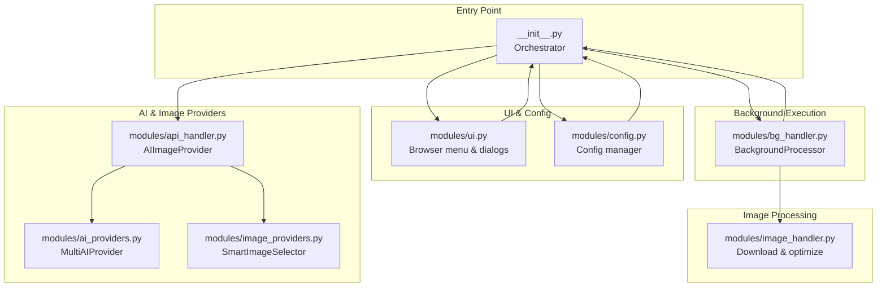
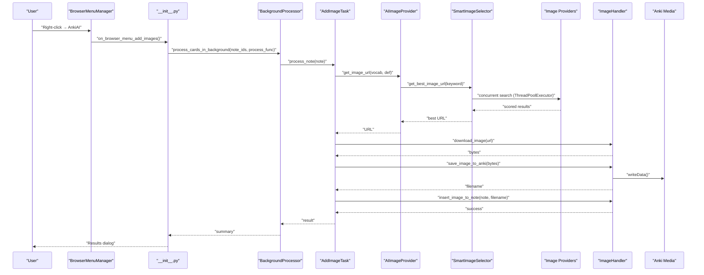
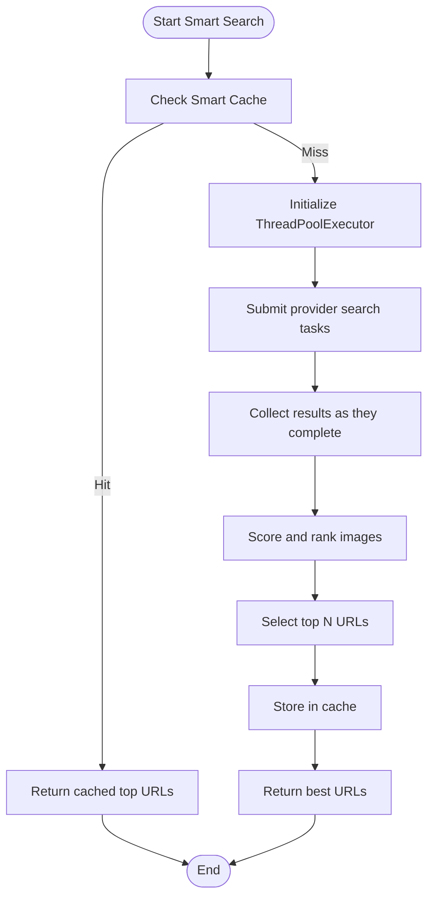
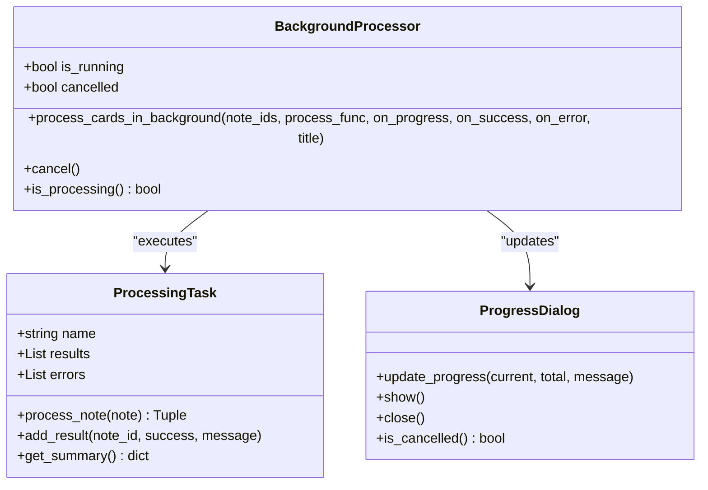
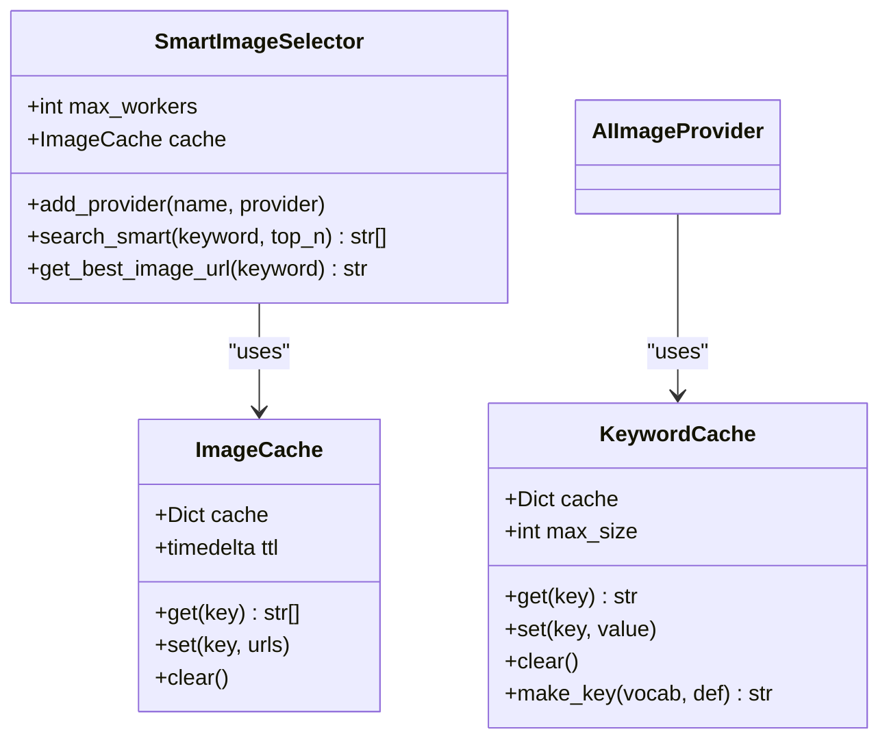
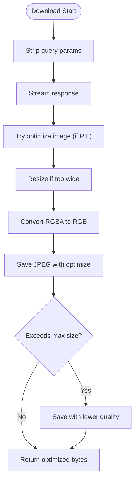
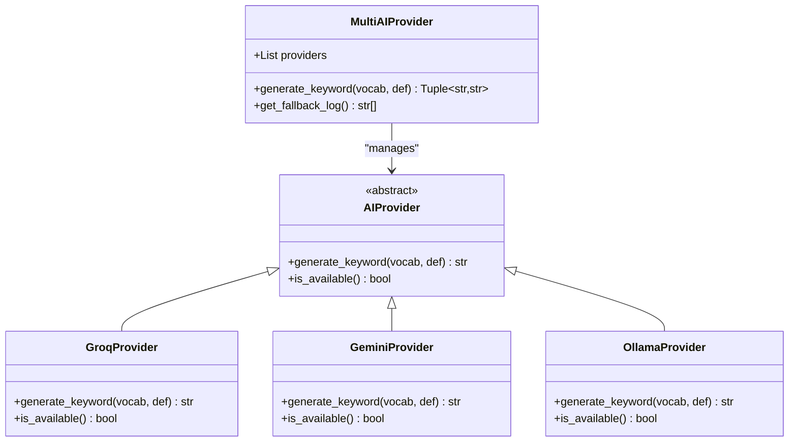
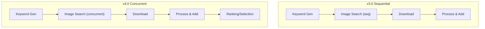
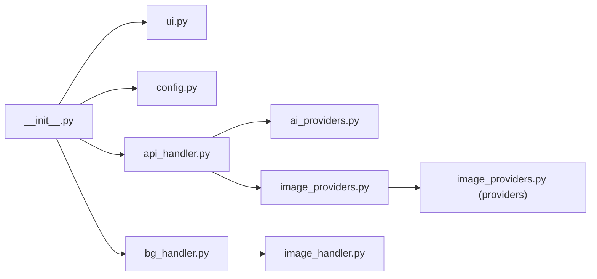

# Performance & Optimization

<cite>
**Referenced Files in This Document**
- [PERFORMANCE_BENCHMARK_V4.md](file://PERFORMANCE_BENCHMARK_V4.md)
- [PERFORMANCE_TIPS.md](file://PERFORMANCE_TIPS.md)
- [ARCHITECTURE.md](file://ARCHITECTURE.md)
- [AnkiAI_ImageAddon/__init__.py](file://AnkiAI_ImageAddon/__init__.py)
- [AnkiAI_ImageAddon/modules/config.py](file://AnkiAI_ImageAddon/modules/config.py)
- [AnkiAI_ImageAddon/modules/ui.py](file://AnkiAI_ImageAddon/modules/ui.py)
- [AnkiAI_ImageAddon/modules/api_handler.py](file://AnkiAI_ImageAddon/modules/api_handler.py)
- [AnkiAI_ImageAddon/modules/image_providers.py](file://AnkiAI_ImageAddon/modules/image_providers.py)
- [AnkiAI_ImageAddon/modules/ai_providers.py](file://AnkiAI_ImageAddon/modules/ai_providers.py)
- [AnkiAI_ImageAddon/modules/image_handler.py](file://AnkiAI_ImageAddon/modules/image_handler.py)
- [AnkiAI_ImageAddon/modules/bg_handler.py](file://AnkiAI_ImageAddon/modules/bg_handler.py)
</cite>

## Table of Contents
1. [Introduction](#introduction)
2. [Project Structure](#project-structure)
3. [Core Components](#core-components)
4. [Architecture Overview](#architecture-overview)
5. [Detailed Component Analysis](#detailed-component-analysis)
6. [Dependency Analysis](#dependency-analysis)
7. [Performance Considerations](#performance-considerations)
8. [Troubleshooting Guide](#troubleshooting-guide)
9. [Conclusion](#conclusion)
10. [Appendices](#appendices)

## Introduction
This document explains the performance optimization and benchmarking features of AnkiAI Image Addon v4.0. It covers the concurrent processing architecture enabling simultaneous operations across multiple AI and image providers, the background processing system preventing UI blocking, caching mechanisms minimizing redundant operations, memory management strategies, and benchmarking results. Practical tuning tips and guidelines for large-scale operations are included.

## Project Structure
The add-on is organized into clearly separated modules that implement distinct stages of the pipeline: configuration, UI, AI and image provider orchestration, image download and processing, and background execution. The main entry orchestrates the workflow and integrates components.

**Diagram sources**
- [AnkiAI_ImageAddon/__init__.py:1-349](file://AnkiAI_ImageAddon/__init__.py#L1-L349)
- [AnkiAI_ImageAddon/modules/config.py:1-132](file://AnkiAI_ImageAddon/modules/config.py#L1-L132)
- [AnkiAI_ImageAddon/modules/ui.py:1-444](file://AnkiAI_ImageAddon/modules/ui.py#L1-L444)
- [AnkiAI_ImageAddon/modules/api_handler.py:1-229](file://AnkiAI_ImageAddon/modules/api_handler.py#L1-L229)
- [AnkiAI_ImageAddon/modules/ai_providers.py:1-393](file://AnkiAI_ImageAddon/modules/ai_providers.py#L1-L393)
- [AnkiAI_ImageAddon/modules/image_providers.py:1-463](file://AnkiAI_ImageAddon/modules/image_providers.py#L1-L463)
- [AnkiAI_ImageAddon/modules/image_handler.py:1-364](file://AnkiAI_ImageAddon/modules/image_handler.py#L1-L364)
- [AnkiAI_ImageAddon/modules/bg_handler.py:1-205](file://AnkiAI_ImageAddon/modules/bg_handler.py#L1-L205)

**Section sources**
- [ARCHITECTURE.md:1-481](file://ARCHITECTURE.md#L1-L481)
- [AnkiAI_ImageAddon/__init__.py:1-349](file://AnkiAI_ImageAddon/__init__.py#L1-L349)

## Core Components
- Configuration and defaults: centralized configuration with performance-oriented defaults and validation.
- UI and field selection: interactive dialogs to choose fields and configure providers.
- AI provider integration: multi-provider fallback with Gemini, Groq, and Ollama.
- Smart image selection: concurrent provider search with scoring and caching.
- Image handler: optimized download, lightweight optimization, and safe write-through to Anki media.
- Background processor: non-blocking execution using Anki’s QueryOp framework.

**Section sources**
- [AnkiAI_ImageAddon/modules/config.py:18-132](file://AnkiAI_ImageAddon/modules/config.py#L18-L132)
- [AnkiAI_ImageAddon/modules/ui.py:13-444](file://AnkiAI_ImageAddon/modules/ui.py#L13-L444)
- [AnkiAI_ImageAddon/modules/ai_providers.py:24-393](file://AnkiAI_ImageAddon/modules/ai_providers.py#L24-L393)
- [AnkiAI_ImageAddon/modules/image_providers.py:29-463](file://AnkiAI_ImageAddon/modules/image_providers.py#L29-L463)
- [AnkiAI_ImageAddon/modules/image_handler.py:36-364](file://AnkiAI_ImageAddon/modules/image_handler.py#L36-L364)
- [AnkiAI_ImageAddon/modules/bg_handler.py:12-205](file://AnkiAI_ImageAddon/modules/bg_handler.py#L12-L205)

## Architecture Overview
The pipeline runs in four stages:
1. UI: user selects cards and fields; configuration dialog is shown if needed.
2. Orchestration: the main entry initializes providers and tasks.
3. Background processing: each note is processed concurrently without blocking the UI.
4. Image pipeline: keyword generation, smart image selection, download, optimization, and insertion.

**Diagram sources**
- [AnkiAI_ImageAddon/__init__.py:99-274](file://AnkiAI_ImageAddon/__init__.py#L99-L274)
- [AnkiAI_ImageAddon/modules/bg_handler.py:23-101](file://AnkiAI_ImageAddon/modules/bg_handler.py#L23-L101)
- [AnkiAI_ImageAddon/modules/api_handler.py:187-228](file://AnkiAI_ImageAddon/modules/api_handler.py#L187-L228)
- [AnkiAI_ImageAddon/modules/image_providers.py:411-463](file://AnkiAI_ImageAddon/modules/image_providers.py#L411-L463)
- [AnkiAI_ImageAddon/modules/image_handler.py:59-364](file://AnkiAI_ImageAddon/modules/image_handler.py#L59-L364)

## Detailed Component Analysis

### Concurrent Processing Architecture
- Smart image selection uses a thread pool to query multiple providers concurrently, then ranks results by a scoring system before selecting the best URL.
- The maximum concurrency for provider requests is configurable, enabling tuning for different environments.
- The background processor executes tasks using Anki’s QueryOp to keep the UI responsive.

**Diagram sources**
- [AnkiAI_ImageAddon/modules/image_providers.py:411-463](file://AnkiAI_ImageAddon/modules/image_providers.py#L411-L463)

**Section sources**
- [AnkiAI_ImageAddon/modules/image_providers.py:373-463](file://AnkiAI_ImageAddon/modules/image_providers.py#L373-L463)
- [AnkiAI_ImageAddon/modules/bg_handler.py:23-101](file://AnkiAI_ImageAddon/modules/bg_handler.py#L23-L101)

### Background Processing with QueryOp
- The background processor wraps long-running operations in a QueryOp, displaying a progress dialog and allowing cancellation.
- It iterates over selected note IDs, invoking a task function per note and aggregating results and errors.

**Diagram sources**
- [AnkiAI_ImageAddon/modules/bg_handler.py:12-205](file://AnkiAI_ImageAddon/modules/bg_handler.py#L12-L205)

**Section sources**
- [AnkiAI_ImageAddon/modules/bg_handler.py:12-205](file://AnkiAI_ImageAddon/modules/bg_handler.py#L12-L205)
- [ARCHITECTURE.md:200-245](file://ARCHITECTURE.md#L200-L245)

### Caching Mechanisms
- Keyword cache: thread-safe cache for generated keywords keyed by vocabulary and definition, preventing repeated AI calls.
- Smart image result cache: caches top URLs for a given keyword with a configurable TTL, dramatically reducing repeated searches.
- Both caches use locks for thread safety and are designed to minimize memory overhead while maximizing throughput.

**Diagram sources**
- [AnkiAI_ImageAddon/modules/api_handler.py:42-72](file://AnkiAI_ImageAddon/modules/api_handler.py#L42-L72)
- [AnkiAI_ImageAddon/modules/image_providers.py:69-102](file://AnkiAI_ImageAddon/modules/image_providers.py#L69-L102)
- [AnkiAI_ImageAddon/modules/image_providers.py:373-463](file://AnkiAI_ImageAddon/modules/image_providers.py#L373-L463)

**Section sources**
- [AnkiAI_ImageAddon/modules/api_handler.py:42-72](file://AnkiAI_ImageAddon/modules/api_handler.py#L42-L72)
- [AnkiAI_ImageAddon/modules/image_providers.py:69-102](file://AnkiAI_ImageAddon/modules/image_providers.py#L69-L102)
- [AnkiAI_ImageAddon/modules/image_providers.py:411-463](file://AnkiAI_ImageAddon/modules/image_providers.py#L411-L463)

### Memory Management and Image Optimization
- Download optimization: stream responses to reduce peak memory usage, enforce shorter timeouts and fewer retries, and remove query parameters to reduce payload size.
- Image optimization: resize to a smaller width, convert RGBA to RGB, and save with JPEG compression and optimization flags; fallback to lower quality if oversized.
- Safe write-through: uses Anki’s media write API to ensure synchronization and dependency tracking.

**Diagram sources**
- [AnkiAI_ImageAddon/modules/image_handler.py:59-196](file://AnkiAI_ImageAddon/modules/image_handler.py#L59-L196)

**Section sources**
- [AnkiAI_ImageAddon/modules/image_handler.py:36-364](file://AnkiAI_ImageAddon/modules/image_handler.py#L36-L364)

### AI Provider Fallback and Reliability
- Multi-AI provider supports Groq (fast), Gemini (quality), and Ollama (local) with automatic fallback.
- Availability checks and graceful degradation ensure resilient operation even under partial failures.

**Diagram sources**
- [AnkiAI_ImageAddon/modules/ai_providers.py:24-393](file://AnkiAI_ImageAddon/modules/ai_providers.py#L24-L393)

**Section sources**
- [AnkiAI_ImageAddon/modules/ai_providers.py:297-393](file://AnkiAI_ImageAddon/modules/ai_providers.py#L297-L393)

### Benchmarking and Performance Metrics
- v4.0 introduces concurrent image search across six providers, intelligent ranking, and optimized image sizes, yielding significant improvements in speed and reliability.
- Benchmarks compare v3.0 sequential processing with v4.0 concurrent processing, showing reductions in per-image time and total batch time, along with smaller file sizes and improved success rates.

**Diagram sources**
- [PERFORMANCE_BENCHMARK_V4.md:87-108](file://PERFORMANCE_BENCHMARK_V4.md#L87-L108)

**Section sources**
- [PERFORMANCE_BENCHMARK_V4.md:15-108](file://PERFORMANCE_BENCHMARK_V4.md#L15-L108)
- [PERFORMANCE_BENCHMARK_V4.md:148-202](file://PERFORMANCE_BENCHMARK_V4.md#L148-L202)
- [PERFORMANCE_BENCHMARK_V4.md:206-240](file://PERFORMANCE_BENCHMARK_V4.md#L206-L240)

## Dependency Analysis
- The main entry depends on UI, configuration, background processor, and provider modules.
- The AIImageProvider composes MultiAIProvider and SmartImageSelector.
- SmartImageSelector depends on multiple image providers and uses a thread pool for concurrency.
- ImageHandler depends on requests and PIL for optimization; writes via Anki’s media API.

**Diagram sources**
- [AnkiAI_ImageAddon/__init__.py:12-17](file://AnkiAI_ImageAddon/__init__.py#L12-L17)
- [AnkiAI_ImageAddon/modules/api_handler.py:24-34](file://AnkiAI_ImageAddon/modules/api_handler.py#L24-L34)
- [AnkiAI_ImageAddon/modules/image_providers.py:104-371](file://AnkiAI_ImageAddon/modules/image_providers.py#L104-L371)

**Section sources**
- [AnkiAI_ImageAddon/__init__.py:12-17](file://AnkiAI_ImageAddon/__init__.py#L12-L17)
- [AnkiAI_ImageAddon/modules/api_handler.py:24-34](file://AnkiAI_ImageAddon/modules/api_handler.py#L24-L34)

## Performance Considerations
- Concurrency tuning: adjust the maximum number of concurrent provider requests and concurrent downloads to balance throughput and rate limits.
- Timeouts and retries: reduced timeouts and fewer retries improve responsiveness; ensure network conditions justify the trade-offs.
- Image optimization: smaller widths and moderate quality yield substantial bandwidth and storage savings with minimal perceptible quality loss.
- Caching: leverage keyword and smart search caches to avoid repeated API calls and provider searches.
- Batch sizing: process manageable batches to prevent memory pressure; stagger batches for very large sets.
- Provider selection: prioritize providers with lower latency and higher success rates for your network conditions.

[No sources needed since this section provides general guidance]

## Troubleshooting Guide
Common performance issues and resolutions:
- Slow processing: switch to search mode, add Pexels key, and increase concurrent requests cautiously.
- High memory usage: reduce concurrent requests, enable image optimization, and process smaller batches.
- API cost concerns: use search mode and free providers; enable keyword caching.
- UI freezing: ensure background processing is used; avoid extremely large batches in one go.

**Section sources**
- [PERFORMANCE_TIPS.md:240-287](file://PERFORMANCE_TIPS.md#L240-L287)
- [PERFORMANCE_TIPS.md:348-390](file://PERFORMANCE_TIPS.md#L348-L390)

## Conclusion
AnkiAI v4.0 achieves significant performance gains through concurrent provider search, intelligent ranking, optimized image handling, and non-blocking background processing. The benchmark report demonstrates measurable improvements in speed, reliability, and file size. By tuning concurrency, timeouts, and caching, users can optimize performance for their systems and network conditions.

[No sources needed since this section summarizes without analyzing specific files]

## Appendices

### Practical Optimization Guidelines
- Prefer search mode with multiple providers for speed and cost-effectiveness.
- Enable smart selection and caching for repeated keywords and searches.
- Adjust concurrent requests and timeouts according to network stability.
- Monitor memory usage and split large batches into smaller chunks.
- Use free providers where possible and leverage caching to minimize API calls.

**Section sources**
- [PERFORMANCE_TIPS.md:72-122](file://PERFORMANCE_TIPS.md#L72-L122)
- [PERFORMANCE_TIPS.md:179-190](file://PERFORMANCE_TIPS.md#L179-L190)
- [PERFORMANCE_TIPS.md:391-437](file://PERFORMANCE_TIPS.md#L391-L437)

### Configuration Reference
Key performance-related settings include AI provider keys, smart selection toggles, concurrency limits, and image optimization parameters.

**Section sources**
- [AnkiAI_ImageAddon/modules/config.py:21-63](file://AnkiAI_ImageAddon/modules/config.py#L21-L63)