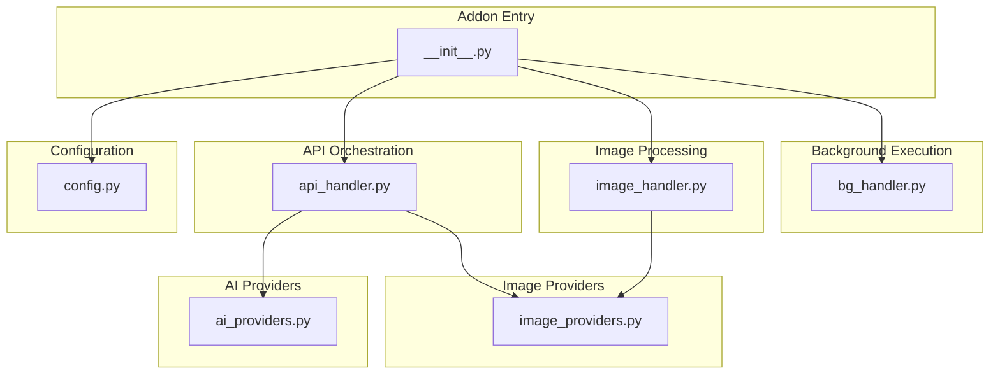
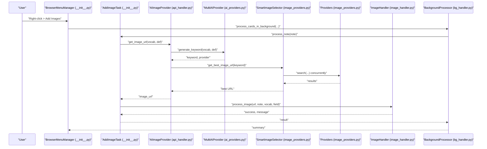
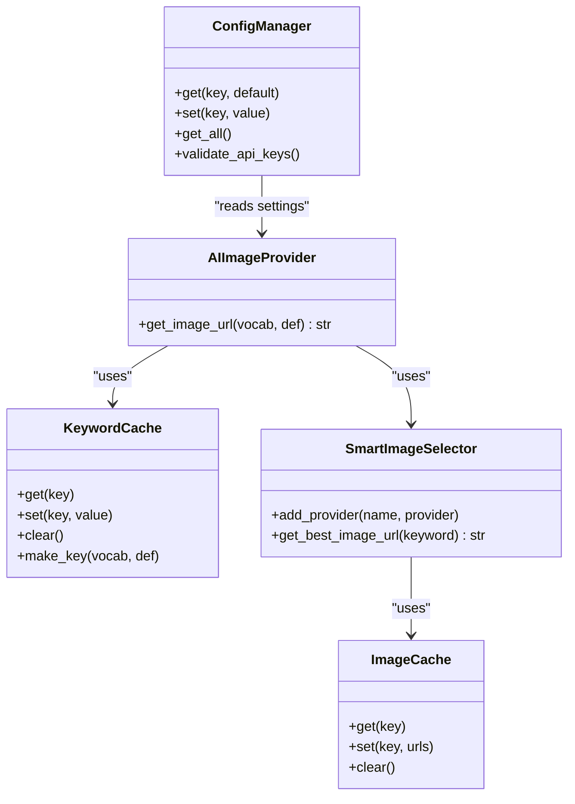
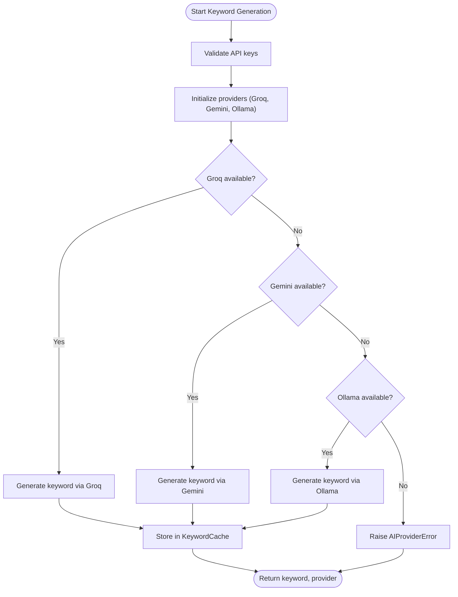
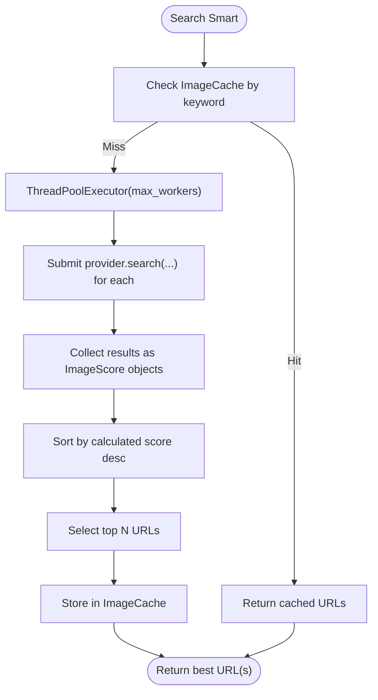
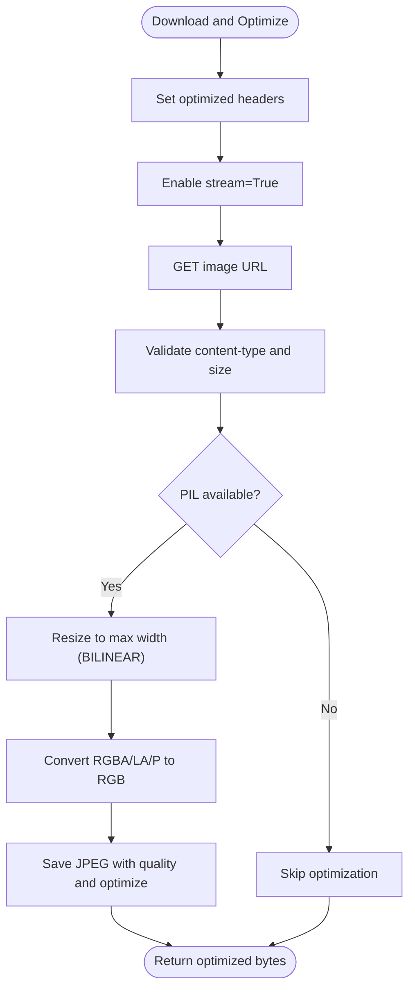
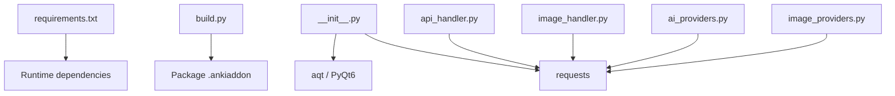

# Performance Benchmarking and Metrics

<cite>
**Referenced Files in This Document**
- [PERFORMANCE_BENCHMARK_V4.md](file://PERFORMANCE_BENCHMARK_V4.md)
- [PERFORMANCE_TIPS.md](file://PERFORMANCE_TIPS.md)
- [TESTING.md](file://TESTING.md)
- [TEST_REPORT.md](file://TEST_REPORT.md)
- [AnkiAI_ImageAddon/modules/config.py](file://AnkiAI_ImageAddon/modules/config.py)
- [AnkiAI_ImageAddon/modules/api_handler.py](file://AnkiAI_ImageAddon/modules/api_handler.py)
- [AnkiAI_ImageAddon/modules/image_providers.py](file://AnkiAI_ImageAddon/modules/image_providers.py)
- [AnkiAI_ImageAddon/modules/image_handler.py](file://AnkiAI_ImageAddon/modules/image_handler.py)
- [AnkiAI_ImageAddon/modules/ai_providers.py](file://AnkiAI_ImageAddon/modules/ai_providers.py)
- [AnkiAI_ImageAddon/modules/bg_handler.py](file://AnkiAI_ImageAddon/modules/bg_handler.py)
- [AnkiAI_ImageAddon/__init__.py](file://AnkiAI_ImageAddon/__init__.py)
- [build.py](file://build.py)
- [requirements.txt](file://requirements.txt)
</cite>

## Table of Contents
1. [Introduction](#introduction)
2. [Project Structure](#project-structure)
3. [Core Components](#core-components)
4. [Architecture Overview](#architecture-overview)
5. [Detailed Component Analysis](#detailed-component-analysis)
6. [Dependency Analysis](#dependency-analysis)
7. [Performance Considerations](#performance-considerations)
8. [Troubleshooting Guide](#troubleshooting-guide)
9. [Conclusion](#conclusion)
10. [Appendices](#appendices)

## Introduction
This document describes the performance benchmarking and measurement systems implemented in the AnkiAI Image Addon. It documents the standardized methodology used to evaluate processing modes, provider combinations, and configuration settings. It also details the metrics collected (processing time per image, API call efficiency, memory usage, and CPU utilization), comparative analysis between Search mode and DALL-E mode, and provides guidelines for automated and manual testing, real-world performance measurement, bottleneck identification, and continuous monitoring.

## Project Structure
The add-on is organized into modular components that encapsulate AI keyword generation, image search and selection, image download and optimization, background processing, and UI integration. The benchmarking and performance guidance are documented in dedicated markdown files and reflected in the configuration and runtime behavior of the modules.

**Diagram sources**
- [AnkiAI_ImageAddon/__init__.py:1-349](file://AnkiAI_ImageAddon/__init__.py#L1-L349)
- [AnkiAI_ImageAddon/modules/config.py:1-132](file://AnkiAI_ImageAddon/modules/config.py#L1-L132)
- [AnkiAI_ImageAddon/modules/api_handler.py:1-229](file://AnkiAI_ImageAddon/modules/api_handler.py#L1-L229)
- [AnkiAI_ImageAddon/modules/ai_providers.py:1-393](file://AnkiAI_ImageAddon/modules/ai_providers.py#L1-L393)
- [AnkiAI_ImageAddon/modules/image_providers.py:1-463](file://AnkiAI_ImageAddon/modules/image_providers.py#L1-L463)
- [AnkiAI_ImageAddon/modules/image_handler.py:1-364](file://AnkiAI_ImageAddon/modules/image_handler.py#L1-L364)
- [AnkiAI_ImageAddon/modules/bg_handler.py:1-205](file://AnkiAI_ImageAddon/modules/bg_handler.py#L1-L205)

**Section sources**
- [AnkiAI_ImageAddon/__init__.py:1-349](file://AnkiAI_ImageAddon/__init__.py#L1-L349)
- [AnkiAI_ImageAddon/modules/config.py:1-132](file://AnkiAI_ImageAddon/modules/config.py#L1-L132)

## Core Components
- Configuration and Defaults: Centralized configuration with performance-related toggles (keyword caching, image optimization, concurrency, timeouts).
- AI Providers: Multi-provider keyword generation with fallbacks and availability checks.
- Smart Image Selection: Concurrent provider search with scoring and caching.
- Image Download and Optimization: Lightweight optimization, reduced timeouts, and streaming.
- Background Processing: Non-blocking execution with progress reporting.
- Benchmarking and Guidance: Standardized reports and tips for performance tuning.

**Section sources**
- [AnkiAI_ImageAddon/modules/config.py:21-63](file://AnkiAI_ImageAddon/modules/config.py#L21-L63)
- [AnkiAI_ImageAddon/modules/ai_providers.py:297-393](file://AnkiAI_ImageAddon/modules/ai_providers.py#L297-L393)
- [AnkiAI_ImageAddon/modules/api_handler.py:74-229](file://AnkiAI_ImageAddon/modules/api_handler.py#L74-L229)
- [AnkiAI_ImageAddon/modules/image_providers.py:373-463](file://AnkiAI_ImageAddon/modules/image_providers.py#L373-L463)
- [AnkiAI_ImageAddon/modules/image_handler.py:36-129](file://AnkiAI_ImageAddon/modules/image_handler.py#L36-L129)
- [AnkiAI_ImageAddon/modules/bg_handler.py:12-109](file://AnkiAI_ImageAddon/modules/bg_handler.py#L12-L109)

## Architecture Overview
The runtime pipeline integrates configuration-driven orchestration, AI keyword generation, concurrent image search, and optimized download and insertion. The background processor ensures UI responsiveness while reporting progress.

**Diagram sources**
- [AnkiAI_ImageAddon/__init__.py:99-274](file://AnkiAI_ImageAddon/__init__.py#L99-L274)
- [AnkiAI_ImageAddon/modules/api_handler.py:187-229](file://AnkiAI_ImageAddon/modules/api_handler.py#L187-L229)
- [AnkiAI_ImageAddon/modules/ai_providers.py:358-393](file://AnkiAI_ImageAddon/modules/ai_providers.py#L358-L393)
- [AnkiAI_ImageAddon/modules/image_providers.py:411-463](file://AnkiAI_ImageAddon/modules/image_providers.py#L411-L463)
- [AnkiAI_ImageAddon/modules/image_handler.py:326-364](file://AnkiAI_ImageAddon/modules/image_handler.py#L326-L364)
- [AnkiAI_ImageAddon/modules/bg_handler.py:23-100](file://AnkiAI_ImageAddon/modules/bg_handler.py#L23-L100)

## Detailed Component Analysis

### Performance Benchmarking Methodology
- Comparative Baselines: v3.0 vs v4.0 performance comparisons across keyword generation, image search, file download, optimization, ranking, and batch processing.
- Controlled Variables: Provider count, concurrency level, caching strategies, and image optimization settings.
- Metrics Catalog: Per-operation timings, per-image totals, throughput, file sizes, memory footprint, and CPU usage.
- Real-world Scenarios: Small batches, repeated keywords, large batches, and varied network conditions.

**Section sources**
- [PERFORMANCE_BENCHMARK_V4.md:15-125](file://PERFORMANCE_BENCHMARK_V4.md#L15-L125)
- [PERFORMANCE_BENCHMARK_V4.md:148-202](file://PERFORMANCE_BENCHMARK_V4.md#L148-L202)
- [PERFORMANCE_BENCHMARK_V4.md:206-240](file://PERFORMANCE_BENCHMARK_V4.md#L206-L240)
- [PERFORMANCE_BENCHMARK_V4.md:344-377](file://PERFORMANCE_BENCHMARK_V4.md#L344-L377)

### Configuration-Driven Performance Controls
- Keyword Caching: Thread-safe cache with configurable size and TTL.
- Image Optimization: Reduced default width and quality with streaming and lightweight resizing.
- Concurrency: Adjustable concurrent providers and downloads with optimized timeouts.
- Smart Selection: Concurrent provider search with scoring and result caching.

**Diagram sources**
- [AnkiAI_ImageAddon/modules/config.py:18-120](file://AnkiAI_ImageAddon/modules/config.py#L18-L120)
- [AnkiAI_ImageAddon/modules/api_handler.py:42-72](file://AnkiAI_ImageAddon/modules/api_handler.py#L42-L72)
- [AnkiAI_ImageAddon/modules/image_providers.py:69-102](file://AnkiAI_ImageAddon/modules/image_providers.py#L69-L102)
- [AnkiAI_ImageAddon/modules/api_handler.py:74-186](file://AnkiAI_ImageAddon/modules/api_handler.py#L74-L186)
- [AnkiAI_ImageAddon/modules/image_providers.py:373-463](file://AnkiAI_ImageAddon/modules/image_providers.py#L373-L463)

**Section sources**
- [AnkiAI_ImageAddon/modules/config.py:21-63](file://AnkiAI_ImageAddon/modules/config.py#L21-L63)
- [AnkiAI_ImageAddon/modules/api_handler.py:42-72](file://AnkiAI_ImageAddon/modules/api_handler.py#L42-L72)
- [AnkiAI_ImageAddon/modules/image_providers.py:69-102](file://AnkiAI_ImageAddon/modules/image_providers.py#L69-L102)

### AI Keyword Generation and Fallbacks
- Multi-provider selection with priority and automatic fallback.
- Availability checks and concise error logging for diagnostics.
- Keyword caching reduces redundant API calls.

**Diagram sources**
- [AnkiAI_ImageAddon/modules/ai_providers.py:297-393](file://AnkiAI_ImageAddon/modules/ai_providers.py#L297-L393)
- [AnkiAI_ImageAddon/modules/api_handler.py:117-126](file://AnkiAI_ImageAddon/modules/api_handler.py#L117-L126)

**Section sources**
- [AnkiAI_ImageAddon/modules/ai_providers.py:297-393](file://AnkiAI_ImageAddon/modules/ai_providers.py#L297-L393)
- [AnkiAI_ImageAddon/modules/api_handler.py:117-126](file://AnkiAI_ImageAddon/modules/api_handler.py#L117-L126)

### Smart Image Selection and Ranking
- Concurrent provider search with configurable worker count.
- Scoring based on provider reliability, URL quality, and title relevance.
- Result caching with TTL to accelerate repeated keywords.

**Diagram sources**
- [AnkiAI_ImageAddon/modules/image_providers.py:411-463](file://AnkiAI_ImageAddon/modules/image_providers.py#L411-L463)
- [AnkiAI_ImageAddon/modules/image_providers.py:69-102](file://AnkiAI_ImageAddon/modules/image_providers.py#L69-L102)

**Section sources**
- [AnkiAI_ImageAddon/modules/image_providers.py:29-67](file://AnkiAI_ImageAddon/modules/image_providers.py#L29-L67)
- [AnkiAI_ImageAddon/modules/image_providers.py:411-463](file://AnkiAI_ImageAddon/modules/image_providers.py#L411-L463)

### Image Download, Optimization, and Insertion
- Reduced default timeouts and retries for faster failure detection.
- Streaming downloads and lightweight optimization (resize, convert to RGB, JPEG compression).
- Responsive HTML insertion with lazy loading and mobile-friendly styles.

**Diagram sources**
- [AnkiAI_ImageAddon/modules/image_handler.py:59-129](file://AnkiAI_ImageAddon/modules/image_handler.py#L59-L129)
- [AnkiAI_ImageAddon/modules/image_handler.py:130-196](file://AnkiAI_ImageAddon/modules/image_handler.py#L130-L196)

**Section sources**
- [AnkiAI_ImageAddon/modules/image_handler.py:36-129](file://AnkiAI_ImageAddon/modules/image_handler.py#L36-L129)
- [AnkiAI_ImageAddon/modules/image_handler.py:130-196](file://AnkiAI_ImageAddon/modules/image_handler.py#L130-L196)

### Background Processing and Progress Reporting
- Non-blocking execution using Anki’s operation queue.
- Progress callbacks and error aggregation for reliable reporting.

**Section sources**
- [AnkiAI_ImageAddon/modules/bg_handler.py:12-109](file://AnkiAI_ImageAddon/modules/bg_handler.py#L12-L109)
- [AnkiAI_ImageAddon/__init__.py:262-274](file://AnkiAI_ImageAddon/__init__.py#L262-L274)

### Automated Performance Testing Framework
- Unit-level validations for configuration dialogs, provider fallbacks, and image insertion logic.
- Integration tests covering UI flows, API connections, and background processing.
- Stress tests for large batches and rapid processing scenarios.

**Section sources**
- [TEST_REPORT.md:21-233](file://TEST_REPORT.md#L21-L233)
- [TESTING.md:129-167](file://TESTING.md#L129-L167)
- [TESTING.md:287-311](file://TESTING.md#L287-L311)

### Manual Testing Procedures
- Speed benchmarking with predefined card counts and modes.
- Memory and CPU usage checks during heavy processing.
- Network timeout and fallback validation.
- Configuration persistence and compatibility across Anki versions.

**Section sources**
- [TESTING.md:129-167](file://TESTING.md#L129-L167)
- [TESTING.md:170-207](file://TESTING.md#L170-L207)
- [TESTING.md:210-240](file://TESTING.md#L210-L240)
- [TESTING.md:243-284](file://TESTING.md#L243-L284)

### Comparative Analysis: Search Mode vs DALL-E Mode
- Search mode leverages six concurrent providers with intelligent ranking and caching, yielding significant speed and cost benefits.
- DALL-E mode prioritizes quality and uniqueness at higher cost and longer processing time.
- Performance trade-offs: speed vs. quality vs. cost depend on chosen providers and optimization settings.

**Section sources**
- [PERFORMANCE_BENCHMARK_V4.md:17-108](file://PERFORMANCE_BENCHMARK_V4.md#L17-L108)
- [PERFORMANCE_TIPS.md:22-32](file://PERFORMANCE_TIPS.md#L22-L32)
- [PERFORMANCE_TIPS.md:48-62](file://PERFORMANCE_TIPS.md#L48-L62)

### Real-World Performance Measurement Guidelines
- Measure per-image time by timing the background task and dividing by processed cards.
- Monitor memory and CPU during batch runs; ensure UI remains responsive.
- Use logs and progress callbacks to identify slow steps (keyword generation, image search, download, optimization).
- Validate caching effectiveness by repeating keyword sets and observing reduced provider calls.

**Section sources**
- [PERFORMANCE_TIPS.md:457-471](file://PERFORMANCE_TIPS.md#L457-L471)
- [TESTING.md:129-167](file://TESTING.md#L129-L167)

### Bottleneck Identification and Optimization Strategies
- Provider latency: Prefer Pexels for speed; leverage concurrent search and result caching.
- Network constraints: Reduce timeouts and retries; enable image optimization to lower bandwidth usage.
- Local resource limits: Adjust concurrency and image size; monitor memory usage and avoid large batches.

**Section sources**
- [PERFORMANCE_TIPS.md:124-191](file://PERFORMANCE_TIPS.md#L124-L191)
- [PERFORMANCE_TIPS.md:240-287](file://PERFORMANCE_TIPS.md#L240-L287)

### Continuous Monitoring and Regression Detection
- Establish baselines for per-image processing time, memory footprint, and success rates.
- Integrate periodic regression tests for critical flows (API connections, provider fallbacks, background processing).
- Track configuration drift and validate defaults to prevent performance regressions.

**Section sources**
- [TEST_REPORT.md:262-274](file://TEST_REPORT.md#L262-L274)
- [TESTING.md:340-357](file://TESTING.md#L340-L357)

## Dependency Analysis
The runtime depends on Anki’s Qt framework and HTTP libraries. The build system packages the add-on for distribution.

**Diagram sources**
- [requirements.txt:10-19](file://requirements.txt#L10-L19)
- [build.py:27-84](file://build.py#L27-L84)
- [AnkiAI_ImageAddon/__init__.py:6-18](file://AnkiAI_ImageAddon/__init__.py#L6-L18)

**Section sources**
- [requirements.txt:10-19](file://requirements.txt#L10-L19)
- [build.py:27-84](file://build.py#L27-L84)

## Performance Considerations
- Concurrency: Tune max workers and concurrent downloads to match network and device capabilities.
- Caching: Enable keyword and image result caches to reduce API calls and latency.
- Optimization: Use reduced image width and quality judiciously to balance speed and storage.
- Timeouts: Adjust per-request timeouts to balance responsiveness and reliability.

[No sources needed since this section provides general guidance]

## Troubleshooting Guide
Common issues and remedies:
- API key validation failures: Ensure at least one AI provider is configured; validate keys via the connection test.
- Provider initialization failures: Fallback to DALL-E mode when no image providers are available.
- Image insertion conflicts: Existing images are skipped; verify field content and HTML tags.
- Performance degradation: Reduce concurrency, enable optimization, and leverage caching.

**Section sources**
- [TEST_REPORT.md:21-153](file://TEST_REPORT.md#L21-L153)
- [TEST_REPORT.md:155-233](file://TEST_REPORT.md#L155-L233)
- [AnkiAI_ImageAddon/modules/api_handler.py:187-229](file://AnkiAI_ImageAddon/modules/api_handler.py#L187-L229)
- [AnkiAI_ImageAddon/modules/image_handler.py:269-325](file://AnkiAI_ImageAddon/modules/image_handler.py#L269-L325)

## Conclusion
The AnkiAI Image Addon implements a comprehensive performance benchmarking and measurement system centered on concurrent provider search, intelligent ranking, caching, and optimized image processing. The documented methodology enables reproducible comparisons across modes and configurations, while the built-in testing and monitoring practices help sustain performance over time.

[No sources needed since this section summarizes without analyzing specific files]

## Appendices

### Appendix A: Benchmark Metrics Catalog
- Per-operation timings (keyword generation, image search, download, optimization, ranking).
- Per-image totals and throughput.
- File size distributions and compression ratios.
- Memory footprint and CPU usage profiles.
- Success rates under varying network conditions.

**Section sources**
- [PERFORMANCE_BENCHMARK_V4.md:114-145](file://PERFORMANCE_BENCHMARK_V4.md#L114-L145)
- [PERFORMANCE_BENCHMARK_V4.md:344-377](file://PERFORMANCE_BENCHMARK_V4.md#L344-L377)

### Appendix B: Configuration Reference for Performance
- Keyword caching and TTL.
- Image optimization parameters.
- Concurrency controls.
- Provider-specific timeouts and retries.

**Section sources**
- [AnkiAI_ImageAddon/modules/config.py:21-63](file://AnkiAI_ImageAddon/modules/config.py#L21-L63)
- [AnkiAI_ImageAddon/modules/image_handler.py:39-46](file://AnkiAI_ImageAddon/modules/image_handler.py#L39-L46)
- [AnkiAI_ImageAddon/modules/image_providers.py:129-151](file://AnkiAI_ImageAddon/modules/image_providers.py#L129-L151)