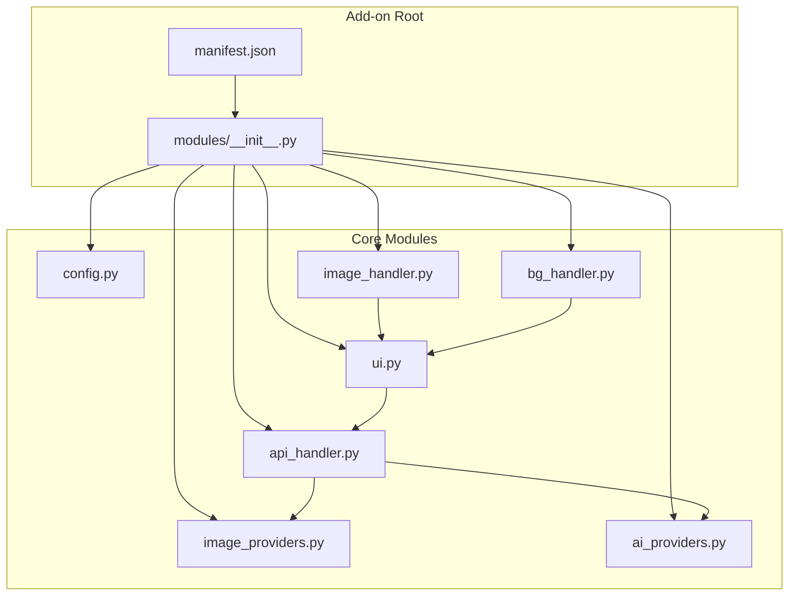
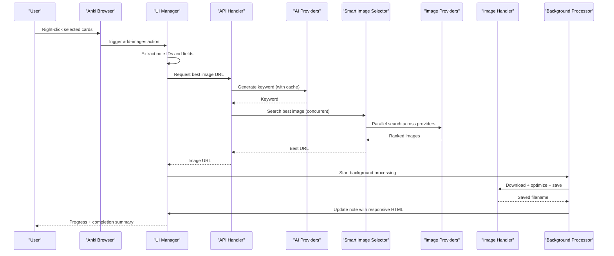
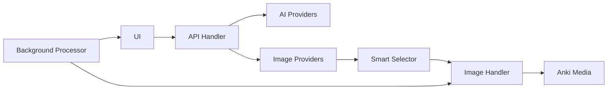

# Project Overview

<cite>
**Referenced Files in This Document**
- [README.md](file://README.md)
- [PROJECT_SUMMARY.md](file://PROJECT_SUMMARY.md)
- [RELEASE_V4.md](file://RELEASE_V4.md)
- [CHANGELOG_V3.md](file://CHANGELOG_V3.md)
- [AnkiAI_ImageAddon/manifest.json](file://AnkiAI_ImageAddon/manifest.json)
- [AnkiAI_ImageAddon/modules/__init__.py](file://AnkiAI_ImageAddon/modules/__init__.py)
- [AnkiAI_ImageAddon/modules/config.py](file://AnkiAI_ImageAddon/modules/config.py)
- [AnkiAI_ImageAddon/modules/api_handler.py](file://AnkiAI_ImageAddon/modules/api_handler.py)
- [AnkiAI_ImageAddon/modules/image_providers.py](file://AnkiAI_ImageAddon/modules/image_providers.py)
- [AnkiAI_ImageAddon/modules/ai_providers.py](file://AnkiAI_ImageAddon/modules/ai_providers.py)
- [AnkiAI_ImageAddon/modules/image_handler.py](file://AnkiAI_ImageAddon/modules/image_handler.py)
- [AnkiAI_ImageAddon/modules/bg_handler.py](file://AnkiAI_ImageAddon/modules/bg_handler.py)
- [AnkiAI_ImageAddon/modules/ui.py](file://AnkiAI_ImageAddon/modules/ui.py)
</cite>

## Table of Contents
1. [Introduction](#introduction)
2. [Project Structure](#project-structure)
3. [Core Components](#core-components)
4. [Architecture Overview](#architecture-overview)
5. [Detailed Component Analysis](#detailed-component-analysis)
6. [Dependency Analysis](#dependency-analysis)
7. [Performance Considerations](#performance-considerations)
8. [Troubleshooting Guide](#troubleshooting-guide)
9. [Conclusion](#conclusion)

## Introduction
AnkiAI Image Addon is an Anki desktop add-on that automates the creation and embedding of AI-powered images into flashcards. It transforms traditional flashcard creation by intelligently generating or searching for relevant imagery based on vocabulary and definition fields, then embedding optimized, responsive images directly into the card’s image field. The add-on targets language learners and educators who want to enhance their learning experience with visual context while maintaining performance, cost efficiency, and a user-friendly interface.

Key goals:
- Automate image addition to boost engagement and retention
- Provide multiple AI and image providers with intelligent fallback
- Deliver background processing for smooth UI performance
- Optimize images for mobile and web sync
- Keep costs low and setup straightforward

## Project Structure
The add-on is organized into modular Python packages under AnkiAI_ImageAddon/modules, each responsible for a distinct aspect of the workflow: configuration, UI hooks, AI and image provider orchestration, image downloading and optimization, and background processing. The manifest defines metadata for Anki installation and compatibility.

**Diagram sources**
- [AnkiAI_ImageAddon/manifest.json:1-12](file://AnkiAI_ImageAddon/manifest.json#L1-L12)
- [AnkiAI_ImageAddon/modules/__init__.py:1-12](file://AnkiAI_ImageAddon/modules/__init__.py#L1-L12)
- [AnkiAI_ImageAddon/modules/config.py:1-132](file://AnkiAI_ImageAddon/modules/config.py#L1-L132)
- [AnkiAI_ImageAddon/modules/ui.py:1-444](file://AnkiAI_ImageAddon/modules/ui.py#L1-L444)
- [AnkiAI_ImageAddon/modules/api_handler.py:1-229](file://AnkiAI_ImageAddon/modules/api_handler.py#L1-L229)
- [AnkiAI_ImageAddon/modules/image_providers.py:1-463](file://AnkiAI_ImageAddon/modules/image_providers.py#L1-L463)
- [AnkiAI_ImageAddon/modules/ai_providers.py:1-393](file://AnkiAI_ImageAddon/modules/ai_providers.py#L1-L393)
- [AnkiAI_ImageAddon/modules/image_handler.py:1-364](file://AnkiAI_ImageAddon/modules/image_handler.py#L1-L364)
- [AnkiAI_ImageAddon/modules/bg_handler.py:1-205](file://AnkiAI_ImageAddon/modules/bg_handler.py#L1-L205)

**Section sources**
- [AnkiAI_ImageAddon/manifest.json:1-12](file://AnkiAI_ImageAddon/manifest.json#L1-L12)
- [AnkiAI_ImageAddon/modules/__init__.py:1-12](file://AnkiAI_ImageAddon/modules/__init__.py#L1-L12)

## Core Components
- Configuration Manager: Centralizes API keys, provider settings, and UI preferences. It validates provider availability and persists settings via Anki’s add-on configuration system.
- UI and Browser Integration: Adds a context menu in Anki Browser, extracts selected note data, and presents configuration dialogs for API keys and field mapping.
- AI Provider Orchestration: Manages multiple AI providers (Groq, Gemini, Ollama) with automatic fallback and keyword caching to reduce API calls and improve responsiveness.
- Smart Image Selection: Searches multiple image providers concurrently, scores results, and selects the best image based on quality and metadata.
- Image Processing: Downloads, optimizes, detects format, saves to Anki media, and inserts responsive HTML into the note’s image field.
- Background Processing: Runs long-running tasks without blocking the UI, with progress callbacks and cancellation support.

**Section sources**
- [AnkiAI_ImageAddon/modules/config.py:1-132](file://AnkiAI_ImageAddon/modules/config.py#L1-L132)
- [AnkiAI_ImageAddon/modules/ui.py:1-444](file://AnkiAI_ImageAddon/modules/ui.py#L1-L444)
- [AnkiAI_ImageAddon/modules/api_handler.py:1-229](file://AnkiAI_ImageAddon/modules/api_handler.py#L1-L229)
- [AnkiAI_ImageAddon/modules/ai_providers.py:1-393](file://AnkiAI_ImageAddon/modules/ai_providers.py#L1-L393)
- [AnkiAI_ImageAddon/modules/image_providers.py:1-463](file://AnkiAI_ImageAddon/modules/image_providers.py#L1-L463)
- [AnkiAI_ImageAddon/modules/image_handler.py:1-364](file://AnkiAI_ImageAddon/modules/image_handler.py#L1-L364)
- [AnkiAI_ImageAddon/modules/bg_handler.py:1-205](file://AnkiAI_ImageAddon/modules/bg_handler.py#L1-L205)

## Architecture Overview
The add-on follows a layered architecture:
- Presentation Layer: Browser menu and dialogs for configuration and field selection
- Orchestration Layer: API handler coordinates AI and image providers
- Data Access Layer: Image handler manages downloads, optimization, and Anki media integration
- Background Layer: Background processor runs tasks asynchronously with progress reporting

**Diagram sources**
- [AnkiAI_ImageAddon/modules/ui.py:1-444](file://AnkiAI_ImageAddon/modules/ui.py#L1-L444)
- [AnkiAI_ImageAddon/modules/api_handler.py:1-229](file://AnkiAI_ImageAddon/modules/api_handler.py#L1-L229)
- [AnkiAI_ImageAddon/modules/ai_providers.py:1-393](file://AnkiAI_ImageAddon/modules/ai_providers.py#L1-L393)
- [AnkiAI_ImageAddon/modules/image_providers.py:1-463](file://AnkiAI_ImageAddon/modules/image_providers.py#L1-L463)
- [AnkiAI_ImageAddon/modules/image_handler.py:1-364](file://AnkiAI_ImageAddon/modules/image_handler.py#L1-L364)
- [AnkiAI_ImageAddon/modules/bg_handler.py:1-205](file://AnkiAI_ImageAddon/modules/bg_handler.py#L1-L205)

## Detailed Component Analysis

### Configuration Management
- Purpose: Store and validate API keys for AI and image providers; manage UI and processing settings.
- Key responsibilities:
  - Default configuration with sensible values for v4.0 (including smart selection and image optimization)
  - Validation of at least one AI provider and one image provider
  - Persistence via Anki’s add-on configuration system
- Impact: Ensures reliable operation and reduces setup friction for users.

**Section sources**
- [AnkiAI_ImageAddon/modules/config.py:1-132](file://AnkiAI_ImageAddon/modules/config.py#L1-L132)

### UI and Browser Integration
- Purpose: Provide a seamless user experience by integrating with Anki Browser and guiding users through configuration and execution.
- Key responsibilities:
  - Context menu hook for “AnkiAI: Automatically add images”
  - Field selection dialog for vocabulary, definition, and image fields
  - Configuration dialog for AI and image provider keys with connection testing
  - Extraction of note data and error/info dialogs
- Impact: Lowers barrier to entry and improves usability across platforms.

**Section sources**
- [AnkiAI_ImageAddon/modules/ui.py:1-444](file://AnkiAI_ImageAddon/modules/ui.py#L1-L444)

### AI Provider Orchestration
- Purpose: Generate search keywords using multiple AI providers with automatic fallback and caching.
- Key responsibilities:
  - MultiAIProvider orchestrates Groq, Gemini, and Ollama in priority order
  - KeywordCache prevents redundant API calls
  - Error logging for fallback diagnostics
- Impact: Reduces latency and improves reliability by leveraging multiple providers.

**Section sources**
- [AnkiAI_ImageAddon/modules/ai_providers.py:1-393](file://AnkiAI_ImageAddon/modules/ai_providers.py#L1-L393)
- [AnkiAI_ImageAddon/modules/api_handler.py:1-229](file://AnkiAI_ImageAddon/modules/api_handler.py#L1-L229)

### Smart Image Selection
- Purpose: Search multiple image providers concurrently, score results, and select the best image.
- Key responsibilities:
  - SmartImageSelector coordinates concurrent searches across six providers
  - ImageScore computes provider-based base scores, URL quality, and title relevance
  - ImageCache stores recent search results for faster subsequent runs
- Impact: Significantly improves image quality and selection speed compared to single-provider approaches.

**Section sources**
- [AnkiAI_ImageAddon/modules/image_providers.py:1-463](file://AnkiAI_ImageAddon/modules/image_providers.py#L1-L463)
- [AnkiAI_ImageAddon/modules/api_handler.py:1-229](file://AnkiAI_ImageAddon/modules/api_handler.py#L1-L229)

### Image Processing Pipeline
- Purpose: Download, optimize, detect format, save to Anki media, and insert responsive HTML into notes.
- Key responsibilities:
  - Optimized download with reduced timeouts and retries
  - Lightweight optimization (resize, compress, convert to RGB)
  - Format detection via magic bytes
  - Anki media write integration for sync
  - Responsive HTML insertion with lazy loading and mobile-friendly attributes
- Impact: Produces smaller, faster-loading images that render well on mobile and sync reliably.

**Section sources**
- [AnkiAI_ImageAddon/modules/image_handler.py:1-364](file://AnkiAI_ImageAddon/modules/image_handler.py#L1-L364)

### Background Processing
- Purpose: Run long-running tasks without blocking the UI, with progress reporting and cancellation.
- Key responsibilities:
  - QueryOp-based background execution
  - Progress callbacks and result summaries
  - Cancellation support and graceful error handling
- Impact: Enables processing hundreds of cards smoothly and provides real-time feedback.

**Section sources**
- [AnkiAI_ImageAddon/modules/bg_handler.py:1-205](file://AnkiAI_ImageAddon/modules/bg_handler.py#L1-L205)

## Dependency Analysis
- Internal dependencies:
  - UI depends on configuration and API handler
  - API handler depends on AI providers and image providers
  - Image handler integrates with Anki media and UI
  - Background processor coordinates UI and image handler
- External dependencies:
  - Requests library for HTTP operations
  - Anki framework (aqt) for UI and media operations
  - PIL/Pillow for image optimization (optional)
- Provider integrations:
  - AI: Groq, Gemini, Ollama
  - Images: Pexels, Unsplash, Pixabay, Openverse, Wallhaven, Lorem Picsum

**Diagram sources**
- [AnkiAI_ImageAddon/modules/ui.py:1-444](file://AnkiAI_ImageAddon/modules/ui.py#L1-L444)
- [AnkiAI_ImageAddon/modules/api_handler.py:1-229](file://AnkiAI_ImageAddon/modules/api_handler.py#L1-L229)
- [AnkiAI_ImageAddon/modules/ai_providers.py:1-393](file://AnkiAI_ImageAddon/modules/ai_providers.py#L1-L393)
- [AnkiAI_ImageAddon/modules/image_providers.py:1-463](file://AnkiAI_ImageAddon/modules/image_providers.py#L1-L463)
- [AnkiAI_ImageAddon/modules/image_handler.py:1-364](file://AnkiAI_ImageAddon/modules/image_handler.py#L1-L364)
- [AnkiAI_ImageAddon/modules/bg_handler.py:1-205](file://AnkiAI_ImageAddon/modules/bg_handler.py#L1-L205)

**Section sources**
- [AnkiAI_ImageAddon/modules/__init__.py:1-12](file://AnkiAI_ImageAddon/modules/__init__.py#L1-L12)

## Performance Considerations
- Multi-provider concurrency: v4.0 searches six providers in parallel, dramatically reducing wait times and improving selection quality.
- Intelligent caching: Keyword cache and image search cache reduce redundant API calls and speed up subsequent runs.
- Optimized image processing: Reduced timeouts, retries, and image size while preserving quality.
- Background execution: Non-blocking processing allows users to continue working while batches are processed.
- Mobile optimization: Responsive HTML and smaller file sizes improve rendering and sync performance on mobile devices.

**Section sources**
- [RELEASE_V4.md:1-440](file://RELEASE_V4.md#L1-L440)
- [AnkiAI_ImageAddon/modules/api_handler.py:1-229](file://AnkiAI_ImageAddon/modules/api_handler.py#L1-L229)
- [AnkiAI_ImageAddon/modules/image_providers.py:1-463](file://AnkiAI_ImageAddon/modules/image_providers.py#L1-L463)
- [AnkiAI_ImageAddon/modules/image_handler.py:1-364](file://AnkiAI_ImageAddon/modules/image_handler.py#L1-L364)
- [AnkiAI_ImageAddon/modules/bg_handler.py:1-205](file://AnkiAI_ImageAddon/modules/bg_handler.py#L1-L205)

## Troubleshooting Guide
Common issues and resolutions:
- Invalid API keys: Verify keys in the configuration dialog and test connections for AI providers.
- Timeout errors: Network instability or slow provider responses; retry or reduce concurrent requests.
- No images found: Adjust keyword generation or enable fallback providers; ensure at least one image provider is configured.
- Anki lag during processing: Use background processing and limit concurrent requests; process smaller batches.
- Mobile display issues: Ensure responsive HTML is enabled; verify image optimization settings.

**Section sources**
- [README.md:117-166](file://README.md#L117-L166)
- [AnkiAI_ImageAddon/modules/config.py:100-119](file://AnkiAI_ImageAddon/modules/config.py#L100-L119)
- [AnkiAI_ImageAddon/modules/ui.py:325-400](file://AnkiAI_ImageAddon/modules/ui.py#L325-L400)

## Conclusion
AnkiAI Image Addon modernizes flashcard creation by combining intelligent AI keyword generation, a robust multi-provider image search system, and efficient background processing. Its v4.0 architecture delivers faster, smarter, and more reliable results with minimal cost and effort. By optimizing for performance, mobile, and user experience, it empowers language learners and educators to enrich their study materials with high-quality visuals seamlessly.