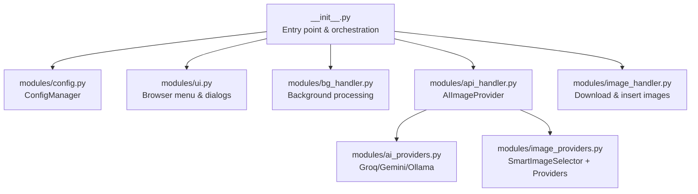
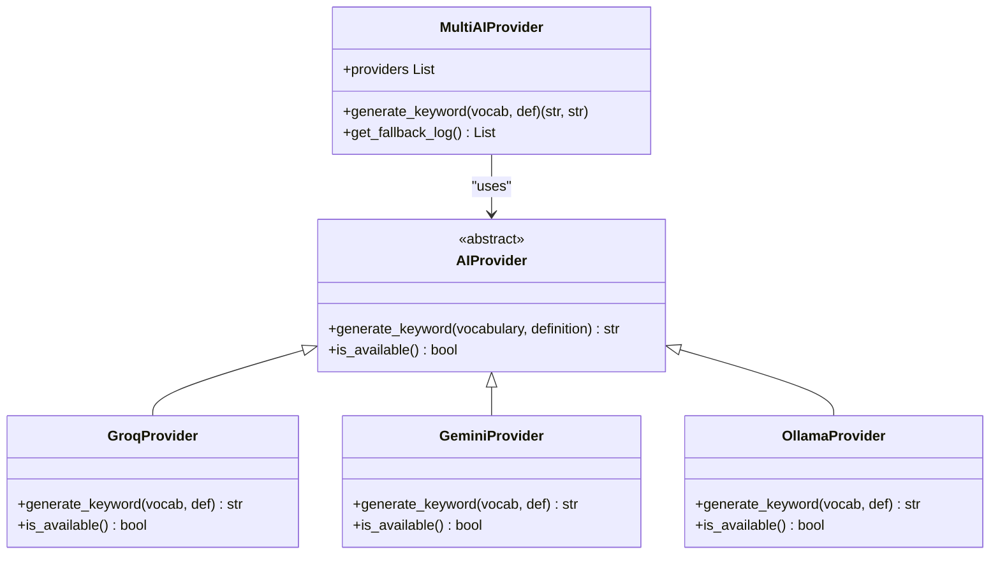
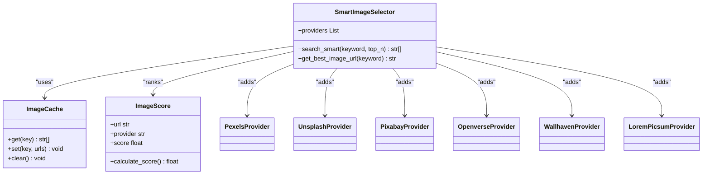
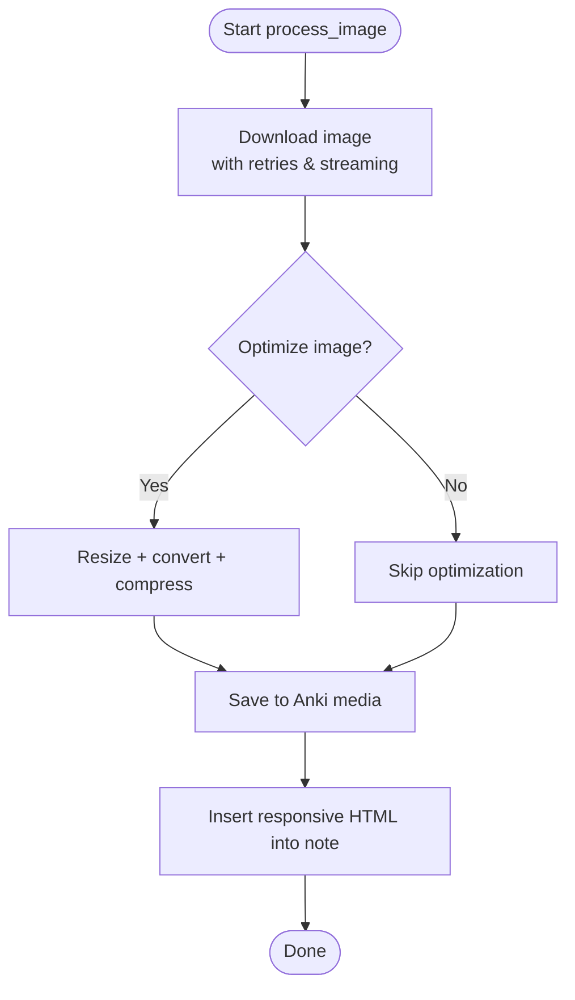
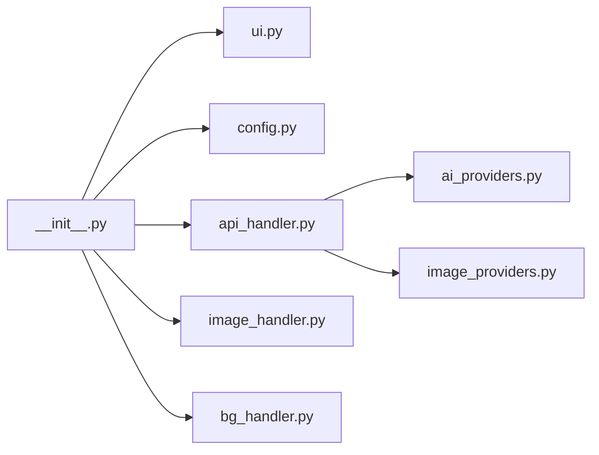

# Troubleshooting & FAQ

<cite>
**Referenced Files in This Document**
- [README.md](file://README.md)
- [API_REFERENCE.md](file://API_REFERENCE.md)
- [CHANGELOG_V3.md](file://CHANGELOG_V3.md)
- [MIGRATION_V3.md](file://MIGRATION_V3.md)
- [PERFORMANCE_TIPS.md](file://PERFORMANCE_TIPS.md)
- [AnkiAI_ImageAddon/modules/config.py](file://AnkiAI_ImageAddon/modules/config.py)
- [AnkiAI_ImageAddon/modules/api_handler.py](file://AnkiAI_ImageAddon/modules/api_handler.py)
- [AnkiAI_ImageAddon/modules/image_providers.py](file://AnkiAI_ImageAddon/modules/image_providers.py)
- [AnkiAI_ImageAddon/modules/ai_providers.py](file://AnkiAI_ImageAddon/modules/ai_providers.py)
- [AnkiAI_ImageAddon/modules/image_handler.py](file://AnkiAI_ImageAddon/modules/image_handler.py)
- [AnkiAI_ImageAddon/modules/ui.py](file://AnkiAI_ImageAddon/modules/ui.py)
- [AnkiAI_ImageAddon/modules/bg_handler.py](file://AnkiAI_ImageAddon/modules/bg_handler.py)
- [AnkiAI_ImageAddon/__init__.py](file://AnkiAI_ImageAddon/__init__.py)
</cite>

## Table of Contents
1. [Introduction](#introduction)
2. [Project Structure](#project-structure)
3. [Core Components](#core-components)
4. [Architecture Overview](#architecture-overview)
5. [Detailed Component Analysis](#detailed-component-analysis)
6. [Dependency Analysis](#dependency-analysis)
7. [Performance Considerations](#performance-considerations)
8. [Troubleshooting Guide](#troubleshooting-guide)
9. [Conclusion](#conclusion)
10. [Appendices](#appendices)

## Introduction
This Troubleshooting & FAQ guide helps diagnose and resolve common issues with the AnkiAI Image Addon. It covers API key problems, timeouts, connectivity issues, permission-related errors, performance bottlenecks, configuration mistakes, error messages, debugging techniques, migration issues, and preventive best practices. The content is grounded in the codebase and official documentation.

## Project Structure
The add-on is organized into modular components:
- Entry point initializes UI hooks, background processing, and integrates configuration.
- Modules handle configuration, AI providers, image providers, image downloading and insertion, UI dialogs, and background processing.
- The add-on supports multiple AI providers (Groq, Gemini, Ollama) and multiple image providers (Pexels, Unsplash, Pixabay, Openverse, Wallhaven, Lorem Picsum) with intelligent selection and fallback.



**Diagram sources**
- [AnkiAI_ImageAddon/__init__.py:1-349](file://AnkiAI_ImageAddon/__init__.py#L1-L349)
- [AnkiAI_ImageAddon/modules/config.py:1-132](file://AnkiAI_ImageAddon/modules/config.py#L1-L132)
- [AnkiAI_ImageAddon/modules/api_handler.py:1-229](file://AnkiAI_ImageAddon/modules/api_handler.py#L1-L229)
- [AnkiAI_ImageAddon/modules/ai_providers.py:1-393](file://AnkiAI_ImageAddon/modules/ai_providers.py#L1-L393)
- [AnkiAI_ImageAddon/modules/image_providers.py:1-463](file://AnkiAI_ImageAddon/modules/image_providers.py#L1-L463)
- [AnkiAI_ImageAddon/modules/image_handler.py:1-364](file://AnkiAI_ImageAddon/modules/image_handler.py#L1-L364)
- [AnkiAI_ImageAddon/modules/ui.py:1-444](file://AnkiAI_ImageAddon/modules/ui.py#L1-L444)
- [AnkiAI_ImageAddon/modules/bg_handler.py:1-205](file://AnkiAI_ImageAddon/modules/bg_handler.py#L1-L205)

**Section sources**
- [AnkiAI_ImageAddon/__init__.py:1-349](file://AnkiAI_ImageAddon/__init__.py#L1-L349)
- [AnkiAI_ImageAddon/modules/config.py:1-132](file://AnkiAI_ImageAddon/modules/config.py#L1-L132)
- [AnkiAI_ImageAddon/modules/api_handler.py:1-229](file://AnkiAI_ImageAddon/modules/api_handler.py#L1-L229)
- [AnkiAI_ImageAddon/modules/ai_providers.py:1-393](file://AnkiAI_ImageAddon/modules/ai_providers.py#L1-L393)
- [AnkiAI_ImageAddon/modules/image_providers.py:1-463](file://AnkiAI_ImageAddon/modules/image_providers.py#L1-L463)
- [AnkiAI_ImageAddon/modules/image_handler.py:1-364](file://AnkiAI_ImageAddon/modules/image_handler.py#L1-L364)
- [AnkiAI_ImageAddon/modules/ui.py:1-444](file://AnkiAI_ImageAddon/modules/ui.py#L1-L444)
- [AnkiAI_ImageAddon/modules/bg_handler.py:1-205](file://AnkiAI_ImageAddon/modules/bg_handler.py#L1-L205)

## Core Components
- ConfigManager: Loads, validates, and persists add-on configuration including AI and image provider keys, concurrency, and optimization settings.
- AIImageProvider: Orchestrates keyword generation via AI providers and image selection via SmartImageSelector.
- AI Providers: Groq (fast), Gemini (quality), Ollama (local).
- Image Providers: Pexels, Unsplash, Pixabay, Openverse, Wallhaven, Lorem Picsum; SmartImageSelector ranks results concurrently.
- ImageHandler: Downloads, optimizes, saves, and inserts images into notes.
- UI: Browser menu integration, field selection, configuration dialog, and connection testing.
- BackgroundProcessor: Runs long-running tasks without blocking the UI.

**Section sources**
- [AnkiAI_ImageAddon/modules/config.py:1-132](file://AnkiAI_ImageAddon/modules/config.py#L1-L132)
- [AnkiAI_ImageAddon/modules/api_handler.py:1-229](file://AnkiAI_ImageAddon/modules/api_handler.py#L1-L229)
- [AnkiAI_ImageAddon/modules/ai_providers.py:1-393](file://AnkiAI_ImageAddon/modules/ai_providers.py#L1-L393)
- [AnkiAI_ImageAddon/modules/image_providers.py:1-463](file://AnkiAI_ImageAddon/modules/image_providers.py#L1-L463)
- [AnkiAI_ImageAddon/modules/image_handler.py:1-364](file://AnkiAI_ImageAddon/modules/image_handler.py#L1-L364)
- [AnkiAI_ImageAddon/modules/ui.py:1-444](file://AnkiAI_ImageAddon/modules/ui.py#L1-L444)
- [AnkiAI_ImageAddon/modules/bg_handler.py:1-205](file://AnkiAI_ImageAddon/modules/bg_handler.py#L1-L205)

## Architecture Overview
End-to-end flow from user action to processed images:

```mermaid
sequenceDiagram
participant User as "User"
participant Browser as "BrowserMenuManager"
participant Config as "ConfigManager"
participant Dialog as "ConfigDialog"
participant Task as "AddImageTask"
participant AIProv as "AIImageProvider"
participant ImgSel as "SmartImageSelector"
participant ImgProv as "Image Providers"
participant ImgH as "ImageHandler"
participant Note as "Anki Note"
User->>Browser : "AnkiAI : Add images"
Browser->>Config : "Read configuration"
Browser->>Dialog : "Prompt for API keys & fields"
Dialog-->>Browser : "Config values"
Browser->>Task : "Create task with fields"
Task->>AIProv : "get_image_url(vocab, def)"
AIProv->>ImgSel : "search_smart(keyword)"
ImgSel->>ImgProv : "Concurrent search"
ImgProv-->>ImgSel : "Ranked URLs"
ImgSel-->>AIProv : "Best URL"
AIProv-->>Task : "Image URL"
Task->>ImgH : "process_image(url, note, vocab)"
ImgH-->>Task : "Success/Failure"
Task->>Note : "Insert image HTML"
Note-->>User : "Updated note with image"
```

**Diagram sources**
- [AnkiAI_ImageAddon/__init__.py:99-274](file://AnkiAI_ImageAddon/__init__.py#L99-L274)
- [AnkiAI_ImageAddon/modules/api_handler.py:187-229](file://AnkiAI_ImageAddon/modules/api_handler.py#L187-L229)
- [AnkiAI_ImageAddon/modules/image_providers.py:373-463](file://AnkiAI_ImageAddon/modules/image_providers.py#L373-L463)
- [AnkiAI_ImageAddon/modules/image_handler.py:326-364](file://AnkiAI_ImageAddon/modules/image_handler.py#L326-L364)
- [AnkiAI_ImageAddon/modules/ui.py:174-400](file://AnkiAI_ImageAddon/modules/ui.py#L174-L400)

## Detailed Component Analysis

### AI Providers and Fallback Logic
- Priority order: Groq → Gemini → Ollama.
- Each provider exposes availability checks and keyword generation.
- MultiAIProvider aggregates providers and logs fallback attempts.



**Diagram sources**
- [AnkiAI_ImageAddon/modules/ai_providers.py:24-393](file://AnkiAI_ImageAddon/modules/ai_providers.py#L24-L393)

**Section sources**
- [AnkiAI_ImageAddon/modules/ai_providers.py:297-393](file://AnkiAI_ImageAddon/modules/ai_providers.py#L297-L393)

### Smart Image Selection and Ranking
- Concurrently queries multiple image providers.
- Scores results by provider reliability, URL quality, and title relevance.
- Returns top-N URLs and caches results.



**Diagram sources**
- [AnkiAI_ImageAddon/modules/image_providers.py:373-463](file://AnkiAI_ImageAddon/modules/image_providers.py#L373-L463)
- [AnkiAI_ImageAddon/modules/image_providers.py:69-102](file://AnkiAI_ImageAddon/modules/image_providers.py#L69-L102)
- [AnkiAI_ImageAddon/modules/image_providers.py:29-67](file://AnkiAI_ImageAddon/modules/image_providers.py#L29-L67)

**Section sources**
- [AnkiAI_ImageAddon/modules/image_providers.py:373-463](file://AnkiAI_ImageAddon/modules/image_providers.py#L373-L463)

### Image Download and Insertion Pipeline
- Downloads with optimized headers, streaming, and retry logic.
- Optionally optimizes images (resize, convert to RGB, JPEG compression).
- Saves to Anki media via the Anki API and inserts responsive HTML into the note.



**Diagram sources**
- [AnkiAI_ImageAddon/modules/image_handler.py:59-129](file://AnkiAI_ImageAddon/modules/image_handler.py#L59-L129)
- [AnkiAI_ImageAddon/modules/image_handler.py:130-196](file://AnkiAI_ImageAddon/modules/image_handler.py#L130-L196)
- [AnkiAI_ImageAddon/modules/image_handler.py:243-325](file://AnkiAI_ImageAddon/modules/image_handler.py#L243-L325)

**Section sources**
- [AnkiAI_ImageAddon/modules/image_handler.py:36-364](file://AnkiAI_ImageAddon/modules/image_handler.py#L36-L364)

### Background Processing and Progress UI
- Uses Anki’s operation queue to prevent UI freezes.
- Provides progress updates and cancellation.

```mermaid
sequenceDiagram
participant UI as "Browser UI"
participant BG as "BackgroundProcessor"
participant Task as "ProcessingTask"
participant Note as "Note"
UI->>BG : "process_cards_in_background(note_ids, process_func)"
BG->>Task : "process_note(note)"
Task->>Note : "Modify & flush"
BG-->>UI : "on_progress(current, total, message)"
UI-->>BG : "Cancel?"
BG-->>UI : "on_success(results) or on_error(error)"
```

**Diagram sources**
- [AnkiAI_ImageAddon/modules/bg_handler.py:23-109](file://AnkiAI_ImageAddon/modules/bg_handler.py#L23-L109)
- [AnkiAI_ImageAddon/modules/bg_handler.py:166-205](file://AnkiAI_ImageAddon/modules/bg_handler.py#L166-L205)

**Section sources**
- [AnkiAI_ImageAddon/modules/bg_handler.py:12-205](file://AnkiAI_ImageAddon/modules/bg_handler.py#L12-L205)

## Dependency Analysis
- Entry point depends on UI, config, API handler, image handler, and background processor.
- API handler composes AI providers and image providers.
- UI dialogs depend on configuration and provider availability tests.
- Background processor uses Anki’s operation queue.



**Diagram sources**
- [AnkiAI_ImageAddon/__init__.py:1-349](file://AnkiAI_ImageAddon/__init__.py#L1-L349)
- [AnkiAI_ImageAddon/modules/api_handler.py:1-229](file://AnkiAI_ImageAddon/modules/api_handler.py#L1-L229)
- [AnkiAI_ImageAddon/modules/ai_providers.py:1-393](file://AnkiAI_ImageAddon/modules/ai_providers.py#L1-L393)
- [AnkiAI_ImageAddon/modules/image_providers.py:1-463](file://AnkiAI_ImageAddon/modules/image_providers.py#L1-L463)
- [AnkiAI_ImageAddon/modules/image_handler.py:1-364](file://AnkiAI_ImageAddon/modules/image_handler.py#L1-L364)
- [AnkiAI_ImageAddon/modules/ui.py:1-444](file://AnkiAI_ImageAddon/modules/ui.py#L1-L444)
- [AnkiAI_ImageAddon/modules/bg_handler.py:1-205](file://AnkiAI_ImageAddon/modules/bg_handler.py#L1-L205)
- [AnkiAI_ImageAddon/modules/config.py:1-132](file://AnkiAI_ImageAddon/modules/config.py#L1-L132)

**Section sources**
- [AnkiAI_ImageAddon/__init__.py:1-349](file://AnkiAI_ImageAddon/__init__.py#L1-L349)
- [AnkiAI_ImageAddon/modules/api_handler.py:1-229](file://AnkiAI_ImageAddon/modules/api_handler.py#L1-L229)
- [AnkiAI_ImageAddon/modules/ai_providers.py:1-393](file://AnkiAI_ImageAddon/modules/ai_providers.py#L1-L393)
- [AnkiAI_ImageAddon/modules/image_providers.py:1-463](file://AnkiAI_ImageAddon/modules/image_providers.py#L1-L463)
- [AnkiAI_ImageAddon/modules/image_handler.py:1-364](file://AnkiAI_ImageAddon/modules/image_handler.py#L1-L364)
- [AnkiAI_ImageAddon/modules/ui.py:1-444](file://AnkiAI_ImageAddon/modules/ui.py#L1-L444)
- [AnkiAI_ImageAddon/modules/bg_handler.py:1-205](file://AnkiAI_ImageAddon/modules/bg_handler.py#L1-L205)
- [AnkiAI_ImageAddon/modules/config.py:1-132](file://AnkiAI_ImageAddon/modules/config.py#L1-L132)

## Performance Considerations
- Prefer Search mode with Pexels for speed and cost-effectiveness.
- Tune concurrent requests and timeouts based on network conditions.
- Use image optimization and responsive HTML to reduce bandwidth and improve mobile rendering.
- Process in small batches to avoid memory spikes.

**Section sources**
- [PERFORMANCE_TIPS.md:1-488](file://PERFORMANCE_TIPS.md#L1-L488)
- [AnkiAI_ImageAddon/modules/image_handler.py:130-196](file://AnkiAI_ImageAddon/modules/image_handler.py#L130-L196)
- [AnkiAI_ImageAddon/modules/config.py:21-63](file://AnkiAI_ImageAddon/modules/config.py#L21-L63)

## Troubleshooting Guide

### Invalid API Keys
Symptoms:
- “No API provider configured” or “All providers failed.”
- “AI Provider failed” or “AI error.”

Root causes:
- Missing or empty keys for AI providers (Groq, Gemini) or Ollama.
- Incorrect or expired keys.

Resolution steps:
- Open the configuration dialog and enter at least one AI provider key (Groq or Gemini recommended).
- If using Ollama, ensure the service is running locally and reachable.
- Use the “Test AI Connections” button to validate providers.
- Confirm at least one image provider key (Pexels recommended) is present.

Preventive measures:
- Store keys securely and test them before bulk runs.
- Keep keys updated; re-test after expiration.

**Section sources**
- [MIGRATION_V3.md:179-197](file://MIGRATION_V3.md#L179-L197)
- [AnkiAI_ImageAddon/modules/ui.py:325-400](file://AnkiAI_ImageAddon/modules/ui.py#L325-L400)
- [AnkiAI_ImageAddon/modules/ai_providers.py:352-357](file://AnkiAI_ImageAddon/modules/ai_providers.py#L352-L357)
- [AnkiAI_ImageAddon/modules/api_handler.py:106-116](file://AnkiAI_ImageAddon/modules/api_handler.py#L106-L116)

### Timeout Errors
Symptoms:
- “Download timeout after N retries.”
- “API timeout (Xs).”
- “Ollama timeout (Xs) – server may be slow or not running.”

Root causes:
- Slow or unstable internet.
- Provider rate limits or throttling.
- Ollama server responsiveness or model loading time.

Resolution steps:
- Reduce concurrent requests and increase timeouts in configuration.
- Switch to faster providers (Groq) or use Pexels for image search.
- For Ollama, ensure the server is running and consider selecting a lighter model.

Preventive measures:
- Monitor network stability and adjust concurrency accordingly.
- Use the “Test AI Connections” to validate provider responsiveness.

**Section sources**
- [AnkiAI_ImageAddon/modules/image_handler.py:114-128](file://AnkiAI_ImageAddon/modules/image_handler.py#L114-L128)
- [AnkiAI_ImageAddon/modules/ai_providers.py:289-294](file://AnkiAI_ImageAddon/modules/ai_providers.py#L289-L294)
- [AnkiAI_ImageAddon/modules/config.py:40-46](file://AnkiAI_ImageAddon/modules/config.py#L40-L46)
- [AnkiAI_ImageAddon/modules/ui.py:325-400](file://AnkiAI_ImageAddon/modules/ui.py#L325-L400)

### Network Connectivity Problems
Symptoms:
- “Connection failed.”
- “Provider unavailable.”
- “No images found.”

Root causes:
- Firewall or proxy blocking requests.
- DNS resolution issues.
- Provider downtime.

Resolution steps:
- Verify internet access and try accessing provider endpoints directly.
- Temporarily disable firewall/proxy for testing.
- Retry later if providers report downtime.

Preventive measures:
- Test provider endpoints via the configuration dialog.
- Keep at least two image providers configured for redundancy.

**Section sources**
- [AnkiAI_ImageAddon/modules/ai_providers.py:56-66](file://AnkiAI_ImageAddon/modules/ai_providers.py#L56-L66)
- [AnkiAI_ImageAddon/modules/ai_providers.py:147-165](file://AnkiAI_ImageAddon/modules/ai_providers.py#L147-L165)
- [AnkiAI_ImageAddon/modules/ai_providers.py:234-243](file://AnkiAI_ImageAddon/modules/ai_providers.py#L234-L243)
- [AnkiAI_ImageAddon/modules/image_providers.py:120-151](file://AnkiAI_ImageAddon/modules/image_providers.py#L120-L151)

### Insufficient Permissions
Symptoms:
- “Error saving image to Anki.”
- “Field does not exist.”
- “Permission denied.”

Root causes:
- Attempting to write outside Anki’s media directory.
- Writing to a non-existent note field.
- Missing note flush after edits.

Resolution steps:
- Ensure the note field name matches an existing field.
- Use the built-in field selection dialog to pick correct fields.
- Do not bypass Anki’s media write API; rely on the provided handler.

Preventive measures:
- Always use the provided image handler to save and insert images.
- Flush notes after modifications.

**Section sources**
- [AnkiAI_ImageAddon/modules/image_handler.py:256-267](file://AnkiAI_ImageAddon/modules/image_handler.py#L256-L267)
- [AnkiAI_ImageAddon/modules/image_handler.py:284-324](file://AnkiAI_ImageAddon/modules/image_handler.py#L284-L324)
- [AnkiAI_ImageAddon/modules/ui.py:96-172](file://AnkiAI_ImageAddon/modules/ui.py#L96-L172)

### Slow Processing
Symptoms:
- Long processing times.
- UI feels sluggish.

Root causes:
- Excessive concurrency or large batches.
- Expensive operations (DALL-E mode) or low-quality image providers.
- Memory pressure from large images.

Resolution steps:
- Use Search mode with Pexels.
- Reduce concurrent requests and batch size.
- Enable image optimization and responsive HTML.
- Process in smaller chunks.

Preventive measures:
- Follow recommended configurations for speed.
- Monitor memory usage and adjust settings.

**Section sources**
- [PERFORMANCE_TIPS.md:240-287](file://PERFORMANCE_TIPS.md#L240-L287)
- [AnkiAI_ImageAddon/modules/config.py:57-63](file://AnkiAI_ImageAddon/modules/config.py#L57-L63)
- [AnkiAI_ImageAddon/modules/image_handler.py:130-196](file://AnkiAI_ImageAddon/modules/image_handler.py#L130-L196)

### Memory Usage Spikes and UI Freezing
Symptoms:
- High memory usage.
- UI unresponsiveness.

Root causes:
- Large images or many concurrent downloads.
- Running large batches without background processing.

Resolution steps:
- Use background processing for long tasks.
- Reduce concurrent requests and image quality/size.
- Process smaller batches.

Preventive measures:
- Always use background processing for bulk operations.
- Keep concurrency conservative on weak networks.

**Section sources**
- [AnkiAI_ImageAddon/modules/bg_handler.py:23-109](file://AnkiAI_ImageAddon/modules/bg_handler.py#L23-L109)
- [AnkiAI_ImageAddon/modules/config.py:57-63](file://AnkiAI_ImageAddon/modules/config.py#L57-L63)

### Field Mapping Errors
Symptoms:
- “Field ‘X’ does not exist.”
- Images not inserted.

Root causes:
- Selected field names do not match note type fields.
- HTML already present prevents duplicate insertion.

Resolution steps:
- Use the field selection dialog to choose correct fields.
- Ensure the target field exists in the note type.
- Allow the handler to append images if the field is not empty.

**Section sources**
- [AnkiAI_ImageAddon/modules/image_handler.py:284-324](file://AnkiAI_ImageAddon/modules/image_handler.py#L284-L324)
- [AnkiAI_ImageAddon/modules/ui.py:96-172](file://AnkiAI_ImageAddon/modules/ui.py#L96-L172)

### Provider Setup Issues
Symptoms:
- “No image provider configured!”
- “All providers failed.”

Root causes:
- Missing image provider keys.
- Misconfigured Smart Selection.

Resolution steps:
- Enter at least one image provider key (Pexels recommended).
- Re-run “Test AI Connections” to validate.
- Ensure Smart Selection is enabled and providers are added.

**Section sources**
- [AnkiAI_ImageAddon/modules/api_handler.py:182-185](file://AnkiAI_ImageAddon/modules/api_handler.py#L182-L185)
- [AnkiAI_ImageAddon/modules/ui.py:325-400](file://AnkiAI_ImageAddon/modules/ui.py#L325-L400)

### Compatibility Problems (Anki Versions)
Notes:
- The add-on targets modern Anki versions and uses Anki’s operation queue and hooks.
- If encountering UI hook issues, verify Anki version compatibility and restart Anki.

**Section sources**
- [AnkiAI_ImageAddon/__init__.py:325-331](file://AnkiAI_ImageAddon/__init__.py#L325-L331)
- [README.md:178-181](file://README.md#L178-L181)

### Error Message Reference
Common messages and actions:
- “AI Provider failed”: Validate AI keys and provider availability.
- “No API provider configured”: Add at least one AI provider key.
- “All providers failed”: Check network, keys, and provider endpoints.
- “Download timeout after N retries”: Adjust timeouts and concurrency.
- “Error saving image to Anki”: Use the provided handler and ensure field exists.
- “Field ‘X’ does not exist”: Select correct fields via dialog.
- “No images found”: Verify image provider keys and try alternative providers.

**Section sources**
- [AnkiAI_ImageAddon/modules/api_handler.py:114-116](file://AnkiAI_ImageAddon/modules/api_handler.py#L114-L116)
- [AnkiAI_ImageAddon/modules/ai_providers.py:352-357](file://AnkiAI_ImageAddon/modules/ai_providers.py#L352-L357)
- [AnkiAI_ImageAddon/modules/image_handler.py:114-128](file://AnkiAI_ImageAddon/modules/image_handler.py#L114-L128)
- [AnkiAI_ImageAddon/modules/image_handler.py:256-267](file://AnkiAI_ImageAddon/modules/image_handler.py#L256-L267)
- [AnkiAI_ImageAddon/modules/image_handler.py:284-324](file://AnkiAI_ImageAddon/modules/image_handler.py#L284-L324)
- [AnkiAI_ImageAddon/modules/api_handler.py:223-227](file://AnkiAI_ImageAddon/modules/api_handler.py#L223-L227)

### Debugging Techniques and Diagnostic Information
- Use Anki’s Add-ons > AnkiAI > View Files to inspect debug logs.
- Reproduce the issue and review printed logs for provider fallback and error details.
- Use the “Test AI Connections” to validate provider health.
- Collect summaries from background processing to identify failing notes.

**Section sources**
- [README.md:160-166](file://README.md#L160-L166)
- [AnkiAI_ImageAddon/modules/ai_providers.py:369-388](file://AnkiAI_ImageAddon/modules/ai_providers.py#L369-L388)
- [AnkiAI_ImageAddon/modules/bg_handler.py:195-205](file://AnkiAI_ImageAddon/modules/bg_handler.py#L195-L205)

### Migration Issues (Upgrading Between Versions)
Key migration points:
- v3 dropped OpenAI dependency in favor of Groq, Gemini, and Ollama.
- Configuration keys changed; re-enter keys for new providers.
- Smart image selection and concurrency settings introduced.

Resolution steps:
- Obtain new keys for Groq and Gemini (free).
- Optionally configure Ollama for offline use.
- Re-test connections and re-run a small batch to verify.

**Section sources**
- [CHANGELOG_V3.md:85-121](file://CHANGELOG_V3.md#L85-L121)
- [MIGRATION_V3.md:50-91](file://MIGRATION_V3.md#L50-L91)
- [MIGRATION_V3.md:179-197](file://MIGRATION_V3.md#L179-L197)

### Preventive Measures and Best Practices
- Always use the configuration dialog to validate keys.
- Keep concurrency moderate and tune timeouts per network.
- Prefer Search mode with Pexels for speed and cost.
- Use background processing for large batches.
- Keep image optimization enabled for mobile and sync performance.
- Regularly test provider connections.

**Section sources**
- [PERFORMANCE_TIPS.md:48-90](file://PERFORMANCE_TIPS.md#L48-L90)
- [AnkiAI_ImageAddon/modules/ui.py:325-400](file://AnkiAI_ImageAddon/modules/ui.py#L325-L400)
- [AnkiAI_ImageAddon/modules/config.py:40-63](file://AnkiAI_ImageAddon/modules/config.py#L40-L63)

## Conclusion
By validating provider keys, tuning performance settings, leveraging background processing, and following the diagnostic steps outlined above, most issues with the AnkiAI Image Addon can be resolved efficiently. Use the provided references to quickly locate relevant configuration and error-handling code for deeper investigation.

## Appendices

### Quick Fix Checklist
- Test AI connections.
- Verify at least one AI and one image provider key.
- Reduce concurrency and increase timeouts if needed.
- Use Search mode with Pexels.
- Process smaller batches with background processing.
- Confirm field names and existence.

**Section sources**
- [AnkiAI_ImageAddon/modules/ui.py:325-400](file://AnkiAI_ImageAddon/modules/ui.py#L325-L400)
- [AnkiAI_ImageAddon/modules/config.py:57-63](file://AnkiAI_ImageAddon/modules/config.py#L57-L63)
- [PERFORMANCE_TIPS.md:240-287](file://PERFORMANCE_TIPS.md#L240-L287)