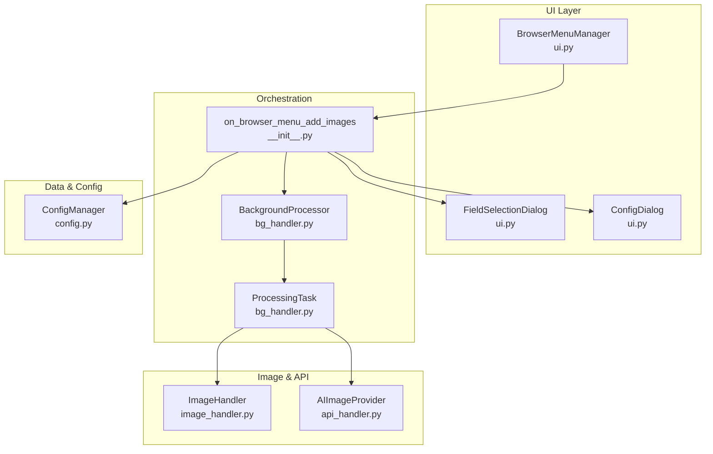
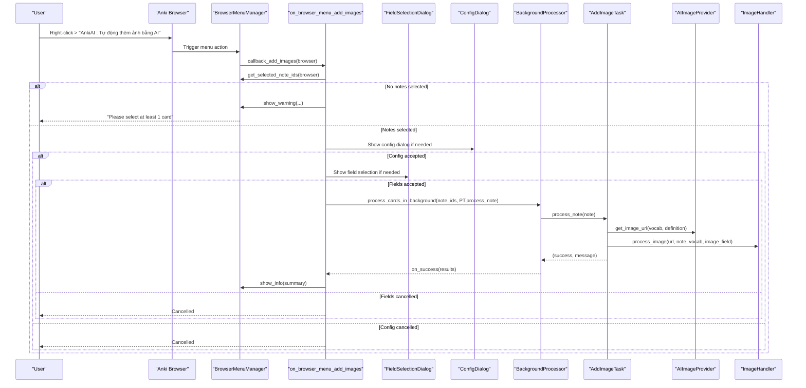
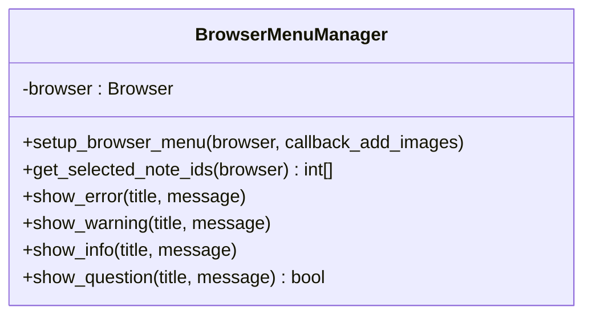
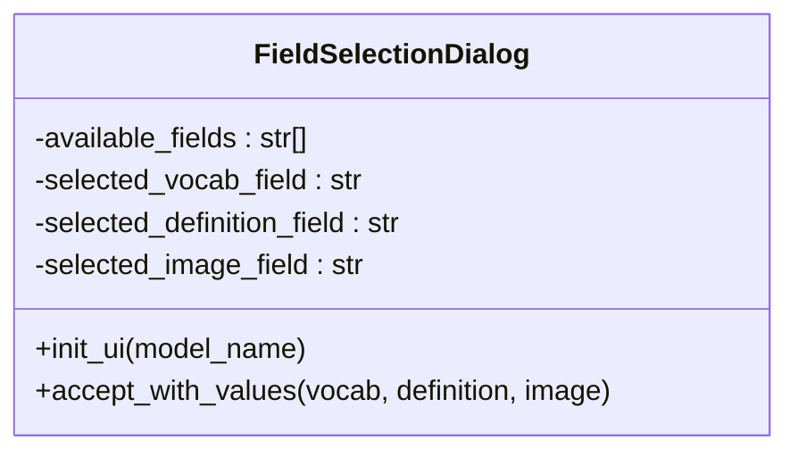
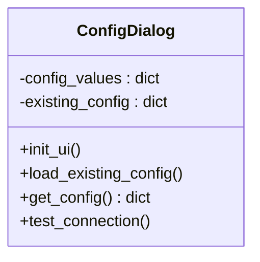
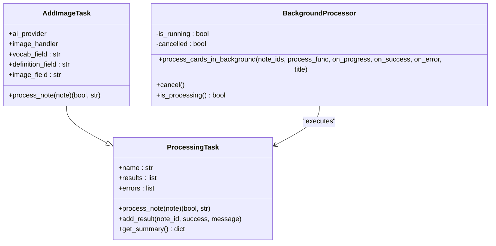
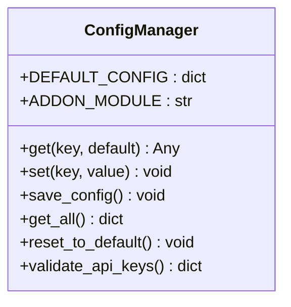
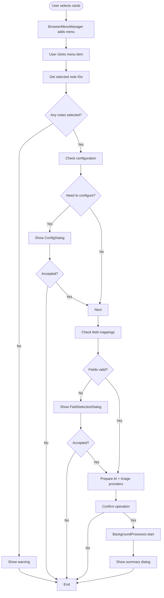
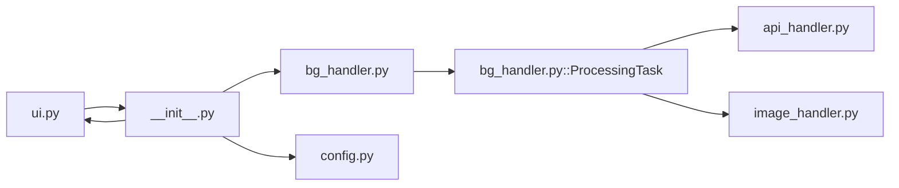

# User Interface Integration

<cite>
**Referenced Files in This Document**
- [ui.py](file://AnkiAI_ImageAddon/modules/ui.py)
- [__init__.py](file://AnkiAI_ImageAddon/__init__.py)
- [bg_handler.py](file://AnkiAI_ImageAddon/modules/bg_handler.py)
- [config.py](file://AnkiAI_ImageAddon/modules/config.py)
- [image_handler.py](file://AnkiAI_ImageAddon/modules/image_handler.py)
- [api_handler.py](file://AnkiAI_ImageAddon/modules/api_handler.py)
- [README.md](file://README.md)
- [API_REFERENCE.md](file://API_REFERENCE.md)
- [PERFORMANCE_TIPS.md](file://PERFORMANCE_TIPS.md)
- [ARCHITECTURE.md](file://ARCHITECTURE.md)
</cite>

## Table of Contents
1. [Introduction](#introduction)
2. [Project Structure](#project-structure)
3. [Core Components](#core-components)
4. [Architecture Overview](#architecture-overview)
5. [Detailed Component Analysis](#detailed-component-analysis)
6. [Dependency Analysis](#dependency-analysis)
7. [Performance Considerations](#performance-considerations)
8. [Troubleshooting Guide](#troubleshooting-guide)
9. [Conclusion](#conclusion)
10. [Appendices](#appendices)

## Introduction
This document explains the user interface integration features of the AnkiAI Image Addon, focusing on how the add-on integrates with Anki’s Browser system and presents a cohesive, user-friendly workflow. It covers:
- The BrowserMenuManager class and its integration with Anki’s browser menus
- The field selection dialog for mapping vocabulary, definitions, and image fields
- The configuration dialog for managing API keys, processing modes, and provider settings
- The progress dialog and background processing pipeline that shows real-time status during batch operations
- Error handling and user feedback mechanisms
- Mobile-responsive design considerations for image display

## Project Structure
The UI integration spans several modules:
- UI orchestration and dialogs live in the UI module
- The main add-on entrypoint wires the browser hook and orchestrates the workflow
- Background processing runs off the main thread to keep the UI responsive
- Configuration is centralized and persisted via Anki’s add-on manager
- Image and API handling are encapsulated in dedicated modules

**Diagram sources**
- [ui.py:13-94](file://AnkiAI_ImageAddon/modules/ui.py#L13-L94)
- [__init__.py:99-274](file://AnkiAI_ImageAddon/__init__.py#L99-L274)
- [bg_handler.py:12-109](file://AnkiAI_ImageAddon/modules/bg_handler.py#L12-L109)
- [config.py:18-132](file://AnkiAI_ImageAddon/modules/config.py#L18-L132)
- [image_handler.py:36-200](file://AnkiAI_ImageAddon/modules/image_handler.py#L36-L200)
- [api_handler.py:74-200](file://AnkiAI_ImageAddon/modules/api_handler.py#L74-L200)

**Section sources**
- [ui.py:1-444](file://AnkiAI_ImageAddon/modules/ui.py#L1-L444)
- [__init__.py:1-349](file://AnkiAI_ImageAddon/__init__.py#L1-L349)
- [bg_handler.py:1-205](file://AnkiAI_ImageAddon/modules/bg_handler.py#L1-L205)
- [config.py:1-132](file://AnkiAI_ImageAddon/modules/config.py#L1-L132)
- [image_handler.py:1-364](file://AnkiAI_ImageAddon/modules/image_handler.py#L1-L364)
- [api_handler.py:1-229](file://AnkiAI_ImageAddon/modules/api_handler.py#L1-L229)

## Core Components
- BrowserMenuManager: Adds a custom context menu item to Anki’s Browse window and extracts selected note IDs. It also provides convenience dialogs for warnings, errors, and informational prompts.
- FieldSelectionDialog: Allows users to select which note fields contain vocabulary, definition, and where images should be stored.
- ConfigDialog: Manages API keys for AI and image providers, testing connections, and saving configuration.
- BackgroundProcessor and ProcessingTask: Run long-running operations off the UI thread, reporting progress and results.
- ConfigManager: Centralizes configuration persistence and validation.

**Section sources**
- [ui.py:13-94](file://AnkiAI_ImageAddon/modules/ui.py#L13-L94)
- [ui.py:96-171](file://AnkiAI_ImageAddon/modules/ui.py#L96-L171)
- [ui.py:174-400](file://AnkiAI_ImageAddon/modules/ui.py#L174-L400)
- [bg_handler.py:12-109](file://AnkiAI_ImageAddon/modules/bg_handler.py#L12-L109)
- [bg_handler.py:166-205](file://AnkiAI_ImageAddon/modules/bg_handler.py#L166-L205)
- [config.py:18-132](file://AnkiAI_ImageAddon/modules/config.py#L18-L132)

## Architecture Overview
The UI integration follows a clear flow:
- The BrowserMenuManager hooks into Anki’s browser lifecycle and adds a “AnkiAI: Tự động thêm ảnh bằng AI” menu item.
- When invoked, the main callback gathers selected note IDs, validates configuration, prompts for field mappings if needed, prepares providers, confirms operation, and starts background processing.
- BackgroundProcessor executes tasks asynchronously, reporting progress and collecting results.
- The UI layer surfaces success/failure summaries and handles user feedback.

**Diagram sources**
- [ui.py:20-48](file://AnkiAI_ImageAddon/modules/ui.py#L20-L48)
- [__init__.py:99-274](file://AnkiAI_ImageAddon/__init__.py#L99-L274)
- [bg_handler.py:23-100](file://AnkiAI_ImageAddon/modules/bg_handler.py#L23-L100)
- [api_handler.py:187-200](file://AnkiAI_ImageAddon/modules/api_handler.py#L187-L200)
- [image_handler.py:59-130](file://AnkiAI_ImageAddon/modules/image_handler.py#L59-L130)

## Detailed Component Analysis

### BrowserMenuManager
- Purpose: Integrate with Anki’s browser, add a custom menu item, extract selected note IDs, and present user feedback dialogs.
- Key behaviors:
  - Adds a “AnkiAI: Tự động thêm ảnh bằng AI” action to the Cards menu, with a fallback to the menu bar for older Anki versions.
  - Extracts selected card IDs and converts them to note IDs.
  - Provides show_error, show_warning, show_info, and show_question helpers for consistent user feedback.

**Diagram sources**
- [ui.py:13-94](file://AnkiAI_ImageAddon/modules/ui.py#L13-L94)

**Section sources**
- [ui.py:13-94](file://AnkiAI_ImageAddon/modules/ui.py#L13-L94)

### FieldSelectionDialog
- Purpose: Let users pick which note fields contain vocabulary, definition, and where images should be stored.
- Key behaviors:
  - Presents three combo boxes pre-populated with available field names.
  - On acceptance, stores the selected fields and closes the dialog.
  - Used when configuration does not match the current note type or when fields are missing.

**Diagram sources**
- [ui.py:96-171](file://AnkiAI_ImageAddon/modules/ui.py#L96-L171)

**Section sources**
- [ui.py:96-171](file://AnkiAI_ImageAddon/modules/ui.py#L96-L171)

### ConfigDialog
- Purpose: Manage API keys for AI providers (Groq, Gemini, Ollama) and image search providers (Pexels, Unsplash, Pixabay, Wallhaven), plus advanced settings.
- Key behaviors:
  - Loads existing configuration into input fields.
  - Validates that at least one AI provider and one image provider are configured.
  - Provides a “Test AI Connections” button to validate connectivity.
  - Returns a normalized configuration dictionary suitable for saving.

**Diagram sources**
- [ui.py:174-400](file://AnkiAI_ImageAddon/modules/ui.py#L174-L400)

**Section sources**
- [ui.py:174-400](file://AnkiAI_ImageAddon/modules/ui.py#L174-L400)

### BackgroundProcessor and ProcessingTask
- Purpose: Run long-running operations without blocking the UI, reporting progress and aggregating results.
- Key behaviors:
  - Uses Anki’s QueryOp to run work in the background.
  - Iterates through note IDs, invoking a process function for each note.
  - Emits progress callbacks and aggregates successes and errors.
  - Exposes cancellation and status checks.

**Diagram sources**
- [bg_handler.py:12-109](file://AnkiAI_ImageAddon/modules/bg_handler.py#L12-L109)
- [bg_handler.py:166-205](file://AnkiAI_ImageAddon/modules/bg_handler.py#L166-L205)
- [__init__.py:27-97](file://AnkiAI_ImageAddon/__init__.py#L27-L97)

**Section sources**
- [bg_handler.py:12-109](file://AnkiAI_ImageAddon/modules/bg_handler.py#L12-L109)
- [bg_handler.py:166-205](file://AnkiAI_ImageAddon/modules/bg_handler.py#L166-L205)
- [__init__.py:27-97](file://AnkiAI_ImageAddon/__init__.py#L27-L97)

### ConfigManager
- Purpose: Centralize configuration management, persistence, and validation.
- Key behaviors:
  - Provides default configuration values and merges with user-provided settings.
  - Saves configuration via Anki’s add-on manager.
  - Validates whether required providers are configured.

**Diagram sources**
- [config.py:18-132](file://AnkiAI_ImageAddon/modules/config.py#L18-L132)

**Section sources**
- [config.py:18-132](file://AnkiAI_ImageAddon/modules/config.py#L18-L132)

### Integration Flow: Browser Hook and Workflow
- The add-on registers a browser menu hook and sets up the “AnkiAI: Tự động thêm ảnh bằng AI” action.
- The callback gathers selected note IDs, validates configuration, prompts for field selection if needed, constructs AI and image providers, asks for confirmation, and starts background processing.
- Progress is reported via callbacks, and a summary dialog is shown upon completion.

**Diagram sources**
- [ui.py:20-48](file://AnkiAI_ImageAddon/modules/ui.py#L20-L48)
- [__init__.py:99-274](file://AnkiAI_ImageAddon/__init__.py#L99-L274)

**Section sources**
- [ui.py:20-48](file://AnkiAI_ImageAddon/modules/ui.py#L20-L48)
- [__init__.py:99-274](file://AnkiAI_ImageAddon/__init__.py#L99-L274)

## Dependency Analysis
- UI module depends on Anki’s Qt widgets and browser APIs to integrate with the Browse window.
- The main entrypoint orchestrates UI dialogs, configuration, and background processing.
- BackgroundProcessor relies on Anki’s QueryOp to run tasks off the UI thread.
- ImageHandler and AIImageProvider encapsulate image fetching and provider logic, returning errors that bubble up to the UI layer.

**Diagram sources**
- [ui.py:1-444](file://AnkiAI_ImageAddon/modules/ui.py#L1-L444)
- [__init__.py:1-349](file://AnkiAI_ImageAddon/__init__.py#L1-L349)
- [bg_handler.py:1-205](file://AnkiAI_ImageAddon/modules/bg_handler.py#L1-L205)
- [api_handler.py:1-229](file://AnkiAI_ImageAddon/modules/api_handler.py#L1-L229)
- [image_handler.py:1-364](file://AnkiAI_ImageAddon/modules/image_handler.py#L1-L364)

**Section sources**
- [ui.py:1-444](file://AnkiAI_ImageAddon/modules/ui.py#L1-L444)
- [__init__.py:1-349](file://AnkiAI_ImageAddon/__init__.py#L1-L349)
- [bg_handler.py:1-205](file://AnkiAI_ImageAddon/modules/bg_handler.py#L1-L205)
- [api_handler.py:1-229](file://AnkiAI_ImageAddon/modules/api_handler.py#L1-L229)
- [image_handler.py:1-364](file://AnkiAI_ImageAddon/modules/image_handler.py#L1-L364)

## Performance Considerations
- Background processing avoids UI freezes by delegating work to Anki’s QueryOp.
- The workflow supports batching to prevent memory pressure and improve stability.
- Mobile responsiveness is built-in: images scale to fit screens and preserve aspect ratios.

Practical tips:
- Prefer Search mode with Pexels for speed and cost-effectiveness.
- Use smaller batches (e.g., 50–100 cards) to reduce memory usage.
- Adjust concurrency and timeouts according to network conditions.

**Section sources**
- [bg_handler.py:23-100](file://AnkiAI_ImageAddon/modules/bg_handler.py#L23-L100)
- [PERFORMANCE_TIPS.md:157-443](file://PERFORMANCE_TIPS.md#L157-L443)
- [README.md:13-16](file://README.md#L13-L16)

## Troubleshooting Guide
Common issues and resolutions:
- No cards selected: The UI warns and aborts the operation.
- Missing or invalid API keys: The configuration dialog validates inputs and shows helpful errors.
- Timeout or rate limiting: Reduce concurrency, increase timeouts, or switch providers.
- Field mapping errors: Re-run the field selection dialog to align with the current note type.
- UI unresponsiveness: Use smaller batches and avoid running too many concurrent operations.

User feedback mechanisms:
- Warning dialogs for empty selections
- Question dialogs for confirmations
- Information dialogs summarizing success/failure counts
- Detailed error messages surfaced from background processing

**Section sources**
- [ui.py:78-94](file://AnkiAI_ImageAddon/modules/ui.py#L78-L94)
- [__init__.py:113-146](file://AnkiAI_ImageAddon/__init__.py#L113-L146)
- [__init__.py:257-260](file://AnkiAI_ImageAddon/__init__.py#L257-L260)
- [ARCHITECTURE.md:360-411](file://ARCHITECTURE.md#L360-L411)

## Conclusion
The AnkiAI Image Addon delivers a robust, user-friendly interface integrated tightly with Anki’s Browser. Through BrowserMenuManager, FieldSelectionDialog, ConfigDialog, and BackgroundProcessor, it enables efficient, batch image addition with clear feedback and graceful error handling. The design emphasizes performance, configurability, and mobile-readiness, ensuring a smooth experience across devices and use cases.

## Appendices

### API Reference Highlights
- BrowserMenuManager: menu setup, note ID extraction, and user feedback dialogs
- FieldSelectionDialog: field mapping UI
- ConfigDialog: provider configuration and connection testing
- BackgroundProcessor: asynchronous batch processing
- ProcessingTask: pluggable task abstraction for processing notes
- ConfigManager: configuration persistence and validation

**Section sources**
- [API_REFERENCE.md:229-288](file://API_REFERENCE.md#L229-L288)
- [API_REFERENCE.md:335-397](file://API_REFERENCE.md#L335-L397)